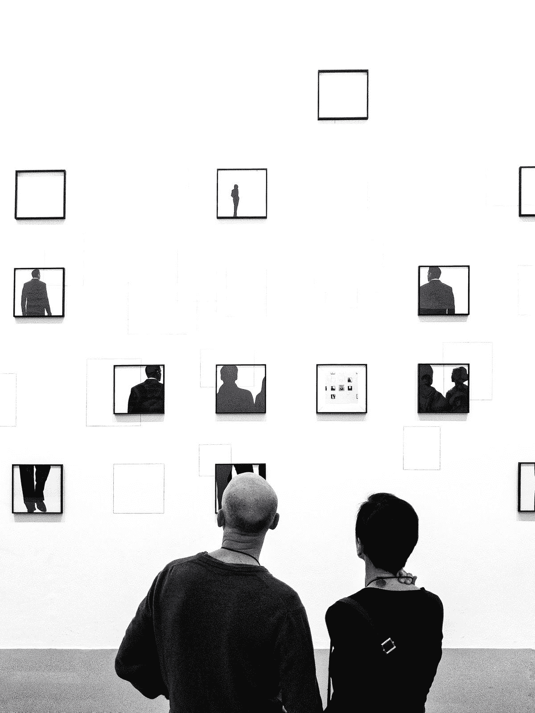
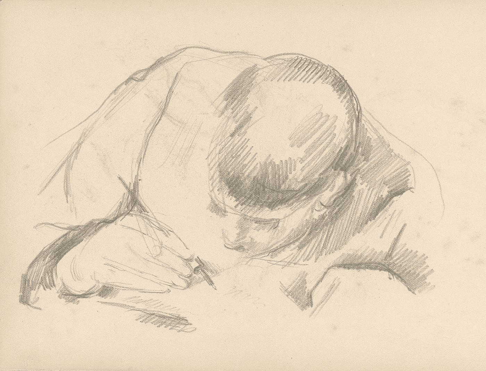
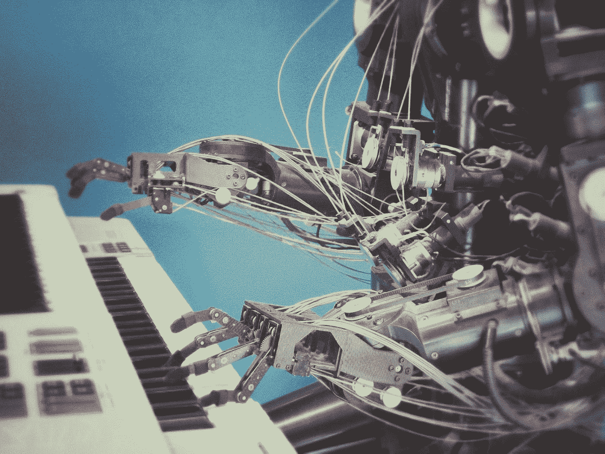

# 机器会变得有创造力吗？

> 原文：<https://towardsdatascience.com/could-machines-become-creative-49f346dcd3a3?source=collection_archive---------25----------------------->

## 人工智能与知识工作

德克·克内梅尔和乔纳森·福利特

Figure 01: Creative output from AI, like artwork, has seen its proof of concept in recent years. What can we expect from AI in the years ahead? [Photo: by Martino Pietropoli on Unsplash]

人工智能自动化正在到来，它将影响知识工作者——作家、艺术家、设计师、科学家、经理和企业家。然而，即使当人工智能自动化完全取代了对人类的需求——比如它征服了像[国际象棋](/how-22-years-of-ai-superiority-changed-chess-76eddd061cb0)和[扑克](/playing-poker-on-mars-how-ai-mastered-the-game-52f66659f8f4)这样的战略游戏——世界并没有终结，人类元素也没有消失。情况不同了。很大程度上更好，在某些方面更糟，但生活实际上还在继续。人类继续做我们的事。机器变得越来越好，越来越好。人工智能既神奇又被过度炒作。至少在几十年或几个世纪内，人类是安全的。

那么，在未来的几年里，我们能真正期待人工智能带来什么呢？人工智能将如何影响创造力和知识工作的世界？虽然人工智能肯定被用来创作艺术品，但这些作品更多的是好奇或概念验证。2016 年，J. Walter Thompson 的[Next rembrant](https://www.jwt.com/en/work/thenextrembrandt)项目教会了人工智能像大师一样绘画。2018 年，[纽约佳士得拍卖行首次出售人工智能制作的艺术品](https://www.nytimes.com/2018/10/25/arts/design/ai-art-sold-christies.html)《埃德蒙·贝拉米的画像》。该印刷品本身是由法国艺术集体“明显”的人类开发的算法创建的。这些是最近取得的显著成就，但它们是孤立的行动。人工智能协作艺术成为主流没有明确的路径。

为了更清楚地了解人工智能何时可能开始改变各种创造性工作，我们采访了 AI Impacts 的 Katja Grace，这是一家专注于人工智能未来决策相关问题的研究机构。它是预测，广义地说，人工智能的进步和对社会的影响。Grace 是 2017 年一篇题为[“人工智能何时会超过人类表现”的论文的第一作者。人工智能专家的证据。”](https://arxiv.org/abs/1705.08807)

## **渐进还是冲刺？**

技术进步通常很慢，当一个关键的新进展实现后，就会很快。但是慢的往往不像看起来那么慢，快的也不像我们想象的那么快。因此，不管人工智能如何演变，我们都应该期待它的表现没有我们想象的那么极端。

> “你可以想象人工智能的进步是以一种渐进的方式发生的，每年都有比以前稍微好一点的人工智能。或者，你可以想象，在某个时候，我们有了一些惊人的洞察力，从而非常突然地拥有了非常好的人工智能。通常，人们预期后一种情况会发生，并相应地制定计划……我们感兴趣的是这两种情况发生的可能性有多大，”Grace 说。

从历史上看，有很多原因我们可能会认为人工智能将逐步发展。然而，有各种各样的理由期待有突然和令人惊讶的进展。什么可能使人工智能自动化的激增成为可能？“最近我们生活的数字化意味着有更多的数据 Grace 说。“深度学习让你使用大量硬件和数据来获得良好的结果。硬件的出现让科学得以快速发展。”

## **自动化知识工作**

对于大多数人来说，自动化作为创造性工作的核心的想法要么是未知的，要么是不舒服的。然而，在 Grace 作为人工智能研究人员的工作中，自动化作为一种无处不在的力量的模型是清楚的:“我认为怀疑深度学习将自动化知识工作的部分原因是我们认为很可能*某种东西*最终将自动化知识工作，”Grace 说。“我们知道人类可以做知识工作。因此，或许让机器来做这件事也是可能的——除非你认为人类有某种神奇的意识火花，这是我们永远无法自动化的。”

“我认为许多人怀疑事实并非如此，所以问题是什么技术会让我们做到这一点？怀疑深度学习可能是这样的一个原因是，我们最近看到在自动化一些正常人类功能的一部分方面取得了很大进展，这些功能是我们以前无法做到的，是大多数工作的关键，例如，识别和处理图像、语音和写作。”

“我们已经看到深度学习做了一些看起来相当智能的事情，例如，很好地玩各种游戏。你可能会认为，让我们玩得好的那种技术，不会离我们做好一些相对简单的智力工作的需求太远。我想有些人认为这种技术可能会让我们拥有人工智能，它可以做人类能做的一切事情，但这更有争议。”

grace 2017 年的论文《AI 什么时候会超过人类的表现？来自人工智能专家的证据”，是基于一项对研究人员的调查，这些研究人员在 2015 年神经信息处理系统会议和 2015 年机器学习国际会议上发表了论文。一部分受访者被问及一个强调就业后果的问题。这个问题将劳动力的完全自动化定义为所有职业都完全自动化。那时，对于任何职业来说，机器都可以比人类工人更好、更便宜地完成任务。总体预测认为，50%的可能性在 122 年后，也就是 2138 年前出现。人工智能在各种知识工作中实现人类绩效的中值估计时间表包括:

*   用 5 到 10 年的时间，写一篇高中作文
*   在 10 到 15 年内，创作出一首排名前 40 的流行歌曲，并且
*   在 25 年或更长的时间里，写一本纽约时报畅销书

鉴于 Grace 的论文预测了人工智能将在许多领域超越人类表现的时间框架，我们希望获得她对一些核心知识工作的意见——具体的创造性实践，如写作和音乐。

## **写作**

人工智能多久才能达到人类的水平？“你可能会想象有助于写得更好的工具，但这些工具在过程中并不完全是自动的*。或者你可以想象一些只为你做新闻的事情，”格雷斯说。“我预计相对而言，很快就会有更好的工具出现。”然而，“为了写得足够好，让作者对世界有一个连贯的了解，有一个他们试图传达的信息或目标，有一个他们试图传达给观众的想法，[这]似乎接近 AGI 全集。但是，我预计人工智能能够写出有趣的文字或者让人觉得值得一读的文字可能还为时过早。”*

格雷斯认为，机器独立写作的局限性在于，它们无法将对世界的广泛理解应用到它们所写的东西上。我们将发现背景是人工智能的致命弱点——并且应该在未来十年继续存在——这是一条关键的粉笔线，有助于指导人工智能将做什么和不能够做什么。格蕾丝也将拥有上下文的能力等同于 AGI 的完整性，这意味着有一种人工的普遍智能使人类的能力黯然失色。这与科幻小说和机器将接管世界的叙事如出一辙。虽然这条主线确实是显而易见的，但将语境和 AGI 联系得太紧密是错误的。拥有广博的知识是一回事；拥有广泛行动的能力完全是另一回事。

Figure 02: How soon might AI write at a human level?
[Illustration: “The Artist’s Son Writing”, 1887, Paul Cezanne, National Gallery of Art, Open Access]

## **音乐**

流行音乐呢？在调查论文中，“我认为很早就很有趣的一件事是，我们问 AI 什么时候能够基本上像泰勒·斯威夫特一样写一首泰勒·斯威夫特的新歌，这样一个忠实的泰勒·斯威夫特粉丝就无法区分这首新歌和她写的和表演的歌曲之间的区别。[研究人员调查]认为大约 10 年后。你可能会想，为了写作，为了真正成为一名作曲家，你需要理解你所说的话。这些机器学习研究人员可能只是对泰勒·斯威夫特没有很好的看法，他们认为这很快就会自动化。”

抛开所有关于泰勒·斯威夫特歌曲内容的笑话不谈，音乐和艺术都是当今人工智能自动化的目标。例如，Aiva(人工智能虚拟艺术家)是一位人工智能作曲家，他创作了用于电影、广告和游戏配乐的音乐，并且是第一位得到作者权利协会认可的虚拟艺术家。

Figure 03: Music is one creative area with numerous AI advances in automation.
[Photo: by Franck V. on Unsplash]

## **创造性人工智能的后果**

创造性人工智能的高级开发有哪些风险或意想不到的后果？“制造一种技术可能很简单，它可以……做出非常高质量的决定，玩游戏玩得非常好，在现实世界中玩得非常好，(例如)赚很多钱。但如果这很容易，而我们还没有想出如何让他们完全按照我们的要求去做，我们可能会以一场巨大的混乱而告终，”格雷斯说。

“如果你可以看看如何建立一家通过生产东西赚钱的公司，但你没有想出让它关心你所关心的所有人类价值——比如河流是否被污染，你往往会以河流被污染而告终。同样，如果你制造的机器非常擅长优化某些东西，但并不真正知道你在乎什么，那么，在没有任何恶意的情况下，它们最终会摧毁你在乎的东西。”

这些听起来和工业革命产生的风险和后果是一样的。当然，即使实际的变化比它应该发生的或者我们可能喜欢的要慢得多，但是心态和意图还是在进化。最终，政策将赶上这一速度，我们将看到国家、企业，最终还有个人大张旗鼓地避免工业化给我们带来的那种破坏性的污染行为。以一种更全面正确的方式做事将会成为做事的基本方式。

那么，机器能变得多聪明，与人类智慧相比又如何呢？“我想问题是:人类有多聪明就有多聪明？怀疑的理由是，人类大脑似乎受到相当大的限制，因为它需要适应人类的大脑，母亲们需要能够生下她们的孩子——生物学上的这种事情——以及它使用了多少能量？…看起来我们的大脑中存在着生物限制，这意味着即使理论上有更高的智力水平，它们也不会给人留下更深刻的印象，”格雷斯说。“即使拥有比我们见过的最聪明的人还要聪明的机器，也会给世界带来巨大的变化。”

[*Creative Next*](http://www.creativenext.org) *是一个播客，探索人工智能驱动的自动化对创意工作者，如作家、研究人员、艺术家、设计师、工程师和企业家的生活的影响。本文附* [*第一季第 12 集——AI 什么时候会超过人类的表现？*](https://creativenext.org/episodes/when-will-ai-exceed-human-performance/)