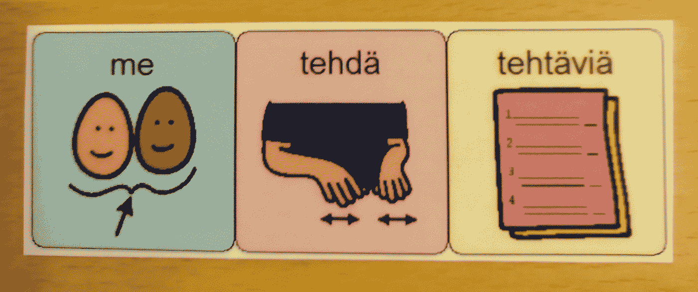
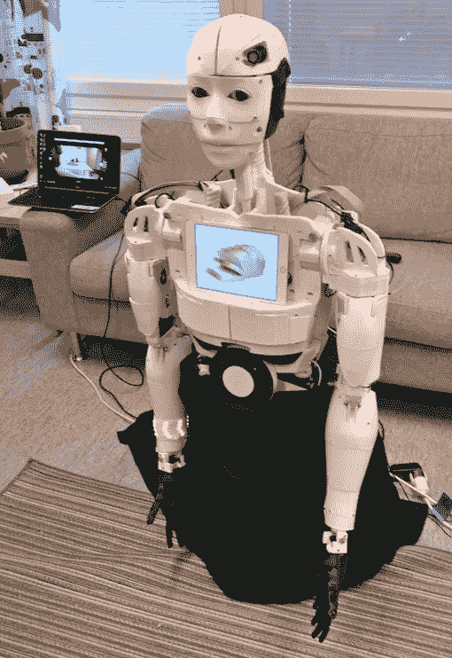
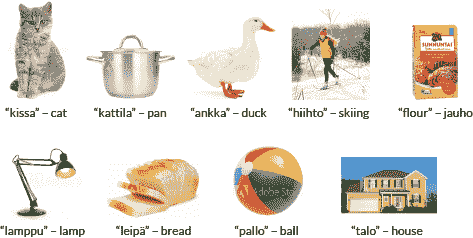
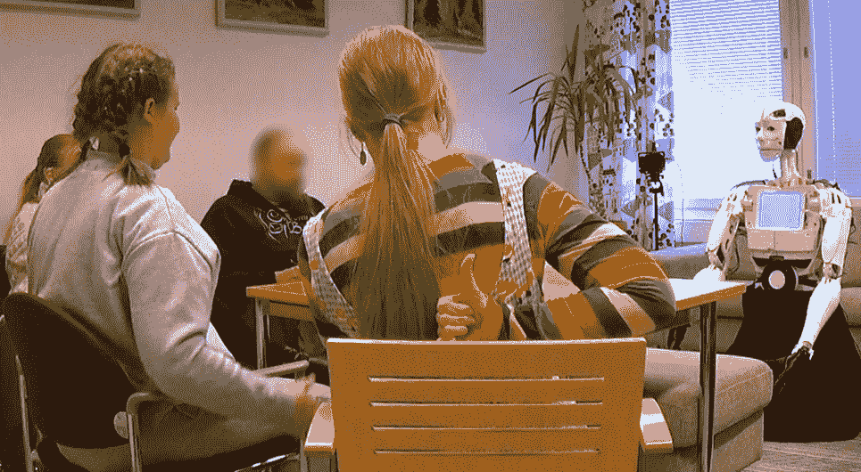
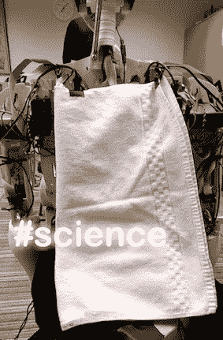

# 我帮助制造了一个机器人，教自闭症儿童手语——这是我学到的

> 原文：<https://towardsdatascience.com/could-robots-teach-sign-language-to-children-with-autism-8a6d7c3eb23a?source=collection_archive---------37----------------------->

## [内部 AI](https://medium.com/towards-data-science/inside-ai/home)

## 机器人专家和自闭症治疗提供者的试点研究

一年前的 2018 年春天，我进行了一项机器人向自闭症儿童教授手语的试点研究。这篇博文反映了研究的结果，以及我们团队设计机器人的过程。整个研究可通过以下方式获得:

阿克塞尔松，硕士，拉察，硕士，韦尔，博士，凯尔基，V. (2019)。自闭症儿童辅助手语机器人导师的参与式设计过程。在 *2019 年第 28 届 IEEE 机器人与人类交互通信国际研讨会(RO-MAN)* 。IEEE。**接受了。**

这项研究是基于我在阿尔托大学的硕士论文。

# 机器人技术、手语和自闭症儿童

首先，我们来回答第一个大问题:**为什么要在自闭症治疗中使用机器人？**自闭症患者对物体的注意力偏好超过对人的注意力偏好(Kerola 等人，2009 年)，自闭症儿童对涉及技术或机器人组件的治疗表现出更大的兴趣(Robins 等人，2006 年)。此外，机器人的操作可以受到严格控制，这可以使自闭症患者的治疗不那么困难(Kozima 等人，2009 年)。

那么，第二个大问题:**为什么要教自闭症儿童手语？**患有自闭症谱系障碍(ASD)的人在交流方面存在问题:40-50%的 ASD 患者在成年后功能性沉默(Bogdashina，2004)。为了缓解这种情况，他们使用了增强和替代沟通(AAC)方法。辅助手语——手语的简化形式——是 AAC 最常见的形式(Tetzchner & Martinsen，2000)。其他常见的 AAC 形式是象征性的图片和照片。

*An example of a symbolic picture communication system used by children with autism: “We do assignments.”*

结合这两个领域——自闭症儿童机器人和自闭症儿童手语——的想法最初来自[萨塔昆塔卫生保健区](https://www.satasairaala.fi/)。萨塔昆塔是芬兰西南部的一个小地区，人口 225 000。该地区的质量经理已经了解到一个机器人正被用于向神经典型儿童教授手语(Uluer 等人，2015 年)，并希望对自闭症儿童研究同样的方法。

Satakunta 发现我工作的公司( [Futurice](https://www.futurice.com/) )制造了一个人形机器人。他们伸出了手，我们组建了一个跨学科团队，重新设计和修改 Futurice 的人形机器人，以适应这一目的。我们的团队有三名来自 Futurice 的机器人专家和三名来自 Satakunta 的自闭症治疗专家:一名神经心理学家、一名语言治疗师和一名质量经理。

# 我们应该如何设计机器人？

Futurice 制造的人形机器人是一个 InMoov 机器人。 [InMoov 由法国雕塑家盖尔·朗之万](http://inmoov.fr/)设计。他将机器人的原理图和软件开源，任何人都可以在网上看到。利用这些，Futurice 建立了自己的 InMoov。Satakunta 想用 InMoov，因为它灵巧的双手使它能够签名。它类似人类的外观也是一个优势:Satakunta 的一位神经心理学家认为类似人类的机器人最适合这种解决方案。

*The original form of the open source humanoid robot InMoov, designed by Gaël Langevin. Image Wikimedia Commons.*

然而，InMoov 并没有准备好。为了使机器人适合自闭症儿童，我们需要修改它的形式、行为、互动和环境。我的工作是设计机器人的这四个维度。我还需要设计人机互动研究，让孩子们和机器人见面并签名。幸运的是，机器人软件和硬件的开源性质使得进行必要的修改相对容易。

我们想在设计机器人时考虑自闭症障碍的特点。ASD 的特征是交流和语言的问题，社会行为的问题，常规的不灵活，以及形成对周围环境的整体感知的问题。然而，自闭症是一个谱系，所以这些特征在不同的人身上有不同的表现。由于不同的演示，我们知道我们无法设计出一个让所有人受益的机器人。然而，我们想找到最好的解决方案，为大多数自闭症儿童服务。

在项目期间，该团队为机器人创建了五个设计准则，这将为自闭症儿童量身定制其设计。例如，自闭症专家提出了孩子在实验过程中可能会分心的担忧。该团队一致认为，为了避免让孩子困惑，机器人的行为应该是一致的和有条理的。这被定义为指导方针:“一致的、结构化的、简单的行为”。为了遵循这个指导方针，语言治疗师和我为机器人和孩子的互动创作了严格的脚本。所有五个指南都是在共同设计讨论中以类似的方式制定的。

## 用于自闭症儿童的机器人设计指南:

1.  单形
2.  一致、有条理、简单的行为
3.  积极、支持、有益的经历和环境
4.  模块复杂性
5.  针对儿童偏好的模块化设计

设计指南帮助团队维持机器人的逻辑和统一设计，并为设计过程中做出的所有决定形成基线。

# 嵌入式伦理

当团队讨论机器人的设计和实验时，提出了几个伦理问题。这些伦理考虑被嵌入到最终的机器人中。

**人身安全** —用户可能会被机器人夹伤或压伤。为了减轻这种担忧，我们决定在互动过程中阻止孩子们触摸机器人。为了做到这一点，我们决定让语言治疗师在房间里陪着孩子，如果需要的话，阻止他们接近机器人。

**数据安全** —用户数据的安全至关重要，尤其是在医疗保健应用中。在这里，我们决定对参加研究的儿童的所有数据进行加密。我们也没有记录任何不必要的数据。

**适当的行为强制**——人们可以从机器人身上学到不礼貌的行为。比如[孩子在与语音代理 Alexa](https://thriveglobal.com/stories/artificial-intelligence-alexa-impact-children-expert-opinion-tips/) 互动后，忘记使用“请”“谢谢”等礼貌用语。Alexa 没有明确要求礼貌的语言，导致人们对它表现不好。在这种情况下，我们不希望孩子们学会虐待机器人，并潜在地将这种不良行为推广到人类身上。我们决定治疗师会干预所有对机器人的不良行为。

**用户之间的平等** —人工智能算法在过去已经被证明是种族主义或性别歧视的(例如 [COMPAS，一种在美国使用的累犯率预测算法，偏向于非裔美国人](https://www.propublica.org/article/machine-bias-risk-assessments-in-criminal-sentencing))。如果机器人使用算法来运行，算法的设计者需要小心。另一个要考虑的是机器人的形式。机器人设计已被证明会强化性别刻板印象，“天才”机器人通常被贴上男性标签，“服务”机器人则被贴上女性标签。在我们的案例中，我们想设计一个不分性别的机器人，这样每个参与研究的孩子都会感到受欢迎。为了做到这一点，机器人没有性别符号。

**透明** —如果用户了解机器人如何操作和决策，他们可以校准他们对机器人的信任程度。在我们的案例中，我们决定在研究结束时告知孩子们和他们的同伴机器人的遥控性质。这样，他们可以避免对当今机器人技术的现状以及如何将其应用于自闭症治疗形成错误的假设。

**情感上的考虑**——研究表明，人类会像对待活着的机器人一样对待它们，即使它们显然已经不存在了。人们与机器人形成情感纽带。在设计中应该考虑到这一点:这个用例需要多强的绑定？在这种情况下，我们不希望孩子或他们的同伴认为机器人正在取代孩子和治疗师之间的联系。为了确保这一点，语言治疗师会一直和孩子呆在房间里。

# 平衡之举

为一个复杂的领域(自闭症治疗)建立复杂的技术(机器人)是困难的。问题空间对团队的双方来说都是不直观的:自闭症专家不熟悉技术限制，机器人专家不了解用户群。设计是一种平衡行为:设计中看似微小的调整可能会导致大量的技术工作。反之亦然，一些在设计上意义重大的改变在技术上也很容易实现。这是我花了大部分时间的地方——将团队的不同观点协调成一个好的设计，在我们 6 个月的时间框架内切实可行。我们一起做出了一系列平衡用户体验和技术复杂性的决定。

The final InMoov with modifications: new Ada hands, lights attached to its right hand, and a screen on its chest

当设计一个社交机器人时，有大量的运动部件(无论是字面上的还是比喻上的)。机器人的特性都是互相影响的。机器人的操作环境影响它的行为，影响它与用户的互动，影响它的形式。将这些设计考虑因素分离出来，并将其具体化为不同的、可实施的技术任务是一项挑战。

从最初的形式修改机器人花了 4.5 个月(最初的构建在 9 个月内完成)。我们所有的修改都遵循了设计准则:例如，我们将机器人类似人类的声音改为机器人声音，给它一个“简单的形式”(准则 1)。

为了让 InMoov 成为更好的手语老师，我们做了一些大的调整。我们给它新的 [Ada hands，由开放仿生学](https://openbionicslabs.com/obtutorials/ada-v1-assembly)设计，由[大都会应用科技大学](https://www.metropolia.fi/en/)建造。我们还在它的胸部嵌入了一个屏幕，并在它的手臂上安装了灯光。添加屏幕是为了提供另一种交流模式(AAC 中经常使用照片)，添加灯光是为了吸引孩子的注意力。

# 10 个孩子和一个机器人

10 个孩子参加了实验。有些人和父母一起来，有些人和其他支持者一起来。两名机器人专家(包括我)在实验室旁边的房间里，操作机器人并通过摄像头观察实验。第三个机器人专家在场来解决任何可能出现的问题。语言治疗师和每个孩子都在实验室，促进孩子和机器人之间的互动，并在需要时进行干预。

*The 9 words the robot signed, and the corresponding images on its screen*

机器人表演了 9 个手势。有了⅓的标志，它胳膊上的灯也闪了一下。随着另一个⅓的迹象，它显示了相应的图像在其屏幕上的迹象。对这三种不同的设计条件进行了检查，以确定哪一种最有效。

我对每个孩子与机器人互动的不同感到惊讶。在整个实验过程中，一些孩子以近乎完美的准确度做手势，仅用 6 分钟就模仿了机器人的所有手势。有些人花了长达 28 分钟的时间，与每个标志作斗争。一个特别的孩子——他不太喜欢签名——不停地嘲笑机器人。在整个实验过程中，这个孩子一直试图拥抱或扑向机器人，语言治疗师和神经心理学家在后面追赶，及时阻止他。

*A child signs with the robot (picture with permission).*

*The speech therapist signals to the robot operators that the child signed correctly (picture with permission).*

# 孩子们模仿并关注机器人

我测量了孩子们的手语准确度和注意力集中程度。孩子们和他们的同伴也完成了关于他们对机器人的看法的调查。

## 我们学到了什么:

**1。孩子们可以模仿机器人，并注意它**

10 个孩子中有 7 个成功模仿过机器人至少一次。在 70%的时间里，他们一直盯着机器人，表明注意力集中。参与调查的 8 个同伴中有 8 个也注意到孩子们与机器人有联系。

**2。机器人屏幕上的图像很好**

机器人在 1/3 的时间里在屏幕上同时显示一幅图像。孩子们的同伴发现这些图像很有用，并认为它们可以帮助孩子们学习。

**3。这个机器人被认为不错，但是有点吓人**

孩子们和他们的同伴都认为孩子们对机器人的体验很好。然而，一些孩子和他们的同伴指出，孩子们觉得机器人很可怕。在未来的设计中，应该识别并减少造成恐怖感的因素。

**4。标志的性能需要提高**

语言治疗师和孩子们的同伴都指出，机器人没有很好地标记所有的单词，这可能会影响孩子们对它们的理解。

## 仍需学习的内容:

**1。孩子们理解这些标志吗？**

对于这个实验，我只测量了孩子们是否模仿了这些标志。未来的实验需要验证孩子们是否理解它们。

**2。谁从机器人中受益最大？**

并不是所有的孩子都对机器人有相似的反应。这种基于机器人的手语疗法不太可能对所有自闭症儿童都有用。未来的实验应该考察这种疗法适合谁。同伴的调查结果支持了这种不同的好处:8 个同伴中有 6 个认为机器人作为手语教师可能是有益的。

**3。如何输入语言治疗师的命令？**

未来要使用机器人，治疗师需要能够独立控制机器人。对于未来的实现，用于编程机器人行为和交互的遥控器或 UI 可能是有用的。

**4。准则 4 和 5 将如何影响设计？**

在这个实验中，我使用了机器人的静态设计。只有它的交互发生了变化(在不同的点使用它的屏幕和灯光)。未来的研究需要检验设计准则“复杂性模块化”(准则 4)和“特定于儿童偏好的模块化”(准则 5)。这些可以帮助机器人适应不同的用户。

# 机器人手语教师的未来

人们与机器人密切互动会招致批评。最突出的担忧是机器人取代人类。在这种情况下，机器人并不打算取代人类的护理，而是增加和支持人类的护理。

治疗会议对治疗师要求很高。他们需要计划和进行会议，同时处理潜在的不合作的参与者。在未来，技术工具可以用来减少治疗师的认知负荷。机器人表演手势，而治疗师可以专注于鼓励、辅导和管理孩子。随着认知负荷的减少，会议可能会更长，从而更深入。如果机器人位于孩子的家中，也可能达到同样的效果:孩子将获得一个一致的工具来练习手势，机器人不会因为重复的练习而感到无聊或沮丧。

据我所知，这是第一次使用机器人向自闭症儿童教授手语。我希望这项研究能继续深入下去。我希望我们的飞行员能为将来如何开发这个应用程序提供一些启发。

*Science — especially pilot studies — sometimes requires improvisation: lights from the robot’s back were reflected on a window behind it, which might have distracted the children. We fashioned a light-reflection-blocker for the robot’s back, out of a towel stolen from our hotel (we did pay for it).*

该项目由 Prizztech 的 Robocoast 和 ERDF 基金以及 Futurice 资助。

A short video about the project, by [Digitalents Helsinki](http://digitalents.munstadi.fi/en/).

o .博格达什娜(2004 年)。自闭症和阿斯伯格综合症的交流问题:我们说同一种语言吗？。杰西卡·金斯利出版社。

k .凯罗拉、s .库扬帕和 t .蒂莫宁，2009 年。自闭症，第一版。PS-kusta NUS。

科济马，h .，米查洛夫斯基，M. P .，，中川，C. (2009)。坚持住。*国际社会机器人学杂志*， *1* (1)，3–18。

Robins，b .，Dautenhahn，k .，和 Dubowski，J. (2006 年)。在自闭症儿童与人形机器人的互动中，外观重要吗？。*交互研究*， *7* (3)，479–512。

Tetzchner，S. V .，& Martinsen，H. (2000 年)。*增强式和替代式沟通介绍*(第 87-89 页)。呜。

乌卢尔，p .，n .阿卡伦和 h .科塞(2015 年)。一种用于手语教学的新型机器人平台。*国际社会机器人学杂志*， *7* (5)，571–585。