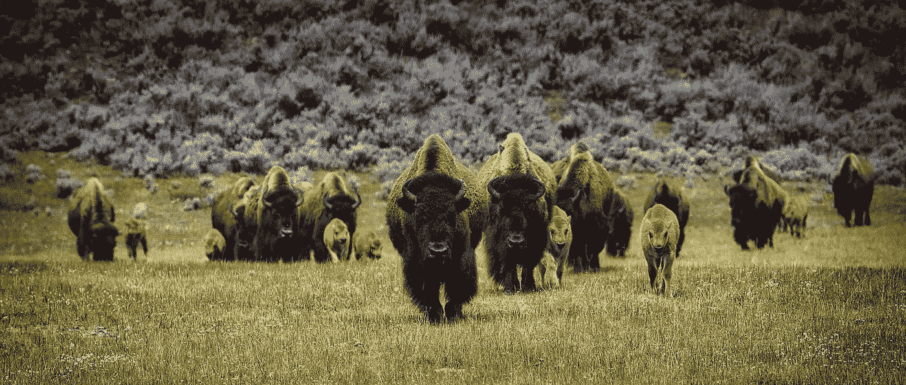

# 我们能进化出人工智能吗？

> 原文：<https://towardsdatascience.com/could-we-evolve-an-artificial-general-intelligence-fcceac1e1ae4?source=collection_archive---------29----------------------->

## 也许试图设计它不是办法…

Image by Skeeze, Pixabay

在过去的十年里，机器学习和深度学习的实践者在狭义人工智能问题上取得了惊人的进展。计算机已经非常擅长各种各样的任务，例如检测图像中的东西，这在以前被认为只有人类才能做到。这些程序向前迈进了一大步，但是它们只适用于特定的任务。对他们正在做的事情没有真正的理解。一台能真正思考、真正理解的计算机的梦想仍未实现。

有些非常聪明的人试图在软件和专门的硬件中复制人脑的能力。这还没有完成，可能是因为我们仍然在研究大脑是如何工作的。

我想还有一个办法。我们不必设计它。我们只需要设计一个人工环境，鼓励它进化。我们自己的大脑进化是因为智力为我们的祖先提供了优势。一个适当设计的虚拟环境，由用遗传算法进化的单个软件代理组成，可能会进化出一个人工智能。这可能很昂贵，但以目前的技术来看，这可能是可行的。

我们实际上是在模拟在一个孤立的星球上进化的高级生命。我们不需要从单细胞生物开始——像原始哺乳动物一样，已经安装了感觉和运动的生物会更好。这样我们就有了一个自由的开端，并且我们对这些是如何工作的有一个很好的理解。

不管怎样，我们为什么进化得如此聪明？

关于原始人发展智力的原因，有几种理论。就能量而言，维持一个复杂的大脑是昂贵的。喂养它需要付出努力，较大的头部在出生时带来了挑战。为了进化，它必须为我们最早的后代提供显著的优势。

攀爬的空间意识至关重要，早期简单工具的使用开辟了新的食物来源。有一种理论认为，我们的智力进化很大程度上是因为生活在更大的社会群体中有优势，需要更高的功能来驾驭在这样一个群体中生存和繁殖的复杂性。也有可能是我们的智力使我们能够在快速变化的气候和环境中生存下来。

**目前可用的积木**

几年来，复杂的神经网络已经通过强化学习成功地学会了[玩视频游戏。固定架构的神经网络一遍又一遍地玩游戏，从游戏中接收游戏分数形式的反馈，就像人类玩家一样。神经网络的权重被调整以优化它接收到的分数。人类设计师为神经网络设计布局，并让它运行。](/teaching-a-computer-to-land-on-the-moon-c168d551fc68)

遗传算法，其中设计解决方案的参数以与生物系统相同的方式进化，已被证明在许多问题上相当成功。解决方案的个体特征被编码在虚拟基因中，然后与具有不同基因的大量不同个体竞争。在每次运行结束时，最成功的个体会经历一轮虚拟的变异和交配，它们的“后代”会存活下来再次竞争。重组和突变慢慢引入新的基因，并在环境中进行测试。

Image by Free-Images, Pixabay

**进场**

如果我们将这些方法结合起来，就会有巨大的灵活性。代替人类设计神经网络结构，我们可以将它编码成一组基因，允许网络的设计改变。应该允许它在复杂程度上有很大的不同。我们不知道最优解是什么，所以可供选择的范围应该很大。

为了连接虚拟感觉，我们至少标准化了神经网络输入的子集。我们标准化这些是因为我们对进化新的感官不感兴趣，而是对使用这些感官的大脑感兴趣。

我们必须设计这样的系统，使得虚拟有机体为更大、更复杂的大脑招致能量成本——这不是免费的。有机体必须从大脑中获得竞争优势，这种优势超过了维持它的成本。

现在——这是最昂贵的部分——我们将数千或数百万的这些虚拟生物放入一个复杂的虚拟环境中，顺其自然。

**那个虚拟环境是什么样子的？**

就图形而言，它不需要很漂亮。用户界面只需要提供状态信息，所以图形渲染可能非常简单。关键在于底层模拟。

我们使用的环境在很大程度上取决于我们想要产生什么样的智能。我们可以利用不同的环境进化出不同强度的智能。例如，一个需要解决复杂数学问题的环境可能会产生一个更适合抽象思维的人工智能。一个主要要求是管理模拟城市的环境可能会训练一个人工智能在现实世界中完成这种工作。

为了这个思想实验的目的，我们将坚持我们可能需要进化出类似我们的东西。

**世界是关键**

我们的大脑进化成一种帮助我们在复杂、充满敌意的世界中生存的方式。我们的模拟环境需要相当复杂。作为起点，这里是我能想到的可能需要的东西。几乎可以肯定还有更多。

当然，我们不能模拟一个完整的生物群落直到单个细菌。我们必须专注于自然选择的关键驱动因素，以保持所需的计算易于管理。

世界上的能源和其他资源肯定是有限的，而且分布不均匀，就像它们在现实世界中一样。如果能源太容易获得，就没有必要竞争，也没有什么可以推动进化。需要有能杀死粗心的有机体的自然危险，包括自然灾害和食肉动物。

Image by David Mark, Pixabay

我们可能想要模拟宏量营养素——蛋白质、碳水化合物和脂肪——在不同食物来源中的不同比例。我们想让我们的生物成为杂食动物，给它们最大的灵活性来收集营养。大型猎物需要强大的防御能力，这将推动合作和武器工具的发展。

环境需要支持简单的工具制作——一些食物资源可能只有使用工具才能获得。代理人需要能够在他们的虚拟世界中与相当小的物体互动。我们已经在较小的规模上做了类似的事情——例如，一个探索奥秘的演示让用户扔纸飞机并与其他小物体互动。模拟一个巨大的世界需要巨大的计算能力，但技术上没有巨大的飞跃。

世界需要以现实的方式做出回应——例如，应该有可能在河流上筑坝来建造鱼笼，或者把东西堆起来组装成简陋的结构。跌倒和受伤应该是一个很大的缺点。

生物体需要一种标准的方式在短距离内与同伴交流。真实的生物使用声音和视觉交流，但我不确定是否需要模拟。在每个有机体中包含一个标准的通信通道就足够了，就像感官输入被标准化一样。我们的目标不是进化通信渠道——而是进化处理与附近生物通信所需的智能。

因为人们认为社会结构推动了更高智能的发展，所以环境中需要有挑战，只有作为一个群体来开发，才能提供优势。应该考虑一种战斗机制，因为不管你喜不喜欢，它都是前进的重要驱动力。同样地，生物必须包含不同攻击程度的基因编码。环境中资源的不均衡分配会推动迁移和战争，这两者都会带来强大的进化压力。

一种计分机制将跟踪环境中每种生物的相对表现，健康的个体将被允许交配和繁殖。遗传算法非常成功地模拟了有性生殖和突变机制，这将是在种群中产生变异的关键。

我们需要确保世界发生一些周期性的快速变化——也许是由火山爆发或彗星撞击引起的重大气候变化。这将为适应性提供进化压力，就像这种变化可能对我们产生的影响一样。

简而言之，我们需要一个用于构建大型在线多人游戏的当前技术的混搭，再加上虚拟现实和强化学习的一些功能。我们只需要把它做大。有了足够复杂的环境和正确的选择压力，AGI 是有可能进化的。

**开放式问题和挑战**

我认为，最大的挑战是所需计算的庞大规模。我们需要模拟一个庞大复杂的世界，然后是成千上万个复杂的虚拟生物。我们需要非常详细地模拟世界和这些有机体之间的相互作用，并在数千个模拟世代中这样做。不会便宜的。

一个有趣的可能性是允许人们设计他们自己的候选生物体的遗传基因，并把它们放入环境中，观察它们的表现。这将为这一过程增加一个博弈的层面，并有可能加速这一过程。当然，在任何情况下，人类代表他们的有机体干涉世界本身都不是一个好主意——这个过程需要被允许顺其自然。原版《星际迷航》系列中的主要指令将完全生效。

原始人从向父母学习中受益匪浅。目前还不清楚在模拟世界中如何实现这一点。一些基本的本能可能也需要硬编码。

另一个悬而未决的问题是，我们将如何与我们设法进化的人工智能交流。他们会用什么渠道？也许这需要从一开始就建立在这个世界上，并与有机体一起进化。

计算能力越来越便宜。随着专门的神经网络硬件变得可用并且更加可配置，我们可能会达到这样一个点，即尝试这样做变得非常合理。这将会花费大量的时间和金钱，但不会与我们真正关心的其他大规模人类努力相冲突。利用现有的软件和硬件，现在可以创建更简单的世界，在更小的范围内测试这个想法。我觉得这值得一试。

你怎么想呢?可行吗？你有改进的想法吗？