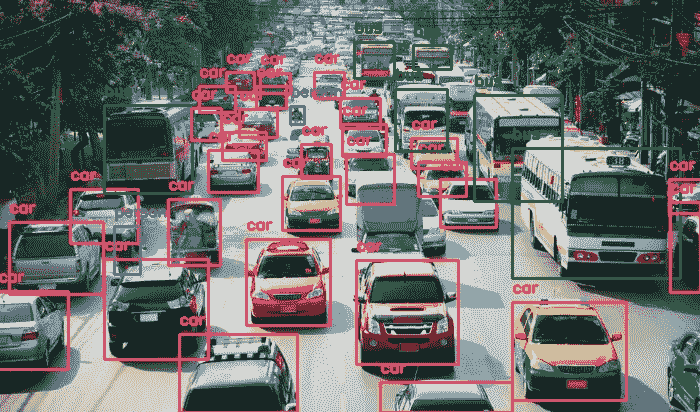
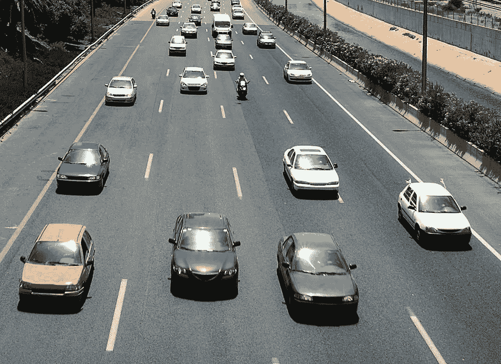
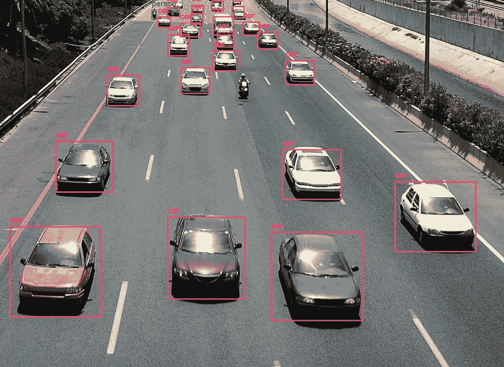
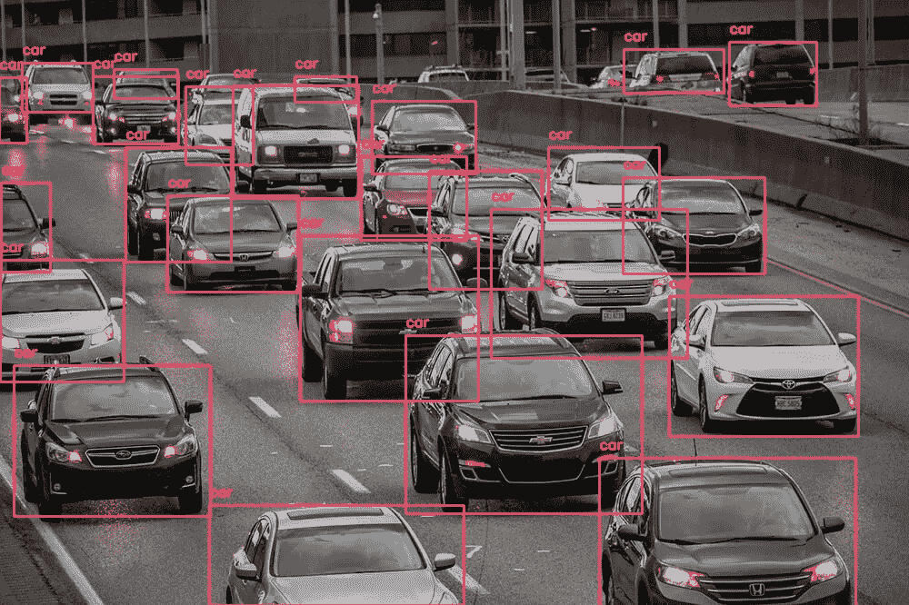

# 使用 Python 用不到 10 行代码计算汽车数量

> 原文：<https://towardsdatascience.com/count-number-of-cars-in-less-than-10-lines-of-code-using-python-40208b173554?source=collection_archive---------5----------------------->

## 使用这个简单的代码制作你自己的汽车计数器


Blue Volkswagen Beetle (Photo by [Tom Arrowsmith](https://unsplash.com/@tom_a?utm_source=unsplash&utm_medium=referral&utm_content=creditCopyText) on [Unsplash](https://unsplash.com/?utm_source=unsplash&utm_medium=referral&utm_content=creditCopyText))

> 当你还是个孩子的时候，开车旅行时，你有没有玩过一个游戏，在这个游戏中你会数经过的车的数量？
> 
> 那曾经是我小时候最喜欢的游戏。

在这篇文章中，我将教你如何用 Python 只用 10 行代码构建你自己的汽车计数器程序。

如果尚未安装以下 python 库，则需要进行安装:

```
opencv-python
cvlib
matplotlib
tensorflow
keras
```

以下代码用于导入所需的 python 库，从存储中读取图像，对图像执行对象检测，显示带有检测到的对象的边界框和标签的图像，计算图像中的汽车数量并打印出来。

```
import cv2
import matplotlib.pyplot as plt
import cvlib as cv
from cvlib.object_detection import draw_bboxim = cv2.imread('cars_4.jpeg')bbox, label, conf = cv.detect_common_objects(im)output_image = draw_bbox(im, bbox, label, conf)plt.imshow(output_image)
plt.show()print('Number of cars in the image is '+ str(label.count('car')))
```



(Left) Original image with cars ([source](http://www.samacharnama.com/wp-content/uploads/2019/06/third-party-insurance..687.png)), (Right) Output image with labelled cars

**该图像的输出:**

```
Number of cars in the image is 29
```



(Left) Original image with cars ([source](https://img.indianauto.com/2018/07/02/O7eTukak/161-7010.jpg)), (Right) Output image with labelled cars

**该图像的输出:**

```
Number of cars in the image is 22
```



(Left) Original image with cars ([source](https://images.squarespace-cdn.com/content/v1/54a6edaae4b0f3612b117e27/1524797161368-BGMWGPTA7UDOXD9H6B7H/ke17ZwdGBToddI8pDm48kOggE0Ch6pMGalwtLMqzsSB7gQa3H78H3Y0txjaiv_0fDoOvxcdMmMKkDsyUqMSsMWxHk725yiiHCCLfrh8O1z5QPOohDIaIeljMHgDF5CVlOqpeNLcJ80NK65_fV7S1Ufo5RWkg_J4of0jUNHaDHx6pZKBvpVYzidBWCapg0tuoMuEaB2HPGSYDV-11UTcW2g/car-3289048_1920.jpg?format=2500w)), (Right) Output image with labelled cars

**该图像的输出:**

```
Number of cars in the image is 25
```

你的汽车计数器程序现在准备好了。你可以用它来做有趣的实验，比如计算每天经过你家车道的汽车数量。

***Python 版本 3.6.9*** 用于运行这段代码。

运行此代码时安装的最重要的软件包版本如下:

```
cvlib: 0.2.2
opencv-python: 4.1.1.26
tensorflow: 1.14.0
matplotlib: 3.1.1
Keras: 2.2.5
```

以下是该计划 Jupyter 笔记本的 GitHub 链接:

[](https://github.com/sabiipoks/blog-posts/blob/master/Count_Number_of_Cars_in_Less_Than_10_Lines_of_Code_Using_Python.ipynb) [## sabi poks/博客帖子

### 此时您不能执行该操作。您已使用另一个标签页或窗口登录。您已在另一个选项卡中注销，或者…

github.com](https://github.com/sabiipoks/blog-posts/blob/master/Count_Number_of_Cars_in_Less_Than_10_Lines_of_Code_Using_Python.ipynb) 

***发现这个帖子有用吗？*** *在下面留下你的想法作为评论。*

希望实现人脸检测。查看我在 [**上的帖子如何使用 python 在不到 3 分钟的时间内实现人脸检测。**](/implement-face-detection-in-less-than-3-minutes-using-python-9f6b43bb3160)

希望实现对象检测。查看我的关于 [**物体检测的帖子，只用了 10 行 python 代码。**](/object-detection-with-less-than-10-lines-of-code-using-python-2d28eebc5b11)

[**点击这里**](https://medium.com/@sabinaa.pokhrel) 阅读我其他关于 AI/机器学习的帖子。

要了解更多关于 cvlib 库的信息，可以访问下面的链接。

 [## cvlib

### 用于 Python 的高级易用开源计算机视觉库。它的开发重点是实现简单的…

www.cvlib.net](https://www.cvlib.net/)