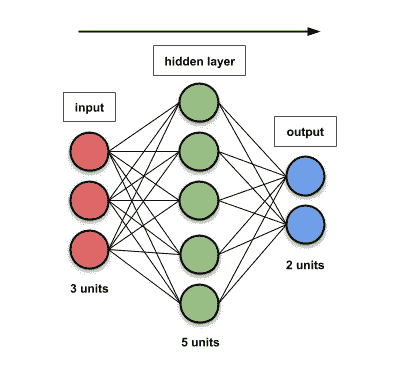
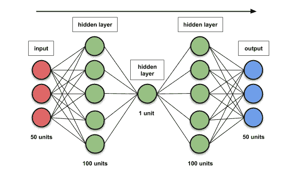
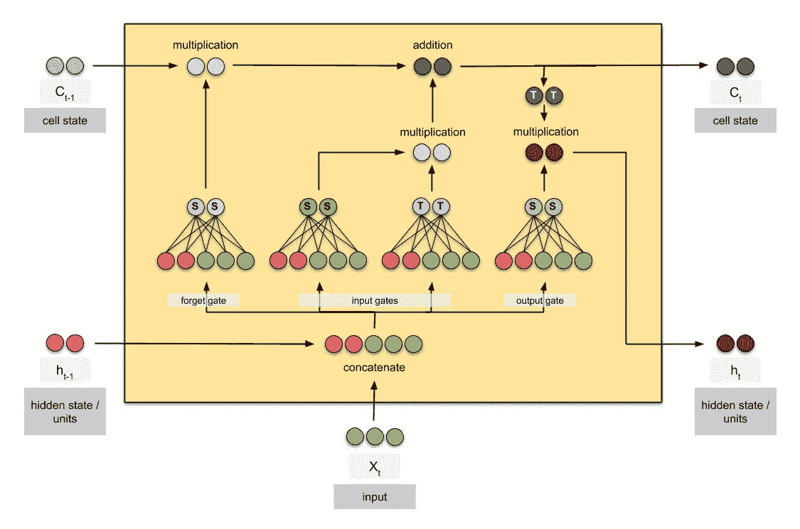
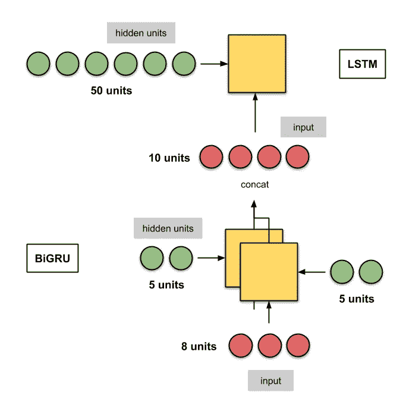
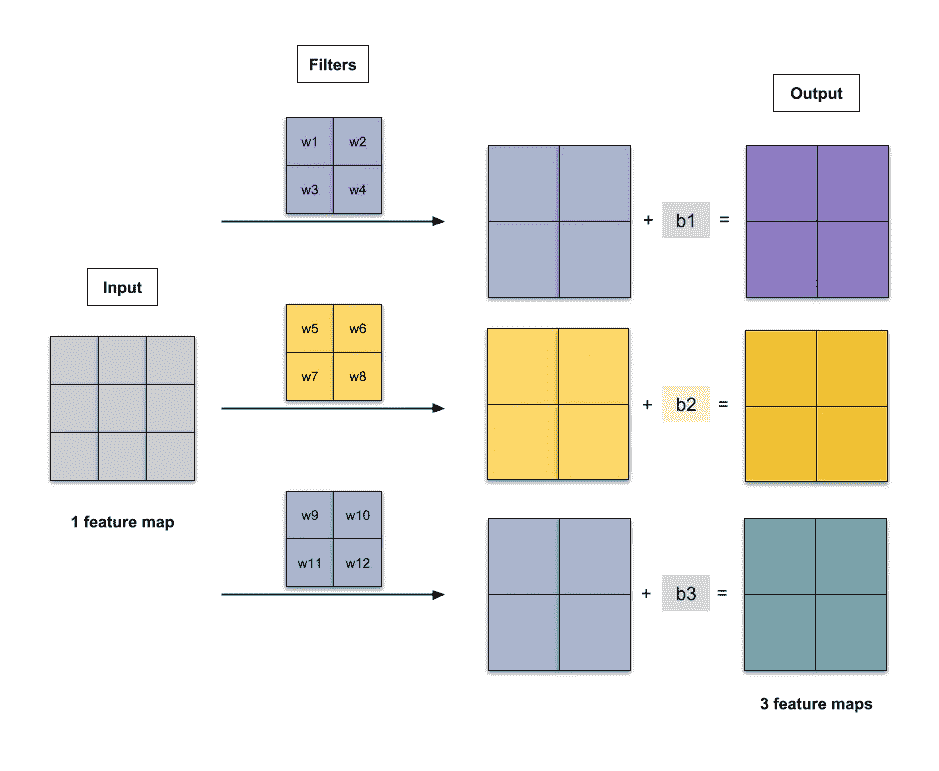
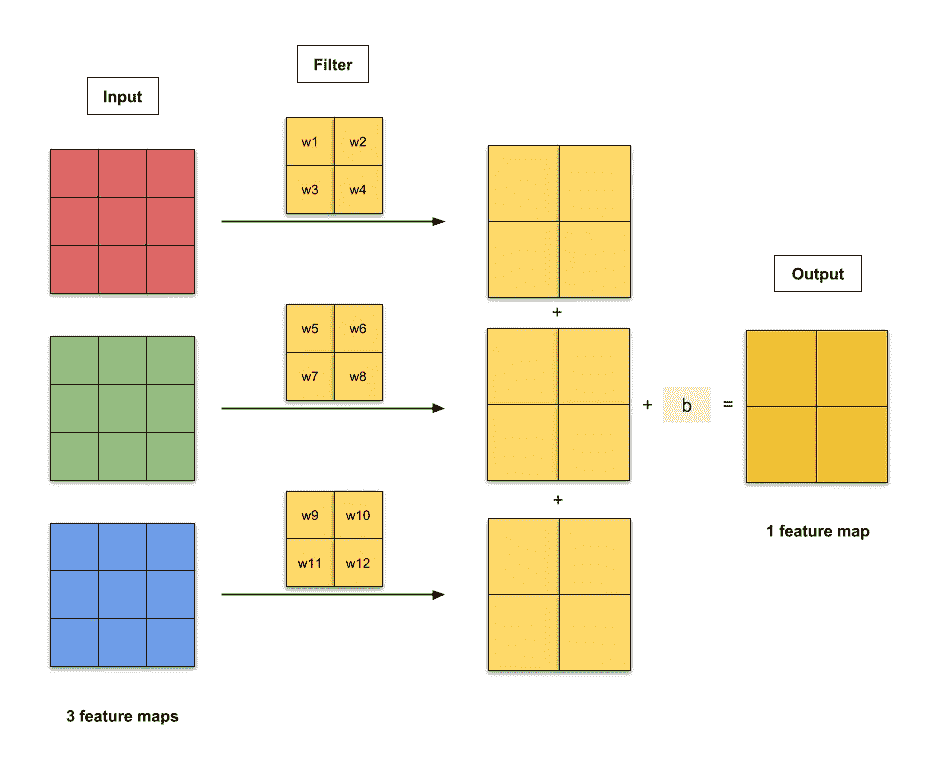
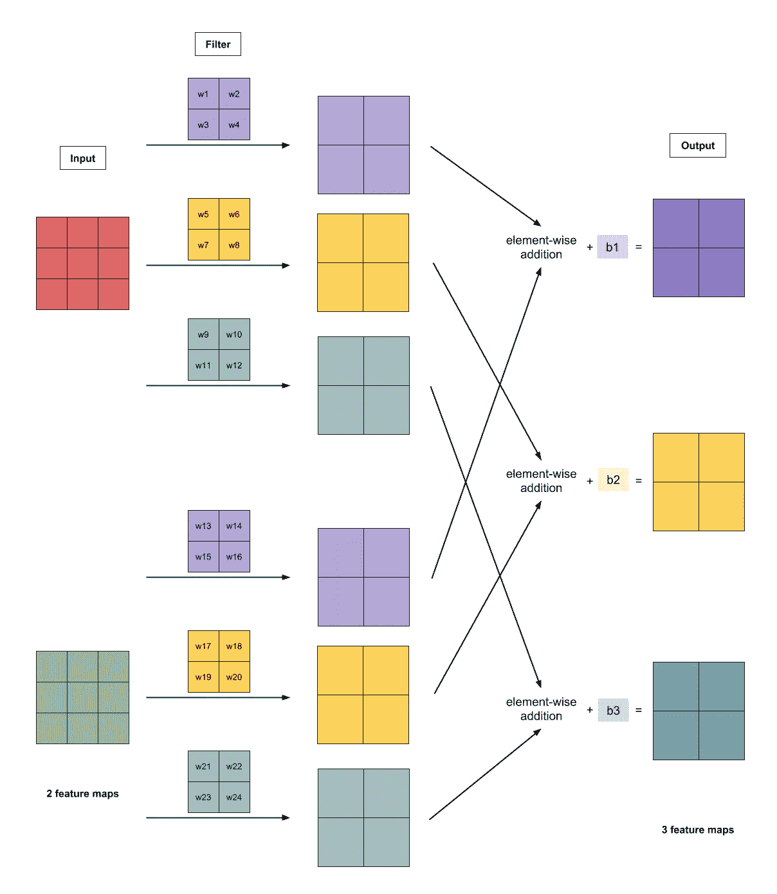

# 手动计算深度学习模型中的参数数量

> 原文：<https://towardsdatascience.com/counting-no-of-parameters-in-deep-learning-models-by-hand-8f1716241889?source=collection_archive---------3----------------------->


Photo by [Andrik Langfield](https://unsplash.com/photos/TqfrYn9lDSA?utm_source=unsplash&utm_medium=referral&utm_content=creditCopyText) on [Unsplash](https://unsplash.com/?utm_source=unsplash&utm_medium=referral&utm_content=creditCopyText)

## 计算 FFNN、RNN 和 CNN 模型参数的 5 个简单例子

W 为什么我们需要再次计算深度学习模型中的参数数量？我们没有。但是，如果我们需要减少模型的文件大小，甚至减少模型推断所需的时间，了解模型量化前后的参数数量将会派上用场。(看视频[这里](https://www.youtube.com/watch?v=eZdOkDtYMoo)关于深度学习的高效方法和硬件。)

计算深度学习模型的*可训练*参数的数量被认为是太琐碎了，因为你的代码已经可以为你做到这一点。但是我想把我的笔记留在这里，供我们偶尔参考。以下是我们将浏览的模型:

1.  [前馈神经网络](#9fe4)
2.  [递归神经网络(RNN)](#192e)
3.  [卷积神经网络(CNN)](#5137)

与此同时，我将使用 Keras 的 API 构建模型，以实现简单的原型制作和简洁的代码，因此让我们在这里快速导入相关对象:

```
**from** keras.layers **import** Input, Dense, SimpleRNN, LSTM, GRU, Conv2D
**from** keras.layers **import** Bidirectional
**from** keras.models **import** Model
```

建立`model`后，调用`model.count_params()`验证有多少参数是可训练的。

## 1.FFNNs

*   ***i*** ，输入尺寸
*   *，隐藏层尺寸*
*   ****o*** ，输出尺寸*

*对于一个隐藏层，*

**num_params
=* 层间连接+每层偏置
=**(*I×h+h×o*)*+*(*h+o*)***

***例 1.1:输入尺寸 3，隐藏层尺寸 5，输出尺寸 2***

**

*Fig. 1.1: FFNN with input size 3, hidden layer size 5, output size 2\. The graphics reflect the actual no. of units.*

*   ****i*** = 3*
*   ****h*** = 5*
*   ****o*** = 2*

**num _ params*
*=*层间连接+各层偏置
=**(3×5+5×2)+(5+2)** =**32***

```
 *input = **Input**((**None**, **3**))
 dense = **Dense**(**5**)(input)
output = **Dense**(**2**)(dense)
 model = **Model**(input, output)*
```

***例 1.2:输入尺寸 50，隐藏层尺寸[100，1，100]，输出尺寸 50***

**

*Fig. 1.2: FFNN with 3 hidden layers. The graphics do not reflect the actual no. of units.*

*   ****我*** = 50*
*   ****h*** = 100，1，100*
*   ****o*** = 50*

**num_params*
=层间连接+各层偏置
=**(50×100+100×1+1×100+100×50)+(100+1+100+50)** =**10451***

```
 *input = **Input**((**None**, **50**))
 dense = **Dense**(**100**)(input)
 dense = **Dense**(**1**)(dense)
 dense = **Dense**(**100**)(dense)
output = **Dense**(**50**)(dense)
 model = **Model**(input, output)*
```

## *2.RNNs*

*   ****g*** ，单位内人数(RNN 1 人，GRU 3 人，LSTM 4 人)*
*   ****h*** ，隐藏单位尺寸*
*   ****i*** ，输入的尺寸/大小*

*由于每个 FFNN 都有***h*(*h*+*I*)+*h***参数，所以我们有*

**num _ params =****g*×【*h*(*h*+*I*)+*h****

***示例 2.1:具有 2 个隐藏单元和输入维度 3 的 LSTM。***

**

*Fig. 2.1: An LSTM cell. Taken from [here](/animated-rnn-lstm-and-gru-ef124d06cf45).*

*   ****g*** = 4 (LSTM 有 4 个 FFNNs)*
*   ****h*** = 2*
*   ****i*** = 3*

**num _ params*
=***g*×【*h*(*h*+*I*)+*h***
=**4****×【2(2+3)+2】** =*

```
***input = **Input**((**None**, **3**))
 lstm = **LSTM**(**2**)(input)
model = **Model**(input, lstm)***
```

*****示例 2.2:具有 5 个隐藏单元、输入大小为 8(其输出被连接)的堆叠式双向 GRU+具有 50 个隐藏单元的 LSTM*****

******

***Fig. 2.2: A stacked RNN consisting of BiGRU and LSTM layers. The graphics do not reflect the actual no. of units.***

***具有 5 个隐藏单元和输入大小 8 的双向 GRU***

*   ******g*** = 3 (GRU 有 3 个 FFNNs)***
*   ******h*** = 5***
*   ******我*** = 8***

****num _ params _ layer 1
=***2*****×*g*×【*h*(*h*+*I*)+*h***(第一项因双向为 2)=)****

****有 50 个隐藏单位的 LSTM****

*   *******g***= 4(LSTM 有 4 个 FFNNs)****
*   *******h*** = 50****
*   *******i*** = 5+5(双向 GRU 输出串接；GRU 的输出大小为 5，与隐藏单元的数量相同)****

*****num _ params _ layer 2
=****g*×【*h*(*h*+*I*)+*h*]** =**4×【50(50+10)+50】****** 

*****total _ params*= 420+12200 = 12620****

```
 ****input = **Input**((**None**, **8**))
layer1 = **Bidirectional**(**GRU**(**5**, return_sequences=**True**))(input)
layer2 = **LSTM**(**50**)(layer1)
 model = **Model**(input, layer2)****
```

****`merge_mode`默认为串联。****

## ****CNN****

****对于一层来说，****

*   *******i*** ，输入地图(或频道)号****
*   *******f*** ，滤镜尺寸(只是长度)****
*   *******o*** ，输出地图(或通道)数量。这也由使用多少个过滤器来定义)****

****一个过滤器应用于每个输入映射。****

*****num_params
=权重+偏差
=***[*I×*(*f×f*)*×o*】*+o*******

******示例 3.1:使用 2 个 *×2 个*滤镜的灰度图像，输出 3 个通道******

********

****Fig. 3.1: Convolution of a greyscale image with 2*×2* filter to output 3 channels. Here, there are 15 parameters — 12 weights and 3 biases.****

*   *******i*** = 1(灰度只有 1 个通道)****
*   *******f*** = 2****
*   *******o*** = 3****

*****num _ params
=***[*I×*(*f×f*)*×o*】*+o*** *=***【1*×*(2*×*3】*+*******

```
 ****input = **Input**((**None**, **None**, **1**))
conv2d = **Conv2D**(kernel_size=**2**, filters=**3**)(input)
 model = **Model**(input, conv2d)****
```

******示例 3.2:使用 2×2 滤镜的 RGB 图像，1 个通道的输出******

****每个输入要素地图有一个过滤器。得到的卷积是逐元素相加的，并且偏置项被加到每个元素上。这给出了具有 1 个特征图的输出。****

********

****Fig. 3.2: Convolution of an RGB image with 2*×2* filter to output 1 channel. Here, there are 13 parameters — 12 weights and 1 bias.****

*   *******i*** = 3 (RGB 图像有 3 个通道)****
*   *******f*** = 2****
*   *******o*** = 1****

*****num _ params
=***[*I×*(*f×f*)*×o*]*+o*** *=***【3****×(2×2)×1]+1****** 

```
 ****input = **Input**((**None**, **None**, **3**))
conv2d = **Conv2D**(kernel_size=**2**, filters=**1**)(input)
 model = **Model**(input, conv2d)****
```

******例 3.3:2 通道图像，2×2 滤波器，3 通道输出******

****每个输入要素地图有 3 个过滤器(紫色、黄色、青色)。得到的卷积是逐元素相加的，并且偏置项被加到每个元素上。这给出了具有 3 个特征图的输出。****

********

****Fig. 3.1: Convolution of a 2-channel image with 2*×2* filter to output 3 channels. Here, there are 27 parameters — 24 weights and 3 biases.****

*   *******i*** = 2****
*   *******f*** = 2****
*   *******o*** = 3****

*****num _ params
=***[*I×*(*f×f*)*×o*】*+o*** *=***【2*****×(2×3】)*******

```
 *****input = **Input**((**None**, **None**, **2**))
conv2d = **Conv2D**(kernel_size=**2**, filters=**3**)(input)
 model = **Model**(input, conv2d)*****
```

*****暂时就这样吧！如果您有任何反馈，请在下面留下您的评论！*****

## *****深度学习相关文章*****

*****[动画版 RNN、LSTM 和 GRU](/animated-rnn-lstm-and-gru-ef124d06cf45)*****

*****[带随机梯度下降的线性回归分步指南](/step-by-step-tutorial-on-linear-regression-with-stochastic-gradient-descent-1d35b088a843)*****

*****[10 种梯度下降优化算法+备忘单](/10-gradient-descent-optimisation-algorithms-86989510b5e9)*****

*****[经办人:图文并茂的关注](/attn-illustrated-attention-5ec4ad276ee3)*****

*****[图文并茂:自我关注](/illustrated-self-attention-2d627e33b20a)*****

******关注我上*[*Twitter*](https://www.twitter.com/remykarem)*@ remykarem 或者*[*LinkedIn*](http://www.linkedin.com/in/raimibkarim)*。你也可以通过 raimi.bkarim@gmail.com 联系我。欢迎访问我的网站*[*remykarem . github . io*](https://remykarem.github.io/)*。******