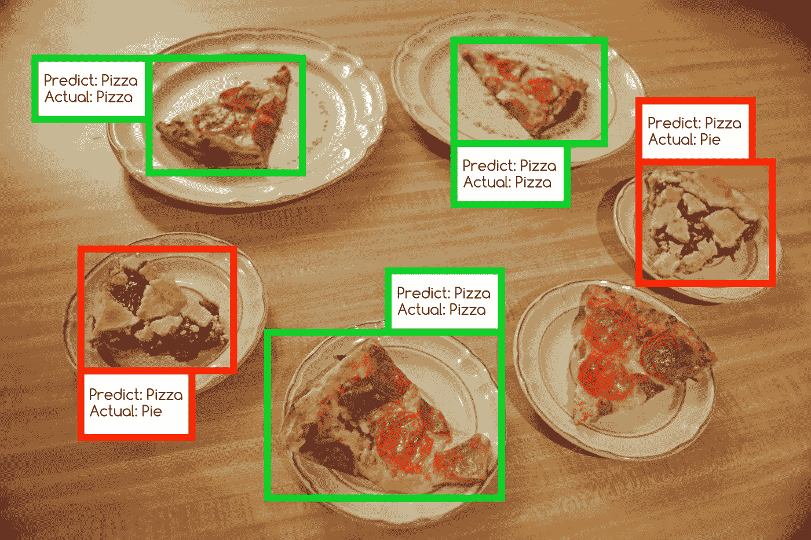
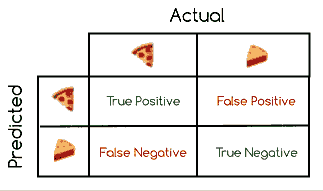
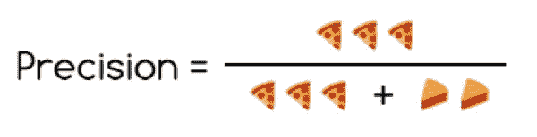
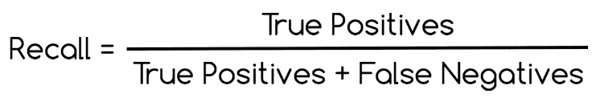
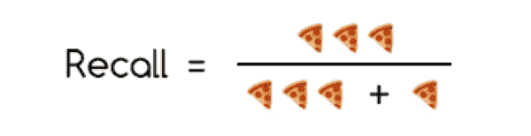

# 数披萨:机器学习的度量标准

> 原文：<https://towardsdatascience.com/counting-pizza-metrics-for-machine-learning-4c2ab61b5378?source=collection_archive---------13----------------------->

## 可视化理解机器学习指标

理解使用机器学习做出商业决策的正确指标很重要。分类说明某样东西是否是别的东西:比如说一张图片是否包含披萨切片。

精度和召回处理*可量化的结果*用于转化为商业模型的分类。不需要理解机器学习实际上是如何工作的。

任何接触涉及机器学习的商业模式的人都应该理解这些指标。包括创始人、管理层、业务发展和投资者。

对于决策者来说，为数据科学团队提供适合业务模型的指标非常重要。我希望向你们展示，任何会数数的人都能明白该用哪种度量。

假设你想诊断一种罕见的疾病。

*   当你说一个病人有疾病时，你有多少正确的机会？
*   你漏掉了多少病例？

对这些问题的回答推动了商业模式的发展。精确和召回是两个各自的答案。

本文旨在给出这些重要指标的直觉。当我们能把一个图像和一个概念联系起来时，直觉往往是最好的。所以让我们来考虑一个直观的例子:下图中有几片披萨？

The answer is 4 pizza slices. I ate the other 4\. Oops.

现在让我们假设我们已经训练了一个卷积神经网络(CNN)来识别图像中的披萨。我不会告诉你它是如何工作的，没关系！CNN 带回来这些结果:

该模型预测了 5 个比萨饼切片。它正确地标记了 3 片比萨饼，但错误地将 2 片馅饼标记为比萨饼。它完全错过了一个比萨饼切片。仔细查看图像，直到您看到所有四个数字都匹配。

现在，让我们回顾一些术语，更深入地了解该模型的表现。精确度和召回率告诉我们从一个分类模型中我们得到什么样的预测。在计算比萨饼的情况下，这些类型的预测是:

*   真阳性:模型预测比萨饼，它是比萨饼
*   假阳性:模型预测比萨饼，它不是比萨饼
*   假阴性:模型预测不是比萨饼，它是比萨饼
*   真否定:模型预测不是比萨饼，它不是比萨饼

或者我们可以用表情符号来展示这些预测！(注意:馅饼表情符号在技术上是指“不是披萨”的任何东西)

美国有线电视新闻网正确预测了 3 个比萨饼切片是比萨饼，所以有 3 个真正的阳性。它错误地预测了实际上是馅饼的 2 片比萨饼，所以有 2 个误报。它漏掉了一片比萨饼，所以有一个假阴性。

*   真阳性= 3
*   假阳性= 2
*   假阴性= 1

现在让我们开始计算模型的表现。精密测量*正确性*。在这里，正确性意味着:

> 当模特说披萨的时候，有多少是正确的？

现在我们来介绍一下精度的公式:

或者更直观(也更美味):

所以精度等于 3 / (3 + 2) = 0.6。这意味着当模型预测某样东西是比萨饼时，它有 60%的几率是正确的。另外 40%的时间里，它错误地预测了比萨饼，而实际上它是馅饼。

另一方面，回忆衡量*完整性。*在这里，完整性意味着:

> 在所有真正的比萨饼中，模型抓住了多少片？

现在我们来介绍一下召回的公式:

或者更形象地说:

所以召回率等于 3 / (3 + 1) = 0.75。这意味着在所有实际的比萨饼中，模型捕捉到了 75%的比萨饼切片。它漏掉了 25%的比萨饼切片，也就是图像右下方的那一片。

现在我们面临一个自然的问题:哪个指标对业务决策更重要？每个人都讨厌的答案，因为它太真实了:看情况。

更有意思的是，精确度和召回率直接相互竞争。随着精确度的提高，召回率趋于下降。随着回忆越来越好，精确性越来越差。

因此，如果我们希望模型永远不要说馅饼是比萨饼(100%精确)，它将错过更多的比萨饼切片总数(更少的回忆)。这种情况经常发生在商业环境中，在这种环境中，一个错误的决策会带来巨大的代价。精准的座右铭是:

> 错过一个事件比对一个糟糕的事件采取行动要好。

如果我们希望模型捕捉到每一片披萨(100%召回)，它会猜测更多的馅饼是披萨(精确度较低)。这种情况经常发生在商业环境中，错过一个事件会有很大的代价。召回的座右铭是:

> 抓住所有事件，有时是错误的，比总是正确的要好。

# 额外收获:更常见的指标

另一个常见的度量标准是普通的老式*精确度*。它衡量正确预测的比例，包括正面和负面预测。

这里要注意:在处理类不平衡的数据集时，这种度量会产生极大的误导。这基本上意味着一种类型的东西比另一种多得多。假设一个数据集包含 100 张比萨饼图片，而只有 5 张馅饼图片。

虽然它通常很少使用，但有时使用精度是合理的。如果一个数据科学家说一个模型达到了 99%的准确率，问问这实际上意味着什么。

毕竟，考虑一下 1%的人患有罕见疾病的情况。一个总是预测“没有疾病”的分类模型将有 99%的准确率。然而，这样的模型将*永远*捕捉不到那种疾病的病例(0%的准确率和召回率)。

现在让我们考虑同样关心精确度和召回率的情况。我们希望模型既高度正确又完整(这在实践中可能相当困难)。我们可以引入另一个指标，称为*F1-得分*。

F1 分数在精确度和召回率之间创造了一个平衡的分数。基本上，它通过在精确度和召回率之间寻找一个值来平衡精确度和召回率，*总是*更倾向于较低的值。比萨饼分类器的 F1 分数是 67%，接近 60%的精确度，而不是 75%的召回率。

在大多数情况下，F1 分数是可取的，以确保我们有良好的精度*和*良好的回忆。在某些情况下，可能没有必要。获得高精度和高召回率需要花费更多的时间、资源和金钱。高精度或高召回率本身可能以较低的成本适用于商业模式。

# 结论

由设计业务模型的人来决定何时使用什么度量标准。

您不必成为数据科学家，也能理解使用哪种指标。它只涉及回答以下问题:

> 机器学习的结果会让我的生意兴隆吗？

度量提供驱动业务模型的可量化结果。精确度、召回率和 F1 分数为理解分类模型的结果奠定了坚实的基础。

我希望我向你展示了任何会数数的人都能理解机器学习指标。我也希望你能从这篇文章中学到一些东西:

*   度量=商业模式的燃料
*   精确度=正确性
*   回忆=完整
*   f1-分数=平衡分数
*   准确性=潜在误导
*   披萨=美味