# py spark:count vectorizer | HashingTF

> 原文：<https://towardsdatascience.com/countvectorizer-hashingtf-e66f169e2d4e?source=collection_archive---------0----------------------->

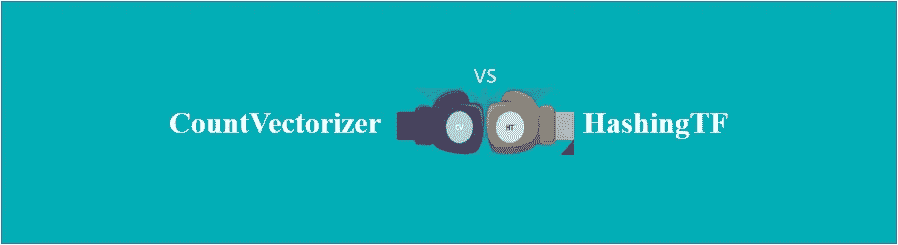

我在将商业实体与其相应的品牌名称进行匹配时，偶然发现了这些术语。但是，让我用一些更简单的例子向您介绍一下。

在深入研究 CountVectorizer 和 HashingTF 之前，让我们先大致了解一下它们是做什么的。

计数矢量器和哈希函数估计器用于生成术语频率向量。它们基本上将文档转换为数字表示，可以直接输入或进一步处理为其他算法，如 LDA、Jaccard 距离的 MinHash、余弦距离等。

假设我们的数据库中只有 2 个文档，我们希望将它们转换成一个特征向量。

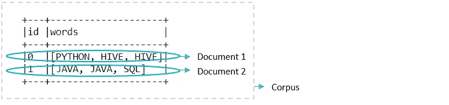

我们可以继续使用特征提取算法，例如术语频率-逆文档频率(TF-IDF)

# **TF-IDF**

这是一种将文档转换成向量的方法，使得向量反映术语对于语料库中的文档的重要性。

如果我们用 t 表示术语，用 D 表示文档，用 D 表示语料库

**术语频率(TF(t，d))** :术语 t 在文档 d 中出现的次数

这里，TF(PYTHON，Document 1)= 1；TF(HIVE，文档 1) = 2

***必须注意的是，HashingTF 和 CountVectorizer 都可以用来生成术语频率向量***

**文档频率(DF(t，D))** :包含术语 t 的文档的数量

这里 DF(PYTHON，Document 1)= 1；DF(HIVE，文档 1) = 1

然而，像 a、an 等这样的停用词。在语料库中出现频率很高，但没有特殊含义。为了解决这个问题，我们使用了逆文档频率(IDF)。

**IDF(t，D)** :术语提供多少信息的数值度量

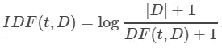

这里 IDF(PYTHON，Document 1)= log((2+1)/(1+1))~ 0.405

类似地，IDF(HIVE，文献 1) ~0.405

**TF-IDF:**TF 与 IDF 的乘积。

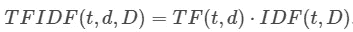

这里 TF-IDF(PYTHON，文档 1，语料库)~ 0.405

同样，TF-IDF(HIVE，文档 1，语料库)~0.81

因此，TF-IDF 确保了在文档中具有高频率的术语将具有高 TF，但是如果一个术语在语料库中具有高频率，则它的重要性被 IDF 降低。语料库中所有文档中出现的术语将具有等于 0 的 TF-IDF。

正如我们已经看到的，HashingTF 和 CountVectorizer 都可以用来生成术语频率向量。因此，现在让我们深入了解每一种方法，了解它们的优点和缺点。

# **计数矢量器**

CountVectorizer 将文本文档转换为提供令牌计数信息的向量。

让我们继续讨论前面讨论过的具有 2 个文档的相同语料库。我们想把文档转换成词频向量

```
*# Input data: Each row is a bag of words with an ID*
df = hiveContext.createDataFrame([
    (0, "PYTHON HIVE HIVE".split(" ")),
    (1, "JAVA JAVA SQL".split(" "))
], ["id", "words"])df.show(truncate = False)
```

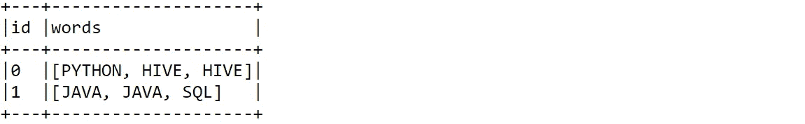

首先，CountVectorizer 将生成一个词汇表，以防没有先验词汇表。例如，在这个例子中，CountVectorizer 将创建一个大小为 4 的词汇表，其中包括 PYTHON、HIVE、JAVA 和 SQL 术语。接下来是计数矢量器模型的拟合。在拟合过程中，CountVectorizer 将选择按词频排序的顶级词汇。该模型将产生一个稀疏向量，可以馈入其他算法。

```
*# Fit a CountVectorizerModel from the corpus*
from pyspark.ml.feature import CountVectorizer
cv = CountVectorizer(inputCol="words", outputCol="features")model = cv.fit(df)result = model.transform(df)
result.show(truncate=False)
```

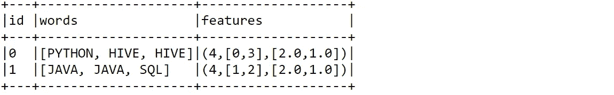

为了便于理解，特征向量可以分成 3 个部分

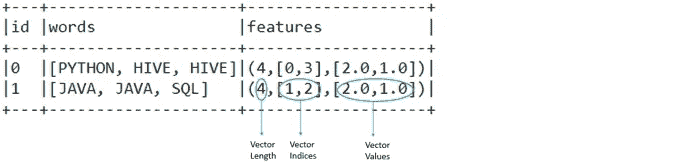

*   开头的数字代表向量的大小。在这里，是 4。
*   第一列数字代表矢量索引。

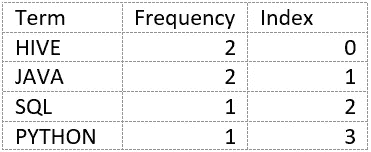

例如，与频率为 1 的术语“SQL”相比，“JAVA”术语的频率为 2。因此，“JAVA”的索引是 1，而“SQL”的索引是 2

*   第二列数字代表与这些指数相对应的值。

在文档 2 中可以看出，索引为 1 的‘JAVA’的值为 2，索引为 2 的‘SQL’的值为 1

然而，应该注意的是，由于“HIVE”和“JAVA”的频率相同，所以索引是可以互换的。

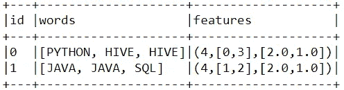

Here, ’HIVE’ has index 0 and ‘JAVA’ has index 1

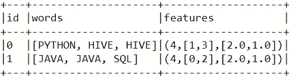

Here, ’HIVE’ has index 1 and ‘JAVA’ has index 0

类似的，其他具有相同频率的术语也是如此。

# **HashingTF**

HashingTF 将文档转换为固定大小的矢量。默认特征尺寸为 262，144。使用散列函数将术语映射到索引。使用的哈希函数是 MurmurHash 3。相对于映射的索引来计算项频率。

```
*# Get term frequency vector through HashingTF*
from pyspark.ml.feature import HashingTFht = HashingTF(inputCol="words", outputCol="features")result = ht.transform(df)
result.show(truncate=False)
```

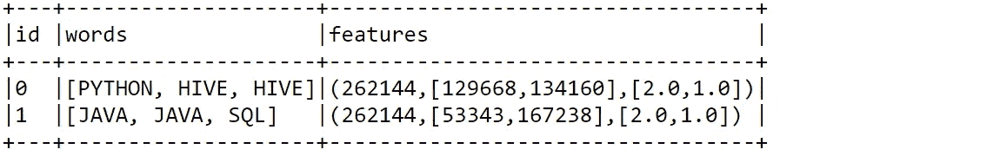

从上面的例子中可以看出，向量的维数被设置为默认值，即 262，144。此外，术语“PYTHON”通过散列函数被映射到索引 134160，并且具有等于 1 的频率。类似地，可以获得关于其他术语的见解。

# **对比与结论**

我们已经看到，CountVectorizer 和 HashingTF 都可以被实现来生成频率向量。然而，这两种实现各有优缺点。让我们仔细看看它们之间的差异，以选择最适合我们要求的算法。-

*   通过 CountVectorizer 生成的向量的大小取决于训练语料库和文档，而通过 HashingTF 生成的向量的大小是固定的。默认大小为 262，144
*   在计数矢量器的情况下，每个原始特征被映射到一个索引。然而，HashingTF 遭受潜在的哈希冲突，即 2 个或更多的项可能被映射到相同的索引，从而在哈希之后变得相同。然而，为了避免哈希冲突，我们可以增加目标特征的维数
*   由于全局项到索引的映射，CountVectorizer 与使用哈希技巧的 HashingTF 相比，计算开销更大。
*   很难解释通过 HashingTF 创建的向量，因为散列是不可逆的，所以无法恢复原始输入。但是，在使用 CountVectorizer 的情况下，可以恢复输入

显然，这两种算法之间有一个权衡。但是，我们可以得出结论，在拥有大量数据集的情况下，使用比 HashingTF 稍低的精度会更合适，而在需要反向映射的情况下，CountVectorizer 会更合适。

希望有所帮助:)