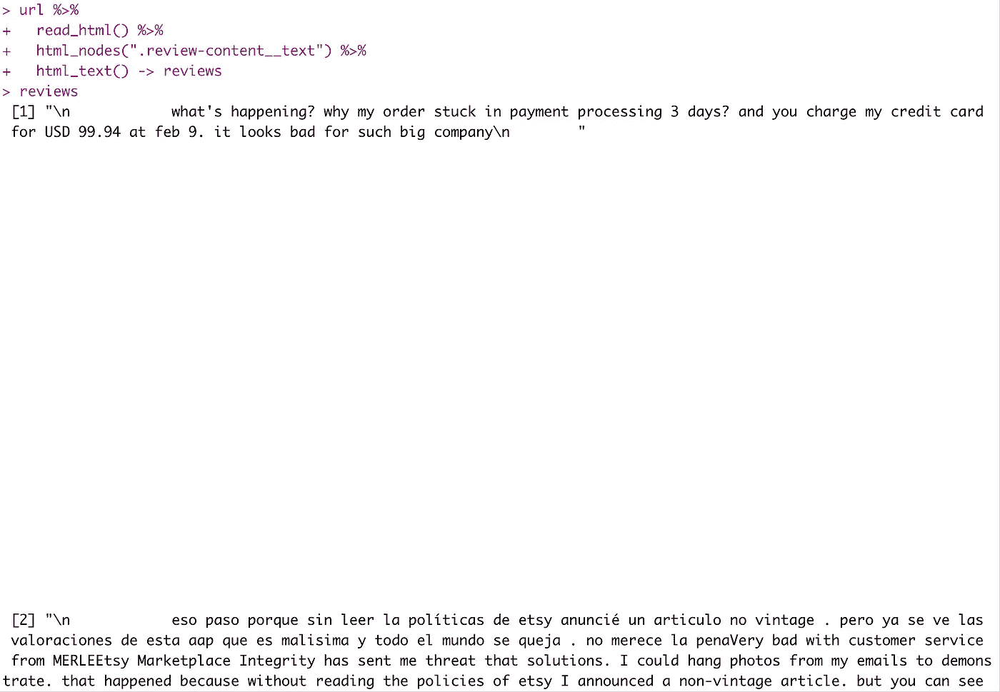
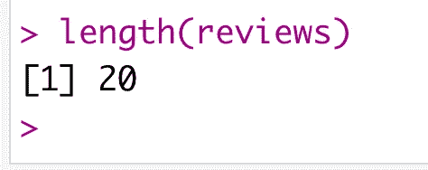
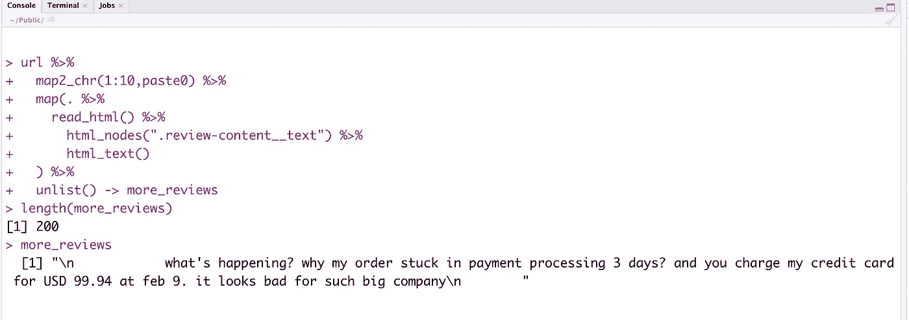

# 面向规模的 R 语言中 Web 抓取与函数式编程的耦合

> 原文：<https://towardsdatascience.com/coupling-web-scraping-with-functional-programming-in-r-for-scale-1bc4509eef29?source=collection_archive---------27----------------------->


[https://unsplash.com/photos/-lp8sTmF9HA](https://unsplash.com/photos/-lp8sTmF9HA)

在这篇文章中，我们将看到如何使用 R 进行 web 抓取，同时，我们将利用 R 中的函数式编程来扩展它。这篇文章的性质更像是一种食谱格式，而不是文档/教程类型，因为这里的目标是解释 web 抓取如何有效地与函数式编程相结合

## **R 中的网页抓取**

数据爱好者无需介绍网络搜集。当数据本身不可用时，这是收集数据的最可行和最基本的方法之一。

当你缺少数据，或者需要宏观经济指标，或者某个项目没有可用的数据，比如带有自定义文本数据集的 Word2vec / Language 时，了解网络搜集会非常方便。

一个漂亮的(类似 Python 中的 BeautifulSoup 包，用于 web 抓取。它与`tidyverse`的宇宙和超级方便的`%>%`管道操作员也很好。

## **样本用例**

顾客对 Etsy.com 感受的文本分析。为此，我们将从[trustpilot.com](http://trustpilot.com)中提取评论数据。

下面是从 Trustpilot 的 Etsy 页面第一页抓取评论的 R 代码。[网址:https://www.trustpilot.com/review/www.etsy.com?page=1](https://www.trustpilot.com/review/www.etsy.com?page=1)

```
library(tidyverse) #for data manipulation - here for pipe
library(rvest) - for web scraping#single-page scrapingurl <- "[https://www.trustpilot.com/review/www.etsy.com?page=1](https://www.trustpilot.com/review/www.etsy.com?page=1)"url %>% 
  read_html() %>% 
  html_nodes(".review-content__text") %>% 
  html_text() -> reviews
```

这是一段相当简单的代码，我们传递 URL 来读取 html 内容。一旦内容被读取，我们使用`html_nodes`函数根据它的`css selector property`获取评论文本，最后从它的`html_text()`中取出文本并将其分配给 R 对象`reviews`。

下面是`reviews`的输出示例:



很好。我们已经成功地收集了我们分析所需的评论。



但问题是我们得到的评论数量只有 20 条——正如我们在截图中看到的，我们已经得到了一条非英语评论，我们可能不得不在数据清理过程中将其排除。

这使我们有机会收集更多的数据来弥补上述数据损失，并使分析更加有效。

## 规模需求

使用上面的代码，我们只从第一页(也是最近的一页)开始。因此，由于需要更多的数据，我们必须将搜索范围扩大到更多的页面，比如说 10 个其他页面，在数据处理之前，这些页面将为我们提供 200 条原始评论。

## 传统方式

非常传统的方法是使用一个循环——通常是使用`for`循环从 1 到 20 迭代 url，以基于一个基本 URL 创建 20 个不同的 URL(字符串连接)。众所周知，这需要更多的计算，代码也不紧凑。

## **函数式编程方式**

在这里，我们将使用来自包`purrr`的 R 的函数式编程支持，在与上述代码相同的数据管道中，以 R 的`tidy`方式执行相同的迭代。我们将使用`purrr`中的两个函数，

1.  `map()`是来自函数式编程范式的典型映射，它接受一个函数并映射到一系列值上。
2.  `map2_chr()`是 map 的发展，它接受函数的附加参数，并将输出格式化为字符。

**下面是我们的函数式编程代码**

```
library(tidyverse)
library(rvest)
library(purrr)#multi-pageurl <- "[https://www.trustpilot.com/review/www.etsy.com?page=](https://www.trustpilot.com/review/www.etsy.com?page=)" #base URL without the page numberurl %>% 
  map2_chr(1:10,paste0) %>% #for building 20 URLs 
  map(. %>% 
    read_html() %>% 
      html_nodes(".review-content__text") %>% 
      html_text()
  ) %>% 
  unlist() -> more_reviews
```

正如您所看到的，这段代码与上面的单页代码非常相似，因此它使得任何理解前面代码的人都可以更容易地用最少的先验知识来通读这段代码。

这段代码中的额外操作是，我们构建 20 个新的 URL(通过更改 URL 的查询值)并逐个传递这 20 个 URL 以进行 web 抓取，最后，作为回报，我们将获得一个列表，我们使用`unlist`保存所有计数必须为 200 的评论(每页 20 条评论 x 10 页)。

让我们看看输出是什么样子的:



是的，200 条评论。这实现了我们的目标，即收集(相当)足够的数据来执行我们上面提到的文本分析用例。

但是本文的重点是向您介绍 R 中的函数式编程，并展示它如何容易地适应现有的数据管道/工作流，它是如何紧凑，毫无疑问，它是如何高效(比典型的 for 循环)。希望这篇文章达到了它的目的。

*   **如果你更感兴趣，可以看看这个关于函数式编程的** [**Datacamp 课程**](https://www.datacamp.com/courses/foundations-of-functional-programming-with-purrr?tap_a=5644-dce66f&tap_s=210728-e54afe)
*   这里使用的完整代码可以在 github 上[找到](https://github.com/amrrs/blogpost_codes/blob/master/rvest_purrr_scraping_at_scale.R)

*谢谢:整篇文章和代码的灵感来自 Saurav Ghosh 在 Bengaluru R 用户组 meetup* 中参加的会议