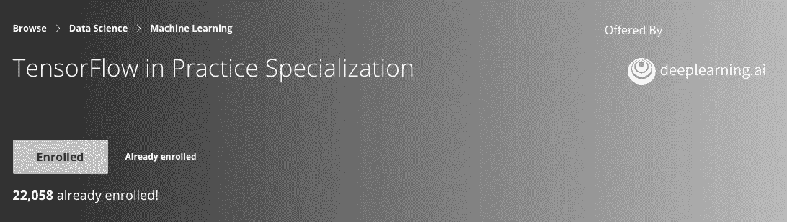
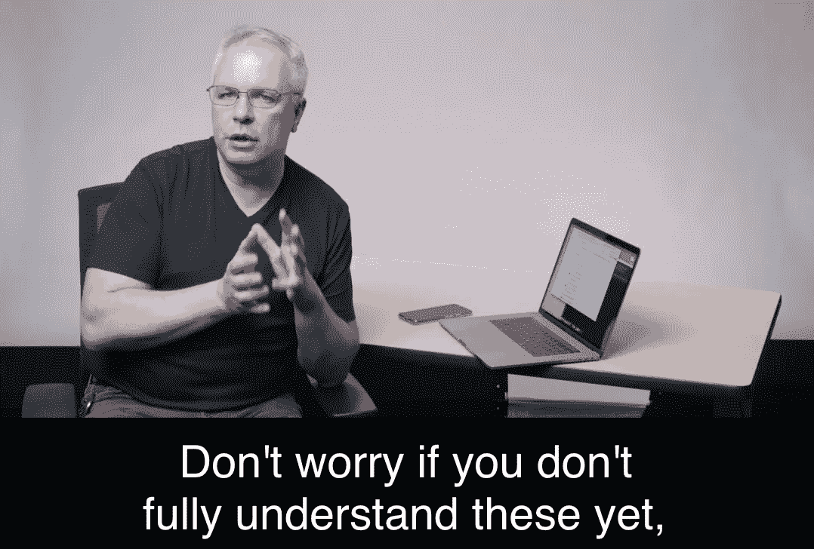

# 面向人工智能、机器学习和深度学习的 TensorFlow 简介

> 原文：<https://towardsdatascience.com/course-review-introduction-to-tensorflow-for-artificial-intelligence-machine-learning-and-deep-5ef1a85042b2?source=collection_archive---------19----------------------->

> *本次审查的结构:*

*   本课程总结
*   本课程涵盖的知识和技能
*   本课程与深度学习专业化的关系
*   这是你的课程吗？
*   我对这门课的主观评价

# 总结:

本课程是 deeplearning.ai 提供的 TensorFlow 在实践专业化方面的第一门课程，顾名思义，是对 TensorFlow 的介绍。中级水平，并将带领你一头扎进深度学习/计算机视觉/人工智能。

# 本课程涵盖的知识和技能

*   了解使用 TensorFlow 的最佳实践和计算机视觉的理论基础。
*   建立一个基本的神经网络。
*   使用卷积来改进神经网络，包括使用池层和密集层。
*   如何使用 google colab？

# 本课程与深度学习专业化的关系

我认为深度学习专业化是这门课程的先决条件。如果学生不了解深度学习，那么理解代码真正在做什么就有点难了。因为本课程更多的是实践，而不是覆盖太多的理论基础，例如，它不会教你如何详细计算约定和池层的大小，但教师会提供一个特定课程的链接。让我举例说明:在第 2 周的视频中，当 Laurence Moroney 教授使用 TensorFlow 构建卷积神经网络时，他提供了一个链接，指向 DeepLearningSpecialization 第四期课程中的一个讲座。

# 这是你的课程吗？

这是一门中级课程。它要求学生具备 Python 编码和高中水平数学的经验。它说，“先前的机器学习或深度学习知识是有帮助的，但不是必需的。”**然而**，在我看来，如果你想理解代码真正在做什么，深度学习的知识也是必需的。如果你已经完成了 DeepLearningSpecialization 或者你已经知道了深度学习的基本理论，但是不熟悉 TensorFlow，我会向你推荐这门课程；如果你之前用过 PyTorch，又想用 TensorFlow 弄脏手，我推荐你这个；如果你像我一样是一个雄心勃勃的数据爱好者，我也一定会向你推荐这门课程！**如果你对这门课程感兴趣，并且正在寻找关于这门课程的信息，那么不要犹豫，这门课程就是为你设计的。**

# 我对这门课的主观评价

劳伦斯·莫罗尼(Laurence Moroney)的教学风格很迷人，跟你的教授或者大学提供的其他课程不一样。劳伦斯能让这门课变得如此有趣。此外，我喜欢劳伦斯和安德鲁在每周讲座开始时的谈话。编码任务并不具有挑战性，除了谦虚，它们对我来说还算简单(我已经完成了 Andrew 的深度学习专业)。Laurence 还在 google colab 中提供了代码，这使得学习过程更加易于管理，学生可以非常快速地在 colab 中训练和测试模型。

# 而且和往常一样，你可以在我的 [GitHub repo](https://github.com/lipengyuan1994/Data-Science-Learning-Repository/tree/master/Introduction%20to%20TensorFlow%20for%20Artificial%20Intelligence%2C%20Machine%20Learning%2C%20and%20Deep%20Learning) 里找到这门课的所有资料。

也发表在我的[个人博客](https://lipengyuan1994.github.io/blog/files/87c0427f79f2740e14342f9d38255c50-11.html)。