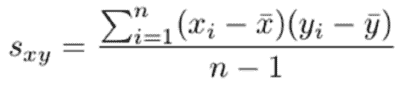
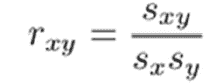
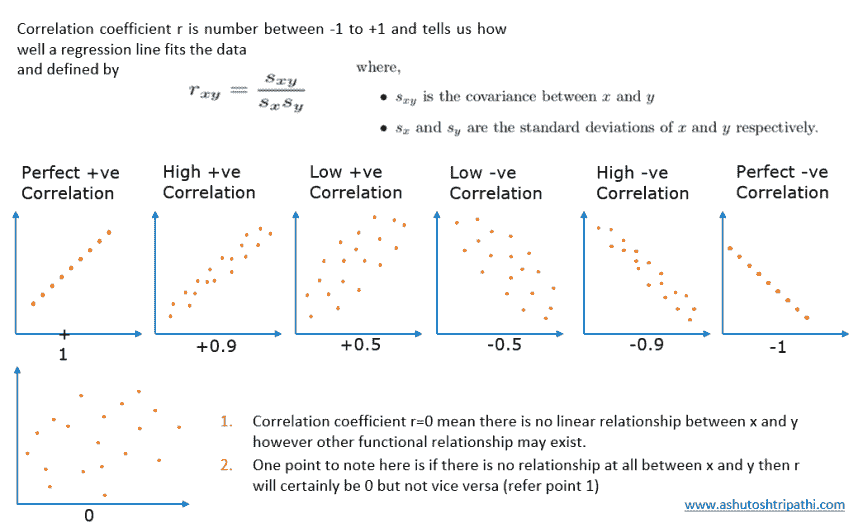

# 什么是协方差和相关系数及其意义？

> 原文：<https://towardsdatascience.com/covariance-and-correlation-321fdacab168?source=collection_archive---------9----------------------->

协方差和相关性对于理解两个连续变量之间的关系非常有帮助。协方差说明两个变量是同向变化(正协方差)还是反向变化(负协方差)。协方差数值没有意义，只有符号是有用的。而相关性解释了一个变量的变化导致第二个变量的比例变化。相关性在-1 到+1 之间变化。如果相关值为 0，则意味着变量之间没有线性关系，但是可能存在其他函数关系。

让我们详细理解这些术语:

# 协方差:

在协方差的研究中，只有符号是重要的。正值表示两个变量的变化方向相同，负值表示它们的变化方向相反。

两个变量 x 和 y 之间的协方差可以计算如下:

其中:

*   x̄是 x 的样本均值
*   ȳ是 y 的样本均值
*   x_i 和 y_i 是样本中第 I 条记录的 x 和 y 值。
*   n 是样本中的记录数

## 公式的意义:

*   分子:x 轴的差异量乘以 y 轴的差异量。
*   协方差单位:x 的单位乘以 y 的单位
*   因此，如果我们改变变量的单位，协方差将有新的值，但符号将保持不变。
*   因此，协方差的数值没有任何意义，但是，如果它是正的，那么两个变量在相同的方向上变化，否则，如果它是负的，那么它们在相反的方向上变化。

# 相关性:

由于协方差只告诉方向，不足以完全理解关系，我们分别用 x 和 y 的标准偏差划分协方差，得到在-1 到+1 之间变化的相关系数。

*   -1 和+1 表明这两个变量具有完美的线性关系。
*   负表示它们与相关系数值的因子成反比。
*   正意味着它们彼此成正比，意味着与相关系数值的因子同方向变化。
*   如果相关系数为 0，则意味着变量之间没有线性关系，但是可能存在其他函数关系。
*   如果两个变量之间完全没有关系，那么相关系数肯定是 0，但是如果它是 0，那么我们只能说没有线性关系，但是可能存在其他函数关系。

x 和 y 之间的相关性可以计算如下:

其中:

*   S_xy 是 x 和 y 之间的协方差。
*   S_x 和 S_y 分别是 x 和 y 的标准差。
*   r_xy 是相关系数。
*   相关系数是一个无量纲的量。因此，如果我们改变 x 和 y 的单位，那么系数值也将保持不变。

让我们借助下图来理解相关系数的意义:

请在下面的评论区分享你的想法/想法。如果你对这个话题有任何疑问，欢迎你用联系方式给我写信。我很乐意回答你的问题。

*原载于 2019 年 1 月 15 日*[*【http://ashutoshtripathi.com】*](https://ashutoshtripathi.com/2019/01/15/covariance-and-correlation/)*。*