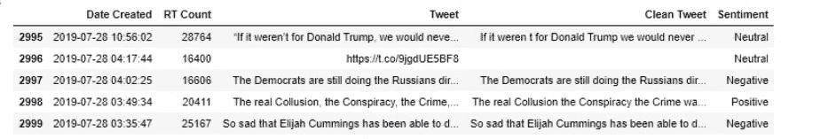
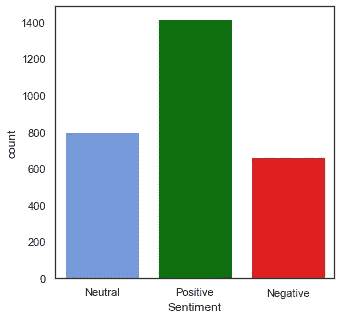
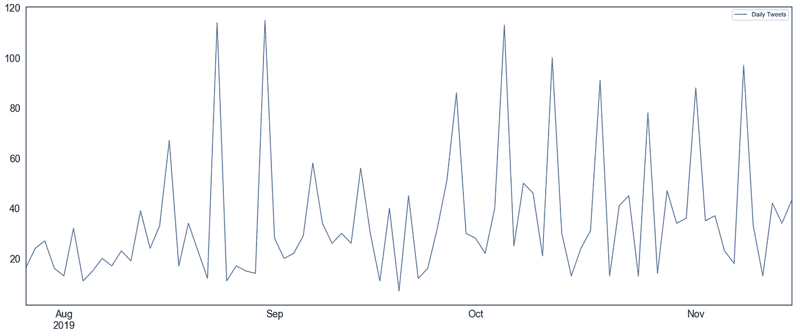
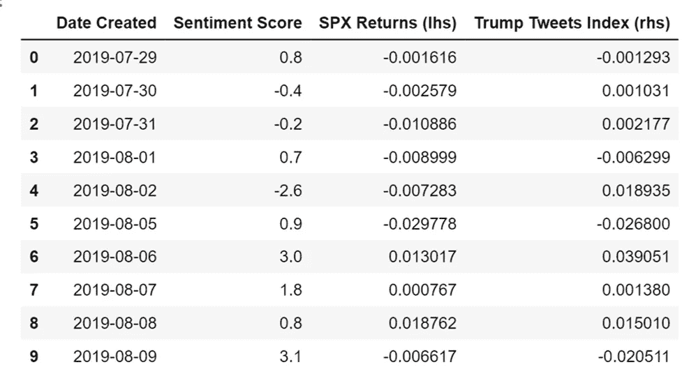
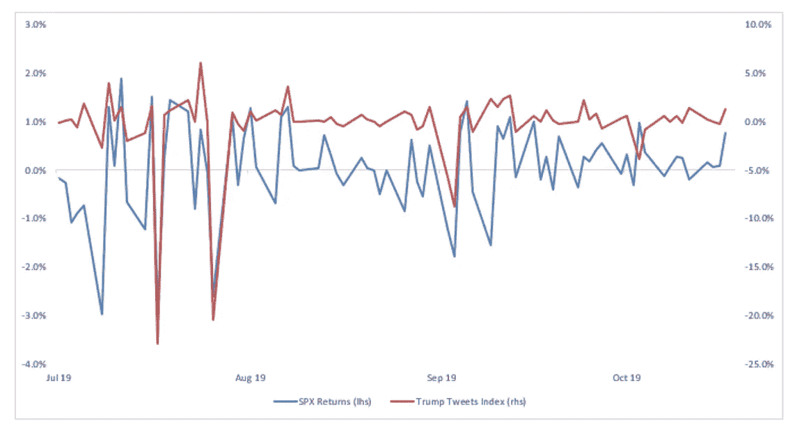

# cov fefe & NLP——特朗普的推文会影响股市吗？

> 原文：<https://towardsdatascience.com/covfefe-nlp-do-trumps-tweets-move-the-stock-market-42a83ab17fea?source=collection_archive---------20----------------------->


Source: John Cameron via Unsplash.

Twitter 是世界上最大的社交媒体服务之一，现在已经成为政治家、组织和公司向其追随者提供更新的平台。代表一家公司或一个政党的用户使用 Twitter 来表达对当前新闻的看法，推动他们的政治活动，甚至确认官方的政策决定。使用该网站向数百万粉丝传播想法的重要人物包括特斯拉创始人埃隆·马斯克、欧盟委员会主席唐纳德·图斯克和现任英国首相鲍里斯·约翰逊。社交网络的使用可能会产生巨大的财务/商业影响——例如，埃隆·马斯克(Elon Musk)在推特上发布消息称，他的电动汽车公司特斯拉(Tesla)私有化的“资金已有保障”，这引起了很多负面关注。特斯拉的股价上涨了 8.5% (1)，这导致了证券交易委员会对马斯克的惩罚性调查。这导致马斯克被罢免了他创建的公司的董事长职务，并被罚款 2000 万美元——这一切都是因为一条推特。美国总统唐纳德·特朗普目前在推特上有 6680 万粉丝，账号为 *"@realDonaldTrump"* (2)。特朗普在他的推特账户上非常活跃，自 2016 年以来平均每天约 10 条推特(3)。特朗普在推特上直言不讳，经常发表针对他的批评者的“人身攻击”言论，特别是针对民主党。推特在此前的大选中发挥了巨大作用(2016 年举行)，特朗普的言论最终促使对前竞争对手总统候选人希拉里·克林顿进行调查。

**有效市场假说**

从广义上来说，交易员和投资组合经理根据公司的基本面、管理层及其未来的预期价值来决定是购买、出售还是持有特定的股票(公司股票)。因此，跟上公司新闻是至关重要的，这可能涉及收益电话会议、新产品发布，以及最近通过推特发布的新闻。这与一个叫做*‘有效市场假说’*的观点相吻合。EMH 主张股票在证券交易所以其内在价值进行交易，也就是说，关于一家公司、其管理层和其估值的所有信息都持续体现在当前股价中。这意味着当特朗普发推文时，这些信息甚至会在成为头条新闻之前就反映在金融市场上。所以现在，让我们收集数据。

**数据收集**

为了分析特朗普的推文，我们通过 Python 模块 Tweepy 使用 Twitter API 收集了 2019 年 7 月 28 日至 2019 年 11 月 16 日的约 3000 条推文(包括转发)。为此，我们在 Twitter 上创建了一个开发人员帐户，然后使用 cursor 方法获取推文，并将它们放入数据帧中:

```
dtweets = tweepy.Cursor(api.user_timeline, id="realDonaldTrump", include_rts=True, count=200, tweet_mode="extended")df = pd.DataFrame(columns=["Date Created","RT Count", "Tweet"])
```

这些推文然后被预处理以“清洗”它们，删除超链接和表情符号。

```
def clean_tweet(tweet):
    return ' '.join(re.sub('(@[A-Za-z0-9]+)|([^0-9A-Za-z \t])|(\w+:\/\/\S+)', ' ', tweet).split())#The long string of what seems like nonsense essentially takes away any characters that aren’t normal english words/letters.df["Clean Tweet"] = df['Tweet'].apply(lambda x: clean_tweet(x))
```

接下来，我们应用了一种叫做自然语言处理的技术。在高层次上，NLP 使用计算技术来分析句子，以实现特定的结果。虽然听起来可能很复杂，但您可能每天都在使用 NLP。常见的例子包括手机键盘上的预测文本、网页上的语言翻译和搜索结果。我们使用的 NLP 工具被称为*【情绪分析】*，它本质上决定了每条推文是正面的、中立的还是负面的。Python 模块“Textblob”旨在通过解析每个句子并给它一个介于-1 和 1 之间的分数来确定推文的情绪。例如，一条包含“错误”一词的推文通常会得到一个负分。此外，一条包含“谢谢”的推文通常会得到积极的评价。当然，有些情况下，一条推文可能并不总是被赋予正确的情绪，特别是对于经济变量。例如，当*低*失业率实际上对经济更有利时，“高失业率”可能会被赋予积极的情绪。然而，对于这个任务，我们使用了默认的 Textblob 功能，因为它已经通过机器学习在大型数据集上进行了测试。下面是用于对推文进行情感分析的代码片段:

```
def analyze_sentiment(tweet):
    analysis = TextBlob(tweet)
    if analysis.sentiment.polarity > 0:
        return 'Positive'
    elif analysis.sentiment.polarity ==0:
        return 'Neutral'
    else:
        return 'Negative'

df["Sentiment"] = df['Clean Tweet'].apply(lambda x: analyze_sentiment(x))i=0
for tweet in dtweets.items(3000):
    analyze_sentiment(tweet.full_text)

    i+=1
    if i == 3000:
        break
    else:
        pass
#code stops at 3000 tweets subject to Tweepy's limits
```

本质上，这段代码定义了一个函数，该函数通过使用“if”和“else”语句，根据 tweet 的情感对其进行分类，并使用 Textblob 对其进行评分。然后，我们在 pandas dataframe 中为“干净的 tweet”创建一个新列，遍历每条 tweet。一旦我们运行了这段代码，数据帧应该看起来像这样(任何空的/无意义的干净的 tweets 都从我们的分析中删除了):



**数据可视化**

利用我们收集的数据，我们可以直观地解释它的分布。下面我们展示了唐纳德·特朗普每条推文的情绪分布。在分析的大约 3000 条推文中，662 条推文被给予负面情绪，798 条中立，1415 条正面情绪。



Source: Twitter, Python. Tweets collected using Twitter API & Tweepy.

下图显示，特朗普的推文频率从 2016 年的平均水平大幅增加(包括转发)。



Source: Twitter, Python. Tweets collected using Twitter API & Tweepy.

为了衡量这些推文对股市回报的影响，我们决定使用标准普尔 500 指数，这是在美国证券交易所交易的 500 家最大公司的加权平均值。重要的是我们使用回报率而不是原始价格，因为回报率使系列**平稳** *(可以使用 Dickey-Fuller 测试来证实这一点，但这里没有使用)* **。**

**过滤数据**

为了尽可能使用最具代表性的数据，我们根据特定的词过滤了与股市相关的推文，如“贸易”、“中国”、“鲍威尔”等，因为它们更有可能影响市场。单词和短语的完整列表如下:

*"贸易"、"利率"、"通胀"、"经济"、"增长"、"操纵"、"货币"、"美元"、"中国"、"美联储"、"鲍威尔"、" Xi "、"关税"、"弹劾"。*

这使得我们的推文总数减少到了 500 条左右。然后根据他们的情绪给这些推文打分。正面推文的得分为 1，负面推文为-1.2，中性推文为 0.1。这些分数后来被转换成一个序列，**将每天所有推文的情感分数总和乘以当天标准普尔指数的回报。**这意味着我们可以将这些系列放在一起进行比较，以找到相关性。当给出分数时，我们认为投资者是厌恶损失的——这意味着他们从损失中获得的悲伤大于他们获得的同等程度的快乐。这就是为什么负面推文比正面推文的量级高。此外，人们可能会认为一条中性的推文得分为 0——在这里，我们假设股市的稳态高于零，因为全球趋势增长率高于零。情绪得分的实际任意数字来自我自己的假设，并且仅被用作将情绪得分缩放到 S & P 回报的手段。



Source — My own calculations.

当我们将这两个系列结合在一起时，我们会得到下面的图表:



Source — Yahoo Finance (4), Twitter

**解读**

直观上，我们可以看到股市的走势和特朗普的推文似乎是一起动的。当在两个系列之间进行相关性分析时，0.68 的正相关性意味着特朗普的推文事实上确实随股市而动。然而，重要的是，相关性 ***并不意味着*** 因果关系。换句话说，我们不知道这种关系的走向。还有许多个体因素可能会影响股票回报，如利率、通胀预期和其他特殊因素。我们发现的对这种关系的解释更有可能是，推文与影响市场的事件相吻合，如令人惊讶的经济数据发布或市场对数据做出反应后的货币政策决定。此外，我们大约 500 条推文的样本量可能不足以得出最准确的结论。展望未来，也许控制某些因素的线性回归，如市场规模、动量和波动性，以及更大的样本量，可能会产生一些有趣的结果。因此，我们不能 100%肯定地说，特朗普的推文先发制人地影响了股市。然而，更有可能的是，推文的情绪与市场回报正相关。

***感谢阅读！*** *如果你有什么见解，请不吝赐教。包含我用来做这个项目的源代码的完整 Jupyter 笔记本可以在我的* [*GitHub 仓库中找到。*](https://github.com/nathanwilthomas/Covfefe-NLP/blob/master/Trump%20Tweets%20NLP_Nov19.ipynb)

参考资料:

[1]投资媒体。*特斯拉股价如何在 80 天内跌了 100 美元*。(2019).请访问:[https://www . investopedia . com/investing/how-tes las-share-price-dropped-100-80-days/](https://www.investopedia.com/investing/how-teslas-share-price-dropped-100-80-days/)

[2]Twitter.com。*唐纳德 j 特朗普(@realDonaldTrump)在推特上*。(2019).可在:[https://twitter.com/realDonaldTrump?购买 ref _ src = tw src % 5 egoogle % 7 ctw camp % 5 eserp % 7 ctw gr % 5 e author](https://twitter.com/realDonaldTrump?ref_src=twsrc%5Egoogle%7Ctwcamp%5Eserp%7Ctwgr%5Eauthor)

[3] Newburger，E. *JP 摩根创建了一个指数来跟踪特朗普的推文对金融市场的影响:“Volfefe 指数”*。(2019)美国消费者新闻与商业频道。可查阅:[https://www . CNBC . com/2019/09/08/Donald-trump-is-tweet-more-and-its-impact-the-bond-market . html](https://www.cnbc.com/2019/09/08/donald-trump-is-tweeting-more-and-its-impacting-the-bond-market.html)

[4]雅虎财经历史数据。(2019).可在:[https://finance.yahoo.com/](https://finance.yahoo.com/)

*免责声明:本文表达的所有观点均为本人观点，* ***与*** *无任何关联，与先锋或其他任何金融实体无关。我不是一个交易者，也没有用本文中的方法赚钱。这不是财务建议。*