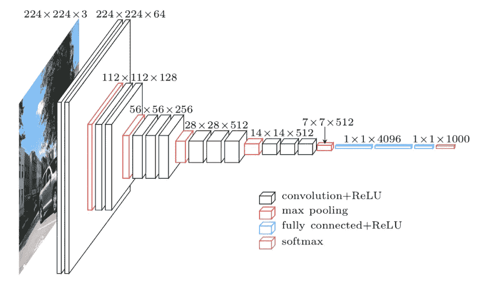
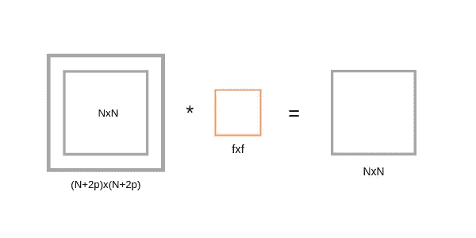

# 卷积神经网络

> 原文：<https://towardsdatascience.com/covolutional-neural-network-cb0883dd6529?source=collection_archive---------0----------------------->

## 从 basic 学习卷积神经网络及其在 Keras 中的实现


## 目录

*   CNN 是什么？
*   为什么要用 CNN？
*   几个定义
*   CNN 中的图层
*   Keras 实施

# 1.CNN 是什么？

计算机视觉每天都在快速发展。原因之一是深度学习。当我们谈论计算机视觉时，我们脑海中会出现一个术语卷积神经网络(缩写为 CNN)，因为 CNN 在这里被大量使用。计算机视觉中 CNN 的例子有人脸识别、图像分类等。它类似于基本的神经网络。CNN 也有像神经网络一样的可学习参数，即权重、偏差等。

# 2.为什么要用 CNN？

## 前馈神经网络的问题

假设您正在处理 MNIST 数据集，您知道 MNIST 的每幅图像都是 28 x 28 x 1(黑白图像仅包含一个通道)。输入层的神经元总数将是 28×28 = 784，这是可以管理的。如果图像的大小是 1000 x 1000，这意味着你需要在输入层 10⁶神经元。哦！这似乎需要大量的神经元来运作。它在计算上是无效的。所以卷积神经网络或者 CNN 来了。简而言之，CNN 所做的就是提取图像的特征，并将其转换到低维，而不丢失其特征。在下面的例子中你可以看到初始图像的大小是 224 x 224 x 3。如果不进行卷积，那么在输入层中需要 224 x 224 x 3 = 100，352 个神经元，但是在应用卷积之后，输入张量维数减少到 1 x 1 x 1000。这意味着在前向神经网络的第一层只需要 1000 个神经元。



Fig. Downsampling

# 3.几个定义

在了解 CNN 之前，有几个你应该知道的定义

## 3.1 图像表示

想想图像，很容易理解它有高度和宽度，所以用二维结构(矩阵)来表示图像中包含的信息是有意义的，直到你记得图像有颜色，为了添加关于颜色的信息，我们需要另一个维度，这就是张量变得特别有用的时候。

图像被编码到颜色通道中，图像数据在给定点被表示为颜色通道中的每个颜色强度，最常见的是 RGB，这意味着红色、蓝色和绿色。包含在图像中的信息是每个通道颜色的强度到图像的宽度和高度，就像这样


Fig. RGB representation of a image

因此，红色通道在每个点上的强度以及宽度和高度可以表示为一个矩阵，蓝色和绿色通道也是如此，因此我们最终有三个矩阵，当这些矩阵组合在一起时，它们就形成了一个张量。

## 3.2 边缘检测

每个图像都有垂直和水平边缘，它们实际上组合在一起形成一个图像。卷积运算与一些用于检测边缘的滤波器一起使用。假设你有尺寸为 6×6 的灰度图像和尺寸为 3×3 的过滤器。当 6×6 灰度级图像与 3×3 滤波器卷积时，我们得到 4×4 图像。首先，将 3×3 滤波器矩阵乘以我们灰度图像的第一个 3×3 尺寸，然后我们将一列向右移动到末尾，之后我们移动一行，依此类推。


Convolution operation

卷积运算可以用下面的方式来表示。这里，我们的图像尺寸是 4 x 4，过滤器是 3 x 3，因此我们得到卷积后的输出是 2 x 2。


Visualization of convolution

如果我们有 N×N 的图像大小和 F×F 的滤波器大小，那么卷积后的结果将是

```
(N x N) * (F x F) = (N-F+1)x(N-F+1)(Apply this for above case)
```

## 3.3 步幅和衬垫

步幅表示在卷积的每一步中我们移动了多少步。默认情况下是一个。


Convolution with Stride 1

我们可以观察到输出的大小小于输入的大小。为了保持输入中输出的维数，我们使用填充。填充是将零对称地添加到输入矩阵的过程。在下面的示例中，额外的灰色块表示填充。它用于使输出的尺寸与输入的尺寸相同。


Stride 1 with Padding 1

假设“p”是填充

最初(无填充)

```
(N x N) * (F x F) = (N-F+1)x(N-F+1)---(1)
```

应用填充后



After applying padding

如果我们在带有填充的(N+2p) x (N+2p)输入矩阵中应用滤波器 F x F，那么我们将得到输出矩阵维数(N+2p-F+1) x (N+2p-F+1)。正如我们所知，应用填充后，我们将获得与原始输入尺寸相同的尺寸(N x N)。因此我们有，

```
(N+2p-F+1)x(N+2p-F+1) equivalent to NxN
 N+2p-F+1 = N ---(2)
 p = (F-1)/2 ---(3)
```

等式(3)清楚地表明，填充取决于滤波器的尺寸。

# 4.CNN 中的图层

CNN 有五个不同的层次

*   输入层
*   卷积层(卷积+ ReLU)
*   汇集层
*   全连接(FC)层
*   soft max/逻辑层
*   输出层


Different layers of CNN

## 4.1 输入层

CNN 中的输入层应该包含图像数据。正如我们前面看到的，图像数据由三维矩阵表示。你需要把它改造成一列。假设您有一个尺寸为 28 x 28 =784 的图像，您需要在输入之前将其转换为 784 x 1。如果有“m”个训练示例，那么输入的维数将是(784，m)。

## 4.2.卷积层

卷积层有时被称为特征提取层，因为图像的特征是在该层中提取的。首先，将图像的一部分连接到卷积层，以执行我们前面看到的卷积运算，并计算感受野(它是输入图像的一个局部区域，与滤波器的大小相同)和滤波器之间的点积。运算结果是输出量的单个整数。然后，我们将过滤器在同一输入图像的下一个感受野上滑动一个步长，并再次进行相同的操作。我们将一次又一次地重复同样的过程，直到我们看完整个图像。输出将成为下一层的输入。

卷积层还包含 ReLU 激活，使所有负值为零。

## 4.3.汇集层


[Source](http://cs231n.github.io/assets/cnn/pool.jpeg) : CS231n Convolutional Neural Network

池层用于减少卷积后输入图像的空间体积。它用于两个卷积层之间。如果我们在卷积层之后应用 FC，而不应用池化或最大池化，那么它将是计算上昂贵的，我们不想要它。因此，最大池化是减少输入图像空间体积的唯一方法。在上面的示例中，我们在跨距为 2 的单个深度切片中应用了最大池。您可以观察到 4 x 4 维输入减少到 2 x 2 维。

池层中没有参数，但有两个超参数-过滤器(F)和步幅(S)。

一般来说，如果我们有输入维数 W1 x H1 x D1，那么

w2 =(W1 F)/S+1

H2 =(H1 F)/S+1

D2 = D1

其中 W2、H2 和 D2 是输出的宽度、高度和深度。

## 4.4.全连接层

全连接层包括权重、偏差和神经元。它将一层中的神经元连接到另一层中的神经元。它用于通过训练对不同类别的图像进行分类。

## 4.5.Softmax /逻辑层

Softmax 或逻辑层是 CNN 的最后一层。它位于光纤通道层的末端。Logistic 用于二分类，softmax 用于多分类。

## 4.6.输出层

输出层包含的标签是以一键编码的形式。

现在你对 CNN 有了很好的了解。让我们在 Keras 实现一个 CNN。

# 5.Keras 实施

我们将使用 CIFAR-10 数据集来构建 CNN 图像分类器。CIFAR-10 数据集有 10 个不同的标签

*   飞机
*   汽车
*   伯德
*   猫
*   鹿
*   狗
*   青蛙
*   马
*   船
*   卡车

它有 50000 个训练数据和 10000 个测试图像数据。CIFAR-10 中的图像大小为 32 x 32 x 3。它带有 Keras 库。


Fig. Model visualization

如果你用的是 google colaboratory，那么要确保你用的是 GPU。来检查你的 GPU 是否开着。尝试以下代码。

输出:

```
Found GPU at: /device:GPU:0
```

首先，导入所有必需的模块和库。

然后加载数据集，并将其分成训练集和测试集。

我们将打印 CIFAR-10 中的训练样本形状、测试样本形状和总类数。正如我们之前看到的，有 10 个类。为了举例，我们将打印来自训练集和测试集的两个示例图像。

输出:


找到输入图像的形状，然后将其整形为训练集和测试集的输入格式。之后，将所有数据类型转换成浮点数。

通过将训练数据和测试数据除以 255 来标准化 0-1 之间的数据，然后使用 *to_catagorical()* 函数将所有标签转换为一个热点向量。

使用一键编码显示类别标签的更改。

输出:

```
Original label 0 :  [6]
After conversion to categorical ( one-hot ) :  
[0\. 0\. 0\. 0\. 0\. 0\. 1\. 0\. 0\. 0.]
```

现在创建我们的模型。我们将添加卷积层，然后是池层。然后我们将连接密集(FC)层来预测类别。输入数据馈送到第一卷积层，该卷积层的输出充当下一卷积层的输入，依此类推。最后，数据被馈送到 FC 层，该层尝试预测正确的标签。

初始化所有参数并用 rmsprops 优化器编译我们的模型。有许多优化工具，例如 adam、SGD、GradientDescent、Adagrad、Adadelta 和 Adamax，请随意尝试。这里的批次是 256，包含 50 个纪元。

*model.summary()* 用于查看模型中各层的所有参数和形状。您可以看到，总参数为 276，138，总可训练参数为 276，138。不可训练参数为 0。

输出:


Model Summary

在编译我们的模型之后，我们将使用 *fit()* 方法训练我们的模型，然后对它进行评估。

输出:


经过训练，我们得到了 83.86%的准确率和 75.48%的验证准确率。其实一点也不差。


Loss vs Epochs graph


Accuracy vs Epochs graph

# 结论:

恭喜你！你通过了解卷积神经网络的基本概念，在 Keras 中制作了卷积神经网络。你可以随意改变它的超参数，并在评论区告诉我。

[***你可以在我的 Github 里找到所有代码***](https://github.com/dshahid380/CIFAR-10)

## 参考资料:

1.  [CS231n 卷积神经网络](http://cs231n.github.io/convolutional-networks/)
2.  [Keras 文档](https://keras.io/)
3.  [深度学习实验室](https://medium.com/deep-learning-turkey/deep-learning-lab-episode-2-cifar-10-631aea84f11e)
4.  关于卷积神经网络的 deeplearning.ai 课程