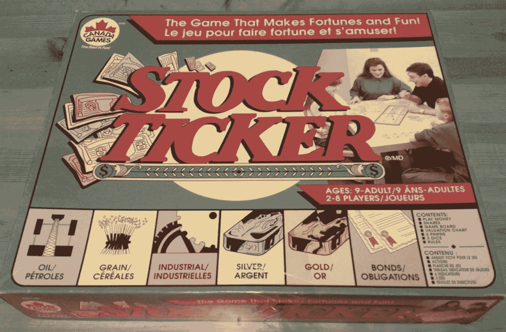
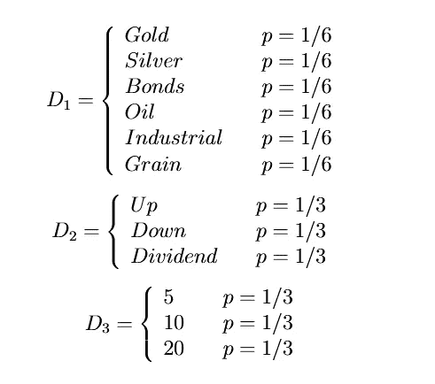
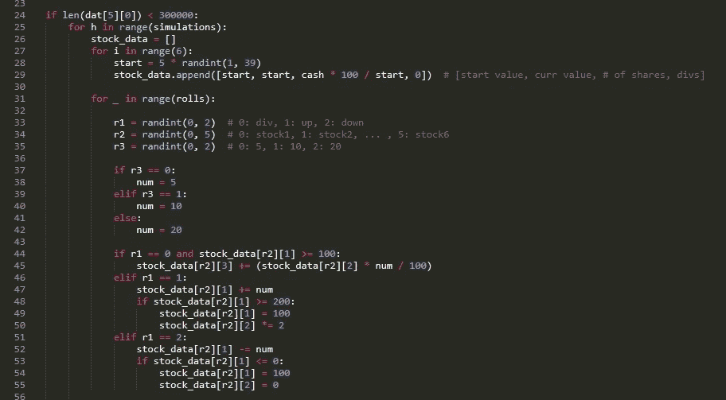
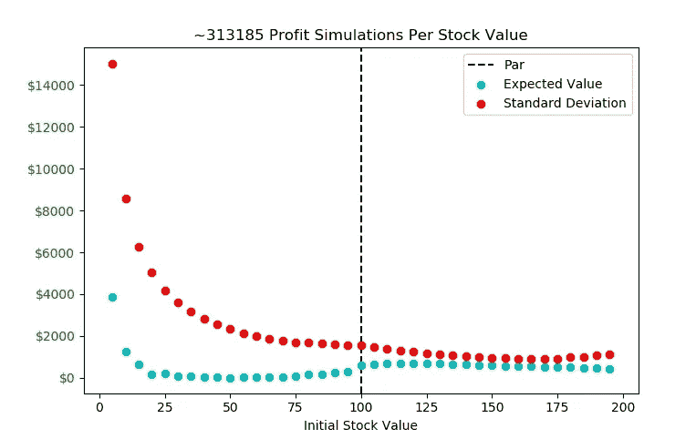
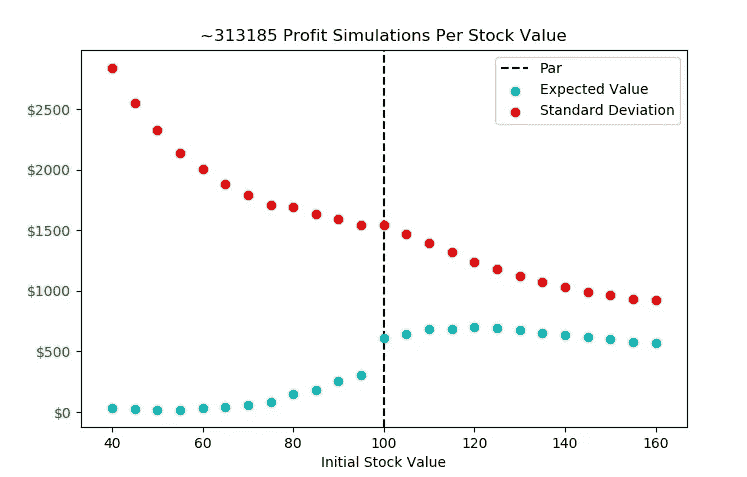
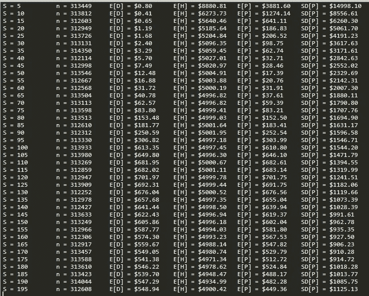

# 使用蒙特卡罗模拟破解 82 岁的股票交易棋盘游戏

> 原文：<https://towardsdatascience.com/cracking-an-82-year-old-stock-trading-board-game-using-monte-carlo-simulation-384c26eeff6c?source=collection_archive---------19----------------------->

棋盘游戏很有趣。股票交易很有趣。将它们放在一起，我们得到了 1937 年由 Copp-Clark 出版社出版的经典，*股票代码*。核心玩法很简单:在波动的市场中从经纪人那里买卖股票，并试图以比桌上所有人都多的总资产结束交易。

如果你从未听说过*股票代码*，那就去易贝、你当地的桌游咖啡馆，甚至你祖母的车库看看。看你能不能弄到一本，这是我个人的最爱。一边喝着啤酒，一边看着你朋友的孤注一掷投资组合策略破产，这是度过周五晚上的好方法。

游戏中的股票走势是由掷骰子触发的，这个公认简单的市场模型的不可预测性造就了一个令人兴奋和引人入胜的游戏。每个人都有自己独特的策略，他们的共同目标是积累最多的现金，看到这些策略成功(或破产)是很有趣的。

# 游戏规则

对于门外汉，我将简要地列出游戏规则。完整的规则可以在[这里](https://en.wikipedia.org/wiki/Stock_Ticker)找到。

*   有六种功能相同的股票:黄金、白银、债券、石油、工业和谷物
*   股票以每股 1 美元开始，你有 5000 美元的启动资金
*   每回合掷出三个骰子来决定股票走势；骰子 1 选择股票，骰子 2 决定上涨/下跌/分红，骰子 3 选择波动幅度
*   股票价值变动 0.05 美元/0.10 美元/0.20 美元，股息按股票数量的 5%/10%/20%分配

*   只有当一只股票达到 ***票面价值***(1.00 美元)或以上时，才会支付股息
*   如果一只股票跌到 0.00 美元，所有玩家都会立即失去他们在这只股票上的投资，股票会重新回到 1.00 美元
*   如果一只股票涨到 2.00 美元，股票就会被分割，所有股东的股票都会翻倍，股票会重新回到 1.00 美元
*   交易只发生在桌子周围七轮结束时的交易阶段；没有买卖限制，也没有交易费用
*   游戏的时间限制是提前确定的，在一个交易阶段发生超过决定的结束时间后游戏结束(我们通常玩~90 分钟)

Photo credits: Scott Graham (Unsplash)

# 战略

这里有许多方法可以考虑。基本的风险管理本能告诉我们，将我们的资本分割成尽可能多的不同股票将使风险最小化，这一概念被称为**投资组合多样化。**

但是这些股票的进入点和退出点应该是什么呢？我们什么时候购买？我们什么时候卖？考虑股息因素后，哪些股票价值的预期回报最高？显然，票面价值或更高的股票更受青睐，因为获取分红将提高我们的回报，但我们应该在 1 美元以上多远的地方买入呢？$1.10?$1.40?

> 我对这个切入点的直觉是大约 1.20 美元

理想情况下，我想选择一个安全的高于票面价值的进入点，所以在一轮行情中不太可能跌破 1 美元。我想确保在股票滚动的情况下，不会牺牲股票分红的高概率。

但我也不希望起点太高。由骰子决定的股票价值时刻与股票价值不成比例——它们是常数。股价上涨+0.20 美元将产生 1.60 美元的股票 **12.5%的**投资回报率。但是，同样的+0.20 美元的涨幅会给 1 美元的股票**带来 20%的**投资回报率。价格越低，股票变动的潜在投资回报率就越高。

考虑到这些因素，我想在中间的某个地方实现平衡，我对这个切入点的直觉是 1.20 美元左右。该股即使遭遇 0.20 美元的价值冲击也能生存下来，并仍能支付股息，其投资回报率前景仍有很大的上升空间。

然而，作为一个好奇而迂腐的统计学家，我想测试一下我的直觉。我试着在谷歌上搜索是否有人已经做过类似的事情，但是没有效果。事实证明，为 20 世纪 30 年代的棋盘游戏进行随机建模并不是一个热门话题。我正在进入未知的水域。

不过，信封背面的数字处理还不够好。尽管这个市场模型是粗糙和基本的，但是有太多的随机因素在起作用，无法用手工计算出所有的统计数据。相反，我求助于**蒙特卡罗模拟**来计算不同策略的预期收益和方差。

# 仿真实现

这项调查是用 Python 进行的——完整的源代码可以在我的 GitHub 上找到[在这里](https://github.com/cjporteo/stockticker-monte-carlo)。

这个想法是为了模拟一种商品在交易阶段开始时每一个股票价值的几十万个回合(0.05 美元，0.10 美元，…，1.90 美元，1.95 美元)。

然后，我们可以采用这些模拟结果，并将它们汇编成统计数据，以量化风险水平。这构成了蒙特卡罗模拟的基础。这里值得关注的统计是**期望值**和**样本标准差**。这只股票能为我带来多少回报？风险有多大？

模拟的参数有:

*   **交易阶段开始时的资产总值**
*   **同桌人数**
*   **在下一个交易阶段开始前在牌桌上的回合数**

然后，将为**玩家** × **回合**掷骰子模拟所有可能的初始值，假设玩家将*所有*资本投入股票。我们做这个假设是为了大大简化模拟的复杂性。这将为我们提供所需的所有重要信息，我们可以在以后应用多样化试探法将预期收益和方差调整到特定的风险容忍度。

Code Snippet From the Simulation

仿真被序列化为[*pickles*](https://docs.python.org/3/library/pickle.html)*并存储在本地，以方便 sim 的扩展。模拟可以分块完成，并且总是被保存。*

*所有的游戏规则都完全包含在模型中，包括股息支付、股票崩溃和股票分割。*

*这个随机过程的结果被记录下来以供分析。*

**

*Photo credits: Agence Olloweb (Unsplash)*

# *结果呢*

*在大约 12，000，000 次模拟(三分钟的计算)之后，我们的好奇心可以得到休息了。现金被设定为 5000 美元(游戏开始时您拥有的金额)。玩家被设定为 4 人，回合数为 7。*

*最初的结果非常有趣。对此，我知道 0.05 美元的股票会有一个相当不错的预期收益。股票如此便宜，一点点资本就能走很长的路。只需简单地增加 0.20 美元，就能让你的初始投资翻五倍。然而，这种策略有很多包袱。一次失误，你就可以和整个投资说再见了。这种策略有很大的差异。*

*剧情是这样的。*

**

*随着初始股价的上升，方差急剧下降，这对于前面讨论的原因是有意义的。然而，在 1.65 美元以上的范围内，它又开始逐渐上升。同样，这也符合我们的预期。当股票接近 2.00 美元时，它分裂的可能性增加。拆分使股票回到票面价值，可以说是一个危险区域。*

*预期收益在 1.00 美元时大幅飙升，因为收取股息的概率在这里出现了跳跃。*

*让我们仔细看看在这个图的中心周围实际上发生了什么，便宜股票的高方差使我们的观点有点倾斜。*

**

*这告诉我们，如果我们把所有的 5000 美元投资到 1.20 美元的股票，我们的预期利润是 701.75 美元，标准差是 1241.51 美元。理想情况下，我们在期望值和标准差之间找到了一个最佳平衡点。1.15 美元到 1.40 美元范围内的任何股票都相当不错，但如果我必须选择一个理想的风险组合，我会选择 1.30 美元的股票。*

*这是这个模拟的完整数字转储。*

**

***S** = initial price, **n** = simulations, **D** = dividend yield, **H** = final holdings, **P** = D + H + (-initial cash) = profit*

# *那么最优策略是什么呢？*

*根据这项调查的结果，在每个交易阶段的开始，注意力应该集中在恰好在 1.15 美元到 1.40 美元范围内的任何股票上。如果你持有这个范围之外的股票，如果可能的话，最好将它全部变现，将资金投入到这些更好的选择中。请记住，每一轮都像这样花时间重组你的所有资产可能会激怒你的朋友，但嘿，只要能赢就好，对吗？*

> *注意力应该集中在位于 1.15 美元到 1.40 美元区间的股票上*

*如果有多只股票处于这个最佳状态，应该采用分散投资来免费降低风险，而不会影响预期利润。例如，在游戏开始时，将 1000 美元投入四只股票，500 美元投入另外两只股票是一个好主意。这样你可能不会得到很多早期的线索，但是在第一个交易阶段开始时，你将处于一个很好的位置来利用董事会的状态。*

*如果你想以额外的方差为代价提高预期利润，将一小部分资金投入廉价股票是实现这一目标的好方法。例如，如果游戏快结束了，你觉得自己不是第一名，那就买一些 0.10 美元或 0.15 美元的股票，试试运气。然而，大量这样做是极不明智的。偶尔，你会成为餐桌上的沃伦·巴菲特，但大多数时候，你只会落得一个钱包空空，自怨自艾的下场。*

**

*Photo credits: Brian Suman (Unsplash)*

# *最后*

*所有这些分析真的有必要吗？这些结果与坚实的数学本能所能提供的结果有很大不同吗？不尽然，但这不是重点。*

*统计学就是要检验假设和怀疑——以客观和不可否认的方式揭示真相。看到所有与这些模拟相关的随机性都崩溃成一个漂亮的模式，这是一件令人非常满意的事情。*

*快乐的棋盘游戏！*