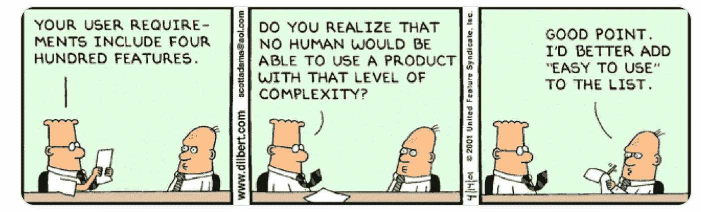
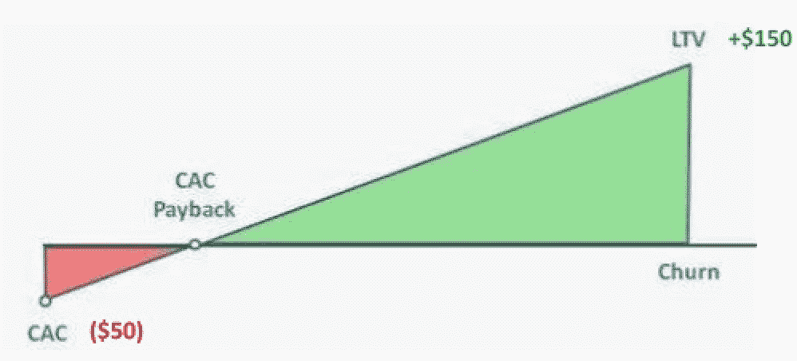
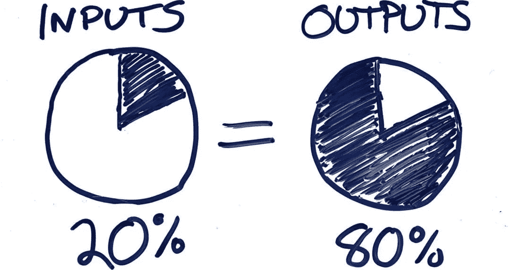

# 赢得一场精彩的产品经理面试

> 原文：<https://towardsdatascience.com/cracking-an-awesome-product-manager-interview-2baa902791a1?source=collection_archive---------2----------------------->

面试了脸书和初创公司的 200 多名项目经理后，我为候选人准备了一份清单。对于一个有抱负的项目经理来说，在面试中采取结构化的方法展示了他们的思维方式，揭示了一个人对项目经理角色的理解，并使他们能够扮演那个角色。与所有人分享！！

我以联合创始人的身份经营过两家数据产品初创公司，为在新兴市场拥有 3.2 亿用户的脸书管理产品，在 AOL 还是“互联网”的时候，它是 AOL 数据产品不可或缺的一部分，现在，我是 Airtel 的首席数据科学家，Airtel 是全球最大的电信公司之一，拥有超过 3.5 亿用户。到目前为止，我已经采访了大约 200 名产品经理(PM ),还指导了十几家印度和美国的初创公司建立他们的 PM、数据 PM (DPM)和数据科学团队。

多年来，我为候选人创建了一份清单，可以帮助他们在 PM 面试中保持最佳状态。对于一个有抱负的项目经理来说，在面试中采取结构化的方法展示了他们的思维过程，揭示了一个人对项目经理角色的理解，并使他们能够扮演那个角色。这对面试者和面试官都是一样的。我会说，在大约一半的面试中，我学到了一些新东西，在其中大约 10-20%的面试中，我对自己说“啊哈，我根本没有那样考虑问题”。

## 模拟面试

实践项目经理面试的方法是让一个朋友(最好是项目经理)问你“你将如何为 Y(用户描述)打造 X(产品类型)？”从了解*你在为谁*构建开始，来解决*什么*(“用例”)和*为什么*用户应该关心。然后你应该通过用例来构建*产品为用户做什么*。

虽然可能会有其他问题，例如对产品市场的估计，或者有时是一个技术问题，例如设计一个应用程序，但上面的问题是最重要的。

## 三条黄金法则

在与面试官一起解决问题的过程中，记住三条规则:(1)提问以澄清——范围、假设、可能的场景，任何事情都是公平的，(2)大声说出你的思考步骤，(3)在进行下一步之前寻求面试官的肯定，尤其是在结果可能是多种可能性之一的情况下。

一旦功能清晰，与潜在用户群的一致性明显("**产品市场适合**")，你应该描述产品的视觉效果*("**设计思维**")，以及*你将如何把它推向市场并成长(**成长**")。最重要的是，如果你能开发出一个收入模型并估算出损益，就考虑录用你吧。**

## *真正的面试*

*大多数人都有自己的面试方式，你应该选择自己的风格和舒适度。以下是我的建议:*

*   *调查公司和产品:听起来很明显，但是我见过太多的应聘者没有做基本的调查就来面试:公司、产品、收入、最近的新闻发布等等。不知道这些是没有借口的——如果你不知道这些，你几乎肯定会被取消资格。*
*   ***展示你多功能、人性化的一面**:以积极的态度去参加面试。面试官在寻找一个多功能的人——产品，一些数据和工程，更多的合作伙伴关系，法律，营销，财务和高管/利益相关者管理。要戴这么多帽子，你需要是一个忙碌的、见多识广的、好奇的、固执己见的、谦逊的和友好的混合体。展现你人性的一面！*
*   ***建立最初的融洽关系**:调查面试官:LinkedIn、Twitter、Medium、他们的社交轨迹、在 YouTube 上的谈话、过去的角色和成就，甚至是他们上过的学校或玩过的游戏。人是群居动物，每个人都喜欢花时间去了解他们和他们的背景的人。*

*既然你已经花了前 7-10 分钟热身，并且和面试官相处融洽，那就准备好回答“你将如何为 Y[用户描述]构建 X[产品类型]”的问题。*

*   ***首先，是用户**:作为项目经理，你的关键角色是识别特定人群今天面临的特定问题，感同身受，设想一个改善他们状况的新解决方案，以足够的细节说明它，考虑利弊，重复功能和改进，并通过工程使它成为一个可构建的解决方案。整体体验将需要考虑用户如何了解解决方案及其关键特性("**发现**")，什么使其引人注目("**产品市场适合**")，以及尽快获得至少相当数量的解决方案以“啊哈！”喜悦时刻("**新用户体验**")。你还需要考虑迫使他们吸引他人参与体验的动力和网络效应(“**成长策略**”)。*

**

**Figure 1: First, it’s the user**

*   ***现在，移动到白板前想象:**我不记得在没有白板的房间里进行面试**和**一个好的候选人没有在最初的 15-20 分钟内开始使用白板。原因很简单，一旦你有了用户故事，让面试官想象用户会看到什么。例如，如果它是一个分享视频的移动应用程序:勾画出主屏幕，显示用户将看到的信息，谈论屏幕之间的导航，以及如何让用户 ***在几分钟内发现关键功能，或者 10 个动作*** 。讲故事是面试这一部分的一个重要方面:谈论你将如何降低复杂性，并推动保持用户参与所需的行动。项目经理不需要成为设计大师，但 UX 感是必须的。*
*   ***使用逻辑结构创建业务框架并进行现实检查:**从市场评估开始。比如:在印度分享短格式视频(目前围绕抖音的热潮，Vigo video 等等)是不是一个针对年轻人的新 app？在印度这样一个快速增长、竞争异常激烈的市场中，获得一个用户需要花费多少成本？在这个市场中，大量风投资金正在追逐相对较窄的一部分城市年轻人，他们拥有相对较高的富裕程度，因此可以花钱进行应用内购买，或者被定向展示/赞助。或者，你应该把重点放在数量更多但第一次接触智能手机的农村年轻人身上吗？这两类用户的获取成本是多少(提示:他们可能相差 5-10 倍印度)？你可能的终身客户价值(LTV)是多少，尤其是如果涉及多个用户群体(男性/女性、年轻人/老年人、功能手机/智能手机)？支持用户的成本是多少？*

*此时需要一个快速的经济模型:你需要知道你的想法是否可行。一个简单的“LTV > CAC + S”(终身价值大于客户获取成本加上支持)是讨论的合适起点。*

**

**Figure 2: LTV > CAC + S. For every $50 invested, you can acquire a customer and return a $150, net off churn and support cost**

*你还应该深入研究一两个现实生活中的话题，尤其是对于高级职位，比如:如何衡量获取渠道的组合以优化预算，或者如何设计新的用户体验(“NUX”)以最大限度地减少应用程序前 30 天的流失。*

*   ***留意线索，随机应变，不断重复:**虽然你应该明确地“领导”讨论，但留意面试官的反馈也很重要。一个好的面试官经常会中途给你数据点来挑战你的假设；你应该能够很快地整合这些并修改你的答案。这是你实际面试中最关键的部分，面试官通常会根据你运用新信息和随机应变的能力来决定是否面试。*

**

**Figure 3: Relatively modest amount of new information from the interviewer can change the outcome of the problem significantly**

*   ***快速结束**:典型的面试过程会持续一个小时，其中大约 7-10 分钟用于介绍，最后 5-10 分钟用于回答候选人可能提出的任何问题。这就给真正的面试留出了大约 40 分钟的时间，其中面试官可能会探索 3-4 个领域，也可能会深入一两个领域。不管这是一个“广度”还是“深度”的问题；你应该提供一个结束。闭包是一个快速、近似的正确答案；它可以让面试官知道他们是否想深入探讨，或者进入下一个问题。*
*   ***大胆想象**:伟大的项目经理都是想象力的大师。我参加的每一次面试，都希望候选人能说一些让我眼花缭乱的话。例如，假设有人问你，你将如何为脸书开发一项功能，以提高其在新兴市场的使用率。除了给出通常的特定于功能的答案，例如国际语言支持、特定的本地内容等。如果一个候选人假设脸书增长的障碍是一个沉重的产品(> 50MB)，在低内存和低存储的低端 Android 手机上不能很好地运行，因此，需要剥离许多功能，制成 5 MB 以下的轻量级产品，她将被记住。*
*   ***现实一点**:为什么这听起来是显而易见的，我见过一些严肃的 PMs 轰炸采访，他们的回答都是不现实的。这种情况通常有以下几个原因:( I)你走了一条狭窄的道路，独自讲述了你的假设和解决方案，而没有从面试官那里寻找线索;( ii)你没有根据提供的新信息重复你的答案，或者(iii)(有点不太可能),面试官从一开始就因为缺乏适当的热身而走神，从未进入“头脑风暴模式”。*

## *结局*

*虽然这可能不适用于你参加的每一次面试，尤其是如果你参加的是同一家公司的一系列面试，你应该从面试官那里了解以下几点:*

*   *检查面试官对工作的期望。你可能认为你是产品负责人，所有人都向你汇报。但事实上没有人为你工作——你仍然要负责送货*
*   *试着感受一下团队文化。是像谷歌和特斯拉那样的工程主导型公司，像脸书和优步那样的项目管理主导型公司，还是像苹果那样的设计主导型公司？这会让你对公司的“等级秩序”有一个概念，以及在实际工作中会有什么样的期待*
*   *询问是什么使一个人在集团和公司中成为“不可替代”项目经理。这个问题通常比你可以问的任何其他问题都更能揭示关于该职位的文化、工作实践和现实，并且是一个很好的“去/不去”检查点*

***面试愉快！！留下你对这些建议的想法，并请添加你自己的观察或学习。我们可以一起学习和提高。***

> ****结语:我计划写一系列关于数据科学、机器学习、产品管理和职业成功故事的博客。你可以跟着我把这些放进你的培养基里。****

****下一个故事:*** [***用“印度级”技术为世界供电***](https://medium.com/@SantanuB/powering-the-world-with-india-class-technologies-2c7dab9c496b?source=friends_link&sk=defcbb3c0e1f7a7cefcbea3331c478f0)*

****上一篇:*** [***人工智能对 2020 年的预测***](https://medium.com/@SantanuB/ai-predictions-for-2020-96db1583e520?source=friends_link&sk=4d312c1dff4d82690ba35e1f029a1da9)*