# 用 Google AutoML Tables & Tensorflow 破解比特币

> 原文：<https://towardsdatascience.com/cracking-bitcoin-with-google-automl-tables-tensorflow-fbe3f16ce9b2?source=collection_archive---------4----------------------->

谷歌已经在其云平台上推出了几款旨在自动化和改善机器学习培训和供应的产品。其中最新的— AutoML Tables 旨在“在结构化数据上自动构建和部署最先进的机器学习模型”。

我曾经是机器学习和自动化一切事物的粉丝，我想我会尝试一下，用另一种自己成为头条新闻的技术来折磨它——比特币。

这个想法很简单——比特币“挖掘”是试图猜测字符串正确组合的过程，这些字符串一旦经过哈希处理，就会生成一个有效的块。副产品是交易的处理，回报是比特币的宝藏。

那么为什么要对其应用机器学习呢？嗯，目前的挖掘方法本质上是“蛮力”强化计算，试图猜测算法的正确输入。然而，比特币的一个关键特征是区块链——迄今为止挖掘的每个区块的完整记录，以及用于挖掘它的输入参数。

事实上，区块链包含 50 万个“问题”的例子，以及解决方案。在机器学习领域，他们称之为“训练数据集”:)

# 区块链——准备训练数据

AutoML Tables 允许用户上传排列在表格中的大型数据集——大表数据集或更简单的——一个. csv 文件。

如前所述，挖掘比特币区块是对一组输入参数应用哈希算法(两次)的过程。这些参数经过哈希处理后，构成了“块头”的一部分，块头必须以多个前导零开头，这由难度决定。一旦产生的哈希有效，它就会存储在区块链中，供所有人查看(和验证)。它是一个 80 字节的字符串，由以下内容组成(单击图片了解更多信息):

添加描述

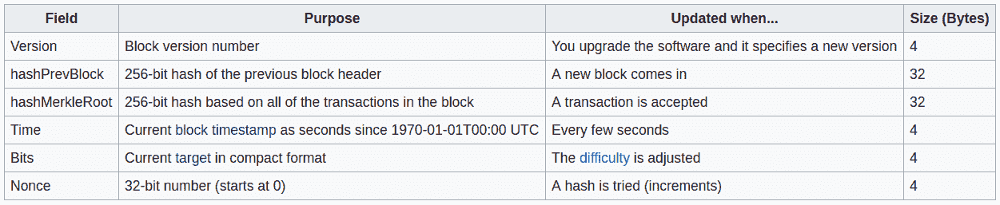

除了版本、Bits (target)和 hashPrevBlock 是固定的之外，其他参数由挖掘器决定并在散列时递增。然而，当与其他人合作挖掘时——时间和 MerkleRoot 也由挖掘池决定，留给我们的只是增加和猜测 Nonce。因此，它将作为我们的目标和我们的机器学习模型的输出，这很好，因为 AutoML 表只能有一列设置为目标。

为了将数据保存到一个. csv 文件中，我启动了一个完整的比特币节点，在等待它与网络同步后(等了又等..)—运行“bitcoin-cli getblock <latestblockhash>”,进行一些剪切并保存到文件中，然后以之前的 Hash 作为输入再次运行，如此向后迭代区块链。结果看起来像这样:</latestblockhash>

添加描述

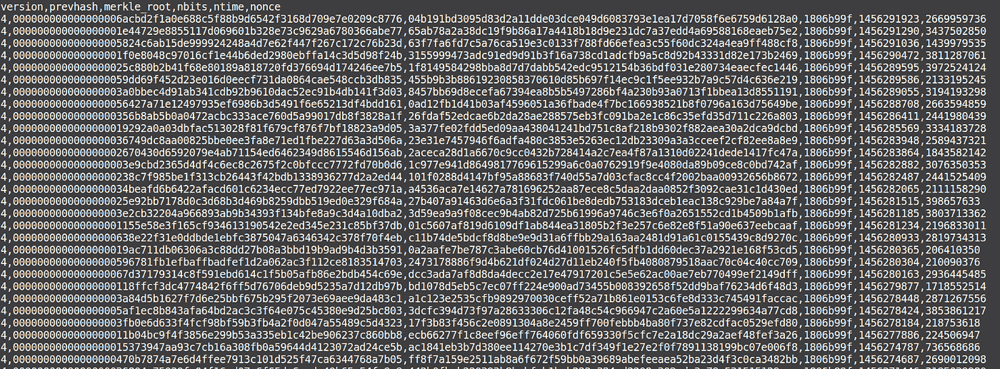

为 AutoML 表添加标题行以获取列名是很重要的。

# 谷歌云自动表

第一步是将我们的训练数据导入到 AutoML 表中。完成后，我们将看到“Schema”屏幕，在这里我们选择 ML 模型的“目标”——它将输出的字段。

添加描述

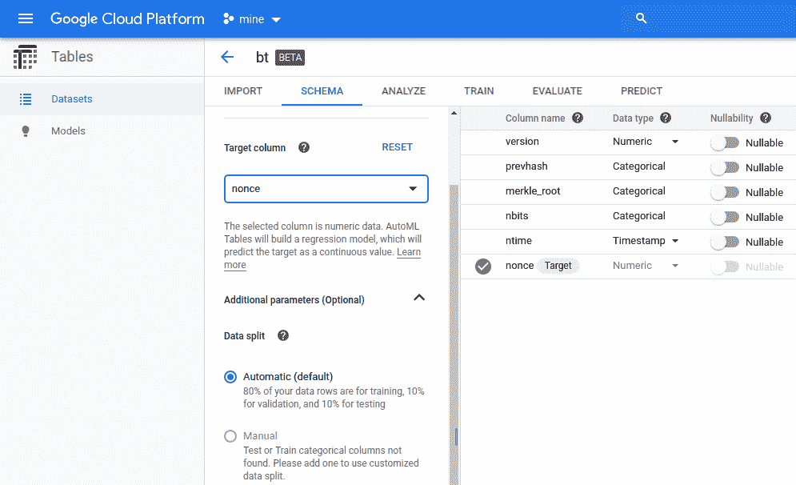

AutoML 还可以帮助从数据中提取验证集，应用加权列，甚至处理时间序列数据。

但是等等！我们已经发现了一个问题——AutoML 自动检测列数据类型，并挑选了几个字段作为“分类的”。这很好，但是在我们的例子中，因为值是唯一的，所以有多少训练行就有多少类别，而实时数据永远不会匹配任何类别！

如果我们进入分析页面，我们可以看到选择了太多类别(蛋糕是第 1 页，共 4 页..)

添加描述

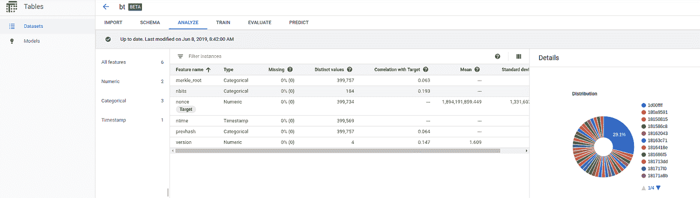

这实际上是 AutoML 表的一个很好的特性——它允许我们在开始训练之前就发现数据中的问题。我们可以看到我们有许多不同的值(没有重复的行)，以及每个字段与我们的目标的相关性，这在我们的例子中是低的，并且将产生差的结果。

由于重要字段的相关性较低，当我们进入训练阶段时，我们选择忽略更静态的列，以便我们的模型可以专注于重要的列:

添加描述

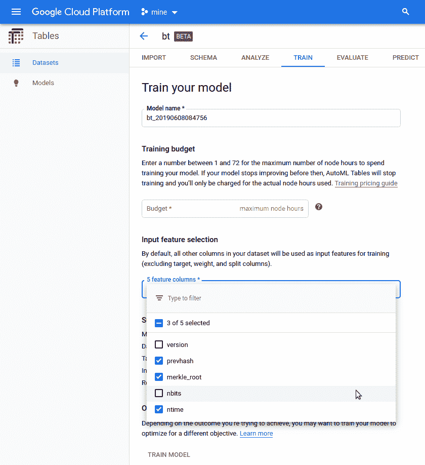

我开始训练这个模型，结果和预期的一样——非常高的平均误差，意味着我们的模型不会产生任何有意义的结果。

# 第二次尝试—逐字节

鉴于上述情况，我尝试将训练数据修改为非分类值。这也将允许我们使用 Tensorflow + Keras 在本地训练一个模型进行比较。

Tensorflow 希望输入采用 Bytearray 的形式，取值范围为 0 到 255。我把区块链的字段一个字节一个字节的拆分，结果看起来是这样的:

添加描述

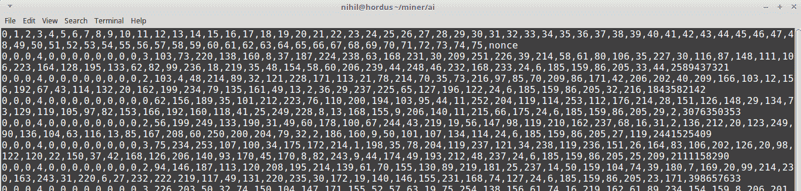

我们的数据现在有 76 个字段，每个字段代表块头的 1 个字节，最后 4 个字节是最后一个数字字段——我们的目标 Nonce。

再次将数据导入 AutoML 表，它将显示为数字:

添加描述

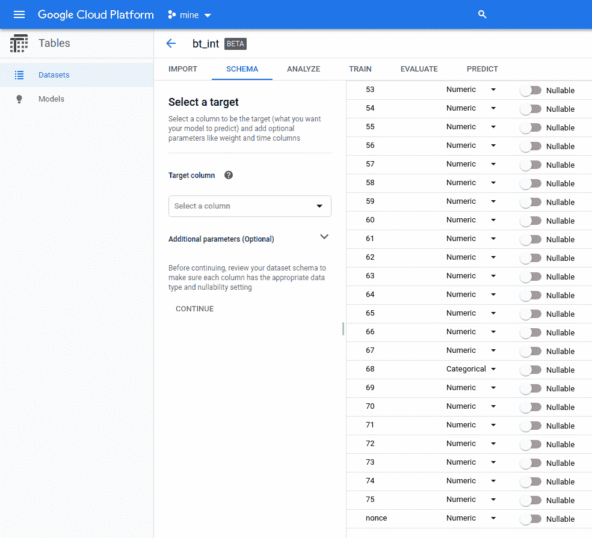

看起来很有希望，与目标的相关性均匀分布在所有列中。不幸的是，培训又一次产生了糟糕的结果:

添加描述

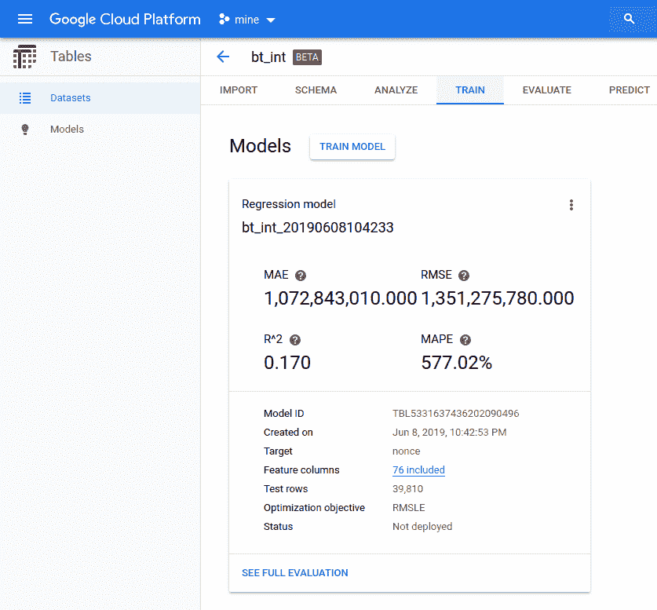

巨大的错误率，高平均平均百分比误差(越低越好)。

# 验证-使用张量流

糟糕的结果是 AutoML 表中的错误，还是只是人工智能无法学习的训练数据的复杂性？为了验证这一点，我求助于古老的 Tensorflow & Keras 进行一些本地培训。

Tensorflow 以 Bytearray 的形式期待数据，正如我们在第二次尝试中所做的那样。这是如何准备的-

添加描述

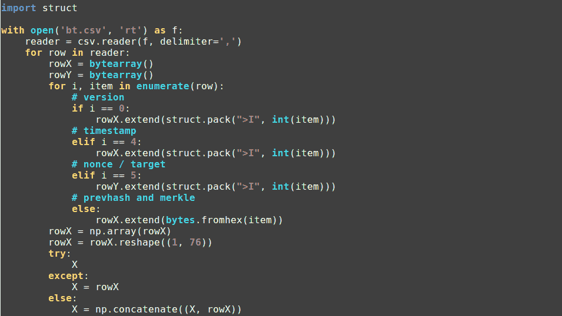

我们训练一个全连接的神经网络，输出 4 个字节，我们将连接这些字节以形成我们的随机数-

添加描述

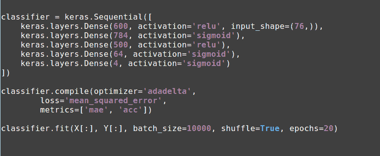

仅仅几个时期的训练结果就已经说明了同样的问题:

添加描述

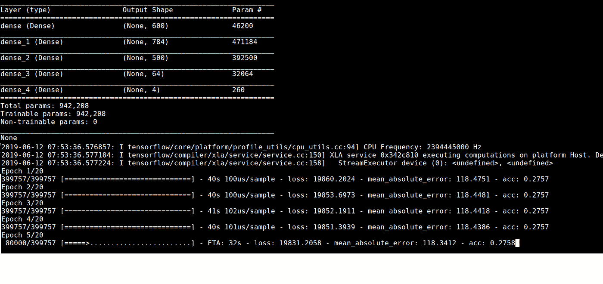

请注意，尽管平均绝对误差没有 AutoML 表中的高，但精度却“固定”在 0.2757。

这不是巧合。因为我们正好输出 4 个字节，这个准确度分数只能意味着神经网络不能正确地学习和预测。

原因？要么是网络不够大——这不太可能，因为我们至少会看到不同时代之间的一些改进，

或者数据在输入和目标之间不包含可检测的相关性。

我想就这样吧！看到一个简单的 SHA256 和足够的“盐”如何产生足够的熵来使区块链真正健壮和不可破解，真是令人惊讶！

至少在我们推出大枪之前…请继续关注第二轮——用富士通量子退火器破解比特币！

德罗·詹斯勒