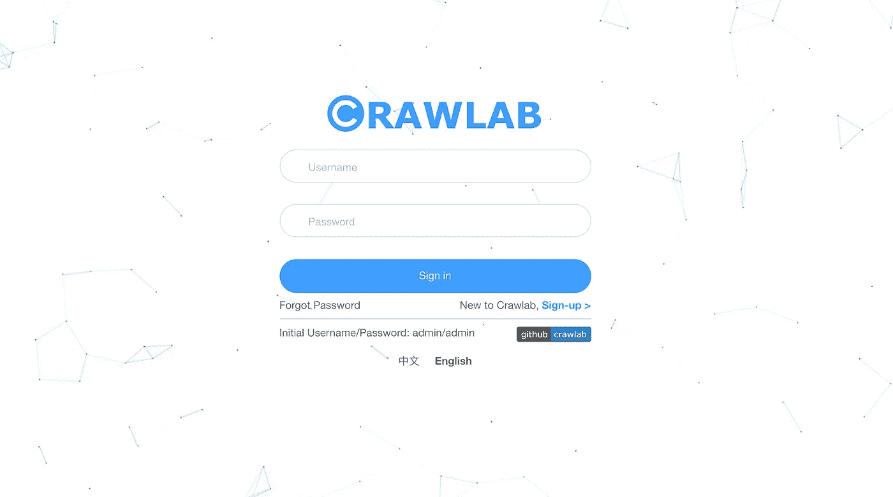
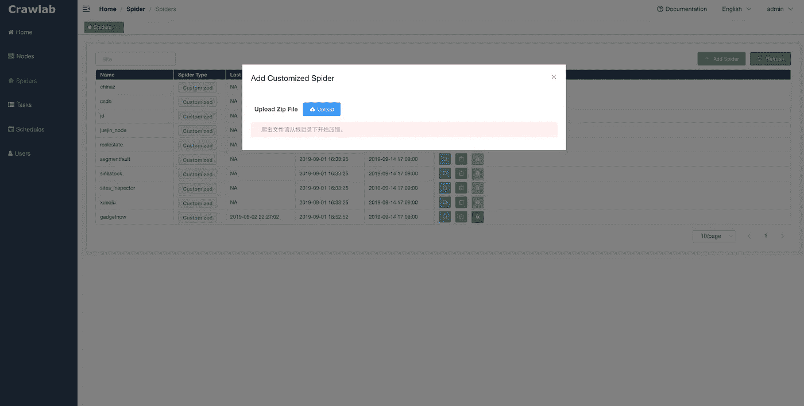
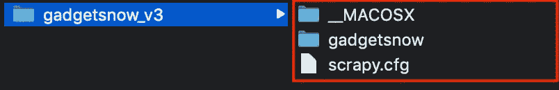
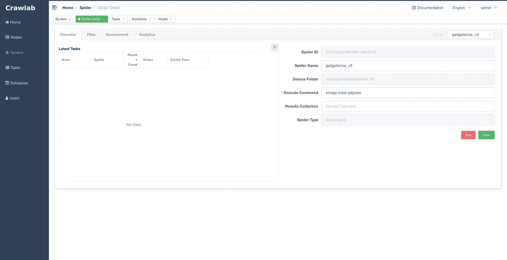
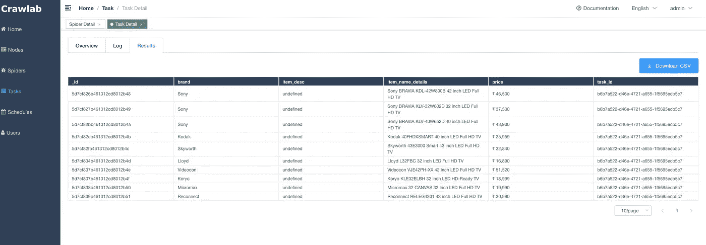

# crawlab——网络爬虫的终极实时仪表板

> 原文：<https://towardsdatascience.com/crawlab-the-ultimate-live-dashboard-for-web-crawler-6c2d55c18509?source=collection_archive---------14----------------------->

## 来监控你所有的爬虫！


最近，我发现了一个非常有趣而又强大的项目。虽然这个项目才开始 6 个月，但是已经有大约 24k 个赞了。该项目于 2019 年 3 月刚刚启动，从以下几点来看，它似乎很有前途。

1.  能够为网络爬虫监控不同种类的语言。比如 Python，NodeJS，Go，Java，PHP 以及各种网络爬虫框架包括 Scrapy，Puppeteer，Selenium。
2.  包括一个漂亮的实时仪表板。
3.  能够可视化的数据抓取，他们可以通过点击一个按钮下载。
4.  你只需输入 XPath 和 URL 就可以创建一个爬虫，即所谓的“可配置爬虫”(不幸的是，最新版本 v0.3.0 已经暂时禁用了这个功能，参考可以在这里找到

## Pyspider vs Crawlab

以前我分享过 Pyspider 是最棒的监控工具之一，如果你没有读过，你可以点击下面的链接来阅读。

[](/pyspider-a-practical-usage-on-competitor-monitoring-metrics-c934d55f9c9a) [## 为什么 Pyspider 可能是初学者最好的刮擦仪表板之一

### py spider——竞争对手监控指标的实际应用

towardsdatascience.com](/pyspider-a-practical-usage-on-competitor-monitoring-metrics-c934d55f9c9a) 

嗯，它们确实有一些相似之处，例如，它们都是爬虫程序的伟大仪表板，它们可以被调度，有一个令人印象深刻的仪表板来可视化…但是，如果你想知道显著的区别，在这里你去:

1.  Pyspider 在可视化抓取网站的旅程方面更胜一筹。
2.  如果你想集成不同的语言或网络爬虫框架，Crawlab 更好。
3.  Crawlab 是用 Golang 写的，一般效率更高，速度更快。

# 案例研究—将 Scrapy spider 集成到 Crawlab

## 第 1 部分—安装 Crawlab

先决条件—在您的笔记本电脑上安装 Docker。

```
version: '3.3'
services:
  master: 
    image: tikazyq/crawlab:latest
    container_name: master
    environment:
      CRAWLAB_API_ADDRESS: "localhost:8000"
      CRAWLAB_SERVER_MASTER: "Y"
      CRAWLAB_MONGO_HOST: "mongo"
      CRAWLAB_REDIS_ADDRESS: "redis"
    ports:    
      - "8080:8080" # frontend
      - "8000:8000" # backend
    depends_on:
      - mongo
      - redis
  mongo:
    image: mongo:latest
    restart: always
    ports:
      - "27017:27017"
  redis:
    image: redis:latest
    restart: always
    ports:
      - "6379:6379"
```

复制上面的代码，保存为***docker-compose . yml***。然后在同一个目录中，在您的终端中键入命令 **docker-compose up** 。docker 映像将被下载到您的本地。

## 第 2 部分—启动 Crawlab 并登录

在您的浏览器上导航到 localhost:8080，您将能够看到如下所示的登录页面。



默认用户名:admin

默认密码:admin

## 第 3 部分—上传 Scrapy 项目

转到这个 [URL](http://localhost:8080/#/spiders) ，然后点击添加蜘蛛按钮，如下图所示。



我正在为 [gadgets now 网站](https://www.gadgetsnow.com/)使用我的爬虫。



上面的快照是我的 scrapy spider 目录，向下一级到包含 scrapy.cfg 的目录(用红框突出显示)，然后压缩这 3 个项目。最后，上传 zip 文件。

## 第 4 部分—获取 MongoDB 的 IP 地址

检索该 docker 图像的 docker ID:`mongo:latest`。您可以使用下面的命令查看 docker id。

```
docker ps
```

然后按照下面的命令输入 docker id:

```
docker inspect -f '{{range .NetworkSettings.Networks}}{{.IPAddress}}{{end}}' <input your docker id here>
```

接下来，您将在 docker 容器中获得您的 MongoDB 的 IP 地址。在我的例子中，IP 地址是 172.18.0.2。

## 第 5 部分—输入 IP 地址并修改 pipelines.py

```
import osfrom pymongo import MongoClientMONGO_HOST ='172.18.0.2'
MONGO_PORT = 27017 
MONGO_DB = 'crawlab_test'class GadgetsnowPipeline(object):
    mongo = MongoClient(host=MONGO_HOST, port=MONGO_PORT)
    db = mongo[MONGO_DB]
    col_name = os.environ.get('CRAWLAB_COLLECTION') 
    if not col_name:
        col_name = 'test'
    col = db[col_name]def process_item(self, item, spider):
        item['task_id'] = os.environ.get('CRAWLAB_TASK_ID')
        self.col.save(item)
        return item
```

这是修改后的 pipelines.py 的 Python 脚本。我想强调以下几点:

1.  输入我们之前获得的 MongoDB 的 IP 地址:MONGO_HOST = ' 172.18.0.2 '。
2.  复制上面的`process_item`函数，并将其替换到您原来的 pipelines.py 文件中。
3.  MONGO_DB 的值可以是 MongoDB 中您想要的任何数据库名称，对于我的例子，我将其设置为`crawlab_test`。

## 第 6 部分—在 items.py 中添加两个新字段

```
task_id = scrapy.Field()
_id = scrapy.Field()
```

这两个字段需要添加到`items.py`中。

首先，`task_id`是您已经执行的每个任务的标识符，您可以在 spider - > spider_name - >任何任务- >概览选项卡中查看它。

其次，`_id`是 MongoDB 中每个对象的惟一标识符。

## 第 7 部分—运行您的蜘蛛



点击你新上传的蜘蛛，然后输入执行命令。因为我的 Scrapy 爬虫的名字是 gdgnow，所以我的命令应该是:

```
scrapy crawl gdgnow
```

然后，先点击**保存**按钮，再点击**运行**按钮开始刮削。

## 第 9 部分——可视化结果



以我的爬虫为例，上面的快照显示了我的爬虫的输出，最重要的是，您可以通过点击**下载 CSV** 按钮下载 CSV 格式的文件。

对于`item_desc`字段，它显示的是`undefined`，因为我的`item_desc`是 JSON 格式的，但是 Crawlab 还不支持输出 JSON 字段。如果您希望在输出数据中包含 JSON 字段，目前唯一的选择是登录包含 MongoDB 的 docker，crawlab 将数据传输到这个 docker 并从中提取数据。

展示相当惊人，向 Crawlab 的所有开发者致敬！

# 最后的想法


非常感谢你耐心阅读到最后。Crawlab 仍处于早期阶段，但它是一个非常有前途的爬虫框架，特别是在监视多个网络爬虫方面。

由于这只是对 Crawlab 的一个简单介绍，我还没有包括 Crawlab 的所有功能，例如，cron job，如何集成其他网络爬虫的框架等等。如果你真的想让我分享更多关于 Crawlab 的内容，请在下面的**评论，我会为此再写一篇文章！**

# 关于作者

[低伟鸿](https://www.linkedin.com/in/lowweihong/?source=post_page---------------------------)是 Shopee 的数据科学家。他的经验更多地涉及抓取网站，创建数据管道，以及实施机器学习模型来解决业务问题。

他提供爬行服务，可以为你提供你需要的准确和干净的数据。你可以访问 [**这个网站**](https://www.thedataknight.com/) 查看他的作品集，也可以联系他获取**抓取服务**。

你可以在 [LinkedIn](https://www.linkedin.com/in/lowweihong/?source=post_page---------------------------) 和 [Medium](https://medium.com/@lowweihong?source=post_page---------------------------) 上和他联系。