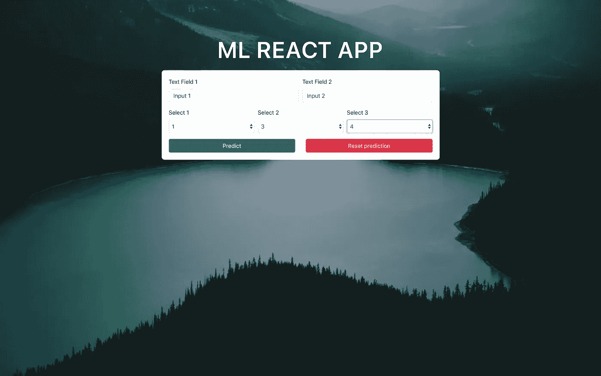
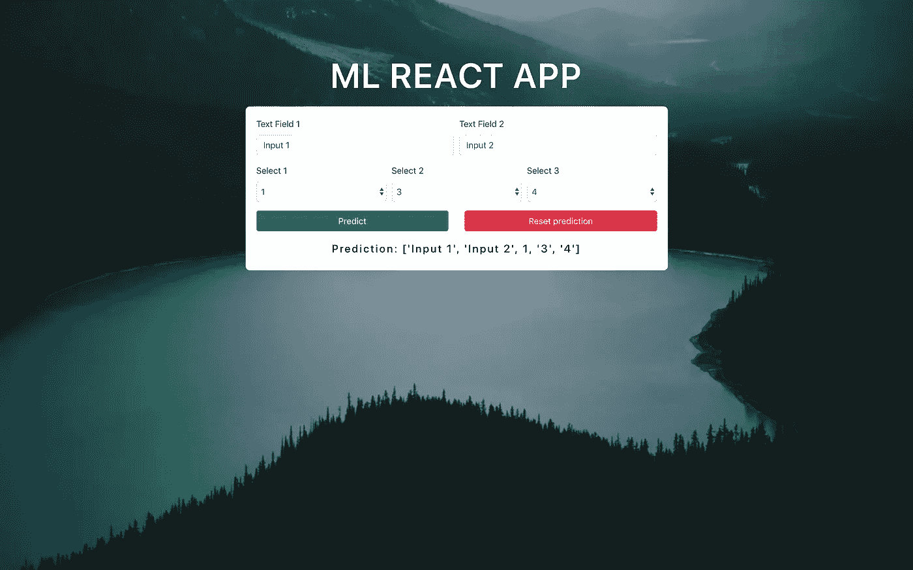
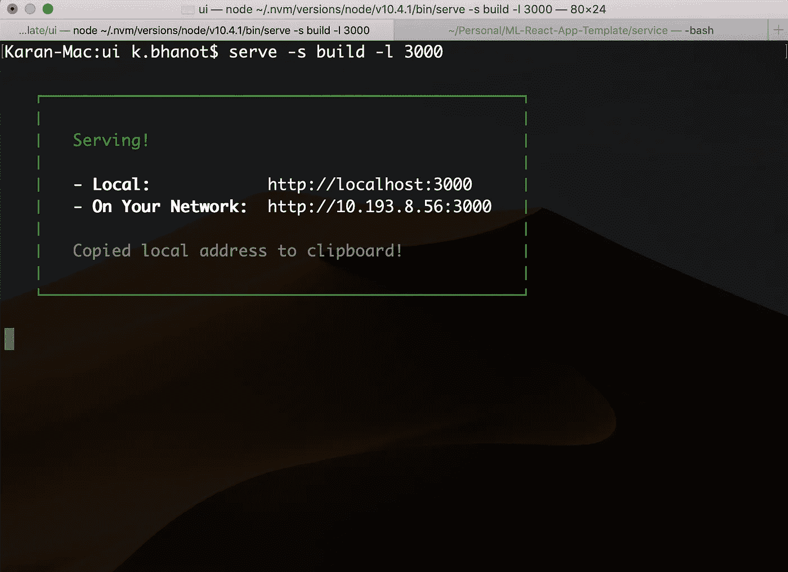
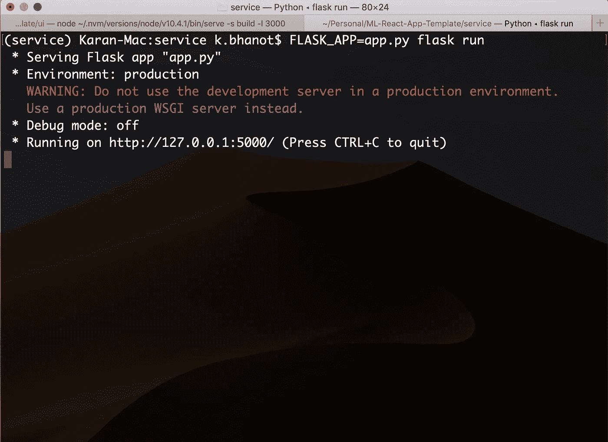
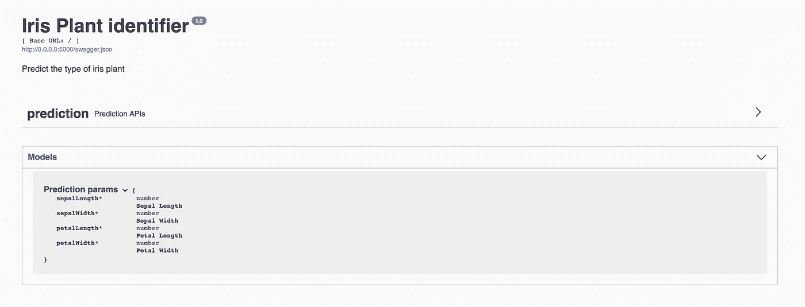
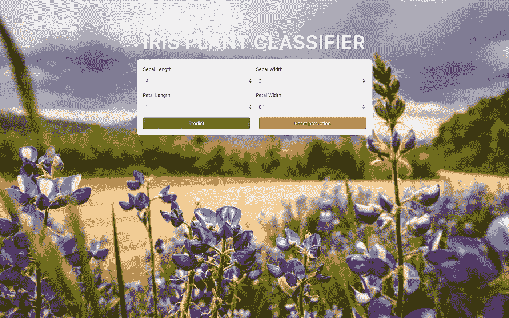
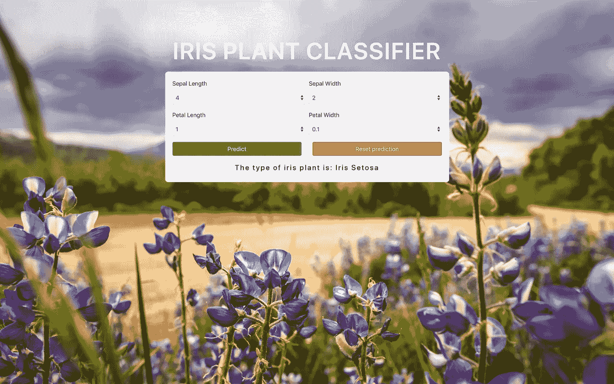
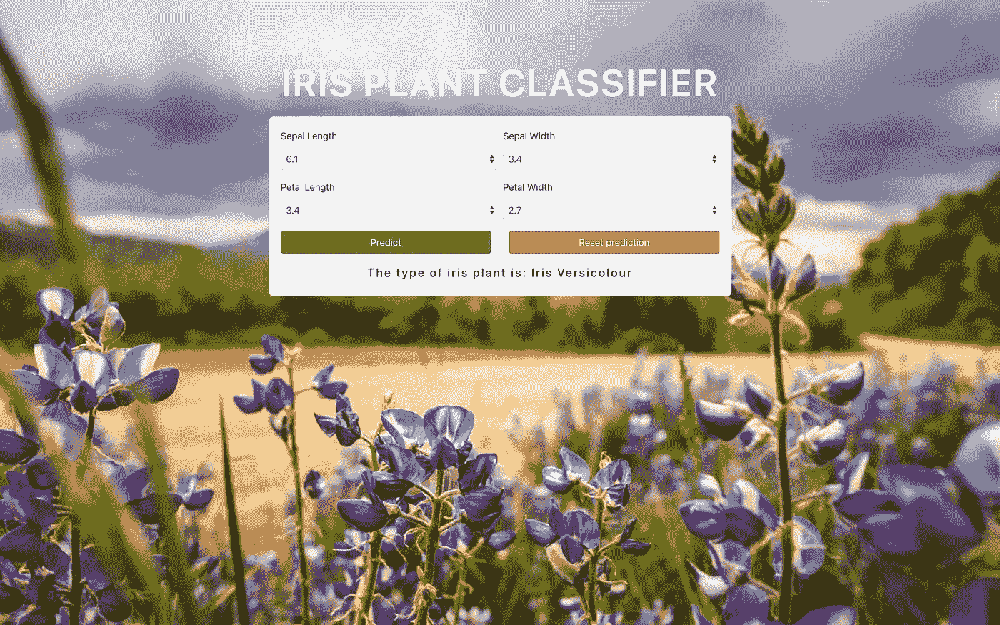

# 使用 React 和 Flask 创建一个完整的机器学习 web 应用程序

> 原文：<https://towardsdatascience.com/create-a-complete-machine-learning-web-application-using-react-and-flask-859340bddb33?source=collection_archive---------0----------------------->


Photo by [Alvaro Reyes](https://unsplash.com/@alvaroreyes?utm_source=medium&utm_medium=referral) on [Unsplash](https://unsplash.com?utm_source=medium&utm_medium=referral)

我一直想开发一个完整的机器学习应用程序，其中我会有一个 UI 来提供一些输入和机器学习模型来预测这些值。上周，我就是这么做的。在这个过程中，我在 React 和 Flask 中创建了一个易于使用的模板，任何人都可以在几分钟内修改它来创建自己的应用程序。

**项目亮点:**

1.  前端是在 React 中开发的，将包括一个表单提交输入值的单个页面
2.  后端是在 Flask 中开发的，它公开预测端点，使用经过训练的分类器进行预测，并将结果发送回前端以便于使用

下面是 GitHub 回购。分叉项目并创建您自己的应用程序吧！

[](https://github.com/kb22/ML-React-App-Template) [## kb22/ML-反应-应用程序-模板

### 它是一个构建 React 应用程序并与 REST 端点进行交互以进行预测的模板。-kb22/ML-React-App-模板

github.com](https://github.com/kb22/ML-React-App-Template) 

# 模板

## 反应

React 是一个 JavaScript 库，由脸书创建，旨在简化用户界面，使其易于开发和使用。它是前端开发的主要语言之一。你可以在这里读到它[。学习 React 的最佳资源是它的文档本身，它非常全面且易于掌握。](https://reactjs.org/)

## 烧瓶和烧瓶-RESTPlus

Flask 和 Flask-RESTPlus 允许我们在 Python 中定义一个服务，它将具有我们可以从 UI 调用的端点。你可以从我下面的文章中了解更多关于开发 Flask 应用程序的信息。

[](/working-with-apis-using-flask-flask-restplus-and-swagger-ui-7cf447deda7f) [## 使用 Flask、Flask RESTPlus 和 Swagger UI 处理 API

### Flask 和 Flask-RESTPlus 简介

towardsdatascience.com](/working-with-apis-using-flask-flask-restplus-and-swagger-ui-7cf447deda7f) 

## 描述

我用`create-react-app`创建了一个基本的 React 应用程序。接下来，我加载了`bootstrap`，它允许我们为每个屏幕尺寸创建响应性网站。我更新了`App.js`文件，添加了一个带有下拉菜单、`Predict`和`Reset Prediction`按钮的表单。我将每个表单属性添加到 state 中，并在按下`Predict`按钮时，将数据发送到 Flask 后端。我还更新了`App.css`文件，为页面添加了样式。



Template view

Flask 应用程序有一个 POST 端点`/prediction`。它接受 json 形式的输入值，将其转换为数组并返回到 UI。在实际应用中，我们将使用存储在`classifier.joblib`中的分类器使用相同的数据进行预测，并返回预测结果。



Prediction displayed on UI

`Reset Prediction`将从 UI 中删除预测。

# 启动模板

将回购克隆到你的电脑上，进入电脑，在这里打开两个终端。

## 准备用户界面

在第一个终端中，使用`cd ui`进入`ui`文件夹。确保您使用的是节点版本`10.4.1`。进入文件夹后，运行命令`yarn install`安装所有依赖项。

为了在服务器上运行 UI，我们将使用`serve`。我们将从全局安装`serve`开始，之后，我们将构建我们的应用程序，然后最后在端口 3000 上使用`serve`运行 UI。

```
npm install -g serve
npm run build
serve -s build -l 3000
```

您现在可以转到`localhost:3000`来查看 UI 已经启动并运行。但是它不会与仍未启动的 Flask 服务进行交互。所以，让我们开始吧。



UI

## 准备服务

在第二个端子上，使用`cd service`移动到`service`文件夹内。我们首先使用`virtualenv`和 Python 3 创建一个虚拟环境。你可以在这里阅读有关 virtualenv [的内容。激活环境后，我们将使用 pip 安装所有必需的依赖项。最后，我们将运行 Flask 应用程序。](/python-virtual-environments-made-easy-fe0c603fe601)

```
virtualenv -p Python3 .
source bin/activate
pip install -r requirements.txt
FLASK_APP=app.py flask run
```

这将在`127.0.0.1:5000`启动服务。



Service

瞧啊。完整的应用程序现在可以正常工作了。耶！！

# 将模板用于自己的用例

为了理解为任何模型使用模板的过程，我将使用`iris`数据集并为其创建一个模型。该示例也可以在项目的`example`文件夹中找到。

## 创建模型

我在虹膜数据集上训练了一个`DecisionTreeClassifier`，它需要 4 个特征——萼片长度、萼片宽度、花瓣长度和花瓣宽度。然后，我使用`joblib.dump()`将模型保存到`classifier.joblib`。分类器现在可用于预测新数据。

## 更新服务

接下来，我在一个文本编辑器中打开了文件`app.py`(Sublime Text 就是其中之一)。我取消了对行`classifier = joblib.load(‘classifier.joblib’)`的注释，以便变量`classifier`现在保存训练好的模型。

在 post 方法中，我做了以下更新:

首先，我使用`classifier.predict()`得到预测。接下来，我为这些类创建了一个映射，0 表示`Iris Setosa`，1 表示`Iris Versicolour`，2 表示`Iris Virginica`。我终于返回了`result`键中的预言。

*更新:*正如[马丁斯·恩塔尔斯](https://medium.com/u/fce9dec74a76?source=post_page-----859340bddb33--------------------------------)指出的，我忘了说我们也需要更新模型，这样它才能正确工作，并且在 Swagger UI 中有更新的模型。

从要点中可以看出，我已经更新了字段名、它们的类型为`Float`、描述和帮助文本。同样的情况现在也将反映在 Swagger 中。



Updated model in Swagger UI

## 更新用户界面

该表单由行内的列组成。因此，由于我有 4 个特性，所以我在 2 行中添加了 2 列。第一行将有萼片长度和萼片宽度的下拉列表。第二行将有花瓣长度和花瓣宽度的下拉列表。

我首先为每个下拉列表创建了一个选项列表。

接下来，我定义了两行，每行两列。每个下拉选择看起来像下面的代码:

对于每个下拉菜单，我们必须更新`<Form.Label></Form.Label>`中的文本。我们还将命名每个选择组。假设名称是`petalLength`，那么我们设置值为`{formData.petalLength}`，名称为`“petalLength”`。正如我们在上面的`{petalLengths}`中看到的，选项是使用我们在`<Form.Control></Form.Control>`中定义的名称添加的。一个`<Form.Row></Form.Row>`中的两个这样的组将构成我们的 UI。

状态也必须用`formData`中的相同名称更新，默认值为各个下拉列表中的最小值。构造函数如下所示。如您所见，状态已经更新为`formData`带有新的键。

## 添加新的背景图像和标题

在 app.css 中，将背景图片的链接改为自己的链接。我添加了一张 [Unsplash](https://unsplash.com/) 的花的图片。我还将标题更新为`Iris Plant Classifier`，并将页面标题也更新到了`public`文件夹中的`index.html`文件中。

# 结果

应用程序现在可以使用这个模型了。使用`npm run build`构建 UI 后，重启两个服务。该应用程序如下所示:



Main Page

对于某些特征值，按下`Predict`按钮，模型将其归类为`Iris Setosa`。



有了新的特征值，模型预测植物为`Iris Versicolour`。



# 结论

如您所见，在本文中，我讨论了一个 ML React 应用程序模板，它将使创建完整的 ML 应用程序变得简单快捷。

针对您自己的使用案例尝试该应用程序，并分享您的反馈。我很乐意收到你的来信。