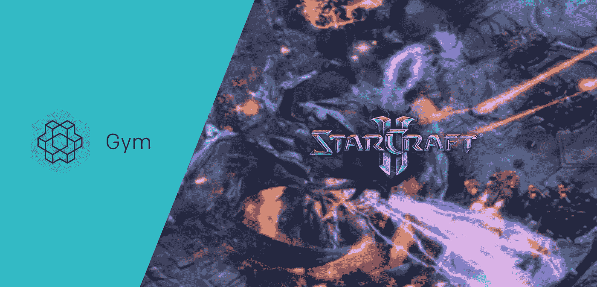
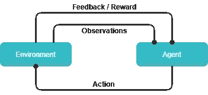
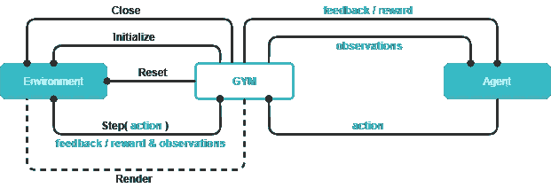
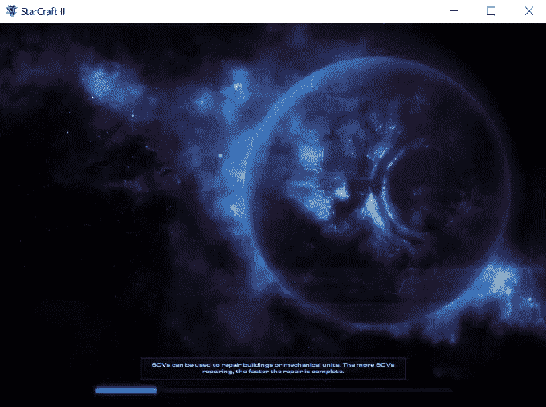
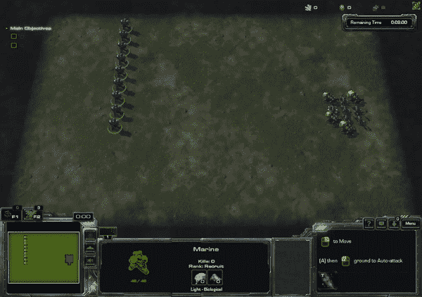

# 为星际争霸 2 创建一个定制的健身房环境

> 原文：<https://towardsdatascience.com/create-a-customized-gym-environment-for-star-craft-2-8558d301131f?source=collection_archive---------29----------------------->

*在本帖中，你将能够学习什么是健身房环境，以及如何以地图 DefeatZerglingsAndBanelings 上的 PySC2 为例创建一个 OpenAI 定制的健身房环境。*



OpenAI Gym x Star Craft 2

目前，有多种强化学习框架可用(例如，OpenAI 基线、稳定基线、TFAgent、多巴胺和 TensorForce 等。)各有利弊。然而，如果您想在各种应用程序环境下使用这些工具，最常见和最方便的方法是构建一个定制的健身房环境。

# 健身房环境

那么什么是健身房环境呢？

在我们开始回答之前，让我们回顾一下强化学习的过程。

强化学习基本上是一个马尔可夫决策过程(MDP ),在这个过程中，主体将根据对环境的观察采取一些行动，以换取反馈。根据反馈，无论是积极的还是消极的，代理人所使用的决策策略将相应地加强或削弱。



MDPs

MDP 需要两个关键组件，即行动和对环境的相应观察。由于不同的环境有不同的观察和行动空间，为了迎合环境不断变化的需求而重新发明各种算法是非常耗时和不切实际的。因此，提出一个可以表示各种设置并可以轻松插入多个框架的标准化环境似乎是一个可行的解决方案。

这就是健身房环境发挥作用的地方。健身房环境为强化学习过程提供了一个标准化的界面。

在健身房环境中，`__init__`函数是用于初始化环境。在训练过程中，动作通过一个`step`函数传递给环境，新的观察作为返回。**动作**和**观察空间**都被编码到`[gym.spaces](https://github.com/openai/gym/tree/master/gym/spaces)`中，用标准化的数字表示。`reset`功能用于初始阶段或每集结束时重置环境。`close`学习过程结束时调用函数，正确终止环境。此外，您还可以定义一个`render`函数来在每一步之后渲染环境。



A gym environment structure

下面是一个健身房环境的框架代码:

## 建立一个定制的健身房环境

现在让我们用星际争霸 2 (SC2)建立一个定制的健身房环境。要了解更多关于 SC2 和 pysc2 的信息，请参考 deepmind [git](https://github.com/deepmind/pysc2) 资源库。

因为我们将使用来自 SC2 的原始观察和操作，所以我们需要安装 pysc2 的开发分支来完成这里的教程。

要安装 pysc2 的开发分支:

```
git clone [https://github.com/deepmind/pysc2.git](https://github.com/deepmind/pysc2.git)
git checkout -t origin/dev
pip install -e .
```

要启动一个定制的健身房环境，我们需要创建下面的文件结构，如 [OpenAI](https://github.com/openai/gym/blob/master/docs/creating-environments.md) 所述:

```
gym-foo/
  README.md
  setup.py
  gym_foo/
    __init__.py
    envs/
      __init__.py
      **foo_env1.py
      foo_env2.py**
      ...
```

配置 *setup.py* 文件和所有的 *__init__。py* 文件可以在这里[查看。因为我们将主要关注于 *foo_env.py* 的实现，所以我包含了一个文件结构的](https://github.com/openai/gym/blob/master/docs/creating-environments.md)[框架](https://github.com/fyr91/gym-env-skeleton)，您可以直接下载。

在 *envs* 文件夹中，让我们创建一个名为*defeat _ zeglings _ banelings _ env . py 的环境文件。*这将是我们的健身房环境文件，我们将使用以下代码开始在这里创建我们的环境:

注意到`kwargs`被传递给了`__init__`函数。这用于使用特定设置初始化 pysc2 环境。

我们将使用观察和操作定义一个默认设置来初始化微型地图 DefeatZerglingsAndBanelings 的 pysc2 环境:

`players`由于设置需求，规范是需要的，虽然它在这里没有做任何事情。`realtime`如果用于训练，可以设置为假。

接下来，我们将开始初始化 gym 和 pysc2 环境:

`env`用于存储 pysc2 游戏环境的实例。`marines`、`banelings`、`zerglings`定义为保留对应的部队。我们为`action_space`定义了大小为 123 的离散动作，包括站位、上移、下移、侧移以及用不同的单位攻击不同的目标。对于`observation_space`，我们定义了一个 19x3 的 2D 矩阵，其下限和上限分别设置为 0 和 64。观察空间的每一行都将包含战场上每个单位的信息，包括坐标和 HP。

现在，我们需要从`reset`函数初始化环境，因为它将在最开始被调用:

如果`self.env`尚未设置，它将首先调用`init_env`函数，用特定设置初始化 pysc2 环境。然后一切都会恢复原状。原始观测值将由`get_derived_obs`函数处理，它将返回一个派生的 19x3 观测值矩阵。

接下来，我们将填充`step`功能。让我们看看完整的代码:

在`step`函数中，`take_action`会消耗一个动作值(从 0 到 122)，映射到一个游戏内动作并相应执行。之后，将计算导出的观测值。最后，返回四个值，包括导出的观察值、先前动作获得的奖励、用于重置环境的情节结束指示符和用于调试的诊断信息字典。

最后，我们即将在这里完成定制的健身房环境。由于我们不会触及`render`函数，剩下的唯一事情就是用`close`函数正确关闭 pysc2 游戏环境:

瞧啊。现在，我们为 SC2 定制了一个工作环境。完整的环境代码可以从[这里](https://github.com/fyr91/sc2env)下载。


如果您已经知道如何从这一点继续定制环境，那么您可以在这里停下来享受一下。否则，我会在下一节中包含一个简短的演示，演示如何使用我们创建的强化学习框架。

# 稳定基线

出于演示目的，我们将在这里使用稳定的基线。要安装稳定的基线，请遵循其官方文档页面[中的说明。](https://stable-baselines.readthedocs.io/en/master/)

除了安装稳定的基线，我们还需要设置我们自己刚刚创建的定制环境。为此，切换到 *sc2env* 根目录并输入以下内容:

```
pip install -e. 
```

一旦安装过程完成，我们就可以开始使用 PPO2(您选择的算法)轻松地在我们自己的环境中进行训练。

代码如下:

培训就像使用`scikit-learn`模型一样简单:

1.  指定要使用的型号(本例中为 PPO2)。
2.  使用`.learn()`开始学习。
3.  使用`.save()`保存训练好的模型。

请注意，PySC2 环境需要`absl`包。

如果在 Windows 系统上运行，我们将能够在训练时看到渲染的游戏:



否则，如果它运行在 Linux 系统上，我们可以使用 headless 模式加快训练速度。

为了监控训练过程，tensorboard 得到了本机支持。我们需要做的就是在定义模型时指定日志目录。

# 摘要

现在你有了工具，但这并不意味着你将能够使用我们创造的环境直接获得智能人工智能。你还可以做更多的事情，让它变得有趣和聪明。你可以定义一些基本的动作，比如撤退或者攻击最近的。你可以提供更多的观察信息。你可以录制一些游戏，进行模仿学习或行为克隆。你也可以创建你自己的迷你地图来帮助你的 AI 建立一些课程来逐步学习技能。



Result from environment with predefined basic actions suggested above

最后，我们已经到了这篇文章的结尾。在这篇文章中，我包含了一个使用 pysc2 创建定制健身房环境的教程，并演示了如何使用具有稳定基线的定制健身房环境。

希望这些有帮助。敬请期待，再见~

