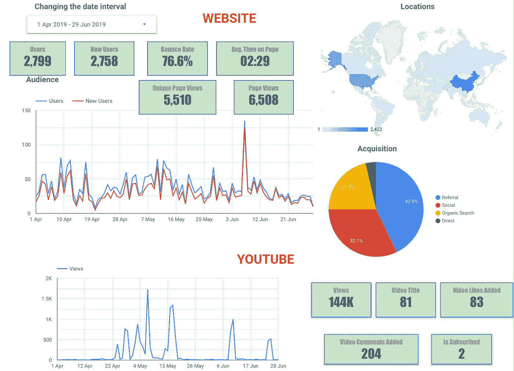
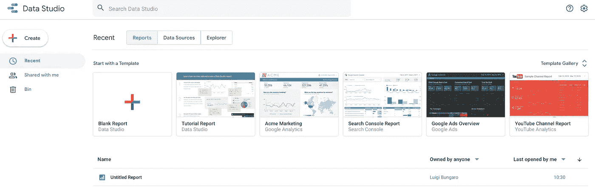
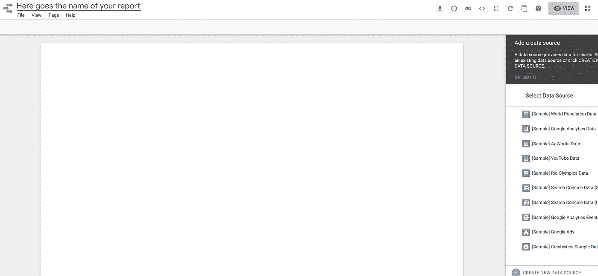
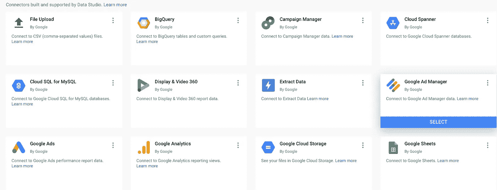
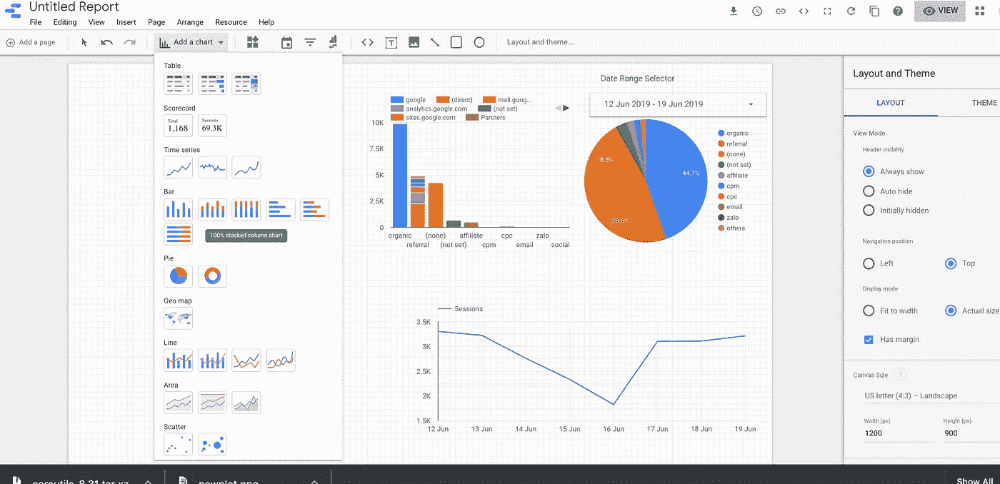
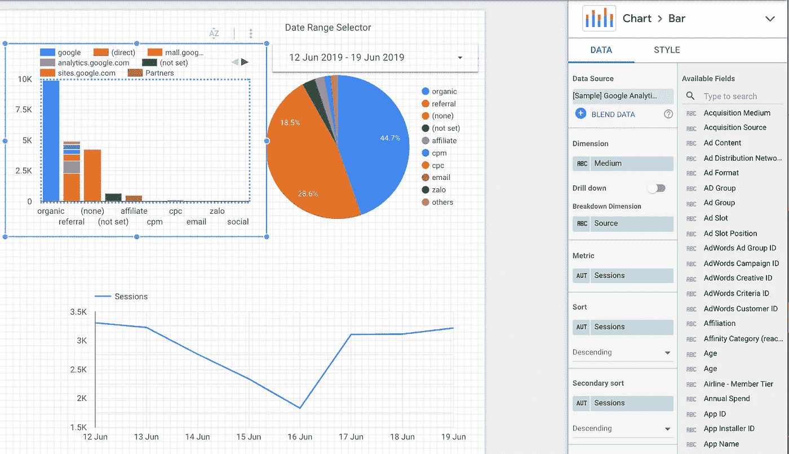
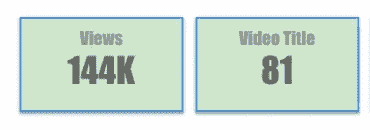

# 使用 Google Data Studio 创建仪表板，并使用它制作自动报告

> 原文：<https://towardsdatascience.com/create-a-dashboard-with-google-data-studio-and-make-automatic-reports-with-it-db42088ad879?source=collection_archive---------15----------------------->

Google Data studio 是一个免费的交互式仪表盘，可以帮助你创建报告。这是我刚刚创建的一个报告的例子。

我已经将仪表板连接到两个数据源:

1.  谷歌分析(从客户网站获取数据)
2.  Youtube 频道

要使用 Google Data Studio，您只需要一个 gmail 帐户，接受条款和条件后，您就可以快速开始使用它。

创建新报告非常简单，您只需点击“空白报告”即可创建您自己的个性化报告，或者您可以使用现成的模板(您也可以在查看一些模板后创建您自己的个性化报告，以了解如何构建您自己的仪表板)。

Create your Blank Report or use a template

单击空白报告后，您将进入此页面，在此您可以为仪表板命名(左上角)，还可以通过“创建新数据源”(右下角)连接到您的数据。如果您没有数据源可以使用，或者您只是想尝试一下，您可以使用 Google 提供的样本数据集。

Your Blank Report — Connect to the Data Source

谷歌已经为你的数据提供了便捷的接口，所以你应该很容易找到你想要的东西。以下是可用数据源连接器的示例:

Examples of some connectors

连接数据集后，您可以开始在报告中添加图表。请记住，您可以将同一个仪表板连接到多个数据源(一旦您添加了一个新图表，您就可以将它连接到您想要用于特定图表的特定数据源)，因此您不需要为多个数据源创建多个仪表板。

要在报表中添加元素，真的很直观。只需点击您想要添加的图表，并将其放置在仪表板中您想要的位置，您还可以更改其大小，例如使其变大。还可以添加文本、图像和图形/线条。

Adding graphs

每个图表都可以在报告的右边部分进行个性化设置，在这里可以选择与哪个数据源相关、使用哪个指标以及个性化其风格。

Choose metrics and style for your graph

我们可以使用的一个很好的特性是数据范围。如果我们将此添加到报告中，将有可能更改我们要考虑用于分析的数据范围，并且它将自动更改基于此时间范围的所有图表，因此我们不需要为不同的时间间隔一次又一次地创建所有图表。

我们也可以使用记分卡，它有助于可视化某些特定的 KPI，不需要图表，如下例所示。

Scorecard

完成图表后，我们可以通过多种方式与他人分享:

Share the Report

按顺序，我们可以:

1.  下载成 pdf 格式
2.  创建自动邮件发送报告(您可以选择时间频率)
3.  获取可共享的链接
4.  有嵌入的代码把图表，例如在一些网页

希望这篇文章对您有用，并享受您的数据分析/报告！

如果你愿意支持我写其他类似的文章， [**请我喝咖啡**](https://www.buymeacoffee.com/berlin) :)