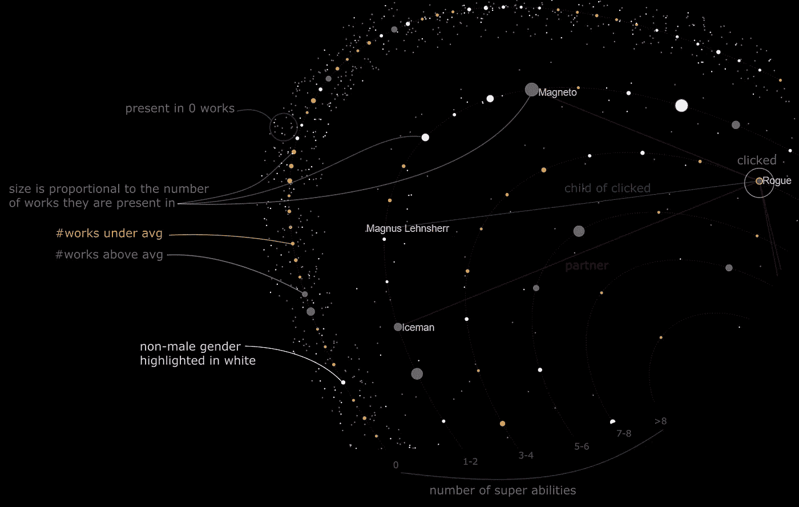
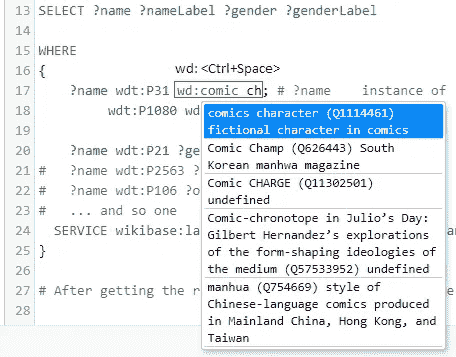
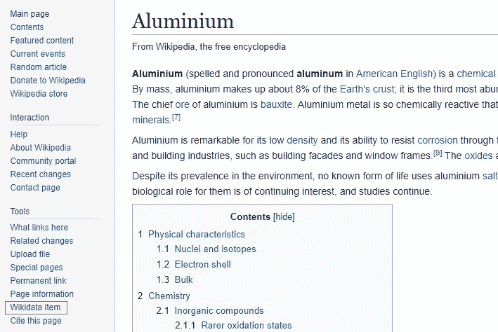
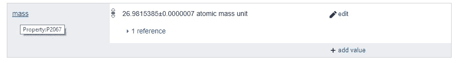

# 用 SQL 和 Javascript 创建一个漫威数据库，简单的方法

> 原文：<https://towardsdatascience.com/create-a-marvel-database-with-sql-and-javascript-the-easy-way-573ccdf44673?source=collection_archive---------31----------------------->

## 维基百科是一个很好的数据来源，你可以在你的下一个项目中利用它

I know, this picture is mostly about DC, but this post is not only about Marvel and [Lena Rose](https://unsplash.com/@happilyabstract?utm_source=unsplash&utm_medium=referral&utm_content=creditCopyText) did a great job taking this picture.

在这篇文章中，我将解释如何使用维基百科、Javascript 和 SQL 创建一个漫威数据库(或 DC 数据库)。我们将制作一个灵活的工具，允许您创建不同的表格用于您的项目。这里解释的概念可以扩展到其他学科。这篇文章是写给那些没有时间学习维基数据系统中使用的*修改的 sql* 的复杂语法，但仍然想玩他们的数据的人的。

我拥有一个漫画数据库的最初原因是为了创建这种可视化效果，你将在本文结尾再次看到这一点:

Legend of Marvel & DC visualization: [https://heberleh.github.io/comics-universe/](https://heberleh.github.io/comics-universe/)

# 管道

这里的想法是通过以下步骤获得一个灵活的数据库:

1.  从 **Wikidata** 中查询表格并导出为 json 文件
2.  创建一个 **Alasql** 数据库，并插入来自 json 文件的数据
3.  使用创建的数据库执行 **SQL 查询**

# 1.从维基百科提取数据

维基百科背后有一个很棒的数据库和本体。点击此处进入查询系统:[https://w.wiki/4iP](https://w.wiki/4iP)

在上面的链接中，你会发现类似的内容(你会在那里找到更多相关信息):

在这段代码中，我选择的实体是*漫画人物*的实例，并且在*虚构世界* *漫威世界*中。乍一看可能有点奇怪，但是这些代码都是维基百科本体的一部分。这就是他们如何处理冗余，并能组织和使一切工作！但是如何创建自己的查询呢？

首先，会帮助你。尝试键入`wdt:<Ctrl+Space>`。您注意到弹出了一个帮助工具提示。尝试键入的*实例。您会看到'*的'*实例的代码是`wdt:P31`。使用同样的方法，现在对于一个*值*，你将输入`wdt:<Ctrl+Space>`(这次没有“t ”!)和*漫画人物*，回车，瞧，你得到了代码`wd:Q1114461`。*

<Ctrl+Space> opens the helper

O *好的，亨利，但是我不知道我们可以用什么，我没有时间学习维基百科的语言……*而且我理解你！因此，为了克服这一点，我们将在这里打开这一页[巨头](https://www.wikidata.org/wiki/Q841372)。这是维基百科条目代码 Q841372，庞然大物！现在看一看，看看有什么关于一个漫画人物的信息。将鼠标指针放在语句部分的项目上。例如，如果您将鼠标放在“实例”上，您将获得 P31 代码！因为它不是一个值，所以对这个值使用`wdt`。

通过浏览该页面，您可以很好地了解可以使用哪些属性。暂停:如果你想创建一个数据库，但还不知道它会是什么，试试[随机文章](https://en.wikipedia.org/wiki/Special:Random)功能来获得见解。我们可以对任何维基百科页面做同样的事情。去官方维基百科网站搜索任何东西，比如说… [铝](https://en.wikipedia.org/wiki/Aluminium)。现在检查左侧栏，寻找 **Wikidata item** 链接。

Wikidata link is in read on the left

单击，瞧，它显示了该项目的所有属性。我们看到我们通过使用`wdt:P2067`得到了**质量**，以及许多其他可能适用于其他类型金属的属性。

Each Wikidata entry has many properties. The tooltip tells you the property ID.

现在我们有了维基数据，我们将:

1.  为感兴趣的属性创建查询
2.  将结果下载为。json
3.  始终跟踪 id(Wikidata 项目 URL)和标签

例如，我创建了一个性别查询。一个查询职业，以此类推。结果是一个文件夹有许多。我将把 json 文件加载到由许多表组成的数据库中。您可以对所有信息执行单个查询。在我的例子中，我希望它具有延展性，这样我就可以执行 JOIN、LEFT JOIN 和其他 SELECT 命令来获得不同的表。

事实上，我没有只获得漫威宇宙，而是丢弃了那个过滤器，获得了一个虚构角色实例的完整数据库(不仅仅是漫画角色——出于某种原因，这个不会查询美国队长)。所以，在我的 json 文件中，你可以找到漫威、DC 和其他人。生成的 jsons 在我的 [GitHub 页面](https://github.com/heberleh/comics-characters-js-database)中找到。接下来，我将展示如何在 Javascript 中使用 json 文件和一个简单的 T21 SQL 数据库。

正如我在上一段中提到的，我的查询实际上是关于虚构角色类及其子类的。我还查询了伴侣和配偶，因此为此我使用命令|来定义两个 wdt:

注意，在上面的代码中，我不再过滤漫威了。对于更复杂的查询或处理列表，请参考 [Wikidata 网站](https://www.wikidata.org/wiki/Wikidata:Main_Page)。另一个不错的选择是位于[维基数据查询服务](https://query.wikidata.org/)顶部的*帮助*按钮，在那里你可以找到例子和支持。

# 2.用 Javascript 创建 SQL 数据库

现在我们有了 json 文件，让我们将它们插入到 SQL 数据库中。为此，我们将使用一个名为 [Alasql](https://github.com/agershun/alasql) 的工具。使用 Alasql，您可以以不同的方式加载数据和创建表格([在这里阅读更多信息](https://github.com/agershun/alasql/wiki))。

这里，因为我们有来自 Wikidata 的 json，所以我们将对每个 JSON(文件)应用一个 SELECT 并插入到我们数据库的一个新表中，以便于访问。为了简化，我的代码将只包含两个表；你可以在这里找到完整的**更新版本** [。看起来是这样的:](https://github.com/heberleh/comics-characters-js-database)

我们准备好了。我们有一个数据库，可以通过调用`let mydb = MarvelDB()`来使用它，并像这样应用 SQL 命令:`mydb.exec('SELECT DISTINCT abilityLabel from abilities')`。

# 3.最终代码和用法

我定义了一些测试来确保一切正常。它举例说明了我们数据库的用法。如果你不习惯测试，只考虑下面代码中的`let result = this.db.exec(...)`和`console.table(result)`，忽略其他部分。

上面的`SELECT`返回列`charLabel`，并重命名为`name`。它还连接了角色、性别和能力表，确保条目具有相同的角色 id ( `char`)。最后，它通过名为 *agender* 的特定性别进行过滤。关于这个数据库的更多例子，请到 [GitHub 页面](https://github.com/heberleh/comics-characters-js-database) -别忘了开始:)

本文描述了我为下面的可视化创建数据库的方式。你可以通过在台式机/笔记本电脑上访问[这个网站](https://heberleh.github.io/comics-universe/)与它互动(它可以在手机上打开，但互动是有限的)。

Marvel & DC visualization: [https://heberleh.github.io/comics-universe/](https://heberleh.github.io/comics-universe/)

这是我漫画人物系列的第一部分:

1.  [用 SQL 和 Javascript 创建漫威数据库，最简单的方法](/create-a-marvel-database-with-sql-and-javascript-the-easy-way-573ccdf44673) [this]
2.  [可视化漫画人物的性别和超能力](https://medium.com/@heberleh/visualizing-comic-characters-genders-and-superpowers-ae7c2311cb89)
3.  [用数据可视化比较漫威和 DC](https://medium.com/@heberleh/comparing-marvel-and-dc-with-data-visualization-33b8f8486082)

欢迎添加私人注释和评论。谢谢你看我的文章！