# 创建多标签分类人工智能:创建我们的数据集[第 1 部分]

> 原文：<https://towardsdatascience.com/create-a-multi-label-classification-ai-for-movie-stills-part-1-ec6c81279888?source=collection_archive---------14----------------------->

## 使用 Pandas 创建我们的数据集，使用 FastAI 库和 Python 进行深度学习以开发 REST API，我们将制作一个能够区分电影剧照中几个元素的 AI，并将其部署到生产中。

Françoise Dorléac and Jean-Paul Belmondo in “[L’homme de Rio](https://www.imdb.com/title/tt0058203/)” (1964).

*该项目将分为四个不同的条款:*

1.  **从数据库中创建我们的数据集到熊猫；**

2.[使用 FastAI 创建一个能够标记电影快照的 AI](https://medium.com/@yann.defretin/create-a-multi-label-classification-ai-train-our-ai-part-2-85064466d55a)；

3.用 Docker 把我们的 AI 作为 REST API 部署到生产中；

4.每个月做一个脚本重新训练我们的 AI。

# 介绍 Whatthemovie.com

创建于 2008 年的 [Whatthemovie](https://whatthemovie.com) 是一个独特的电影问答游戏，人们上传电影剧照，其他人必须猜猜这张照片是从哪部电影中拍摄的。在十多年的时间里，该网站已经从我们的优秀用户上传的 30 000 部电影中积累了超过 470 000 张图片。

我们重视质量胜于数量。因此，并非所有提交的图像都会被接受。今天，我们可以拥有超过一百万张图片，但这不是我们的首要任务。上传的图像必须对测验有趣，测验本身应该在难度和电影类型方面保持平衡。

主要区域如下所示:

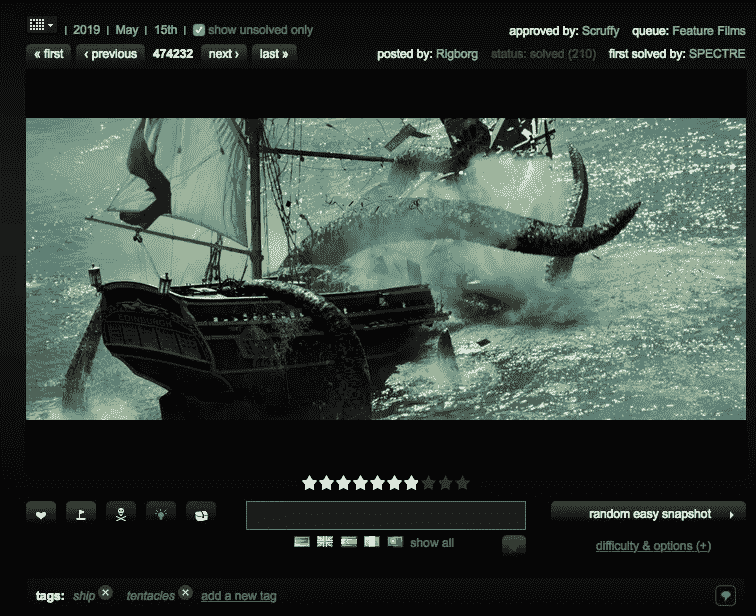

Can you guess what movie is behind this shot?

给你一张取自电影场景的图片，你必须猜电影的名字。旗帜意味着你不必输入原始标题来获得分数，你也可以用德语、法语、西班牙语等来写。我们支持多种语言的替代游戏，让来自世界各地的用户有机会与其他用户一起游戏和竞争。

# 改善上传阶段

在网站上上传新的电影剧照听起来可能很容易:你从我们的数据库中选择一部电影——或者添加一部新的——你上传你的图像，你就可以开始了。实际上，用户必须首先用任何可用的播放器从电影中自己拍摄快照，裁剪图像中潜在的黑条，并通过上面描述的上传阶段。

在上传阶段的最后一步，我们要求我们的用户添加标签，描述图像包含的内容，图像中有什么——图像是否显示街道、汽车等。这看起来也相对容易，但他们已经做了很多工作，我们的大多数上传者都懒得添加标签，这很不幸，因为**相关标签对过滤照片**很重要。

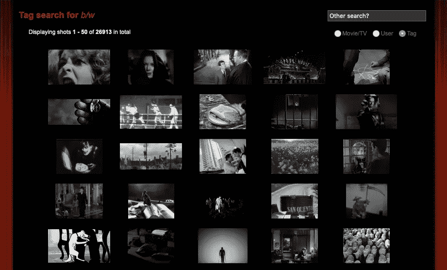

Anna Karina in “[Le petit soldat](https://www.imdb.com/title/tt0054177/)” (1963). You can see the tags below the shot. When you click on one of them — like “b/w” for black and white — , you can see all the black and white movie snapshots uploaded on the website.

过滤黑白快照听起来可能没什么意思，但想想其他标签，如“戈尔”、“裸体”或“血液”。这些标签显示了明显的敏感内容，一些用户不希望看到这些图片——至少在没有询问他们的情况下。这就是为什么标记图像很重要。如果一个用户忘记在他的照片上添加“裸体”或“戈尔”标签，一个用户在工作中玩——很多都是这样！—可能会看到这个图像，没有人希望这种情况发生在开放的计划中。

事实上，我们已经在网站上添加了一个设置，让用户选择他们是否希望这种快照自动显示。但显然，如果一张快照没有被标记为敏感的——“血染”或“裸体”，它仍然会显示出来。**这引出了我们今天的项目:**当用户上传他们的快照时，我们能自动向他们建议标签吗？我们能否建立一个能够检测图像中相对常见元素的人工智能，以帮助人们标记他们的照片？我们能否检测图像中的裸体或血块材料，以防止明智的人看到它们？

在这个系列的第一部分，我们将从从我们的数据库创建一个数据集开始，并用 Pandas 清理它。然后，在第二篇文章中，我们将开始使用 FastAI 训练一个 AI，并尝试优化它，以在预测图像中的元素时获得我们可以获得的最佳结果。接下来，我们将找到一种方法，用 Docker 将我们的 AI 部署到生产中。最后，我们将尝试编写一个脚本，每个月用上传的新数据自动重新训练我们的 AI。

# 从玛丽雅姆到熊猫

我们的网站由 [Ruby on Rails](https://rubyonrails.org) 提供支持，这使得数据库结构非常容易创建、理解和维护。在我们为这个项目处理的所有数据中，我们实际上只对两个表感兴趣:“shots”表和“tags”表。这些表格有我们需要的所有数据。前者有图像 ID 及其文件名。后者将所有标签添加到一个特定的“refID”——在我们的例子中，就是我们的图像 ID。

有几种方法可以将这些表格导出为我们关心的格式。熊猫，我们将要用来准备数据来训练我们的 AI 的库，可以读取几种文件类型，如 CSV 文件。这很幸运，因为 [PhpMyAdmin](https://phpmyadmin.net) 能够将表格直接导出为 CSV 文件。

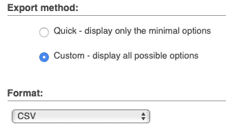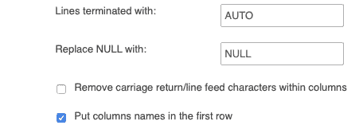

Don’t forget to check “Put columns names in the first row” before exporting.

PhpMyAdmin 是一种很好的转换方式，但是我们更喜欢通过命令行进行导出，将 CSV 文件直接保存在服务器上。让我们首先使用 [mysqldump](https://dev.mysql.com/doc/refman/8.0/en/mysqldump.html) 将我们的两个表导出到 SQL 文件:

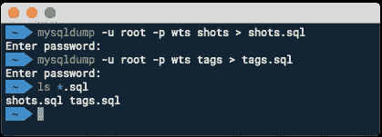

现在我们已经导出了表格，我们可以使用 James Mishra 制作的这个[伟大的 Python 脚本](https://github.com/bmtgoncalves/mysqldump-to-csv/blob/master/mysqldump_to_csv.py)将它们转换成 CSV 文件:

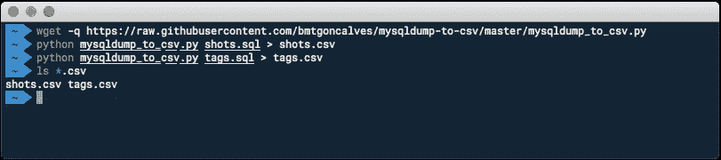

我们现在准备好和[熊猫](https://pandas.pydata.org)一起工作了！

# 准备和清理我们关于熊猫的数据

我们现在有了格式良好的数据。我们可以开始使用 Pandas 来探索数据，只保留我们感兴趣的表中的列，并将这两个表合并，以获得一个非常好的数据集，为训练我们的 AI 做好准备。

安装熊猫并使用它的最好方法是安装 [Anaconda](https://www.anaconda.com) 。这是一个很棒的软件包，默认附带了很多用于深度学习的图书馆，如 Pandas。你可以在[本页](http://docs.continuum.io/anaconda/install/)找到如何安装。

安装 Anaconda 的另一个优势是默认包含的 Jupyter。Jupyter 可以让你直接在浏览器中进行一些 Python、Pandas 和机器/深度学习编码，这非常方便，因为你可以创建和显示数据图表，以检查它显示了什么，更好地决定保留什么等等。启动 Jupyter 很容易，只需在安装后的终端中键入`jupyter notebook`。

## **加载数据**

开始编码吧！一旦我们启动了 Jupyter，我们就必须导入我们需要的 libairies 在本例中，是 Pandas、Numpy 和 Matplotlib。

我们现在可以打开熊猫的 CSV 文件并开始挖掘。让我们先打开“标签”表。

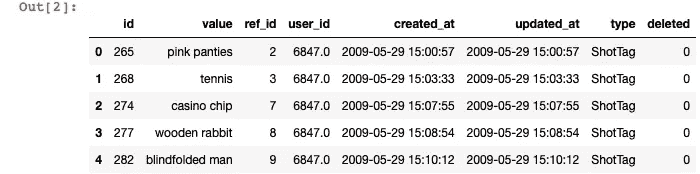

With .head(), we can see the first rows of our table and its structure directly in Jupyter.

这里我们可以做的第一件事是删除我们不需要的列。“标记”表包含标记的“值”、标记链接到的快照的 ID——“ref _ ID”以及添加它的用户。当您通过 Ruby on Rails 的生成器创建新表时，它们会自动生成列“created_at”和“updated_at”。

让我们只保留“id”、“值”和“ref_id”列:

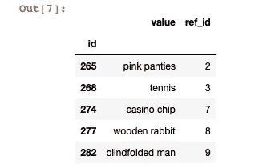

Only keep the values we care about!

在这个项目中，我们的目标不是找到图像中每一个可能的元素，而是找出最常见的元素，或者更准确地说，是网站上最常用的标签。通过熊猫和`.value_counts()`函数，我们可以很简单地发现:

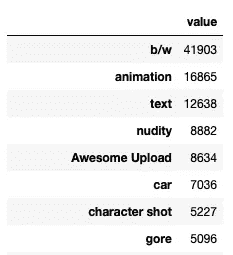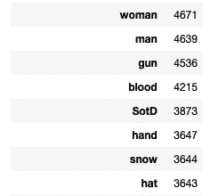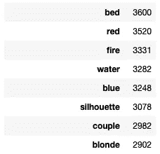

Some of the most-used tags on the website.

显示这里使用的前 400 个标签可能有些夸张，但是我们已经可以在第一批结果中找到一些需要清理的数据。我们可以看到，在第 5 个位置，我们有标签“真棒上传”，或者在第 13 个位置，我们有“SotD”标签。这些标签在我们的例子中没有用，因为有些标签没有描述图像上的内容。其实都和网站的系统有关。

带有“精彩上传”标签的照片意味着它是由高级用户上传的，在这种情况下，图像被自动接受，没有投票，没有选择。因此，我们不想保留这个标签，并试图在新上传的图像上建议它—它已经自动完成了。

这同样适用于“SotD”标签，意思是“每日快照”。每天，评分最高的照片都会得到奖励、提升和上传者。它没有描述快照中的任何内容，所以我们不需要它。

另一个有趣的是“情侣”标签。一对夫妇很难被认出来。可能是两个男人，两个女孩，一个男人和一个女孩等等。此外，我们如何以及何时决定应用这个标签？当人与人之间很亲近的时候。接吻？拥抱？很难看出区别。**更重要的是，因为我们的网站是一个问答游戏，所以标签必须只描述图像显示的内容，这一点很重要。标签不应该泄露任何关于我们试图猜测的电影的线索。**如果一个上传者——他显然已经看过这部电影——添加了“情侣”标签，这就泄露了关于这部电影的一些信息，我们不希望这样。如果我们看到两个人接吻，这并不意味着他们是一对，也不意味着他们离得很近。

## **去掉我们不想建议的标签**

在移除标签之前，我们可以合并非常相似的标签。例如，我们有带有“电话”标签或“电话”标签的照片。既然它描述的是同一个东西，我们可以把它们合并成一个单一的“电话”:

我们还对其他标签进行了同样的处理，如“飞机”和“飞机”或“红发人”和“红发人”,之后我们会删除表格中可能出现的重复标签，以确保一切都是干净的:

对于这个项目，我们决定保留那些至少被添加了 500 次以上的标签，并排除一些如上所述的标签。Pandas 提供了一个方便的函数来检查一个列的值是否是不同值列表的一部分，并且只保留这些值。在这里，我们想要相反的。我们希望从数据集中排除一系列标签。我们可以使用`.isin()`函数，该函数通常只返回值与列表元素之一匹配的行。但是如果我们在函数前面加上`~`,它会做我们正在寻找的事情，排除一系列标签——就像一个`isNOTin()`函数。

这次操作之后，我们还剩下 183 个不同的标签。我们现在可以在“tags”表中只保留包含其中一个带有`.isin()` 函数的行:

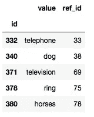

Our “tags” table is now ready to be merged!

# 将“标签”表与“照片”表合并

现在我们已经清理了我们的“标签”表，只保留了最常用和最有趣的标签，我们必须使用 Pandas 来创建一个包含标签和图像数据的独特的表。我们知道“tags”表中的“ref_id”列指的是“shots”表中图像的“id”。Pandas 使得合并两个不同的表变得容易，这两个表有一个与`merge`函数相同的“键”。

让我们首先加载并检查“shots”表的结构:

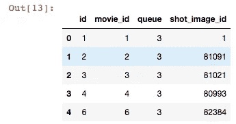

A few columns of our “shots” table.

这里我们只关心“id”列，它指的是网站上的镜头 ID，以及存储电影快照文件名的“shot_image_id”列。是时候合并两个表了！正如我们已经知道的，我们在这两个表之间有一个公共的键，所以这很容易。让我们用熊猫来做这项工作:

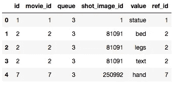

Both tables have been merged into one.

合并数据后，我们将再次删除最终数据集中我们不感兴趣的所有列。但是我们也要将每个图像的所有标签重新组合到一个单元格中。例如，您可以在上面看到 id 为“2”的图像有三个不同的行，这意味着它有三个不同的标签与之相关联—“值”列中的“床”、“腿”、“文本”。

我们将把给定图像的所有标签重新分组到一个单元格中，用逗号分隔:

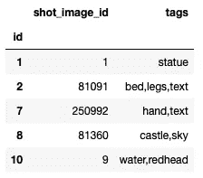

Our final table: an image ID and its tags.

为了清楚起见，我们还将包含标记的列重命名为“tags”，将列“ref_id”设置为 index，并将其重命名为“id”。很好，现在我们的数据集已经准备好训练我们的 AI 了！通过使用`tags_grouped.shape`，我们看到我们的数据集中有 243 558 张图片，至少有一个相关的标签和 183 个不同的标签。

最后要做的是将数据集导出到 CSV 文件:

# 下一步是什么

在我们系列的第一篇文章中，我们使用熊猫从头开始创建了我们自己的数据集。在清理它并只保留有用的数据之后，现在是时候开始考虑如何使用这个数据集来创建和训练一个能够区分电影快照中不同元素的 AI，并向用户建议这些元素作为标签。这将是我们第二篇文章的主题。敬请期待！