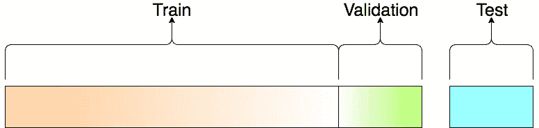

# 创建多标签分类人工智能:训练我们的人工智能[第 2 部分]

> 原文：<https://towardsdatascience.com/create-a-multi-label-classification-ai-train-our-ai-part-2-85064466d55a?source=collection_archive---------17----------------------->

## 在我们的第一篇文章中，我们从头开始创建和清理了一个关于熊猫的数据集，现在我们要用我们的数据训练一个人工智能来区分电影快照中的几个元素。

Gérard Depardieu and Patrick Dewaere in [“Les Valseuses](https://www.imdb.com/title/tt0072353/)” (1974).

*这个项目被分成四个不同的条款:*

1.  [从数据库中创建我们的数据集到熊猫](https://medium.com/@yann.defretin/create-a-multi-label-classification-ai-for-movie-stills-part-1-ec6c81279888)**；**

2.**使用 FastAI 创建能够标记电影快照的 AI；**

3.用 Docker 把我们的 AI 作为 REST API 部署到生产中；

4.每个月做一个脚本重新训练我们的 AI。

# 我们在哪里？

通过上一篇文章，我们成功地创建了一个数据集，它将电影快照和描述图像内容的相应标签结合在一起。

提醒一下，该数据集由 243 558 幅图像组成，带有 183 个不同的标签。这是一个简单的 CSV 文件，如下所示:

Our dataset: an image ID and its associated tags.

我们现在将使用这个数据集来创建和训练一个人工智能，它将能够检测和建议用户上传的图像元素。但是怎么做呢？我们可以选择什么库来制作这个 AI？我们去哪里找快速训练我们的 AI 所需的 CPU 和 GPU 资源？

在这个系列的第二部分中，我们首先要找到并创建一个适合这个繁重任务的环境。然后，我们将选择 [FastAI](https://www.fast.ai) ，当今最有前途的深度学习图书馆之一，来制作我们的人工智能，并希望在文章结束时，我们可以导出一个好模型，以便在我们的网站上使用它。

# 设置环境

为了用 FastAI 训练我们的 AI，我们需要找到可以在短时间内处理超过 25 万张图像的最佳环境。我们的网站运行在两个专用的服务器上，有很好的硬件来服务 Ruby on Rails 应用程序。但是计算机视觉需要很多资源，尤其是一个好的 GPU——而我们的服务器没有。因此，我们需要找到一个平台，能够以便宜的价格甚至免费，按需*为我们提供这些资源*。

这是幸运的，因为有两个主要的在线平台可以以非常简单的方式提供我们正在寻找的环境。

## **Kaggle，一个数据科学项目的地方**

[Kaggle](https://kaggle.com) 是一个知名的社区网站，供数据科学家在深度学习挑战中竞争。参加比赛后，你会得到一个数据集，你必须创建一个人工智能，在这个数据集上给出最好的结果。你可以随意使用任何深度学习库。

Kaggle is famous for hosting competitions where you can win thousand of dollars.

但是说 Kaggle 只是关于竞争是不正确的。事实上，Kaggle 还向数据科学家免费提供数百个数据集，学习该领域最常用的工具的课程，更重要的是，免费提供一个拥有丰富资源的现成环境**。**

**然后，你可以直接在其他数据科学家的网站上参加比赛，与他们展开较量。他们给你你需要的一切:一个类似 Jupyter 的界面，一些磁盘空间，一个好的 CPU 和一个 GPU。只需点击几下，你就可以开始训练一个人工智能！**

**FastAI，我们将在这个项目中使用的库，也可以在 Kaggle 上获得。实际上，这个项目很大程度上受到了[这个内核](https://www.kaggle.com/hortonhearsafoo/fast-ai-v3-lesson-3-planet)的启发，你可以在那里找到 FastAI 的创造者杰瑞米·霍华德——用他的图书馆参加著名的[星球:从太空了解亚马逊](https://www.kaggle.com/c/planet-understanding-the-amazon-from-space/overview/description)比赛。他只用了几行代码就获得了极好的结果。**

**你可以在他们的官网上找到关于如何在 Kaggle 上开始使用 FastAI 的[不错的教程](https://course.fast.ai/start_kaggle.html)。**

**虽然 Kaggle 似乎是我们项目的完美之地，但它也有一些限制。我认为 Kaggle 是一个不错的网站，在那里你可以玩和尝试不同种类的东西。但对于严肃的深度学习项目，你将不得不转向一个真正的供应商，给你更多的灵活性，更多的资源。**

## **谷歌云平台**

**由于我们希望能够导出我们的模型，并以自动方式每月重新训练我们的 AI，我们需要为我们的任务找到一个更好的主机，在那里我们可以根据我们的需要深度定制我们的环境。谷歌云平台似乎是解决这一问题的最佳场所。它以合理的价格提供许多服务。注册时你甚至可以免费获得一年 300 美元的积分。**

****

**The list of services GCP provides is ridiculously long.**

**与 GCP 合作肯定需要更多的时间和工作。您基本上必须创建一个虚拟机，并安装项目所需的一切。主要的优点是你可以自由地为你的项目创建任何类型的虚拟机。您可以建立一个拥有大量资源的虚拟机，甚至可以在世界范围内选择虚拟机所在的地区。**

**幸运的是，网上有很多教程可以帮助你开始学习 GCP。FastAI 有一个关于如何开始在谷歌云平台上使用他们的图书馆的专用教程。按照他们的指示，你应该有一个环境，里面有开始训练人工智能所需的所有工具。**

**当我们必须每月重新训练我们的模型时，将我们的环境放在云上肯定会使事情变得更容易。GCP 为他们提供的几乎所有服务提供 API，包括创建、启动和停止虚拟机。这是一个非常重要的特性，可以降低重新训练的难度。**

# **用 FastAI 创建一个 AI**

**我们创建了一个运行在谷歌云平台上的虚拟机，配有一个很棒的 GPU——在我们的例子中是一个 NVIDIA Tesla P100，配有 16gb 的 VRAM。就像我们在以前的文章中用熊猫创建数据集一样，我们将使用 Jupyter 与 FastAI 进行交互。但首先，让我们谈谈这个令人敬畏的图书馆。**

**FastAI 库提供了一个高级 API，能够为许多不同的应用程序创建深度学习模型，包括文本生成、文本分析、图像分类和图像分割。FastAI 对于 Pytorch 就像 Keras 对于 Tensorflow 一样:一组更直观的抽象，使得用几行代码开发深度学习模型变得很容易。**

**FastAI 会为您处理许多参数或超参数，默认情况下会产生良好的性能——当然，一切都是可定制的。**

**但是 FastAI 不仅仅是一个图书馆，它还是一门很棒的进入深度学习的课程。该课程分为两部分，可在[的网站](https://course.fast.ai)上免费获得。它非常适合新手，因为它可以让你在没有大量领域知识的情况下快速玩深度学习模型。这个项目完全基于这个课程和 FastAI，所以感谢他们的出色工作！**

**现在我们开始编码吧！像往常一样，我们首先必须通过 Jupyter 导入我们需要的所有图书馆:**

# **预处理数据集**

**我们要做的第一件事是预处理我们的数据集。预处理是非常重要的一步，尤其是在处理图像的时候。为了获得更好的性能，甚至为了让神经网络理解我们在喂它什么，我们必须*将图像标准化*并调整它们的大小。**

**在我们的项目中，我们正在处理来自电影的快照。电影可以有许多不同的长宽比。想想老电影:大多数都是用正方形格式制作的——4/3。但如今，它都是关于宽屏幕的——16/9——甚至更宽的宽高比，如 2.35 或 2.39。**

****

**The most-used aspect ratios in the cinema industry.**

**因此，为了使我们的人工智能更有效，预处理步骤是至关重要的:我们需要确保我们所有的数据在训练部分都具有相同的格式。为此，我们首先加载包含数据集的 CSV 文件:**

**通过这两行代码，FastAI 基本上读取了我们的数据集文件，并理解了我们的图像存储在一个名为“images”的文件夹中，后缀为“”。jpg”。`ImageList`是一个内置功能，让你轻松做计算机视觉。你可以在他们伟大的[文档部分](https://docs.fast.ai)找到更多关于这个函数或者整个库的信息。**

**变量“data”现在包含了与数据集相关的所有内容。我们可以开始预处理了:**

**大部分的评论不言自明，但我会详细一点。我们要做的第一件事是使用`split_by_rand_pct`方法将数据集分成两部分:**

1.  **一个训练集:它将包含用于训练我们的 AI 的图像和标签。我们将原始数据集的 90%用于训练集。**
2.  ****验证集**:AI 没有用来学习的图像和标签。这些图像仅由模型看到，以验证它是否正确学习以及性能是否变得更好。就此而言，我们使用原始数据集的 10%，因此值为“0.1”。**

****

**A visualisation of the splits. Test set is optional.**

**其次，我们用`label_from_df`方法告诉 FastAI 在哪里寻找每个图像的标签。在我们的例子中，标签位于 CSV 文件的第二列(不包括索引列)，由逗号分隔。**

**接下来是有趣的部分，预处理。通过`transform` 方法——更具体地说是`get_transforms()`函数——我们要求 FastAI 对我们的图像执行一些工作，以便创建“更多”数据。这被称为**数据扩充**。当您的训练集中没有足够的数据时，这尤其有用。默认情况下，FastAI 将对其处理的训练图像应用一些技术，最常见的是仿射变换，如水平或垂直翻转、旋转等。还有非仿射变换，如调整大小，裁剪，亮度变化等。它将在每次迭代中基于单个图像创建新的图像变体。**

****

**Examples of data augmentation techniques: rotation, flip, brightness.**

**我们正在做的下一个转换是调整图像的大小，正如你所看到的，这对我们来说很重要。我们决定选择 224 像素乘 224 像素的正方形大小，因为它对于计算机视觉来说似乎是一个很好的值，特别是当我们在最后一行使用 ImageNet 标准化图像时。**

**我们决定选择数字“3”。它相当于“挤压”方法。其他可用的方法有“裁剪”、“填充”或根本不调整大小。**

****

**The difference methods available to resize our images.**

**我们选择了“挤压”方法，因为经过几次测试后，我们发现这是最适合我们的情况的方法，因为我们想在调整大小后保留原始图像的所有信息，而不管它们的原始大小和纵横比。每次都给了我们最好的结果。**

**最后，我们使用 [ImageNet](http://www.image-net.org) 统计来标准化我们的图像。标准化涉及使用著名的 ImageNet 数据集的平均值和标准差。使用平均值和标准差是一个非常标准的做法。因为它们是用一百万张图像计算出来的，所以统计数据相当稳定。这会使训练更快。**

# **定义我们的神经网络结构**

**一旦我们完成了预处理，是时候创建我们的神经网络架构并开始训练我们的 AI 了。我们将在这个项目中使用**迁移学习**。迁移学习是一种技术，其中在一个任务上训练的模型被重新用于第二个相关的任务——在我们的例子中，检测电影快照中的元素。这种技术可以非常有用，例如，帮助那些没有知识从零开始创建他们的深度神经网络的人，无论是资源还是时间。或者只是为了避免完全重新编码，而我们可以使用一个现成的、适合我们的数据类型的类似模型。**

**我们将使用最近为图像分类创建的最有趣的模型之一，名为" [Resnet](https://arxiv.org/abs/1512.03385) " —其他可用的模型在这里[列出](https://pytorch.org/docs/stable/torchvision/models.html)。Resnet 是一种残差神经网络，有几种版本，深度可达 152 层——“resnet 152”。它在图像识别方面提供了令人难以置信的结果。**

**通过迁移学习，我们将获得这个已经训练好的模型的预训练权重，该模型已经在属于 1000 个不同类别的数百万张图像上进行训练，并使用这些已经学习的特征来预测新的类别，即我们的标签。这样做的主要优点是，我们不需要非常大的训练数据集来快速获得好的结果。**

**让我们以“Resnet152”作为预训练模型来制作我们的架构，创建一个广泛应用于计算机视觉的[卷积神经网络](/a-comprehensive-guide-to-convolutional-neural-networks-the-eli5-way-3bd2b1164a53)。CNN 是一种深度学习算法，它可以将图像作为输入，为图像中的各个方面或对象分配重要性，并能够区分它们。非常适合我们！**

**Create our neural network structure : CNN, Resnet152 and two metrics: accuracy and FBeta.**

**我们定义了两个函数作为神经网络的度量，以帮助我们评估它是否表现良好。第一个是精度阈值。为什么是门槛？简单地说，因为在这里，我们不是在制作一个多类分类器，我们希望我们的人工智能只为每张图像预测一个类——概率最高的一个。我们正在制作一个多标签分类器，这意味着每幅图像可以有不同的类别——或者为零。**

**在我们的例子中，我们有 183 个不同的类。所以我们对每张图片的每一类都有一个概率。但是，我们不仅仅要挑选其中的一个，我们要从这 183 个班级中挑选出 *n* 。基本上，我们将每个概率与某个阈值进行比较。然后我们会说，任何高于这个阈值的东西，都意味着图像中确实有这个元素。杰瑞米·霍华德使用 0.2 作为他的竞争门槛，因为它似乎普遍工作得很好。我们决定听从他的建议。因此，给定图像的概率高于 0.2 的每个类别将被视为该图像的一部分。**

**第二个度量被称为“FBeta”。这是一个众所周知的指标，在数据科学家行业或 Kaggle 主办的比赛中广泛使用。当你有一个分类器，你会有一些假阳性和假阴性。你如何权衡这两件事来创造一个单一的数字，并评估性能？有很多不同的方法可以做到这一点，而“FBeta”是一个很好的方法，可以将它们组合成一个单一的数字。它考虑了精确度和召回率。你可以在这里阅读更多关于“T4”的信息。**

****

**Both precision and recall are used to compute FBeta.**

****

**The FBeta formula.**

# **我们开始训练吧**

**我们现在已经有了一个现成的带有迁移学习的卷积神经网络，Resnet152 和两个指标。是时候训练我们的数据了！让我们从 10 个时期开始——一个时期意味着我们所有图像的一次迭代。**

****

**The results after 10 epochs.**

**没有那么多的工作，我们已经得到了相当好的结果！精确度看起来不错，FBeta 一直在上升。对你们中的一些人来说，Fbeta 分数可能看起来很低，但请记住，我们正在研究超过 183 个不同的类，我们并不试图创造一个完美的人工智能，它可以绝对预测图像包含的每个元素。我们正在努力使人工智能能够*建议*网站上最常用的标签，如“黑白”、“动画”、“男人”、“女人”等。**

**尽管如此，仍有改进的余地。我们可以尝试调整我们神经网络的学习速率，看看它是否能导致更好的结果。学习率是深度学习中一个非常重要的超参数。如果选择得不好，神经网络的表现就不会很好。默认情况下，FastAI 使用[单周期策略](https://docs.fast.ai/callbacks.one_cycle.html)，这意味着学习率将在每次迭代中先增加，然后降低。**

****

**The one-cycle policy in pictures. [Source](https://docs.fast.ai/callbacks.one_cycle.html)**

**单周期策略允许非常快速地训练神经网络，这意味着它将快速收敛到低损失值。但要让它发挥作用，我们需要找到最佳学习率，让单周期政策真正发挥作用。FastAI 提供了寻找最佳学习率的函数:**

****

**The loss seems to explode with a large learning rate.**

**我们可以从上面的图表中看到，大的学习率似乎没有帮助。其实学习率越大，损失越大。我们不希望这样。我们可以限制我们的学习速率来避免这种情况，并使用这个更新的参数重新开始训练。此外，我们不仅要重新开始训练，只有我们的神经网络的最后一层被更新。相反，我们这次将更新所有的权重，包括使用上面使用的函数`unfreeze()`的 Resnet 的 152 层权重。**

**We define a maximum learning rate to avoid having a loss that goes high.**

****

**Our results after 10 another epochs.**

**列车损失似乎变得更低，而 FBeta 似乎也变得更高。一切看起来棒极了！我们可以尝试另一种学习速率，训练更多一点，希望提高我们模型的性能，但我们已经可以看到**我们最有可能处于最佳能力，介于欠拟合和过拟合**之间。**

****

**The figure shows the optimal capacity that falls between underfitting and overfitting. When reached, we can stop the training. It’s called “early stopping”. Source: [https://arxiv.org/pdf/1803.09820.pdf](https://arxiv.org/pdf/1803.09820.pdf)**

**事实上，在第四个时期之后，我们的验证损失开始高于训练损失。但更重要的是，它似乎没有减少，而在此期间，培训损失不断减少。我们甚至可以看到，验证损失在某个时期开始增加。这无疑是一个信号，表明我们可能已经达到了模型的最佳容量，我们应该停止这里的训练，否则我们可能会开始过度适应。**

**当您在相同的数据上训练过多的模型时，就会发生过度拟合。当需要在它从未见过的数据上测试你的模型时，在它的舒适区之外，模型开始表现不佳，因为它只习惯于识别训练数据，而不是其他。它不能很好地概括新的、看不见的数据。该模型学习特定于训练数据的模式，这些模式在其他数据中是不相关的。**

# **对测试图像的预测**

**我们最好在这里停止训练，到此为止。我们可以先用`save()`函数保存我们的模型，然后导出我们的模型，其中包含所有优化的权重和偏差:**

**Save the model just in case we want to start again from this point and export the pre-trained model to use on production.**

**如果我们的人工智能在电影快照的建议标签上正确执行，我们可以快速测试各种数量的图像。我们将一百张人工智能从未见过的电影剧照放在一个文件夹中，并创建了一个快速的 Python 脚本来显示每张图像的预测标签及其各自的概率:**

****

**A few examples of the testing set with the predicted tags and their respective probability.**

**好像很管用！当然，它没有列出*所有*图像中可能显示的元素，但这从来不是我们的目标。我们想创造一个人工智能，当用户上传电影快照时，它可以向用户建议常用标签，我认为它工作得很好。几乎三分之二的时候，人工智能会提示*图像中所有*可能的元素。这并不意味着其余的时间它没有暗示任何东西，只是没有*所有的*元素——可能只有一两个标签。**

**一如既往，还有改进的空间，但对于第一款车型，我们对结果很满意。重要的是要记住，根据我们的人工智能，只有出现概率超过 20%的标签才会显示在这里。我们希望建议我们确信图像中确实存在的标签。**

# **下一步是什么？**

**现在我们已经做了一个能够检测电影快照中元素的 AI，并在简单测试后导出了性能良好的模型，我们如何将这个单个文件转化为我们网站上的服务？我们如何在我们的服务器上实现人工智能，并与当前的 Ruby on Rails 后端交互？这将是我们下一篇文章的主题，我们将使用 Docker 在 Python 中创建一个 REST API，以允许我们的网站向 AI 发送请求，AI 将返回给定图像中存在的标签。敬请期待！**