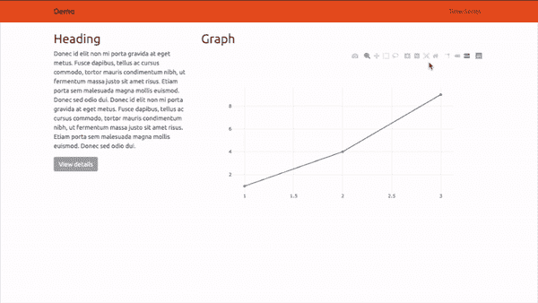
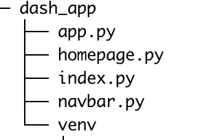

# 创建多页 Dash 应用程序

> 原文：<https://towardsdatascience.com/create-a-multipage-dash-application-eceac464de91?source=collection_archive---------3----------------------->



**制作仪表板**是向编码人员和非编码人员传达数据科学项目价值的好方法！

对于我们这些从事数据科学工作的人来说，我们的数据技能往往伴随着前端开发技能的缺乏。由 Plotly 构建的 Dash 库提供了简单的 boiler plate 代码，用于开发 Python 中的交互式 web 应用程序。

*寻找灵感，查看* [*仪表盘图库*](https://dash-gallery.plotly.host/Portal/) *！*

在本文中，我将介绍构建一个基本的多页面 dash 应用程序的步骤。该项目的代码和数据可以在 [this Github repo](https://github.com/joelsewhere/dash_app) 中找到。

# 为什么是多页应用？

学习构建一个多页面应用程序是非常有用的，原因有很多。以下是一些例子:

1.  允许为方法或背景信息添加单独的页面。
2.  将一个复杂的数据项目分解到多个页面中可以带来流畅的用户体验。
3.  可以用来建立一个在线投资组合！
4.  理解工作流可以作为进入 web 开发世界的一小步。

# 应用程序结构:

## 项目目录:



index.py 最终是运行整个应用程序的文件。可以把它看作是项目的目录。每个页面将在单独的文件中构建，然后导入到 index.py 中。此工作流用于保持文件的简洁和可读性，并保持项目结构的组织性和灵活性。

## D.R.Y 代码

该工作流有助于避免重复代码。例如，这个应用程序的每个页面都需要一个导航栏。组件只是被导入，而不是在每个文件中编写相同的代码。

# 创建目录和环境

首先，我们创建一个文件夹来保存我们所有的项目文件:

注意:我个人更喜欢使用 Visual Studio 代码或 Pycharm，但是为了使本演练易于理解，我们将坚持在终端中构建该应用程序。

在终端中:

```
mkdir dash_app
cd dash_app
```

接下来我们要做的是创建一个虚拟环境来构建应用程序。不，这在技术上不是一个要求，但是它消除了产生依赖错误的风险，并且通常是构建 web 应用程序时的最佳实践。

```
pip install virtualenv
virtualenv venv
source venv/bin/activate
```

(venv)现在应该出现在终端中的$符号之前。这意味着您现在正在使用您的虚拟环境。

随着虚拟环境的激活，我们需要安装我们将用于这个项目的库。

```
pip install pandas
pip install dash
pip install dash-bootstrap-components### These are dependences and are likely already installedpip install dash-core-components
pip install dash-html-components
pip install plotly
```

# 构建导航栏:

注意:导航栏和主页其余部分的代码直接从 [dash bootstrap components 网站](https://dash-bootstrap-components.opensource.faculty.ai/)复制而来。

**Dash bootstrap 组件**将网页划分成网格，是组织 web 应用布局的有用工具。有关定位应用程序组件(网页上出现的任何内容)的更多信息，请点击[此链接](https://dash-bootstrap-components.opensource.faculty.ai/l/components/layout)并查看 dbc 的使用。Row 和 dbc.Column

在终端中打开 vim 文本编辑器。

```
vim navbar.py
s
```

s 启用了编辑模式，这样我们就可以开始编写代码了！

在 navbar.py 中:

```
import dash_bootstrap_components as dbcdef Navbar():
     navbar = dbc.NavbarSimple(
           children=[
              dbc.NavItem(dbc.NavLink("Time-Series", href="/time-series")),
              dbc.DropdownMenu(
                 nav=True,
                 in_navbar=True,
                 label="Menu",
                 children=[
                    dbc.DropdownMenuItem("Entry 1"),
                    dbc.DropdownMenuItem("Entry 2"),
                    dbc.DropdownMenuItem(divider=True),
                    dbc.DropdownMenuItem("Entry 3"),
                          ],
                      ),
                    ],
          brand="Home",
          brand_href="/home",
          sticky="top",
        )return navbar
```

在上面的第六行中，href 参数告诉应用程序将哪个页面返回给用户(如果在开头放置 https://就可以导航到外部网站！)

在这行代码中，我们将 href 设置为“/time-series”。这将是我们的时间序列图的链接名称。

保存并退出文件。

```
Esc
:wq [ENTER]
```

# 主页:

```
vim homepage.py
## s to enable edit mode
```

在 homepage.py 中，我们首先需要导入所需的库。

```
import dash
import dash_bootstrap_components as dbc
import dash_core_components as dcc
import dash_html_components as html
```

我们还想从 navbar.py 导入 navbar 函数，并创建一个 Navbar 对象。

```
from navbar import Navbarnav = Navbar()
```

## 构建主页主体:

该页面的布局将是 2 个网格空间的网格。1 行，2 列。

第一栏:

*   页眉
*   段落
*   纽扣

第二栏:

*   页眉
*   图表

额外加分:[把图形改成图像。](https://dash.plot.ly/dash-deployment-server/static-assets)

```
body = dbc.Container(
    [
       dbc.Row(
           [
               dbc.Col(
                  [
                     html.H2("Heading"),
                     html.P(
                         """\
Donec id elit non mi porta gravida at eget metus.Fusce dapibus, tellus ac cursus commodo, tortor mauris condimentumnibh, ut fermentum massa justo sit amet risus. Etiam porta semmalesuada magna mollis euismod. Donec sed odio dui. Donec id elit nonmi porta gravida at eget metus. Fusce dapibus, tellus ac cursuscommodo, tortor mauris condimentum nibh, ut fermentum massa justo sitamet risus. Etiam porta sem malesuada magna mollis euismod. Donec sedodio dui."""
                           ),
                           dbc.Button("View details", color="secondary"),
                   ],
                  md=4,
               ),
              dbc.Col(
                 [
                     html.H2("Graph"),
                     dcc.Graph(
                         figure={"data": [{"x": [1, 2, 3], "y": [1, 4, 9]}]}
                            ),
                        ]
                     ),
                ]
            )
       ],
className="mt-4",
)
```

下一位代码*重要*。

因为我们正在构建一个多页面应用程序，我们需要能够将布局导入到其他文件中。为此，我们将构建一个主页函数，返回页面的整个布局。

*注意:布局必须始终是一个破折号 html 组件。标准是将布局包装在一个 div 中。*

```
def Homepage():
    layout = html.Div([
    nav,
    body
    ])return layout
```

在继续之前，让我们确保应用程序正常工作。为此，请将以下代码添加到页面底部。

```
app = dash.Dash(__name__, external_stylesheets = [dbc.themes.UNITED])app.layout = Homepage()if __name__ == "__main__":
    app.run_server()
```

保存并退出 vim。

```
Esc
:wq [ENTER]
```

太好了！现在让我们运行应用程序，以确保代码正常工作！

```
python homepage.py
```

如果应用程序失败，将打印出一条错误消息。习惯这个，很大程度上是应用构建的工作流程。对我来说，90%的时间是一个简单的语法错误。阅读错误信息并调试问题。(如果我的代码有问题，请在评论中告诉我！)

如果应用程序运行，将打印出几行。重要的一行应该是这样的:

```
Running on [http://127.0.0.1:8050/](http://127.0.0.1:8050/)
```

复制 http url 并将其粘贴到互联网浏览器中。

> 转眼间。一个应用诞生了！

在你欣赏你的作品一段时间后，关闭网络应用。

```
[CTR] C
##### It will look like this in terminal: ^C
```

# 应用

现在让我们建立我们的交互式图形页面！

首先，我们创建一个 app.py 文件。

```
vim app.py
## s to enable edit mode
```

接下来，导入应用程序的库、我们的 Navbar 函数以及伊利诺伊州的人口数据。

```
### Data
import pandas as pd
import pickle### Graphing
import plotly.graph_objects as go### Dash
import dash
import dash_core_components as dcc
import dash_html_components as html
import dash_bootstrap_components as dbc
from dash.dependencies import Output, Input ## Navbar
from navbar import Navbardf = pd.read_csv('[https://gist.githubusercontent.com/joelsewhere/f75da35d9e0c7ed71e5a93c10c52358d/raw/d8534e2f25495cc1de3cd604f952e8cbc0cc3d96/population_il_cities.csv](https://gist.githubusercontent.com/joelsewhere/f75da35d9e0c7ed71e5a93c10c52358d/raw/d8534e2f25495cc1de3cd604f952e8cbc0cc3d96/population_il_cities.csv)')df.set_index(df.iloc[:,0], drop = True, inplace = True)df = df.iloc[:,1:]
```

最后两行代码只是将日期列设置为索引，然后从数据集中删除该列的副本。

好，现在让我们建立一些组件！

## 导航条:

```
nav = Navbar()
```

## 标题:

我们将使用标题向用户提供一些说明。

```
header = html.H3(
    'Select the name of an Illinois city to see its population!'
)
```

## 下拉列表:

对于这个应用程序，我们将建立一个下拉菜单。在后台，下拉菜单被格式化为字典列表。这本词典有两个关键词。“标签”和“价值”。label =用户将在下拉菜单中看到的内容，value =返回给应用程序以查询数据的内容。

因为每一列都是伊利诺伊州的一个城市，所以我们将使用这个数据集的列名进行查询。

每一列都被格式化为“伊利诺伊州的城市”。让每个标签都包含“伊利诺伊州”有点大材小用，因为我们只寻找伊利诺伊州的城市。在下面的代码中，我们将删除每个词典标签的这部分额外文本:

```
options = [{'label':x.replace(', Illinois', ''), 'value': x} for x in df.columns]
```

现在，我们将字典列表直接插入到一个下拉对象中

***重要:*** 任何交互的组件都必须有一个 id 名。你很快就会明白为什么了。此外，组件不能共享 id 名称。如果一个 id 被多次使用，将会抛出一个错误，应用程序将会中断。

dcc 中的参数。下拉功能有。

*   **id:** 组件的唯一标识符。格式化为字符串。
*   **选项:**带有“标签”和“值”键的字典列表
*   **value:** 应用程序加载时下拉菜单设置的默认值。(我从数据集中随机选择了一个城市作为默认城市。)

```
dropdown = html.Div(dcc.Dropdown(
    id = 'pop_dropdown',
    options = options,
    value = 'Abingdon city, Illinois'
))
```

下拉完成！

## 输出空间:

这是我们输出图表的地方。

```
output = html.Div(id = 'output',
                children = [],
                )
```

这是所有的组件！

现在，就像我们制作主页一样，我们将制作一个名为“App”的布局功能。

```
def App():
    layout = html.Div([
        nav,
        header,
        dropdown,
        output
    ])return layout
```

好的，现在让我们制作图表。我们将创建一个 build_graph 函数，该函数将从下拉菜单中接受一个城市，并返回一个显示该城市人口趋势的图表。

```
def build_graph(city):data = [go.Scatter(x = df.index,
                        y = df[city],
                        marker = {'color': 'orange'})]graph = dcc.Graph(
           figure = {
               'data': data,'layout': go.Layout(
                    title = '{} Population Change'.format(city),
                    yaxis = {'title': 'Population'},
                    hovermode = 'closest'
                                  )
                       }
             )return graph
```

好吧！这个文件到此为止。确保保存并退出。

```
Esc
:wq [ENTER]
```

# 索引

现在，让我们用一个 index.py 文件将它们集合起来！

```
vim index.py
## s to enable edit mode
```

导入所有的库和函数。

```
import dash
import dash_core_components as dcc
import dash_html_components as html
from dash.dependencies import Input, Output
import dash_bootstrap_components as dbcfrom app import App, build_graphfrom homepage import Homepage
```

接下来，我们声明一个 dash app 对象。为了美观，我们将通过传入 dbc.themes 外部样式表来使用主题。主题的名字总是大写的，并且包含在一个列表中。随意阅读可用的主题[这里](https://bootswatch.com/)。

```
app = dash.Dash(__name__, external_stylesheets=[dbc.themes.UNITED])
```

***重要:*** 为了让我们的时间序列图具有交互性，我们要为下拉菜单和输出空间创建一个回调函数。但是，dash 不允许回调布局中不存在的组件。因为主页布局中没有下拉菜单或输出空间，所以我们必须更改应用程序的配置。

```
app.config.suppress_callback_exceptions = True
```

接下来，我们创建一个 dcc。Location 对象，在应用程序中不可见，但监视 url。这将告诉我们的应用程序根据用户点击的链接返回一个页面。

现在，创建一个内容空间，我们可以在这里返回主页或时间序列页面。

```
app.layout = html.Div([
    dcc.Location(id = 'url', refresh = False),
    html.Div(id = 'page-content')
])
```

# 复试

好吧！现在让我们使我们的应用程序具有交互性，这样当用户点击某些东西时，事情就会发生。

我们需要两次复试。一个用于返回应用程序的不同页面，另一个用于更新图表。

为此，我们声明@app.callback

在 app.callback 中，我们传递在文件顶部导入的输出函数。输出的参数是:

1.  正在更新的组件的 id。
2.  正在更新的组件的参数。(90%的情况下，您将更新一个 div，并且该参数将被设置为“children”)

注意:一个回调可以更新多个输出空间。只需将所有输出函数包装在一个列表中。

接下来，我们将输入函数传递给 app.callback。

*   * *输入总是包含在列表中。即使只有一个输入**
*   输入参数与输出参数相同

在这种情况下，我们输出到我们的“页面内容”div，并从我们的“url”位置输入。

```
[@app](http://twitter.com/app).callback(Output('page-content', 'children'),
            [Input('url', 'pathname')])
def display_page(pathname):
    if pathname == '/time-series':
        return App()else:
        return Homepage()
```

现在我们为我们的时序图创建回调。

因为我们做了一个 build_graph 函数，所以这个回调超级简单。

```
[@app](http://twitter.com/app).callback(
    Output('output', 'children'),
    [Input('pop_dropdown', 'value')]
)
def update_graph(city):graph = build_graph(city)return graph
```

最后，让应用程序运行。

```
if __name__ == '__main__':
    app.run_server(debug=True)
```

注意，我已经设置了 debug=True。在部署应用程序时，您应该将其设置为 false，但我们正处于开发阶段，将 debug 设置为 True 会使应用程序的调试变得更加容易。

保存并退出:

```
Esc
:wq [ENTER]
```

并运行应用程序！

```
python index.py
```

# 结论

这是一个简单的例子，但是这些基础可以用来构建更加复杂和强大的应用程序！

发表评论，如果你有任何问题，请告诉我。

附:退出您的虚拟环境。

```
deactivate
```