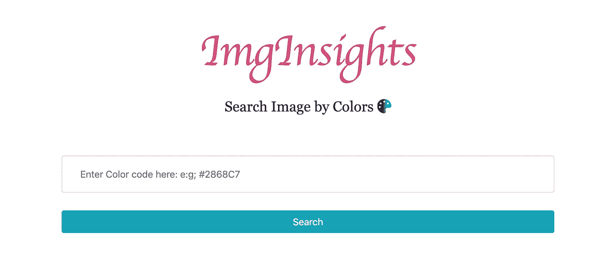
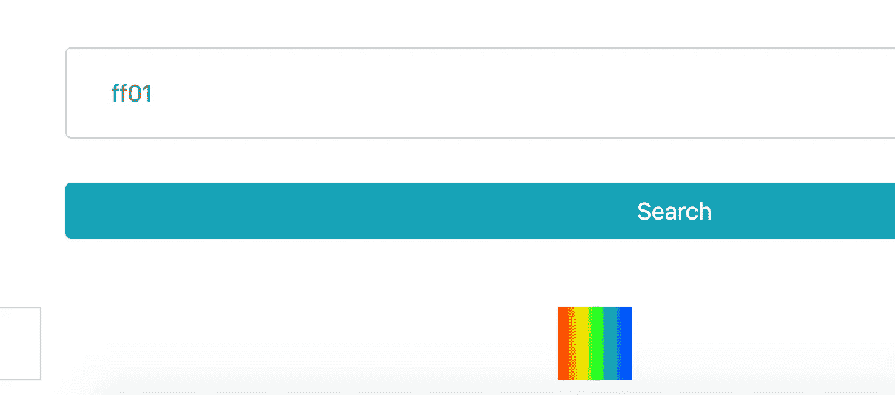
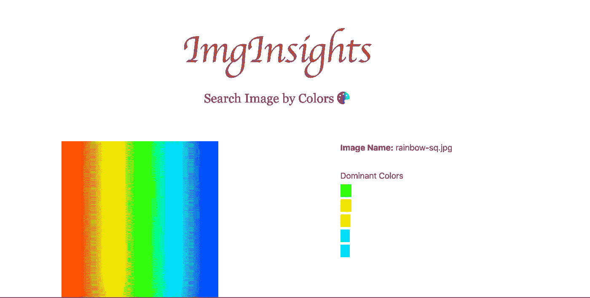

# 在 OpenCV 和 Flask 中创建一个简单的图片搜索引擎

> 原文：<https://towardsdatascience.com/create-a-simple-image-search-engine-in-opencv-and-flask-79384b78ee25?source=collection_archive---------26----------------------->

## 了解如何使用 OpenCV 提取图像中像素的颜色，然后通过 CSS 十六进制颜色代码搜索图像



我最近开始玩 [OpenCV](https://opencv.org/about/) ，一个用于图像处理的开源计算机视觉库。幸运的是有 Python 绑定可用。更幸运的是，像阿德里安这样的人已经做了一个伟大的服务，他们发布了关于类似主题的书和博客。

那么这到底是怎么回事呢？嗯，这很简单，或者我说，是最简单的使用 OpenCV 加载图像并找到与该图像相关的颜色，并在基于 Flask 的 web 应用程序中显示见解的演示。这不是一个国家的艺术应用程序，也不是目前我打算做的方式，但嘿，这只是一个开始，而不是结束。除了把我对像素的基础学习转化成一个 ***产品*** *(Google！当心！！)*

我不会深入 OpenCV 和 Flask 的细节，我将介绍应用程序实际上在做什么。

该应用程序由两部分组成:一个基于网络的应用程序，用于存储来自网络的图像并显示处理后的图像及其主色；一个命令行脚本，用于运行下载的图像并提取颜色代码。网页图像如下所示:


你通过颜色代码搜索图片，它会返回如下结果:



单个图像的视图看起来像:



让我们讨论系统的核心部分，也就是执行主要工作的命令行脚本。

```
def process_image(image_name):
    color_count = {}
    print('Processing the image {}'.format(image_name))
    path = 'website/static/uploaded_images/' + image_nameimage = cv2.imread(path)for i in range(image.shape[0]):
        for j in range(image.shape[1]):
            (b, g, r) = image[i, j]
            h_value = rgb2hex(r, g, b)if h_value in color_count:
                color_count[h_value] += 1
            else:
                color_count[h_value] = 1
    return color_count
```

导入计算机视觉后，我们通过调用`cv2.imread()`从磁盘读取图像。数据以`numpy`数组的形式提供，因此使用它的`shape`方法来查找宽度、高度和通道等细节。顺便说一下，OpenCV 以 BGR 格式存储图像数据，而不是 RGB 颜色空间。一旦数据被检索为 BGR 格式，我们就使用一个定制的`rgb2hex`方法将 RGB 转换为十六进制颜色。该函数然后返回一个字典列表，其中包含十六进制的颜色代码及其频率，我们将使用它来查找图像中颜色的百分比。我还做了一个演示，可以在 youtube 视频中看到[。](https://www.youtube.com/watch?v=gG0uVcYGpDc&feature=youtu.be)

# 结论

这是 OpenCV 中的一个基本图像处理教程。它不是一个成熟的产品，因为它不能告诉你图片中独特的颜色。它只是告诉你基于像素颜色的信息，而不是基于 ML 算法执行颜色分割和聚类。

希望在接下来的几周内，我会就更高级的话题进一步讨论 OpenCV。

像往常一样，这些代码可以在 Github 上找到。

***本帖原载*** [***此处***](http://blog.adnansiddiqi.me/create-a-simplest-image-search-engine-in-opencv-and-flask/) ***。***