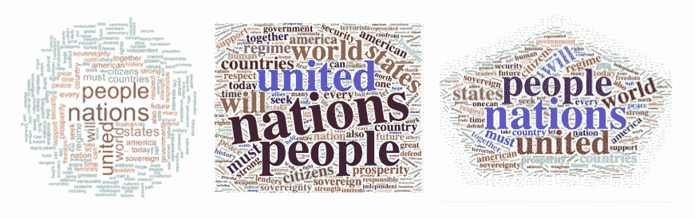
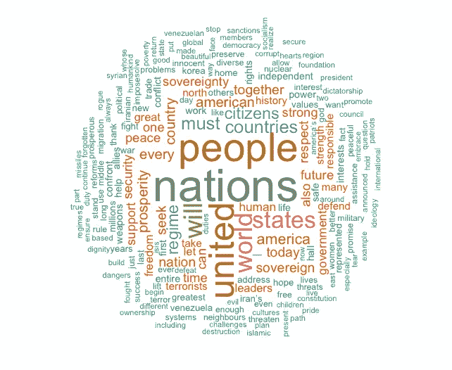
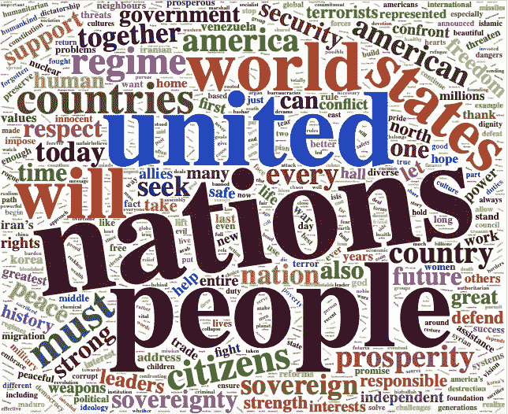
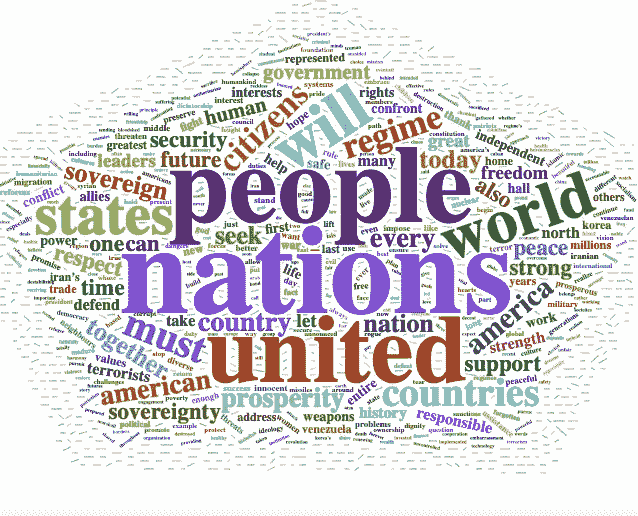

# 如何在 R 中生成单词云

> 原文：<https://towardsdatascience.com/create-a-word-cloud-with-r-bde3e7422e8a?source=collection_archive---------1----------------------->

## 如何以及何时使用它们的简单步骤



# 创建单词云的 4 个主要步骤

在接下来的部分中，我将向你展示如果你想用 r 生成一个单词云，需要遵循的 4 个简单步骤。

## 步骤 1:检索数据并上传包

要生成文字云，你需要下载 R 版本的*文字云* 包以及颜色的 *RcolorBrewer* 包。注意还有一个 *wordcloud2* 包，设计略有不同，应用也很好玩。我将向您展示如何使用这两个包。

```
install.packages("wordcloud")
library(wordcloud)install.packages("RColorBrewer")
library(RColorBrewer)install.packages("wordcloud2)
library(wordcloud2)
```

最常见的是，词云被用来分析 twitter 数据或文本语料库。如果你正在分析 twitter 数据，只需通过使用 *rtweet* 包上传你的数据(参见这篇[文章](/a-guide-to-mining-and-analysing-tweets-with-r-2f56818fdd16)了解更多信息)。如果你正在处理一篇演讲、一篇文章或任何其他类型的文本，确保将你的文本数据作为一个语料库加载。一个有用的方法是使用 *tm* 包。

```
install.packages("tm")
library(tm)#Create a vector containing only the text
text <- data$text# Create a corpus  
docs <- Corpus(VectorSource(text))
```

## 步骤 2:清理文本数据

在生成你的单词云之前，清理是必不可少的一步。事实上，为了让您的分析带来有用的见解，您可能需要从文本中删除特殊字符、数字或标点符号。此外，您应该删除常见的停用词，以产生有意义的结果，并避免最常见的频繁出现的词，如“I”或“the”出现在词云中。

如果你正在使用 **tweets** ，使用下面一行代码来清理你的文本。

```
gsub("https\\S*", "", tweets$text) 
gsub("@\\S*", "", tweets$text) 
gsub("amp", "", tweets$text) 
gsub("[\r\n]", "", tweets$text)
gsub("[[:punct:]]", "", data$text)
```

如果你正在处理一个**文集**，有几个软件包可以用来清理你的文本。下面几行代码向您展示了如何使用 *tm* 包来做到这一点。

```
docs <- docs %>%
  tm_map(removeNumbers) %>%
  tm_map(removePunctuation) %>%
  tm_map(stripWhitespace)
docs <- tm_map(docs, content_transformer(tolower))
docs <- tm_map(docs, removeWords, stopwords("english"))
```

## 步骤 3:创建文档术语矩阵

下一步你要做的是建立一个数据框架，在第一列中包含每个单词，在第二列中包含它们的频率。

这可以通过使用来自 *tm* 包的 TermDocumentMatrix 函数创建一个文档术语矩阵来完成。

```
dtm <- TermDocumentMatrix(docs) 
matrix <- as.matrix(dtm) 
words <- sort(rowSums(matrix),decreasing=TRUE) 
df <- data.frame(word = names(words),freq=words)
```

或者，特别是如果你使用 tweets，你可以使用 tidytext 包。

```
tweets_words <-  tweets %>%
 select(text) %>%
 unnest_tokens(word, text)words <- tweets_words %>% count(word, sort=TRUE)
```

## 第四步:生成单词云

*字云* 包是生成字云最经典的方式。下面一行代码向您展示了如何正确设置参数。例如，我选择研究美国总统在联合国大会上的演讲。

```
set.seed(1234) # for reproducibility wordcloud(words = df$word, freq = df$freq, min.freq = 1,           max.words=200, random.order=FALSE, rot.per=0.35,            colors=brewer.pal(8, "Dark2"))
```



可能发生的情况是，您的**单词云裁剪了某些单词，或者干脆不显示它们**。如果发生这种情况，请确保添加参数 **scale=c(3.5，0.25)** 并摆弄数字，使单词 cloud 合适。

词云的另一个常见错误是**显示了太多不常用的词**。如果是这种情况，请确保调整最小频率参数 **(min.freq=…)** ，以便使您的词云更有意义。

这个 *wordcloud2* 包使用起来更有趣，允许我们做一些更高级的可视化。例如，你可以选择你的文字云以特定的形状甚至字母出现(参见这个[小插图](https://cran.r-project.org/web/packages/wordcloud2/vignettes/wordcloud.html#lettercloud-function)获取有用的教程)。作为一个例子，我使用了相同的联合国演讲语料库，并生成了如下所示的两个单词云。很酷，对吧？

```
wordcloud2(data=df, size=1.6, color='random-dark')
```



```
wordcloud2(data=df, size = 0.7, shape = 'pentagon')
```



# 你应该使用单词云的 3 个理由

*   文字云是杀手**可视化**工具。它们以简单明了的格式呈现文本数据，就像云一样，其中单词的大小取决于它们各自的频率。因此，它们在视觉上看起来很好，也很容易理解。
*   字云是很棒的**沟通**工具。对于任何希望交流基于文本数据的基本见解的人来说，无论是分析演讲、捕捉社交媒体上的对话还是报告客户评论，它们都非常方便。
*   字云**见解深刻**。视觉上引人入胜，单词云让我们能够快速得出一些见解，允许在解释它们时有一定的灵活性。它们的视觉形式刺激我们思考，并根据我们希望分析的内容得出最佳见解。

# 那么，什么时候该用词云呢？

是的，单词云是有洞察力的，伟大的交流和可视化工具。尽管如此，它们也有自己的限制，理解这一点是知道什么时候使用它们，什么时候不使用它们的关键。

单词云本质上是一种描述工具。因此，它们应仅用于捕捉**基本定性洞察**。视觉上吸引人，它们是开始对话、演示或分析的绝佳工具。然而，他们的分析仅限于洞察力，根本不具备更广泛的统计分析的能力。

我经常写关于数据科学和自然语言处理的文章。关注我的[*Twitter*](https://twitter.com/celine_vdr)*或*[*Medium*](https://medium.com/@celine.vdr)*查看更多类似的文章或简单地更新下一篇文章。* ***感谢阅读！***