# 使用 Flask 和 Heroku 创建一个 API 来部署机器学习模型

> 原文：<https://towardsdatascience.com/create-an-api-to-deploy-machine-learning-models-using-flask-and-heroku-67a011800c50?source=collection_archive---------4----------------------->


*Photo by* [*Ian Simmonds*](https://unsplash.com/@ihs_photo?utm_source=unsplash&utm_medium=referral&utm_content=creditCopyText) *on* [*Unsplash*](https://unsplash.com/s/photos/ship?utm_source=unsplash&utm_medium=referral&utm_content=creditCopyText)

机器学习模型是基于可用数据进行预测的强大工具。为了使这些模型有用，需要部署它们，以便其他人可以通过 API(应用程序编程接口)轻松访问它们来进行预测。这可以使用 [Flask](https://flask.palletsprojects.com/en/1.1.x/) 和 [Heroku](https://www.heroku.com) 来完成——Flask 是一个微型 web 框架，不需要特定的工具或库来创建 web 应用程序，Heroku 是一个可以托管 web 应用程序的云平台。

要使用 Flask 和 Heroku 成功部署机器学习模型，您需要以下文件:model.pkl、app.py、requirements.txt 和一个 Procfile。本文将介绍如何创建这些所需的文件，并最终在 Heroku 上部署应用程序。该员额的主要部分如下:

*   创建 GitHub 存储库(可选)
*   使用大量数据创建和筛选模型
*   创建烧瓶应用程序
*   本地测试烧瓶应用程序(可选)
*   部署到 Heroku
*   测试工作应用程序

根据您在流程中所处的阶段，您可以随意跳过其中任何一项！

# 创建 Github 存储库(可选)

为了便于以后在 Heroku 上部署，您需要为这个项目创建一个 github 存储库，并克隆它以供本地使用。要创建新的存储库，请单击右上角的个人资料图标，单击“存储库”，然后单击“新建”。为您的存储库命名，使用自述文件初始化存储库，并添加一个许可证，如下例所示:

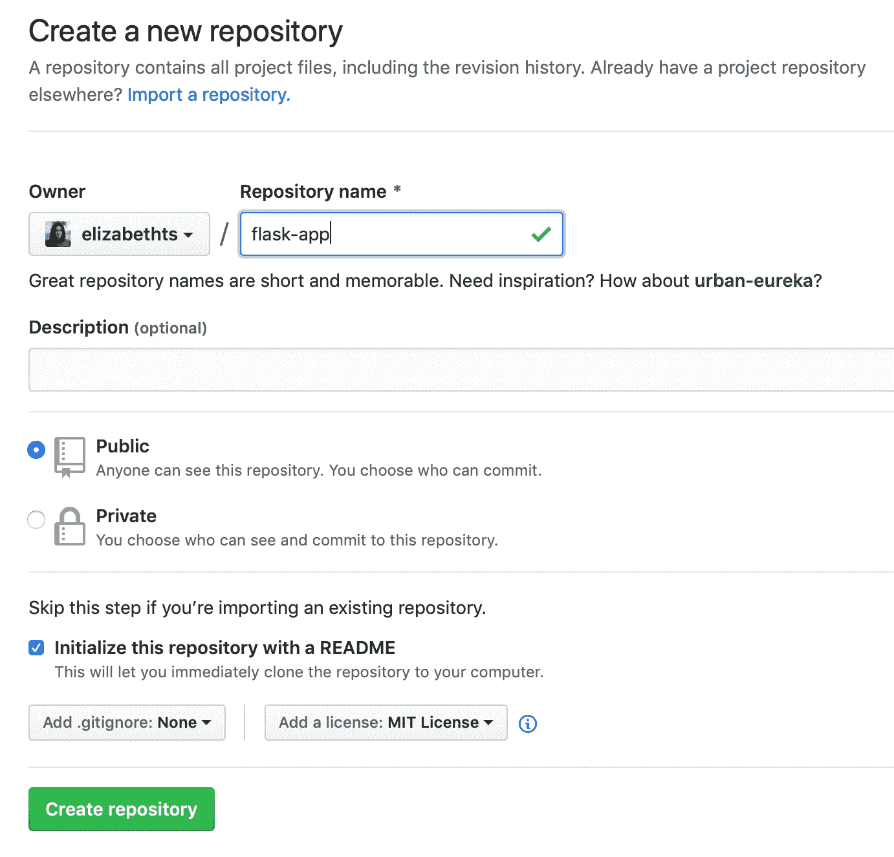

要克隆存储库，请转到存储库页面，单击“克隆或下载”并复制链接。在终端中，转到要克隆存储库的文件夹，并键入命令:

```
git clone link_to_repository
```

运行此命令会将存储库克隆到您的本地计算机上，您可以检查以确保文件夹是在正确的位置创建的。既然回购已经设置好了，我们就可以创建机器学习模型并对其进行处理了。

# 创建和筛选机器学习模型

首先，让我们使用 Titanic 数据集创建一个简单的逻辑回归模型。根据阶级、年龄、兄弟姐妹数量和票价等信息，该模型将预测是否有人在泰坦尼克号上幸存。如果你想了解我的例子，你可以在这里找到数据集[的 csv 文件。在您的工作目录中创建一个 Jupyter 笔记本，并通过运行以下代码创建模型:](https://github.com/elizabethts/deploy-mlm-flask-heroku/blob/master/titanic.csv)

```
import pandas as pd
from sklearn.linear_model import LogisticRegression# create df
train = pd.read_csv('titanic.csv') # change file path# drop null values
train.dropna(inplace=True)# features and target
target = 'Survived'
features = ['Pclass', 'Age', 'SibSp', 'Fare']# X matrix, y vector
X = train[features]
y = train[target]# model 
model = LogisticRegression()
model.fit(X, y)
model.score(X, y)
```

上面的代码从 csv 数据创建了一个 pandas dataframe，删除了空值，定义了模型的特征和目标，将数据拆分为一个只包含特征的矩阵和一个包含目标的向量，并拟合逻辑回归模型，然后对其进行评分。

这就创建了一个模型，它可以以大约 70%的准确率预测泰坦尼克号乘客的存活率，然后可以使用:

```
import pickle
pickle.dump(model, open(‘model.pkl’, ‘wb’))
```

pickle 文件可以在 Jupyter 笔记本的同一个目录中找到。

# 编写烧瓶应用程序

打开您的 IDE(我使用 PyCharm)并创建一个新的。工作目录中的 py 文件名为`app.py`

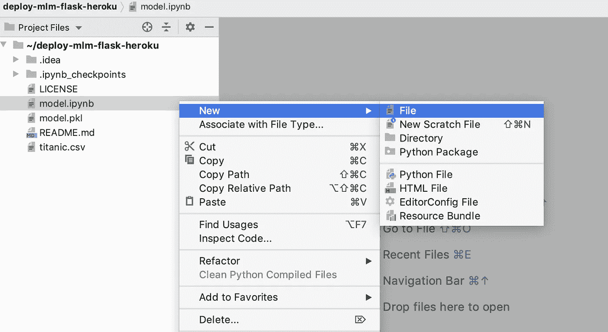

flask 应用程序的代码可以在下面找到(python v3.7 版)。

```
**import** pandas **as** pd
**from** flask **import** Flask, jsonify, request
**import** pickle

*# load model* model = pickle.load(open(**'model.pkl'**,**'rb'**))

*# app* app = Flask(__name__)

*# routes* @app.route(**'/'**, methods=[**'POST'**])

**def** predict():
    *# get data* data = request.get_json(force=**True**)

    *# convert data into dataframe* data.update((x, [y]) **for** x, y **in** data.items())
    data_df = pd.DataFrame.from_dict(data)

    *# predictions* result = model.predict(data_df)

    *# send back to browser* output = {**'results'**: int(result[0])}

    *# return data* **return** jsonify(results=output)

**if** __name__ == **'__main__'**:
    app.run(port = 5000, debug=**True**)
```

**代码的结构如下:**

*   **装载酸洗模型**
*   **命名烧瓶 app**
*   **创建一个接收 JSON 输入的路由，使用训练好的模型进行预测，并以 JSON 格式返回预测，可以通过 API 端点访问。**

在路由内部，我将 JSON 数据转换为 pandas dataframe 对象，因为我发现这适用于大多数(不是所有！)您希望用来进行预测的模型类型。您可以选择使用您喜欢的方法来转换输入，只要它与您的模型的`.predict()`方法一起工作。输入的顺序必须与用于训练模型的数据帧中的列顺序相匹配，否则在尝试进行预测时会出现错误。如果您正在接收的输入顺序不正确，您可以在创建数据帧后轻松地对其进行重新排序。

**这里的要点是，您需要将从请求中获得的 JSON 数据转换成模型可以用来进行预测的数据结构。如何到达那里取决于你自己。**

一旦将它粘贴到 app.py 文件中，您就可以从命令行运行 flask 应用程序(或者如果您使用 PyCharm，只需运行代码)。要从命令行运行应用程序，请使用:

```
python app.py
```

如果操作正确，您将看到类似这样的内容:

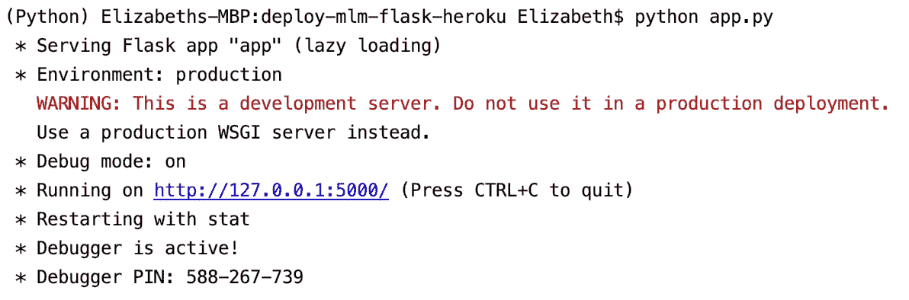

> 错误提示:如果这是您第一次创建 flask 应用程序，您可能会得到一个错误提示，提示您需要将 flask 安装到 python 环境中。使用`!pip install flask`并重试。

当你的 flask 应用程序启动并运行时，点击蓝色链接，你应该会看到这个——这很正常:

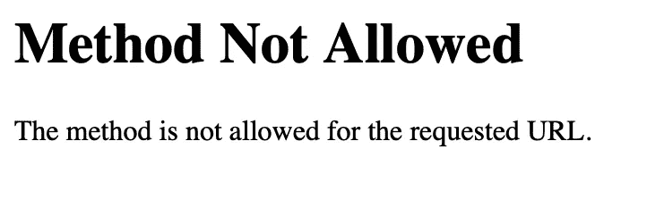

## 可选的，*但是你真的应该*:测试应用程序是否工作

将`requests`和`json`导入到你的 Jupyter 笔记本中，然后用你的本地服务器创建一个变量，如果它与下面的不同:

```
# local url
url = '[http://127.0.0.1:5000'](http://127.0.0.1:5000') # change to your url
```

创建示例数据并转换为 JSON:

```
# sample data
data = {'Pclass': 3
      , 'Age': 2
      , 'SibSp': 1
      , 'Fare': 50}data = json.dumps(data)
```

使用`requests.post(url, data)`发布样本数据并检查响应代码。您希望获得 200 的响应代码，以确保应用程序正常工作:

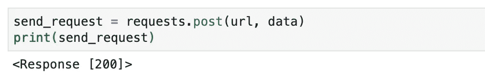

然后您可以打印请求的 JSON 来查看模型的预测:

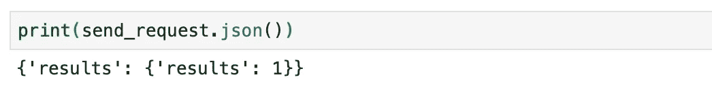

模型预测值为 1，这意味着乘客生还🙌

完成测试后，按 ctrl+c 关闭 flask 应用程序。

# 创建 Procfile

Procfile 指定了 Heroku 应用程序在启动时执行的命令。要创建一个，在工作目录中打开一个名为 Procfile(没有扩展名)的新文件，并粘贴以下内容。

```
web: gunicorn app:app
```

仅此而已。保存并关闭。✅

# 创建需求. txt

requirements.txt 文件将包含 flask 应用程序的所有依赖项。要创建 requirements.txt，请在终端的工作目录下运行以下命令:

```
pip freeze > requirements.txt
```

如果您不是在一个新的环境中工作，这个文件将包含您当前环境中的所有需求。如果您稍后在部署应用程序时遇到错误，您可以删除导致错误的需求。

对于这个项目，requirements.txt 至少应该包含:

```
**Flask**==**1.1.1
gunicorn**==**19.9.0
pandas**==**0.25.0
requests**==**2.22.0
scikit-learn**==**0.21.2
scipy**==**1.3.1**
```

## 可选项:将文件提交到 GitHub

运行以下命令将文件提交给 git:

```
# add all files from the working directory
git add .
```

然后提交您的信息:

```
git commit -m 'add flask files'
```

最后，使用下面的命令将更改推送到 Github。可能会要求您输入您的 github 用户名和密码。如果您设置了 2FA，您将需要您的密钥作为密码。

```
git push origin master
```

至少，您的 Github repo 现在应该包含:

*   app.py
*   model.pkl
*   Procfile
*   requirements.txt

**注意:所有这些文件都应该在工作目录级别，而不是在另一个文件夹中**

# 部署到 Heroku

如果您还没有，请在[www.heroku.com](https://www.heroku.com)创建一个免费账户。

只需选择名称并点击“创建应用”即可创建新应用。这个名称并不重要，但它必须是唯一的。

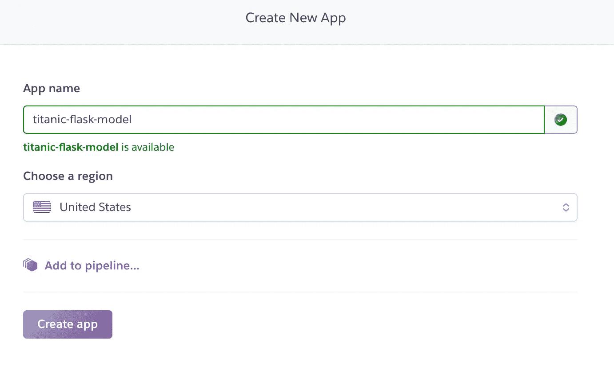

对于部署应用程序的方式，您有几个选项。我试过 Heroku CLI 和 GitHub，我个人更喜欢 GitHub…但是我会把两个都展示出来，所以挑一个你想看的。

## 使用 Github 部署

点击下面的 github 图标，连接您的 github 帐户:

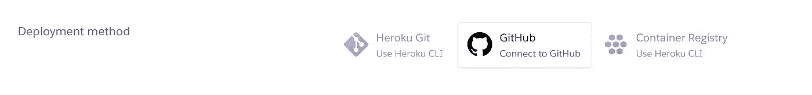

搜索正确的存储库，然后单击连接:

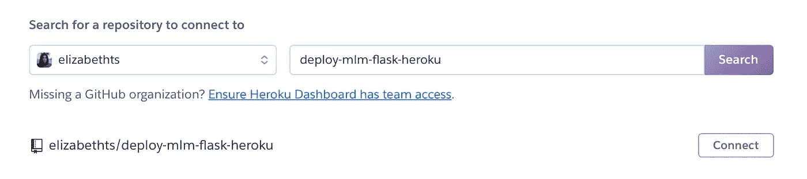

然后滚动到页面底部，单击“部署分支”

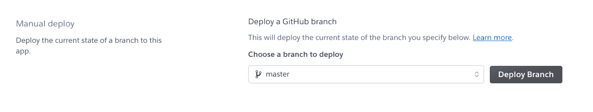

如果一切正常，您应该会看到这条消息🎉🎉

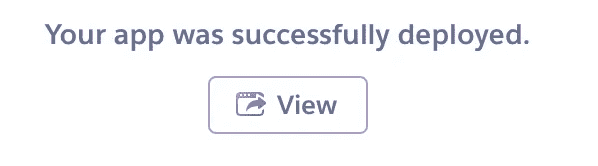

如果出现问题，请检查您的 requirements.txt，删除给你带来问题的依赖项，然后重试\_(ツ)_/

## 使用 Heroku CLI 部署

在 Heroku CLI 部分，您将看到部署时需要遵循的说明。将每个命令粘贴到您的终端中，并按照任何提示进行操作，如登录。注意任何需要修改的命令，比如`cd my-project/`——其中`my-project/`实际上应该是您的项目目录。git remote 应该准确地设置为 Heroku 中的应用程序名称。

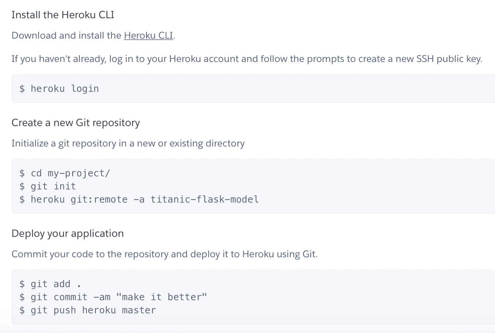

如果您成功地遵循了这些说明，您应该在 overview 页面上看到 build successful🎉🎉

如果没有，您可以通过从命令行运行`heroku logs --tail`来检查出了什么问题。

# 测试部署的模型并生成预测

如果你已经测试了你的 flask 应用程序，这些说明将会非常相似，除了现在使用 Heroku 应用程序的 url。

在你的 Jupyter 笔记本中导入`requests`和`json`，然后创建一个变量来存储 Heroku 应用的 url(你可以在 Heroku 上点击应用页面右上角的“打开应用”来找到这个)。然后创建一些示例数据，并将其转换为 JSON:

```
# heroku url
heroku_url = '[https://titanic-flask-model.herokuapp.com'](https://titanic-flask-model.herokuapp.com') # change to your app name# sample data
data = {  'Pclass': 3
             , 'Age': 2
             , 'SibSp': 1
             , 'Fare': 50}data = json.dumps(data)
```

使用以下代码检查响应代码。响应代码 200 表示一切运行正常。

```
send_request = requests.post(heroku_url, data)
print(send_request)
```

`Output: <Response [200]>`

最后，看看这个模型的预测:

```
print(send_request.json())
```

`Output: {‘results’: {‘results’: 1}}`

如果使用不同的样本数据，输出结果会有所不同。在这种情况下，结果为 1 意味着模型预测乘客幸存，更重要的是 API 起作用了！

现在，人们可以通过 Heroku URL 访问您的 API 端点，并使用您的模型在现实世界中进行预测🌐

这里是 [github repo](https://github.com/elizabethts/deploy-mlm-flask-heroku) ，包含部署这个 API 所需的所有文件和代码。

在 twitter [@elizabethets](http://www.twitter.com/elizabethets) 上找到我或者在 [LinkedIn](https://www.linkedin.com/in/elizabethts/) 上联系我！

来源:

[](https://flask.palletsprojects.com/en/1.1.x/) [## 欢迎使用 Flask - Flask 文档(1.1.x)

### 欢迎阅读 Flask 的文档。开始安装，然后了解快速入门概述。有…

flask.palletsprojects.com](https://flask.palletsprojects.com/en/1.1.x/) [](https://heroku.com/) [## 云应用平台| Heroku

### 无论您是在构建简单的原型还是关键业务产品，Heroku 的全托管平台都能为您提供…

heroku.com](https://heroku.com/) [](https://devcenter.heroku.com/articles/procfile) [## Procfile

### Heroku 应用程序包括一个 Procfile，它指定了应用程序在启动时执行的命令。你可以用一个…

devcenter.heroku.com](https://devcenter.heroku.com/articles/procfile)