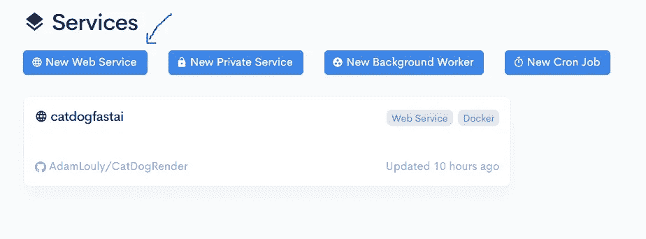

# 使用 fastai 创建和部署图像分类器，并在 15 分钟内渲染。

> 原文：<https://towardsdatascience.com/create-and-deploy-an-image-classifier-using-fastai-and-render-in-15-mins-947f9de42d21?source=collection_archive---------22----------------------->


当我刚开始学习机器学习和深度学习时，我花了很长时间来学习如何建立一个图像分类器，我参加了所有的机器学习课程，学习了 pandas，numpy 和 sklearn，然后我意识到，使用这些，我仍然不能创建一个图像分类器，所以我必须学习深度学习，CNN 和 keras 框架，所有这些只是为了创建一个正常的 CNN 图像分类器。

但现在在 2019 年，要创建一个图像分类器，你需要学习的只是 Fastai，用不到 6 行代码，你就可以创建一个随时可以部署的图像分类模型，击败 SOTA 论文的大多数结果。


**Fastai** 是第一个为视觉、文本、表格数据、时间序列和协同过滤等所有最常用的深度学习应用提供单一一致接口的深度学习库。

直到现在一切都好！我们现在可以使用 fastai 来构建一个图像分类器。

但是等等，模型会留在控制台吗？就像我总是需要用 jupyter 笔记本来预测新图像一样？
我如何将模型部署为可从 web 访问？

呈现有答案。


Render 是一个统一的平台，通过免费 SSL、全球 CDN、专用网络和 Git 自动部署来构建和运行您的所有应用和网站。

你需要做的就是将你的模型训练后保存下来，添加到 Render 提供的模板中，(可以从 github 克隆)，你的模型就部署好了。

例子:[https://catdogfastai.onrender.com/](https://catdogfastai.onrender.com/)

今天我将向你展示如何使用快速人工智能创建和训练一个模型来对猫和狗的图像进行分类，然后如何使用 render 将其部署在一个网站上。

我们开始吧！

首先，你必须准备一个数据集，从谷歌上获取一些猫和狗的图片，并把它们放在不同的文件夹中，给第一个命名为猫，第二个命名为狗。


现在让我们打开我们的 jupyter 笔记本，或者我们的 python 脚本，(随便什么让你的船漂浮)。

在开始编码之前，你首先要安装 PyTorch 和 fastai，

您可以使用以下方式安装它们:

```
if you are using anaconda:conda install -c pytorch pytorch-cpu torchvision
conda install -c fastai fastaiorpip install orpip install http://download.pytorch.org/whl/cpu/torch-1.0.0-cp36-cp36m-linux_x86_64.whl
pip install fastai
```

现在，在安装了所需的库之后，让我们开始吧。

首先我们要进口 fastai。

```
from fastai.vision import *
```

如果你是一名软件工程师，你可能会注意到我们从 fastai.vision 导入了* (all)，这违背了良好的软件工程实践。
完全正确，但在数据科学领域，当我们构建模型时，最重要的事情是尽可能快地与事物进行交互，当涉及到将模型投入生产时，您可以从母库导入您需要的任何东西。

酷！现在我们必须导入数据。

```
path="/images/"np.random.seed(42)data = ImageDataBunch.from_folder(path+'.', train=path+'.',valid_pct=0.2,ds_tfms=get_transforms(), size=224,num_workers=4).normalize(imagenet_stats)
```

我们使用 ImageDataBunch 类来导入图像。

这是 fastai 上最强的特性之一，这个类不需要任何配置就可以自动处理很多事情。

valid_pct 指应用交叉验证时，训练期间验证数据的百分比。

我们为所有图像分配了 244 的大小，以及 4 个 CPU 工作线程。

最后的归一化函数用于归一化所有图像，因为如果所有图像的平均值为 0，标准差为 1，则我们的深度学习模型可以很好地拟合。(不需要在这方面深入探讨)

现在让我们检查一下我们的班级:

```
data.classes
```

Out[5]: ['猫'，'狗']

太棒了，现在我们的数据被导入，类被分配(猫和狗)。

让我们检查一下我们的 dataBunch 对象。

```
data.show_batch(rows=3, figsize=(7, 8))
```


我们的数据似乎已正确导入。

现在让我们创建我们的模型。在本例中，我们将使用 Resnet34，它是一个残差神经网络。

残余神经网络是一种人工神经网络，其建立在从大脑皮层中的锥体细胞已知的构造上。残余神经网络通过利用跳过连接或跳过某些层的捷径来做到这一点。

ResNet 设法在图像分类中击败了许多论文的 SOTA 结果，所以在我们的问题中使用它已经足够好了。

如果你没有得到 ResNet 的东西，你也不用担心。

```
from fastai.metrics import error_rate
learn = cnn_learner(data, models.resnet34, metrics=error_rate,model_dir="/tmp/model/")
```

我们这样创建我们的学习器，cnn_learner，我们指定 error_rate 作为一个度量来计算准确度。

而且我们添加了 models.resnet34 作为架构，是 fastai 提供的。

如果是第一次使用这个架构，那么当你运行这个代码片段时，它就会被下载。

好了，现在我们创建了我们的模型。

让我们训练它！！

```
defaults.device = torch.device('cuda') *# makes sure the gpu is used*
learn.fit_one_cycle(4)
```


Training results

最后一个时期的错误率是 0.15，这意味着我们的模型成功地将 85%的图像正确分类，注意到数据集中的一些图像是黑色图像或随机噪声图像。

酷，实际上我对这种准确性很满意，如果你不满意，请添加一些纪元。

现在，让我们保存模型，以便稍后在 web 中部署它。

```
learn.save("model")
```

好了，现在我们已经完成了模型的训练和保存。

让我们现在部署它。

首先你要去:[https://github.com/render-examples/fastai-v3](https://github.com/render-examples/fastai-v3)
并从这个库生成一个新的库。

现在你必须在渲染中创建一个免费账户:【https://render.com/register

上传你保存在某处的模型，例如: [DropBox](https://www.dropbox.com/)

现在回到 github > server . py 中的存储库


用您的 url 更改文件 url，用文件名更改文件名。

另外，不要忘记把职业改成['猫'，'狗']，或者你有的任何职业。

在 github 中保存你的代码(你甚至不需要在你的 pc 中克隆它)

现在转到呈现[仪表板](https://dashboard.render.com/services)服务



单击新建 Web 服务

它会要求你授权给 github，授权之后，你所有的库列表就会出现。

点击你之前克隆的那个。


为您的应用程序添加一个名称，忽略付款部分，然后单击创建 Web 服务。

你要等待一段时间的应用程序被建立和部署，然后你可以从链接:yourappname.onrender.com 检查出来

这里有一个小演示:


# 结论

我们已经使用 fastai 制作了一个图像分类器，并使用 Render 进行了部署。那就像鞭子一样快。

如果您有任何问题、建议或批评，可以通过 Twitter 联系我:@ [loulyadam](https://twitter.com/LoulyAdam)

你可以在这里找到代码源:[https://github.com/AdamLouly/CatDogRender](https://github.com/AdamLouly/CatDogRender)

你可以在这个[链接](https://www.kaggle.com/adamlouly/fastaaiclassifier)找到这里的猫狗数据集。