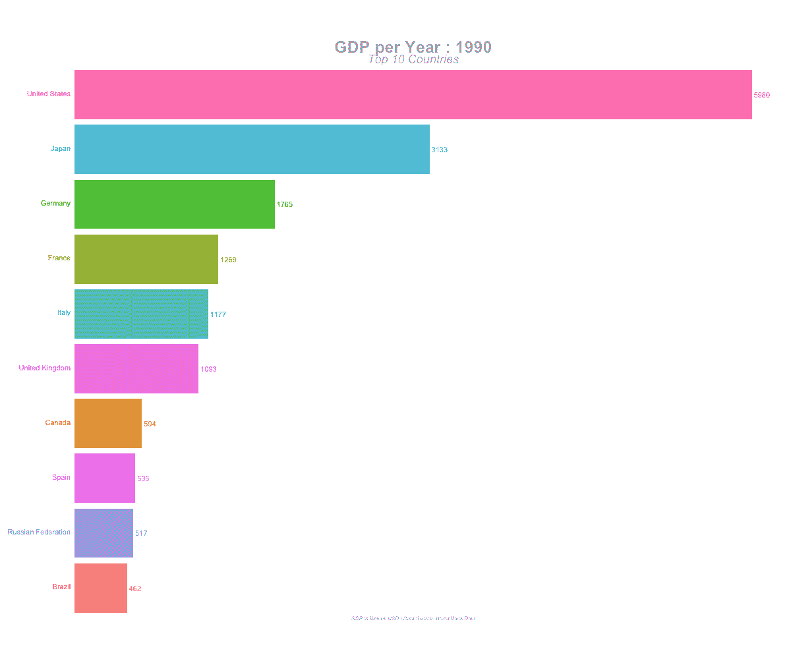

# 使用 R 创建趋势动画条形图

> 原文：<https://towardsdatascience.com/create-animated-bar-charts-using-r-31d09e5841da?source=collection_archive---------3----------------------->



最近，动画柱状图开始在社交媒体上疯传，让许多数据爱好者想知道这些动画柱状图是如何制作的。这篇文章的目的是解释如何使用 R-R 和多用途的软件包来构建这样一个动画条形图。

# [享受 78%的 DataCamp 折扣](https://datacamp.pxf.io/c/2888696/1240322/13294?u=https%3A%2F%2Fpromo.datacamp.com)


# 包装

在 R 中构建动画情节所需的包有:

*   ggplot2
*   [gganimate](https://gganimate.com/index.html)

虽然以上两个是基本的软件包，但我们也在这个项目中使用了整个`tidyverse`、`janitor`和`scales`来进行数据操作、清理和格式化。

# 数据

用于本项目的原始数据集是从[世界银行数据](https://databank.worldbank.org/data/reports.aspx?source=2&series=NY.GDP.MKTP.CD&country=#)下载的。相同的 csv 文件可以在[项目文件夹](https://github.com/amrrs/animated_bar_charts_in_R)中找到。

# 关于数据:

这个数据包含了大部分国家几年(尤其是 2000 年到 2017 年)的 GDP 值。

# 数据预处理:

我们将使用下面的代码以期望的格式准备我们的数据。实际上，我们正在清理列名，将数字转换成数字格式，并使用 tidyr 的`gather()`函数将数据从宽格式转换成长格式。整理后的数据保存到一个新的 csv 文件`gdp_tidy.csv`中，以备后用。

```
library(tidyverse)
library(janitor)gdp <- read_csv("./data/GDP_Data.csv")#select required columnsgdp <- gdp %>% select(3:15) #filter only country rowsgdp <- gdp[1:217,]gdp_tidy <- gdp %>% 
  mutate_at(vars(contains("YR")),as.numeric) %>% 
  gather(year,value,3:13) %>% 
  janitor::clean_names() %>% 
  mutate(year = as.numeric(stringr::str_sub(year,1,4)))write_csv(gdp_tidy,"./data/gdp_tidy.csv")
```

# 动画情节

动画情节构建过程包括两个主要部分:

*   使用 ggplot2 构建整套实际静态图
*   使用 gganimate 以所需参数激活静态图

这两个主要步骤之后的最后一步是以所需的文件格式渲染动画，如 GIF 或 MP4(视频)。

# 加载所需的库

```
library(tidyverse)
library(gganimate)
```

# 数据处理:

在这一步中，我们将过滤数据集，仅保留给定年份的前 10 个国家。我们还将创建几个列来帮助我们在绘图中显示标签。

```
gdp_tidy <- read_csv("./data/gdp_tidy.csv") gdp_formatted <- gdp_tidy %>%
  group_by(year) %>%
  # The * 1 makes it possible to have non-integer ranks while sliding
  mutate(rank = rank(-value),
         Value_rel = value/value[rank==1],
         Value_lbl = paste0(" ",round(value/1e9))) %>%
  group_by(country_name) %>% 
  filter(rank <=10) %>%
  ungroup()
```

# 构建静态图

现在我们的数据已经准备好绘制了，我们将构建所有需要的静态图。正如你可能已经在这篇文章顶部的动画中看到的，我们将看到在给定的数据集中，GDP 排名前 10 位的国家在过去几年中是如何变化的。为此，我们需要为每一年建造单独的地块。

```
staticplot = ggplot(gdp_formatted, aes(rank, group = country_name, 
                fill = as.factor(country_name), color = as.factor(country_name))) +
  geom_tile(aes(y = value/2,
                height = value,
                width = 0.9), alpha = 0.8, color = NA) +
  geom_text(aes(y = 0, label = paste(country_name, " ")), vjust = 0.2, hjust = 1) +
  geom_text(aes(y=value,label = Value_lbl, hjust=0)) +
  coord_flip(clip = "off", expand = FALSE) +
  scale_y_continuous(labels = scales::comma) +
  scale_x_reverse() +
  guides(color = FALSE, fill = FALSE) +
  theme(axis.line=element_blank(),
        axis.text.x=element_blank(),
        axis.text.y=element_blank(),
        axis.ticks=element_blank(),
        axis.title.x=element_blank(),
         axis.title.y=element_blank(),
        legend.position="none",
        panel.background=element_blank(),
        panel.border=element_blank(),
        panel.grid.major=element_blank(),
        panel.grid.minor=element_blank(),
        panel.grid.major.x = element_line( size=.1, color="grey" ),
        panel.grid.minor.x = element_line( size=.1, color="grey" ),
        plot.title=element_text(size=25, hjust=0.5, face="bold", colour="grey", vjust=-1),
        plot.subtitle=element_text(size=18, hjust=0.5, face="italic", color="grey"),
        plot.caption =element_text(size=8, hjust=0.5, face="italic", color="grey"),
        plot.background=element_blank(),
       plot.margin = margin(2,2, 2, 4, "cm"))
```

我们不会详细讨论如何构建静态图，因为这与使用`ggplot2`构建普通图非常相似。正如你在上面的代码中看到的,`theme()`函数有几个关键方面是为了让它与动画配合得更好，比如——只画了垂直的网格线，图例、轴标题和其他一些组件都从图中删除了。

# 动画

这里的关键功能是`transition_states()`，它在*年*前将各个静态图缝合在一起。`view_follow()`用于提供背景线(网格线)随着动画的进行而移动的视图。

```
anim = staticplot + transition_states(year, transition_length = 4, state_length = 1) +
  view_follow(fixed_x = TRUE)  +
  labs(title = 'GDP per Year : {closest_state}',  
       subtitle  =  "Top 10 Countries",
       caption  = "GDP in Billions USD | Data Source: World Bank Data")
```

# 翻译

随着动画被构建(准备好)并保存在对象`anim`中，是时候我们使用`animate()`函数渲染动画了。 `animate()`中使用的渲染器因所需输出文件的类型而异。

**对于 GIF 文件格式:**

```
# For GIFanimate(anim, 200, fps = 20,  width = 1200, height = 1000, 
        renderer = gifski_renderer("gganim.gif"))
```

**对于视频(MP4)文件格式:**

```
# For MP4animate(anim, 200, fps = 20,  width = 1200, height = 1000, 
        renderer = ffmpeg_renderer()) -> for_mp4anim_save("animation.mp4", animation = for_mp4 )
```

# 最终输出:

该项目的 GIF 输出:


# 总结:

因此，我们已经成功地构建了动画条形图，根据 GDP 值来可视化排名靠前的国家在几年内的变化情况。一旦数据预处理和数据操作步骤将输入数据重新整形为所需的格式，就可以很容易地根据您的目的修改这些代码。r 是任何形式的数据可视化的神奇工具，要了解更多[请查看这个](https://www.datacamp.com/courses/forecasting-in-r?irclickid=V0FwRdyHGxyIW7HRYNWRwwwzUkG3P3TqCXti2k0&irgwc=1&utm_medium=affiliate&utm_source=impact&utm_campaign=2888696)。这个完整的项目可以在 [my github](https://github.com/amrrs/animated_bar_charts_in_R) 上获得，你可以随意地使用它。

## [**免费注册接收我的数据科学简讯— AI**](https://nulldata.substack.com/)

***免责声明:*** *此处使用的代码是从本栈溢出问题* [*动画排序条形图各条互相超越*](https://stackoverflow.com/questions/53162821/animated-sorted-bar-chart-with-bars-overtaking-each-other) 的答案中长时间借用(可以说是启发、复制)