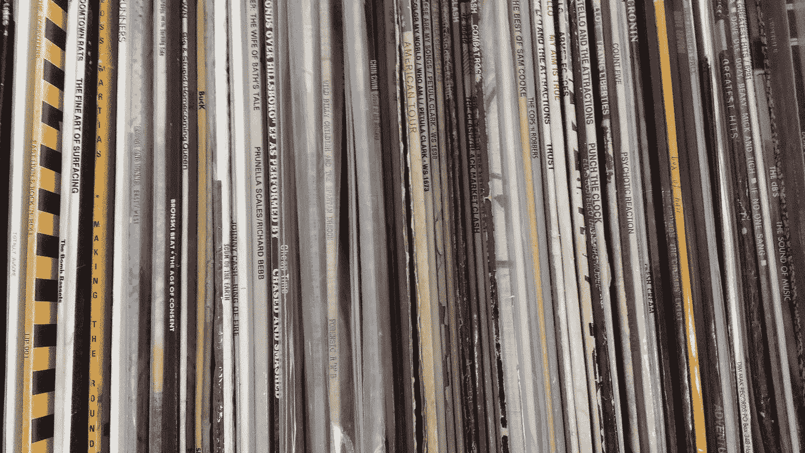
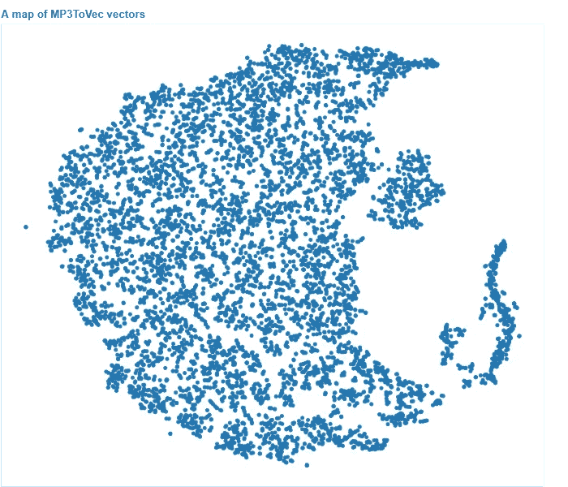

# 通过使用深度学习来听音乐，创建自动播放列表

> 原文：<https://towardsdatascience.com/create-automatic-playlists-by-using-deep-learning-to-listen-to-the-music-b72836c24ce2?source=collection_archive---------11----------------------->

## 走向组织音乐的连续方式

[Robert Dargavel Smith](mailto:teticio@gmail.com) —高级机器学习硕士项目结束( [MBIT 学校](http://mbitschool.academy)，西班牙马德里)

# 动机

周围有许多自动 DJ 工具，它们巧妙地将一首歌曲的速度与另一首歌曲的速度相匹配，并混合节拍。老实说，我一直觉得那种 DJ 很无聊:他们技术越好，听起来就越像一首没完没了的歌。在我看来，重要的不是你怎么玩，而是你玩什么游戏。这些年来，我收集了许多珍贵的唱片，并在电台和俱乐部做过一些 DJ。我几乎可以通过听一首歌几秒钟就判断出我是否会喜欢它。或者，如果正在播放一首歌曲，通常会立即想到一首与之相配的歌曲。我认为人工智能可以应用于这种“音乐直觉”，作为一种音乐推荐系统，只需简单地*听*一首歌(当然，还需要有广博的音乐知识)。

几年前，iPod 有一个非常酷的功能，叫做 *Genius* ，它可以根据几首示例歌曲即时创建一个播放列表。苹果决定移除这一功能(尽管它在 iTunes 中仍然可用)，大概是为了说服人们订阅他们的音乐流媒体服务。当然，Spotify 现在提供了这一功能，但就我个人而言，我发现它推荐的最好的是我已经知道的音乐，最差的是相当商业化和缺乏创意。我有一个很大的音乐库，我想念有一种简单的方式来说“继续播放这样的歌曲”(特别是当我开车的时候)，以及一些帮助我发现新音乐的东西，甚至是在我自己的收藏中。我花了一些时间寻找替代解决方案，但什么也没找到。

# 实施细节

一种常见的方法是使用音乐流派来对音乐进行分类，但我发现这种方法过于简单和局限。罗克珊是雷鬼、流行还是摇滚歌手？那么所有不断发展的电子音乐细分领域呢？我觉得有必要找到一种更高维度、更连续的音乐描述，并且不需要标记每个音轨(即无监督学习方法)。

我做的第一件事是从 Spotify 上收集尽可能多的播放列表。(不幸的是，在一个类似的[竞赛](https://labs.spotify.com/2018/05/30/introducing-the-million-playlist-dataset-and-recsys-challenge-2018/)已经结束后，我有了这个想法，在这个竞赛中，获得了一百万首歌曲的使用权。)这个想法是，按播放列表分组会给个别歌曲带来一些背景或意义——例如，“80 年代迪斯科音乐”或“我最喜欢的海滩歌曲”。人们倾向于制作相似艺术家的歌曲的播放列表，具有相似的情绪、风格、流派或用于特定的目的(例如，用于健身房的锻炼)。不幸的是，Spotify API 并没有让下载播放列表变得特别容易，所以方法相当粗糙:我搜索了所有名称中包含字母“a”、字母“b”的播放列表，以此类推，直到“Z”。通过这种方式，我设法获得了 240，000 个播放列表，其中包括 400 万首独特的歌曲。我故意排除了所有由 Spotify 策划的播放列表，因为它们特别商业化(我相信艺术家可以付费在其中播放)。

然后，我使用 Word2Vec 算法创建了这些歌曲的嵌入(“ [Track2Vec](https://github.com/teticio/Deej-A.I./blob/master/notebooks/Track2Vec.ipynb) ”)，将每首歌曲视为一个“单词”，将每个播放列表视为一个“句子”。(如果你能相信我，我也有同样的想法，独立于[这些家伙](https://spandan-madan.github.io/Spotify/)。)我发现 100 维是个不错的尺寸。给定一首特定的歌曲，该模型能够令人信服地推荐同一艺术家或类似艺术家，或同一时期和流派的 Spotify 歌曲。由于独特歌曲的数量巨大，我将“词汇”限制在那些出现在至少 10 个播放列表中的歌曲，给我留下了 450，000 首歌曲。

Spotify API 的一个优点是，它为大多数歌曲提供了一个 URL，允许您下载 30 秒的 MP3 样本。我下载了所有这些 MP3，并把它们转换成一个梅尔声谱图(Mel Spectrogram )( T9)——每首歌的一个紧凑表示，它应该反映了人耳对声音的反应。就像一个人可以通过听几秒钟的歌曲想到相关的音乐一样，我认为仅仅 5 秒钟的窗口就足以抓住一首歌的主旨。即使是这样有限的表示，所有光谱图的压缩大小达到了 4.5 千兆字节！

下一步是尝试使用从 Spotify 收集的信息从光谱图中提取特征，以便有意义地将它们相互联系起来。我训练了一个卷积神经网络，以尽可能接近地(在余弦近似下)再现与给定频谱图(输入 *x* )对应的 Track2Vec 向量(输出 *y* )。我尝试了[一维](https://github.com/teticio/Deej-A.I./blob/master/notebooks/Speccy_1D.ipynb)(在时间轴上)和[二维](https://github.com/teticio/Deej-A.I./blob/master/notebooks/Speccy_2D.ipynb)卷积网络，并将结果与基线模型进行了比较。基线模型试图在不实际听音乐的情况下得出最接近的 Track2Vec 向量。这导致了一首歌，理论上，每个人都应该喜欢(或讨厌)一点；-) ( [SBTRKT — Sanctuary](https://p.scdn.co/mp3-preview/5ac546c1bcbb1d0a6dbeced979dc95361ffc2530?cid=194086cb37be48ebb45b9ba4ce4c5936) )，余弦接近度为 0.52。在过度拟合之前，我能够从验证数据中获得的最好分数是 0.70。使用 300 维嵌入，验证分数更好，但基线分数也更好:我觉得基线分数更低、两者之间的差异更大更重要，这反映了更具多样性和辨别能力的潜在代表。当然，分数仍然很低，但期望一个声谱图可以捕捉到人类基于文化和历史因素分组在一起的歌曲之间的相似之处，这确实是不合理的。此外，一些歌曲在 5 秒钟的窗口中表现得相当糟糕(例如，在奎恩的“现在不要阻止我”的情况下，这一部分对应于布莱恩·梅的吉他独奏……)。我摆弄了一个[自动编码器](https://github.com/teticio/Deej-A.I./blob/master/notebooks/Speccy_AE.ipynb)和一个[可变自动编码器](https://github.com/teticio/Deej-A.I./blob/master/notebooks/Speccy_VAE.ipynb)，希望迫使光谱图的内部潜在表现更加连续、清晰，从而更有意义。最初的结果似乎表明，二维卷积网络更好地捕捉光谱图中包含的信息。我也考虑过训练一个暹罗网络来直接比较两个光谱图。我把这些想法留给将来可能的研究。

最后，通过一个 MP3 文件库，我将每个 MP3 映射到每 5 秒时间片的一系列 Track2Vec 向量。大多数歌曲从开始到结束变化很大，所以一首接一首的推荐到处都是。同样，我们可以应用 Doc2Vec 模型来比较类似的文档，我为每个 MP3 计算了一个“MP3ToVec”向量，包括根据其 *TF-IDF* (术语频率，逆文档频率)权重的每个组成 Track2Vec 向量。这种方案更加重视针对特定歌曲的频繁出现的*和*的推荐。由于这是一个 *O* ( *n* )算法，所以有必要将 MP3 库分成 100 个一批(否则我的 8000 个 MP3 将需要 10 天来处理！).我检查了一下，这对计算出的向量的影响可以忽略不计。

# 结果

您可以在本[练习册](https://github.com/teticio/Deej-A.I./blob/master/notebooks/Deej-A.I.ipynb)的末尾看到一些结果，并自行判断。它特别擅长识别古典音乐、口语词、嘻哈和电子音乐。事实上，我对它工作得如此之好感到惊讶，以至于我开始想知道有多少是由于 TF-IDF 算法，有多少是由于神经网络。所以我创建了另一个基线模型，使用随机初始化权重的神经网络将光谱图映射到向量。我发现这种基线模型擅长识别流派和结构相似的歌曲，但是，当有疑问时，会提出一些完全不合适的东西。在这些情况下，经过训练的神经网络似乎会选择具有类似能量、情绪或仪器的东西。在许多方面，这正是我所寻找的:一种超越僵化的流派界限的创造性方法。为了 TF-IDF 算法的目的，通过摆弄确定两个向量是否相同的*ε*参数，有可能在流派(全局)和“感觉”(局部)特征之间找到良好的折衷。我还将结果与 Genius 在 iTunes 中生成的播放列表进行了比较，尽管这非常主观，但我觉得 Genius 坚持了流派，即使歌曲不太搭配，也不会做出那么“有灵感”的选择。也许大众来源的“可口可乐”测试需要成为最终的裁判。

当然，考虑到数据、计算能力和时间的限制，我认为结果可以作为概念的证明。

# 应用程序

除了自动(相对于俱乐部电台)DJ 的最初想法，你还可以做其他一些有趣的事情。例如，由于矢量映射是连续的，您可以轻松地创建一个播放列表，它平滑地“[连接一首歌曲和另一首歌曲之间的点](https://github.com/teticio/Deej-A.I./blob/master/notebooks/Join_the_dots.ipynb)，通过您喜欢的任意多个路径点。例如，你可以通过放克和鼓贝斯从[灵魂乐转到 techno。或者从摇滚到歌剧:-)。](https://soundcloud.com/teticio/mix-automatically-created-with-artificial-intelligence-deej-ai)

另一个简单的想法是使用麦克风听音乐，并提出一组下一首歌曲来即时播放。与其与整个 MP3 音乐进行比较，不如只考虑每首歌的开头，这样音乐从一个音轨到另一个音轨会更自然。

# 你自己试试吧

将 [*git* 库](https://github.com/teticio/Deej-A.I.)克隆或下载到您的计算机上。安装了所需的 python 包后

并且[下载](https://drive.google.com/file/d/1LM1WW1GCGKeFD1AAHS8ijNwahqH4r4xV/view?usp=sharing)模型权重到你有 python 文件的目录，你可以处理你的 MP3(和 m4a)库。只需运行以下命令并等待…

它将创建一个名为“Pickles”的目录，并在子目录“mp3tovecs”中创建一个名为“mp3tovec.p”的文件。完成后，您可以使用

然后在浏览器中进入 [http://localhost:8050](http://localhost:8050) 。如果加上参数`--demo 5`，就不用等到每首歌结束了。只需加载您希望播放列表所基于的 MP3 或 M4A；不一定非得是你音乐库里的一首。最后，有几个控件你可以摆弄(因为它是目前的编程，这些只有在下一首歌曲已经在播放时才生效)。“Keep on”决定了在生成播放列表时要考虑的先前曲目的数量，而“ducked”指定了要在混音中加入多少随机性。或者，您可以使用创建一个您选择的音乐之旅的 MP3 混音

其中“tracks.txt”是包含 MP3 或 M4A 文件列表的文本文件，这里，9 是您想要在每个文件之间生成的附加轨道的数量。

如果你对我用来训练神经网络的数据感兴趣，请随时给我发[邮件](mailto:teticio@gmail.com)。

 [## teticio/Deej-A.I

### 只需*听*音乐即可创建自动播放列表。

github.com](https://github.com/teticio/Deej-A.I.) 

*最初发表于*[T5【http://github.com】](https://gist.github.com/teticio/1d0f366b5f7fd82c06d8c01d7983f1e0)*。*