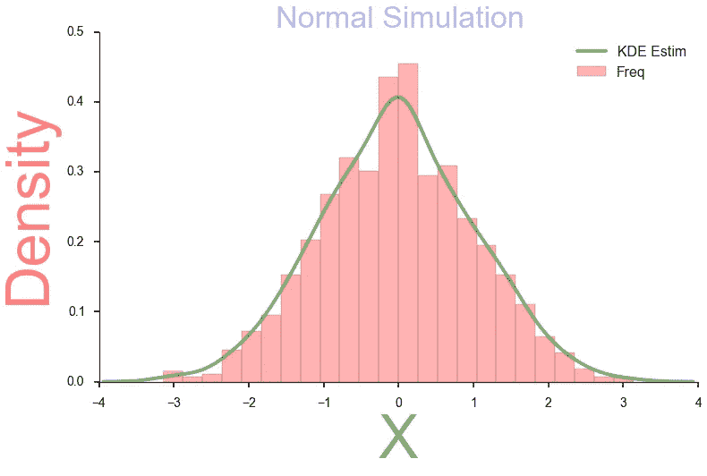

# 使用 SeaBorn 创建基本的图形可视化

> 原文：<https://towardsdatascience.com/create-basic-graph-visualizations-with-seaborn-18f622012a5a?source=collection_archive---------14----------------------->

## 基本但强大而美丽的图形


Photo by [Isaac Smith](https://unsplash.com/@isaacmsmith?utm_source=medium&utm_medium=referral) on [Unsplash](https://unsplash.com?utm_source=medium&utm_medium=referral)

说到数据准备和熟悉数据，我们通常跳过的**一步是数据可视化**。

虽然一部分原因可能是因为**缺乏适用于我们使用的平台的良好可视化工具**，但我们大多数人有时也会**变得懒惰**。

对于我们大多数的绘图需求，我会阅读博客，使用 StackOverflow 解决方案，并在每次需要绘制简单图形时与 Matplotlib 文档讨价还价。

这让我想到了一篇用 Python 创建通用图形类型的**博文。**

但是作为一个拖延者，我总是把它推到我的脑后。

帮助我在 Python 中追求数据可视化需求的一件事是密歇根大学的这门关于[数据可视化和应用绘图](https://www.coursera.org/specializations/data-science-python?ranMID=40328&ranEAID=lVarvwc5BD0&ranSiteID=lVarvwc5BD0-SAQTYQNKSERwaOgd07RrHg&siteID=lVarvwc5BD0-SAQTYQNKSERwaOgd07RrHg&utm_content=3&utm_medium=partners&utm_source=linkshare&utm_campaign=lVarvwc5BD0)的课程，它是 Python 本身的一个很好的[数据科学专业的一部分。强烈推荐。](https://www.coursera.org/specializations/data-science-python?ranMID=40328&ranEAID=lVarvwc5BD0&ranSiteID=lVarvwc5BD0-SAQTYQNKSERwaOgd07RrHg&siteID=lVarvwc5BD0-SAQTYQNKSERwaOgd07RrHg&utm_content=3&utm_medium=partners&utm_source=linkshare&utm_campaign=lVarvwc5BD0)

所以我最终写这篇博文的基本目的是创建一个代码库，为我提供可以直接用于分析的现成代码。

没错。所以现在开始。

首先导入我们将需要使用的库。

```
import matplotlib.pyplot as plt #sets up plotting under plt 
import seaborn as sns #sets up styles and gives us more plotting options 
import pandas as pd #lets us handle data as dataframes
```

我们将使用包含以下信息的**提示数据**。

```
tips = sns.load_dataset("tips")
tips.head()
```


# 带回归线的散点图

现在让我们将这些数据可视化。我们将在 seaborn 中使用 [**regplot**](http://stanford.edu/~mwaskom/software/seaborn/generated/seaborn.regplot.html#seaborn.regplot) 选项。


这需要一点代码，但我觉得它比 Matplotlib 或 ggPlot2 渲染的要好得多。我们在没有太多代码的情况下进行了大量定制。

但这并不是真正让我喜欢 Seaborn 的原因。

真正引起我注意的绘图类型是`lmplot`，它允许我们在**分面**模式中使用 **regplot** 。


[](http://stanford.edu/~mwaskom/software/seaborn/tutorial/color_palettes.html#building-color-palettes-with-color-palette)**:
你可以使用 **color_palette()** 函数构建自己的调色板。color_palette()将接受任何 **seaborn palette** 或[**matplotlib colormap**](http://matplotlib.org/users/colormaps.html)的名称(jet 除外，你千万不要用它)。它还可以接受以任何有效 matplotlib 格式指定的颜色列表(RGB 元组、**十六进制颜色代码**或 HTML 颜色名称)。返回值总是 RGB 元组的列表。这允许您在图形中使用自己的调色板。**

# **条形图**

****

# **直方图和分布图**

**它们构成了我工作流程的另一部分。让我们使用 seaborn 绘制正态直方图。为此，我们将使用函数。这个函数结合了 matplotlib hist 函数(自动计算一个好的默认 bin 大小)和 seaborn kdeplot()函数。它还可以拟合 **scipy.stats** 分布，并绘制数据的估计 PDF。**

********

# **配对图**

**你需要看到变量之间是如何变化的。数据集中变量的分布是怎样的？这是与函数一起使用的图表。非常有帮助，使用它是一种乐趣。在这个例子中，我们将使用**虹膜数据集**。**

```
iris = sns.load_dataset("iris")
iris.head()
```

********

**希望这篇文章对你有用，值得你花时间。你可以在 [github](https://github.com/MLWhiz/visualization/blob/master/Graphs.ipynb) 找到 iPython 笔记本**

**我试图让这尽可能简单，但你可能总是**问我**或查看文档中的疑问。**

**如果你有更多关于如何使用 Seaborn 的想法，请在**评论**部分提出建议。**

**随着我开始使用更多的可视化工具，并遇到其他像 seaborn 一样好的库，我肯定会尝试添加到这篇文章中。**

**另外，由于这是我的第一个可视化帖子，我想从密歇根大学调用一个关于[数据可视化和应用绘图](https://www.coursera.org/specializations/data-science-python?ranMID=40328&ranEAID=lVarvwc5BD0&ranSiteID=lVarvwc5BD0-SAQTYQNKSERwaOgd07RrHg&siteID=lVarvwc5BD0-SAQTYQNKSERwaOgd07RrHg&utm_content=3&utm_medium=partners&utm_source=linkshare&utm_campaign=lVarvwc5BD0)的好课程，这是一个很好的[数据科学专业的一部分，Python](https://www.coursera.org/specializations/data-science-python?ranMID=40328&ranEAID=lVarvwc5BD0&ranSiteID=lVarvwc5BD0-SAQTYQNKSERwaOgd07RrHg&siteID=lVarvwc5BD0-SAQTYQNKSERwaOgd07RrHg&utm_content=3&utm_medium=partners&utm_source=linkshare&utm_campaign=lVarvwc5BD0) 本身也不错。一定要去看看。**

**【https://mlwhiz.com】原载于[](https://mlwhiz.com/blog/2015/09/13/seaborn_visualizations/)**