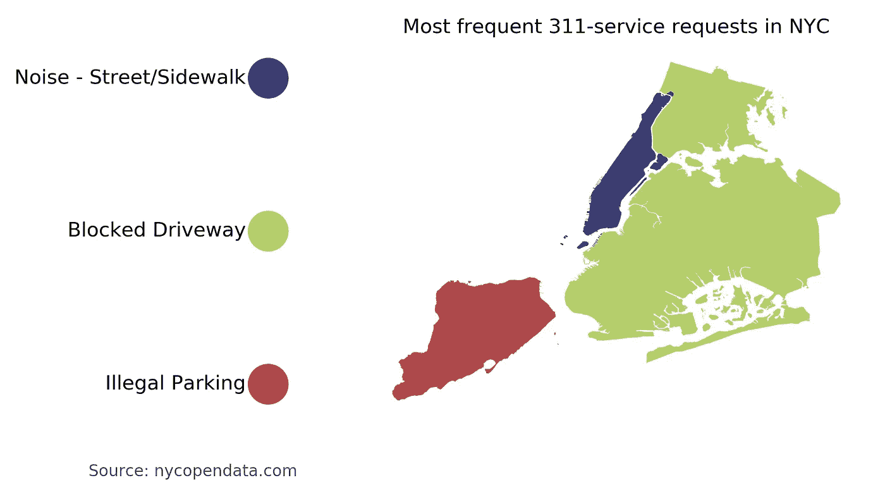
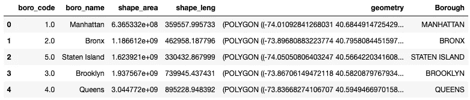
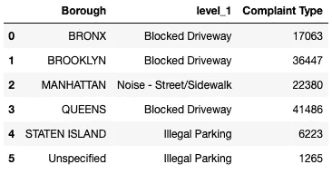
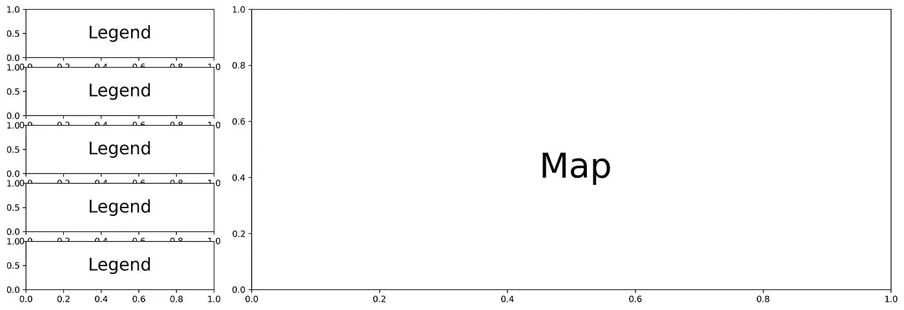
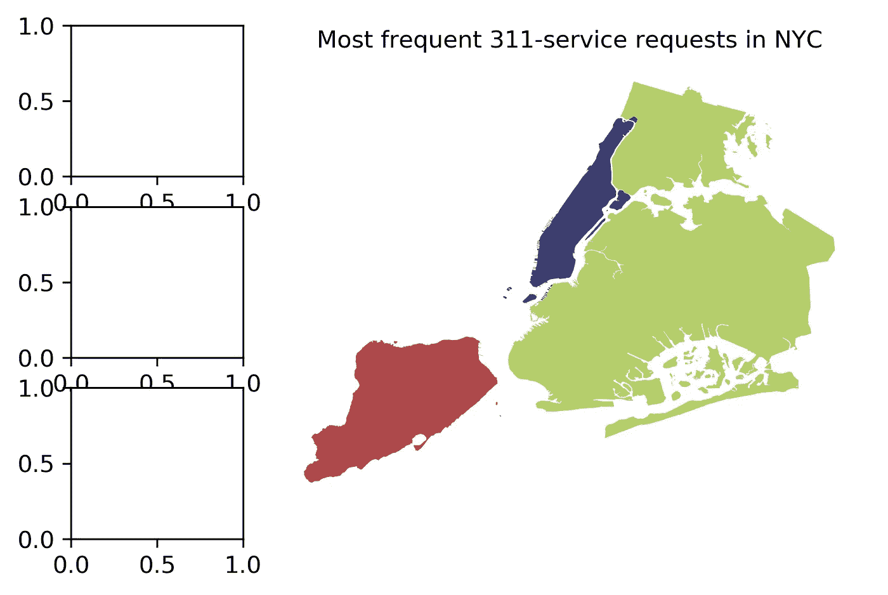
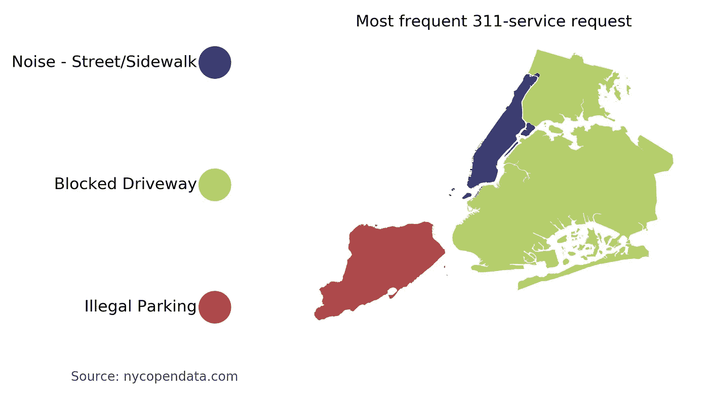

# 根据分类数据创建 Python 地图

> 原文：<https://towardsdatascience.com/create-categorical-choropleth-with-python-122da5ae6764?source=collection_archive---------15----------------------->

有很多关于使用 Python 构建地理地图的好帖子，比如[这个](/lets-make-a-map-using-geopandas-pandas-and-matplotlib-to-make-a-chloropleth-map-dddc31c1983d)。然而，所有这些帖子都使用 choropleths 作为连续数据，这意味着使用带有颜色条的渐变来填充地图。由于我找不到很多关于如何使用分类信息构建地图的信息，所以我决定尝试自己构建一些东西，结果是这样的:

Map from categorical data, built with Python.

## 要求

为了构建此地图，您需要以下库:

*   Pandas 和 NumPy(使用数据框)
*   Geopandas(使用 shapefiles)
*   Matplotlib(绘制图表)

# 准备数据

## 获取数据

创建 geopandas 地图时，您总是需要两个文件。

第一个文件是 shapefile，它包含多边形以构建一个带有边界的空地图。你可以在网上找到无数不同地区和边界的 shapefiles。对于这个项目，我使用了一个以行政区为边界的纽约市形状文件。

`fp = ‘geo_export_58b25928–032c-45c8-a41f-8345f112f4d4.shp’
map_df = gpd.read_file(fp)`

The shapefile data.

数据导入后，您就可以预览地图的外观，而无需用数据填充地图。

`map_df.plot()`

A plot of the NYC shapefile.

现在让我们用我们的数据对不同的行政区进行颜色编码。

第二个文件是实际数据，即包含用于填充地图的值。在这种情况下，我在纽约市使用了包含 364.558 **311 服务请求**的[文件。](https://www.kaggle.com/sherinclaudia/nyc311-2010)

`df = pd.read_csv(‘NY_311_requests.csv’)`

在这个文件中，每行代表一个请求(或投诉)。然而，我想看看各区最受欢迎的投诉类型。通过使用 **groupby** 我可以创建这个概览:

`df_top_compl = df.groupby(‘Borough’)[‘Complaint Type’].apply(lambda x: x.value_counts().head(1)).reset_index()`

Most frequent complaint by borough

## 合并数据

现在我们有了两个文件，我们可以将它们合并在一起，这样我们就有了地理数据和填充数据(投诉)的组合。由于两个数据框架都包含行政区，我们可以基于该列进行合并。然而，在数据文件中，行政区是用大写的**写成的**，所以我们也需要将它应用到 shapefile。

`map_df[‘Borough’] = map_df[‘boro_name’].apply(lambda x: x.upper())`

现在，两个文件都有一列具有相似的值，我们可以在该列上合并它们。(为了防止 shapefile 中的行政区没有匹配的填充数据，我还添加了一个 fillna()值。)

`data_df = pd.merge(map_df, df_top_compl, how=’left’, on=’Borough’)
data_df[‘level_1’].fillna(value=’No data’, inplace=True)`

现在所有的数据都准备好了，我们可以创建地图了！

# 创建地图

## 准备颜色

在我们创建实际的地图之前，我们将为图例做一些准备。鉴于代码应该是动态的，以防数据发生变化，我们不能使用固定数量的图例颜色。所以我们要做的是用调色板中相应的颜色创建一个填充值的字典(在这个例子中是 **matplotlib tab20b** )，除了' *No data* '值，按照惯例它应该总是灰色的。

`keys = list(data_df[‘level_1’].unique())
color_range = list(np.linspace(0, 1, len(keys), endpoint=False))
colors = [cm.tab20b(x) for x in color_range]
color_dict = dict(zip(keys, colors))
color_dict[‘No data’] = ‘lightgray’`

## 准备网格

由于我们需要绘制图例和地图，我们将把图形分成两列；**左为图例**，**右为地图**。图例的左列必须再次按行拆分:每个值和相应的颜色一行。但是，由于项目应该是动态的，我们不能使用固定的行数，它应该适应填充值的数量。使用下面的代码，我们可以根据唯一填充值的数量创建一个轴列表**。**

`row_count = data_df[‘level_1’].nunique()
ax_list = []
for i in range(row_count+1):
ax_list.append(‘ax’ + str(i+1))
ax_string = ‘, ‘.join(ax_list)`

基于该字符串和轴名称列表，我们可以创建具有 4 列和 N 行的**plot grid**。

`fig, (ax_string) = plt.subplots(row_count, 4)`

在这 4 列中，我们将第一列用于图例，另外 3 列用于实际绘图(使用 colspan)。

例如，如果我们有 5 行(要绘制的唯一值)，网格将如下所示:

Subplotgrid mockup.

## 绘制地图

这就是“传统”的连续数据图谱的不同之处。我们将使用一个循环来堆叠不同的地图，而不是绘制一个地图，以创建最终的结果。每个图层由一个区组成，每个区的颜色对应于它的值，使用我们之前构建的颜色字典。

`ax1 = plt.subplot2grid((row_count,4),(0,1), rowspan=row_count, colspan=3)
for index, row in data_df.iterrows():
plot = data_df[data_df[‘boro_code’] == row[‘boro_code’]].plot(color=color_dict[row[‘level_1’]], ax=ax1)
ax1.axis(‘off’)`

Map without legend.

地图看起来很棒，但是没有相应的图例显然是没用的。所以让我们把那部分也加上。

## 绘制图例

现在让我们在左栏添加一个图例。由于我们使用图层构建了地图，因此我们还需要以一种不太传统的方式构建图例。网格已经完成，包含了我们将要绘制的每个图例值的一行。现在在每一行将放一个彩色圆圈(使用一个小饼图)和一个字符串与相应的值。

`row_counter = 0
for i in data_df[‘level_1’].unique():
plt.subplot2grid((row_count,4),(row_counter,0))
plt.pie([1],labels=[i],radius=0.4, colors=[color_dict[i]])
plt.axis(‘off’)
row_counter += 1`

Final result.

在那里！带有分类数据和相应图例的精美地图。如果数据发生了变化，您可以简单地重新运行脚本，图例中的颜色和值的数量都会很好地适应。

当然，你可以把它应用到你能找到的任何 shapefile 和数据上，只要你能合并这两个文件。

你可以在我的 [GitHub](https://github.com/ZhongTr0n/categorical_choropleth) 上查看并下载我的 Jupyter 笔记本。如果有不清楚的地方，请随时提问。

最后，我要感谢[本杰明·库利](https://medium.com/u/37240f6b6698?source=post_page-----122da5ae6764--------------------------------)，他的[帖子](/lets-make-a-map-using-geopandas-pandas-and-matplotlib-to-make-a-chloropleth-map-dddc31c1983d)给了我创作这个附加内容的灵感。

由于这是我在 Medium 上的第一篇帖子，任何评论或反馈都将受到极大的感谢。

*关于我:我叫布鲁诺，是总部位于荷兰的人工智能技术纵向扩展公司*[*dash mote*](http://www.dashmote.com)*的数据科学家。我们的目标是借助基于人工智能的解决方案，弥合图像和数据之间的鸿沟。
查看我在* [上的其他作品 https://www.zhongtron.me](https://www.zhongtron.me) 。