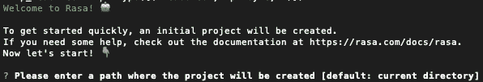
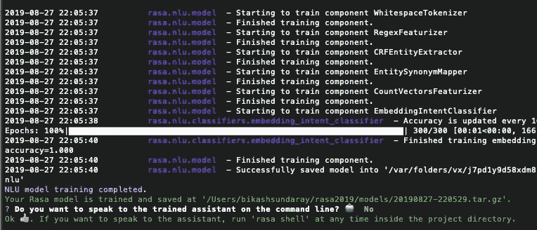
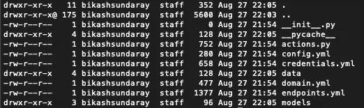
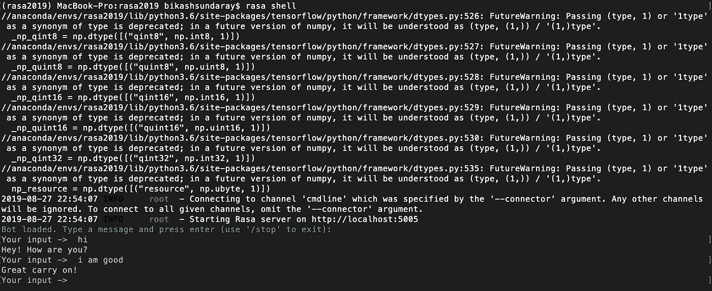
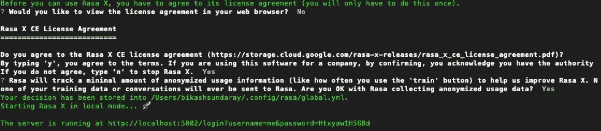
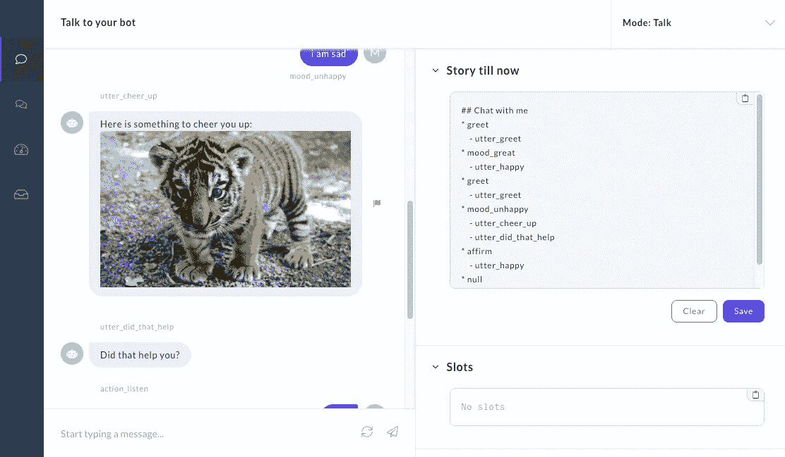
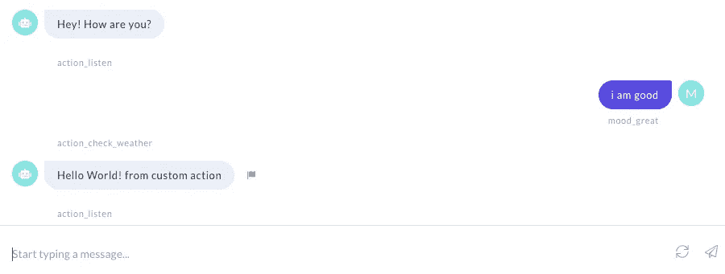

# 使用 Rasa Part-1 创建聊天机器人

> 原文：<https://towardsdatascience.com/create-chatbot-using-rasa-part-1-67f68e89ddad?source=collection_archive---------1----------------------->

## [**现实世界中的数据科学**](https://medium.com/towards-data-science/data-science-in-the-real-world/home)

## 安装并运行你的第一个 Rasa 机器人。了解 Rasa 框架。

**Rasa** 是一个开源的机器学习框架，用于构建 [AI 助手和聊天机器人](http://blog.rasa.com/level-3-contextual-assistants-beyond-answering-simple-questions/)。大多数情况下，在 Rasa 中工作不需要任何编程语言经验。虽然有一个叫做“**Rasa**Action Server 的东西，你需要在那里用 Python 写代码，它主要用来触发外部动作，比如调用 Google API 或 REST API 等。


rasa.com

Rasa 有两个主要模块:

1.  **拉莎·NLU**用于理解用户信息
2.  用于进行对话和决定下一步行动的 Rasa 核心

注意——现在 Rasa NLU 和 Rasa 核心源代码合并在一起。

Rasa X 是一个帮助你构建、改进和部署由 Rasa 框架支持的人工智能助手的工具。Rasa X 包括一个用户界面和一个 REST API。Rasa X 是 Rasa 的最新版本。

关于我:我是 Rasa 官方贡献者。

# Rasa 组件

**Rasa X** —这是一个基于浏览器的 GUI 工具，它将允许您通过使用基于 GUI 的交互模式来训练机器学习模型。请记住，它是 Rasa 软件堆栈中的可选工具。有时，rasa 会从您的浏览器向 Rasa 发送使用统计信息— *，但它不会向您的系统外部发送训练数据*，*，它只会发送您使用 Rasa X Train 的次数。*

**Rasa NLU** —这是 Rasa 试图理解用户消息的地方，以检测您消息中的**意图**和**实体**。Rasa NLU 有不同的组件来识别意图和实体，其中大多数都有一些额外的依赖关系。

1.  Spacy(需要单独安装)
2.  Tensorflow(默认情况下可用于 Rasa)

**Rasa Core** —这是 Rasa 尝试帮助您处理上下文消息流的地方。基于用户消息，它可以预测对话作为回复，并可以触发 Rasa 动作服务器。

Rasa 内部使用 Tensorflow，无论何时您执行“ **pip install rasa** ”或“ **pip install rasa-x** ”操作，默认情况下它都会安装 Tensorflow。

# 安装 Rasa

Ubuntu 16+，Mac OS 和 Windows 10 (Visual C++构建工具)

**注意:**如果您使用的是 windows，请确保您已经安装了 Visual c++构建工具。这是一些 python 包所必需的。一定要使用 miniconda 来避免系统中其他已安装的 Python 包或冲突的 Python 版本的问题。

在你的操作系统中安装 MiniConda(Anaconda 的一部分)

 [## Miniconda - Conda 文档

### 安装程序有两种变体:Miniconda 是基于 Python 2 的，Miniconda3 是基于 Python 3 的。请注意…

conda.io](https://conda.io/miniconda.html) 

安装 miniconda 后，按照下面的命令在 conda 中创建一个虚拟环境。这将允许您无错误地运行 Rasa。

```
conda install python=3.6
conda create -n rasa python=3.6
source activate rasa
pip install rasa-x --extra-index-url [https://pypi.rasa.com/simple](https://pypi.rasa.com/simple)
```

按照上面的命令，Rasa 和 Rasa X 都将安装在您的系统中。

# 在 Rasa 中创建新项目

打开终端，激活康达虚拟环境。现在转到一个目录并执行“ **rasa init** ”，它将在该位置创建一个 rasa 项目。“rasa x”将启动 Rasa X 应用程序

```
source activate rasa
rasa init
```



“ **rasa init** ”应该显示上面的消息，以防您做得很好，并且您的系统不包含任何错误。跟随交互式会话并继续按回车键到达最后一步。最后，它应该显示这条消息。



如果您在终端中执行“ **ls -la** ”，您可以看到 Rasa 创建的文件列表。现在做“rasa x”来启动 rasa。

# Rasa 配置

让我解释一下文件，它是作为 Rasa 的初始项目结构创建的。

一个空文件，帮助 python 找到你的动作

`actions.py`自定义操作的代码。如果您希望 Rasa 通过 REST API 或 API 调用来调用外部服务器，您可以在这里定义您的自定义操作。请记住，您可以为 Rasa 自定义操作创建多个 Python 脚本。

`config.yml` '* '配置你的 NLU 和核心车型。如果你正在处理 Tensorflow 或 Spacy，你需要在这里定义这样的管道。要处理这个文件，你要表现出对机器学习和深度学习的了解。

`credentials.yml`连接其他服务的详细信息。如果你想在 Facebook Messenger 上构建 Bot，微软 Bot 框架，你可以在这里维护这样的凭证和令牌。所以基本上你只需要添加脸书、slack 和 Bot 框架相关的配置，rasa 会自动为你做 rest。请记住，您需要通过 https 域托管 Rasa。在开发过程中，您可以使用 **ngrok** 作为测试工具。

`data/nlu.md`‘*’你的 NLU 训练数据。您可以在这里定义意图。比如订披萨或者预定优步。你需要为此添加相关的句子。请记住，如果您正在使用 Rasa-X，您的培训意图和数据将会自动添加。

`data/stories.md` '* '你的故事。这是 Rasa 核心所必需的。有一种叫做“Rasa 中的对话流”的东西，其中 Rasa Core 控制着你和 chatbot 之间的对话流，因此对于这种流，你需要使用这些故事来训练 chatbot。因此，如果你想让你的聊天机器人在不同的背景(故事)下非常完美，你可以在这里添加这些故事。

`domain.yml` '* '您的助手的域。这个文件结合了聊天机器人可以检测到的不同意图和机器人回复列表。请记住，您可以在这里定义您的自定义操作服务器 python 方法名称(下划线格式)，以便 Rasa 为您调用该 Python 方法。

`endpoints.yml`连接到 FB messenger 等频道的详细信息。这主要用于生产设置。您可以像 Redis 一样配置您的数据库，以便 Rasa 可以存储跟踪信息。

`models/<timestamp>.tar.gz`您的初始模型

# 玩示例聊天机器人

Rasa 用默认数据为您创建了一个示例机器人。所以现在您可以从 Shell/Terminal 开始使用它。首先，让我们从终端测试您的聊天机器人(记住要在终端中进行)

```
rasa shell
```



你可以输入“hi ”,在机器人的回复中，你会收到一些回应。

# 如何使用 Rasa-X

这是 Rasa 堆栈的最新成员。您可以使用 Rasa-X 在浏览器上尝试您的聊天机器人。可以下载训练数据。此外，您可以通过指导您的机器人来纠正您的训练数据。

```
rasa x
```

它将询问许可协议，您可以说“y”并继续。



在浏览器上打开此链接—[http://localhost:5002/talk](http://localhost:5002/talk)

在左边，你可以试着和你的机器人聊天，在右边你可以看到哪个意图和回复得到了回应。



**关于 Rasa-x 的一些事实**

当您在本地运行 Rasa X 时，您的培训数据和故事将从您的项目(例如`data/nlu.md`)中的文件中读取，并且您在 UI 中所做的任何更改都将保存回这些文件中。对话和其他数据存储在 SQLite 数据库中，该数据库保存在一个名为`rasa.db`的文件中。

观看此视频，了解有关 Rasa-X 的更多信息

# 如何使用 Rasa 自定义操作(操作服务器)

这是你的聊天机器人最真实的例子。假设你想在你的聊天机器人上增加一个功能，让你的机器人告诉你一个特定城市的最新天气预报，你会怎么做？答案是“Rasa 自定义操作”

一个动作可以运行你想要的任何代码。自定义操作可以打开灯，在日历中添加事件，检查用户的银行余额，或者任何你能想到的事情。

Rasa 将在预测到自定义操作时调用您可以指定的端点。这个端点应该是一个 web 服务器，它响应这个调用，运行代码，并可选地返回信息来修改对话状态。

在编辑器中打开“**actions . py**”(Visual Studio 代码可以是一个选项)

**步骤 1 —** 在“actions.py”中定义一个名为“**ActionCheckWeather”**的方法

```
**from** **rasa_sdk** **import** Action
**from** **rasa_sdk.events** **import** SlotSet

**class** **ActionCheckWeather**(Action):
   **def** name(self) -> Text:
      **return** "action_check_weather"

   **def** run(self,
           dispatcher: CollectingDispatcher,
           tracker: Tracker,
           domain: Dict[Text, Any]) -> List[Dict[Text, Any]]:

      dispatcher.utter_message("Hello World! from custom action") **return** []
```

步骤 2-将此自定义操作与您的聊天机器人相链接。打开“domain.yml”。

在动作列表中添加“动作 _ 检查 _ 天气”动作。这应该是这样的

```
actions:- utter_greet- utter_cheer_up- utter_did_that_help- utter_happy- utter_goodbye- **action_check_weather**
```

现在，在故事中，将这个自定义操作添加为您的流。打开“ **stories.md** ”文件和这个新的自定义动作“action_check_weather”作为快乐路径流的一部分。

```
**## happy path*** greet- utter_greet* mood_great- action_check_weather
```

步骤 3 告诉 rasa 使用自定义操作服务器

打开“endpoints.yml”并添加以下行以启用自定义操作服务器

```
action_endpoint: url: "http://localhost:5055/webhook"
```

现在使用下面的命令重新训练你的 Rasa 聊天机器人。你需要重新训练你的机器学习模型，因为你在“stories.md”和“domain.yml”文件中做了一些修改。所以没有重新训练，你不能通知 Rasa 使用这些。

```
rasa train
```

现在使用以下命令再次启动 Rasa

```
rasa x
```

此外，使用以下命令启动 Rasa 操作服务器。Rasa X 和 Rasa run 操作应该在两个不同的终端中运行。

```
rasa run actions
```



你可以看到，你得到了用 python 写的自定义动作的回复。在同一个 python 脚本中，您可以连接到后端数据库并返回响应。此外，您可以使用额外的 python 包调用外部 API。

另外，你可以用 C#、NodeJS 和 Java 开发定制动作服务器。

# 如何为聊天机器人构建自定义前端

您可以使用 HTML5 和 CSS3 构建一个聊天机器人 GUI。可以像 ReactJS 和 JQuery 一样使用库。如果你愿意，你可以使用 Angular 作为你的前端 JavaScript 框架来为你的聊天机器人构建前端。

1.  在 HTML5 和 CSS3 中构建 GUI
2.  从前端调用 Rasa Rest API
3.  好了

从 JavaScript 到 Rasa 后端的示例 API 调用

当我们开始构建生产级 Rasa 聊天机器人时，首先我们可以简单地使用下面的命令来启动 Rasa。

```
rasa run
```

上述命令将运行 Rasa 核心，并在端口 5005 上公开 REST API。

```
URL: [http://localhost:5005/webhooks/rest/webhook](http://localhost:5005/webhooks/rest/webhook)
Method: POST
Header: Content-Type: application/json
Body:
{
 “sender”: “Rasa1”,
 “message”: “hi”
}Response:
[
    {
       “recipient_id”: “Rasa1”,
       “text”: “Hey! How are you?”
    }
]
```

现在，您可以在前端应用程序中解析这个响应，并向用户显示这个响应。请记住，Rasa 将根据我们在请求正文中传递的名为“Rasa1”的唯一 id 来跟踪您的对话。

在本文的下一部分，我们将学习

1.  Rasa 插槽
2.  使用 Docker 的 Rasa
3.  Rasa-X 进展
4.  Rasa 生产部署

你可以从我的 Github 获得完整的代码

[](https://github.com/bikashkumars/rasa) [## bikashkumars/rasa

### 此时您不能执行该操作。您已使用另一个标签页或窗口登录。您已在另一个选项卡中注销，或者…

github.com](https://github.com/bikashkumars/rasa) 

快乐的 Rasa 和快乐的机器学习——读者们。！！！