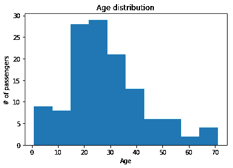
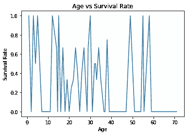
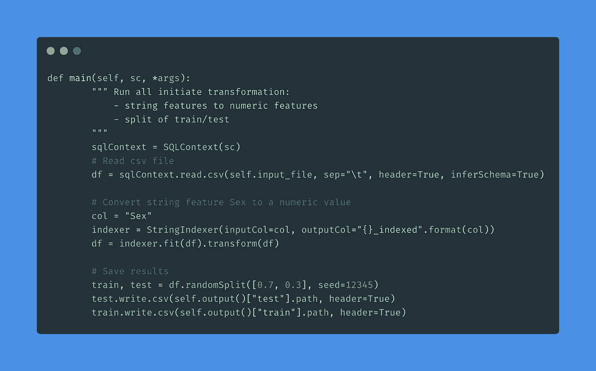
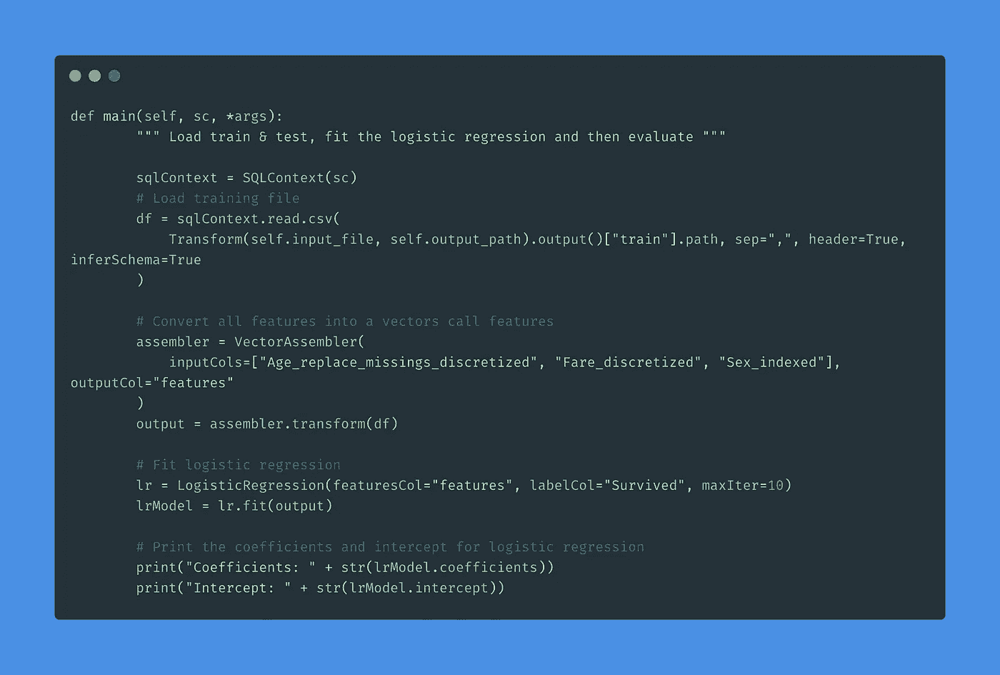
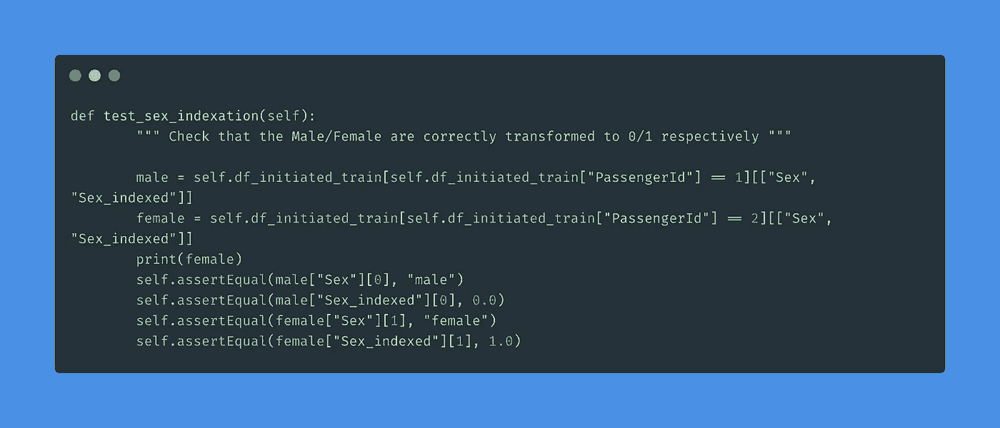
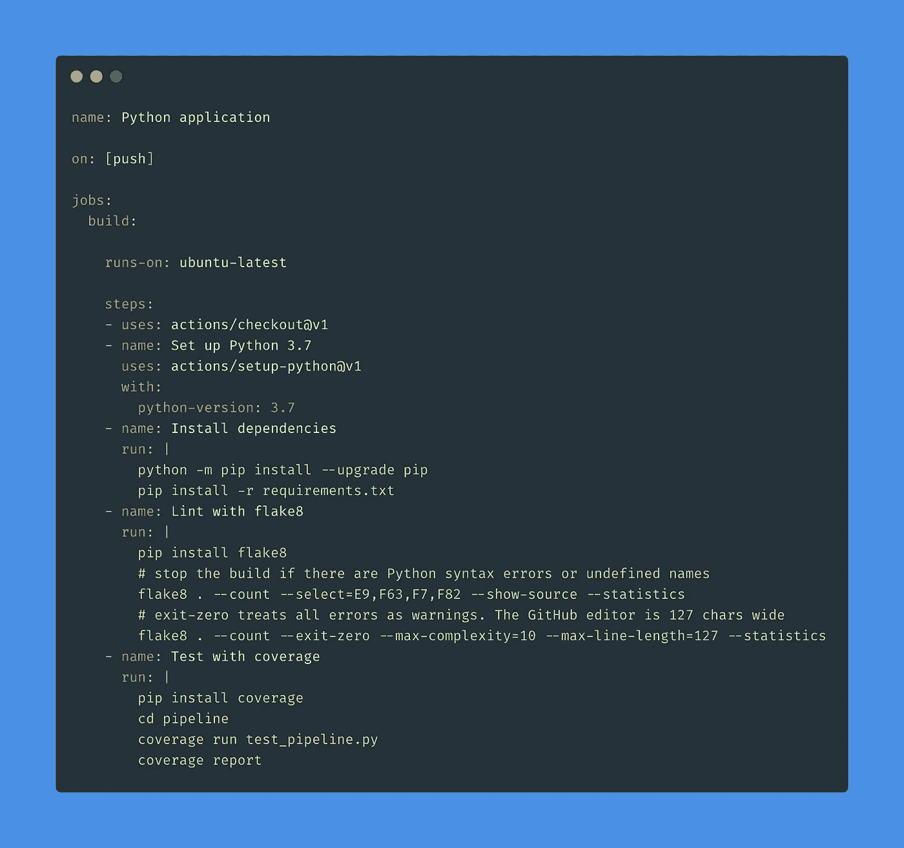

# 使用 Luigi & PySpark 和 CI/CD 创建数据科学管道

> 原文：<https://towardsdatascience.com/create-data-science-pipelines-with-luigi-pyspark-and-ci-cd-6422129b310d?source=collection_archive---------25----------------------->


Photo by [Victor](https://unsplash.com/@victor_g?utm_source=medium&utm_medium=referral) on [Unsplash](https://unsplash.com?utm_source=medium&utm_medium=referral)

本文将为您提供关于使用以下 Python 包创建健壮的数据管道的所有细节:

*   路易吉，管道公司的包裹
*   PySpark，一个通过 Python API 使用 Spark 的包
*   熊猫，一个处理数据的包
*   Unittest，一个实现单元测试的包。

本文使用的所有代码，可以在下面的 GitHub repo 上找到:[https://github.com/aalepere/luigi_spark_flask_cicd](https://github.com/aalepere/luigi_spark_flask_cicd)

# 什么是数据管道，我们为什么需要它们？

数据管道是一组连续应用于一个或多个数据源的数据处理。

数据处理的例子可以是:加载数据源，转换成定义的格式，应用完整性规则，替换丢失的值…

数据管道在机器学习领域非常重要。传统上，数据科学家倾向于以更“手动”的方式工作，通过文件和笔记本来操作数据。

然而，当需要将模型迁移到生产环境中时，这可能是一项困难的工作。

使用数据管道及其相关原理具有以下优势:

*   再现性
*   可配置的
*   模块性
*   准备生产

# **路易吉**

Luigi 是允许创建数据管道的 python 包。传统上，当创建管道时，我们将事件列表链接起来，以所需的输出结束。Luigi packages 通过开箱即用的功能帮助您构建干净的数据管道，例如:

*   依赖关系解析，换句话说，确保在移动下一个任务之前，所有上游任务都被正确执行。Luigi 允许创建干净的图形
*   工作流程管理
*   图形可视化
*   并行化处理

【https://github.com/spotify/luigi 

# **PySpark**

PySpark 是 Spark 的 Python API。PySpark 允许我们通过 Python API 利用 Spark 的所有特性。在本次回购中，我们主要使用 Spark 的机器学习功能，包括:

*   特征模块，一组可用于特征工程的数据转换(替换缺失值、离散化等)
*   分类模块，一组分类模型(逻辑回归，随机森林…)

[https://spark . Apache . org/docs/latest/API/python/py spark . html](https://spark.apache.org/docs/latest/api/python/pyspark.html)

# **测试& CI/CD**

CI/CD 是一个框架，通过在开发阶段引入自动化来频繁地将代码/特性交付到产品中。CI/CD 的主要概念是持续集成、持续交付和持续部署。CI/CD 是集成新代码给开发和数据科学团队带来的问题的解决方案。通常，数据科学家在 Jupyter notebooks 等原型开发环境中工作，事实证明，很难轻松转移到生产环境中。

具体来说，CI/CD 在数据管道的整个生命周期(从集成和测试阶段到交付和部署)中引入了持续的自动化和连续监控。

# **创建任务**

在 Luigi 中，要创建一个数据管道，我们需要创建一组任务，然后执行这些任务以产生期望的最终输出。

Luigi 任务由以下元素组成:

*   **输入**，这定义了一个任务需要哪些输入。它通常是一个文件，但稍后我们会看到，通过使用字典，我们可以使用多个文件(即训练和测试)。
*   **输出**，这定义了任务的输出，然后作为输入用于下游任务。
*   **运行**，执行任务时需要运行的指令集
*   **需要**，在执行当前任务之前需要执行的一组上游任务。这允许在任务之间创建依赖关系，有点像数据库设计中的主键和外键。
*   **Main** ，在某些情况下如使用 PySpark 时，将使用 Main 代替 run


# 数据分析

为了定义将要执行的转换，我们首先需要执行一些数据分析。将用于泰坦尼克号生存数据集的数据集。

*   性，取两个值男性和女性。大多数机器学习算法只接受数值。因此，性别特征必须转换成数值(即男性→ 0，女性→ 1)
*   年龄，有一些缺失的价值需要被取代。由于分布偏向年轻人，我们决定用中位数来代替缺失值。



*   年龄是一个离散值，以决定观察其与存活率(每个年龄的存活数/总乘客数)的关系。正如您在下面看到的，信号非常嘈杂，因此我们希望离散化特征以获得连续的特征。



*   离散化后，我们看到 bin 2 的存活率更高:在 26 到 33 岁之间。看起来他们在疏散泰坦尼克号时优先考虑了老人和孩子。


*   票价，就像年龄也是酌情而定的。

我们可以添加更多的转换和特性，但这里的主要目的是解释数据管道的构建块。

# 任务

以下是将按顺序执行的任务的描述:

*   **FileExists** :检查初始的 titanic 数据集是否存在。


*   **启动**:将所有字符串特征(即性别)转换为数字特征，并将数据集拆分为 70/30 的训练/测试。



*   **转换**:应用数据分析部分描述的转换(替换缺失值和离散化)。这些转换都应用于训练集/测试集。


*   **模型**:取 2 个转换集，用 train 拟合逻辑回归，并用测试对其进行评估。



# **运行管道**

为了能够运行管道，我们需要告诉 Luigi 模块的名称和要执行的任务。

由于依赖关系的定义，我们只需告诉 Luigi 运行最后一个任务(即模型)，Luigi 就会知道如何重建图并执行所有上游任务:

```
PYTHONPATH='.' luigi --module pipeline Model --local-scheduler 
--input-file "../source_data/titanic.csv" --output-path "data_out"
```

input_file 和 output_path 是 Luigi 参数，它允许我们选择将哪个数据集推入管道，以及将所有任务输出保存在本地驱动器的什么位置。

# **测试管道**

如上所述，CI/CD 的原则之一是实现和部署的连续流，为了允许这样的模式，我们需要引入测试来确保代码质量，并且任何代码都不会破坏管道的所有组件。

**设置**

使用**单元测试**包，**设置**用于运行一段将被所有单元测试使用的代码。在我们的例子中，我们使用一个我们已经准备好的测试文件来运行数据管道，这个测试文件包含了所有需要测试的不同测试用例。

**测试**

下面是一个已经实现单元测试的例子:

*   测试初始数据集在训练和测试之间是否正确分离


*   测试性别特征是否正确映射到数值



**CI/CD**

在 GitHub 中，您可以设置动作，动作是一组指令，当代码被推送到 repo 时将执行这些指令。

[](https://github.com/features/actions) [## 功能* GitHub 操作

### GitHub Actions 现在拥有世界一流的 CI/CD，可以轻松实现所有软件工作流程的自动化。构建、测试和…

github.com](https://github.com/features/actions) 

GitHub Actions 允许通过 CI/CD 实现软件工作流程的自动化。

直接从 GitHub 构建、测试和部署您的代码。进行代码审查、分支管理和问题分类。

下面是一个设置示例:



将新代码推送到 repo 后，将执行 CI/CD 工作流:


工作流将安装所有需要的 Python 包，用 flake8 检查语法质量，并运行所有测试。这确保了所有推送到 repos 的新代码不会破坏现有的管道。