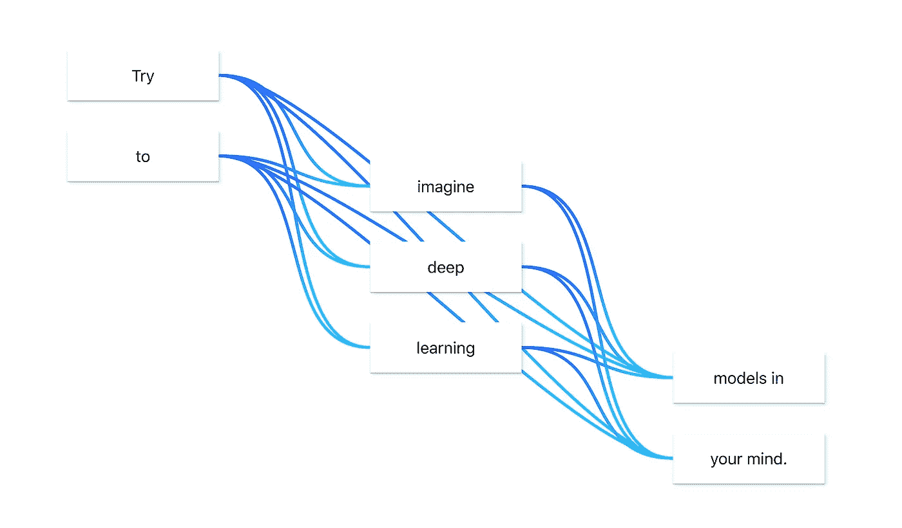

# 使用 Flowpoints 创建深度学习模型

> 原文：<https://towardsdatascience.com/create-deep-learning-models-with-flowpoints-d9b675d0e5af?source=collection_archive---------19----------------------->

## *构建和分享深度学习模型的直观方式。*

我经常发现自己在解释我的模型是如何工作的。有时我试图用通俗的语言来表达，有时我只是把它解释为一个黑盒，有时我画出代表神经网络部分的互连节点。

# 引入流动点

Flowpoints 是一个开源的在线工具，用户可以在其中以流程图的方式建立深度学习模型。

通过在神经网络(flowpoints)中创建表示操作的节点，将这些节点相互连接，并更改它们的参数，可以快速创建深度学习模型。

相应的 Python 代码可以在浏览器中查看，或者只需点击一下就可以复制到剪贴板。

通过一个菜单，您可以选择代码是使用 TensorFlow 还是 PyTorch。

…您还可以轻松创建模型的共享链接！

# 一个简单的例子

所以我们来试试吧！在本例中，我们将创建以下模型，该模型将在 CIFAR10 数据集上接受训练。

What the final model looks like

*对于那些喜欢先吃甜点的人来说:* [*这里是*](https://mariusbrataas.github.io/flowpoints_ml/?p=KlHpdLzP3SDx) *成品模型，这里是* [*这个例子的 colab。*](https://colab.research.google.com/drive/1rkJItfTb8fB0mWQRmL-shsiReFLJ57vR)

## 第一:创建一个新模型

从前往[流量点开始。一个相当空的用户界面应该出现在你的屏幕上。](https://mariusbrataas.github.io/flowpoints_ml)

在侧栏中，单击库下拉菜单，然后选择 TensorFlow。现在我们模型的代码将使用 TensorFlow 代替 PyTorch。

接下来，点击主题下拉菜单，选择“橙色”。这没有实际价值，但是我们在这里用风格编码。

## 第二:给你的模型添加一些流点

向您的模型添加一些操作。单击蓝色+按钮创建一个新的流量点。出现第一个流点应该是“输入”。这个点将被用来告诉模型我们输入的形状。我们会回来的。

不要单击任何其他地方，多单击几次+按钮。一堆流点应该一个接一个地弹出，并自动连接。

*如果您缺少连接:单击您想要获取输出的流点，按住 shift，然后单击您想要连接的流点。连接应该会立即显示出来。要移除连接，只需重复此过程。*

创建尽可能多的流动点，并按照您喜欢的方式排列它们。或者只是复制图中的模型。

## **第三:改变图层类型**

现在你已经有了一大堆线性运算。那些对我们没多大帮助。是时候告诉每个流点它应该做什么了。

点击第一个流点(“输入”)，并选择侧边栏中的流点选项卡。确保“n_dims”框设置为 3，并且“尺寸”显示为 32，32，3。这些是 CIFAR10 数据集中图片的尺寸。

单击下一个流点(连接到输入的流点)，并单击“层类型”区域。在这里，您将更改该流点的操作。首先删除该字段中的所有文本，然后键入“Conv”。应该会出现一个操作列表，Conv2d 非常接近顶部。选择此操作。

*橙色和蓝色的小徽章表示相关图层在哪个库中可用。*

流点的参数应改变，以匹配 TensorFlow 中 Conv2D 运算的参数。

将所有参数设置为有意义的东西(可以使用[我的型号](https://mariusbrataas.github.io/flowpoints_ml/?p=KlHpdLzP3SDx)作为例子)。

对所有流动点重复此步骤，改变它们的层类型和参数，使它们有意义。

## **第四:看一看代码！**

单击侧边栏中的“代码”选项卡，显示您当前型号的代码。它应该是这样的:

Screenshot of the UI with the “Code”-tab open

整个代码如下所示:

The entire code for the model in this walkthrough

## **大功告成！**

要共享或保存您的工作，请执行以下操作:在屏幕左下方的小按钮堆栈中，单击链接共享按钮。将弹出一个对话框，要求您输入密码。这可以用来保护你的模型。如果您想创建一个公共链接(就像我在这个例子中所做的那样)，只需将密码字段留空即可。

要为您的模型复制代码，请单击按钮堆栈中的复制按钮。会弹出一个通知，告诉你代码已经被复制到你的剪贴板上。您可以将其直接粘贴到您的管道中。您可以在我为这个小演练创建的 [colab](https://colab.research.google.com/drive/1rkJItfTb8fB0mWQRmL-shsiReFLJ57vR) 中找到我的模型的代码:)

*感谢阅读！*

*欢迎分享任何反馈，如果您发现 bug(代码是开源的)可以提出新问题，或者自己添加功能和补丁！*

[*这里是回购的链接！*](https://github.com/mariusbrataas/flowpoints_ml#readme)