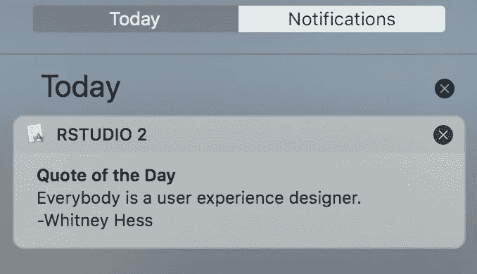
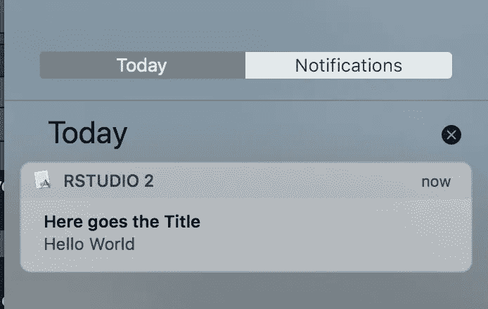
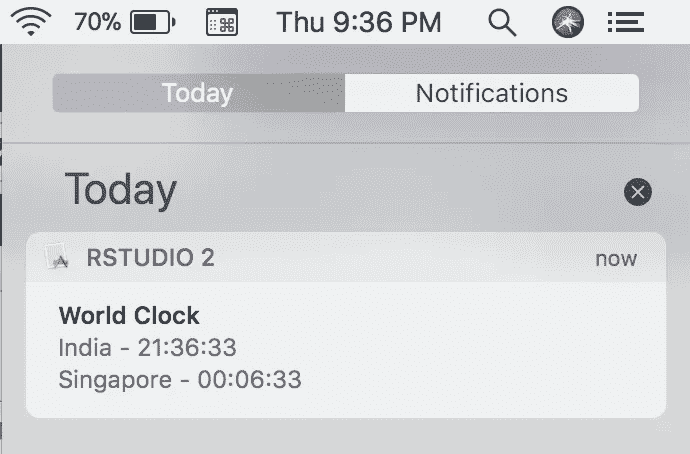

# 从 R 创建桌面通知，以提高您的数据科学生产力

> 原文：<https://towardsdatascience.com/create-desktop-notifications-from-r-7aeefa90d649?source=collection_archive---------20----------------------->



虽然通知会分散我们对深层工作的注意力，但如果有效处理，通知也可以帮助我们变得更有效率。桌面通知是让用户了解任务完成或一些信息的一种非常好的方式。比方说，您的模型一直在运行，最后，您只需发送 AUC 分数的通知。拥有不是很好吗？有了这个 R 包`notifier`，就可以做到了。

# 关于通知程序:

`[notifier](https://github.com/gaborcsardi/notifier)`是 RStudio 知名 [Gábor Csárdi](https://twitter.com/gaborcsardi) 的 R 包。`notifier`可用于在 macOS、Windows 和 Linux 上发送来自 R 的桌面通知。`notifier`跨平台(Windows / Mac/ Linux)运行，但以下代码是在 macOS High Sierra 机器上编写和测试的。

# 通知程序安装和加载

`notifier`目前仅在 github 上可用，因此可以使用以下代码安装:

```
#install.packages("devtools") if devtools is not installed
devtools::install_github("gaborcsardi/notifier")
```

我们可以使用下面的代码将`notifier`加载到当前的 R 会话中(就像其他 R 包一样)。

```
library(notifier)
```

# 它是如何工作的？

如文档中所述，通知是这样显示的:

*   在 macOS 上，通知程序使用终端通知程序工具，参见[https://github.com/julienXX/terminal-notifier](https://github.com/julienXX/terminal-notifier)
*   在 Linux 和*BSD 系统(包括 Solaris)上，使用 notify-send 命令行工具。这需要 Ubuntu/Debian 和类似系统上的 libnotify-bin 包，或者 RedHat/CentOS/Fedora 和类似系统上的 libnotify 包。
*   在 Windows 8 或更新的 Windows 版本上，通知程序使用烤面包机工具，参见[https://github.com/nels-o/toaster](https://github.com/nels-o/toaster)。
*   在较旧的 Windows 版本上，通知程序使用 notifu 程序，参见[https://www.paralint.com/projects/notifu](https://www.paralint.com/projects/notifu)。

# 基本用法

`notifier`非常简单，用一个函数创建一个通知，或者如该函数所说，“用**通知**”。函数`notify()`有以下三个参数:

*标题—消息标题。
* msg —实际通知消息。
*图像—图像，以及消息—可选。

# 你好世界

如同每个计算机编程练习一样，让我们从一个简单的 Hello World 通知消息开始。

```
#composing the first notification messagenotify(
  title = "Here goes the Title",
  msg = c("Hello","World")
  )
```

给出此通知(屏幕截图):



# 稍微有用一点

现在我们已经学会了如何从 R 发送桌面通知，让我们试着让通知有一些意义和用途。我能立即想到的是一个世界时钟或不同国家的时间。下面是我们如何做到这一点的代码。

这段代码只是获取当前的系统时间，并按照各自的时区对其进行格式化。记住，参数`msg`只接受字符类型，因此我们需要将日期类型转换为字符类型，默认情况下，我们已经使用了`paste0`。

```
#composing a slightly complex and also useful notificationnotify(
  title = "World Clock",
  msg = c(paste0(" India - ", format(Sys.time(), format = "%H:%M:%S" ,tz = "Asia/Calcutta"),"\n",
                 paste0("Singapore - ", format(Sys.time(), format = "%H:%M:%S" ,tz = "Asia/Singapore"),"\n"))
          )
)
```

给出此通知(屏幕截图):



# 激励通知

由于我们已经使用 base-R 函数创建了一个稍微有意义的通知，让我们升级到一个可以激励我们的好通知——以引用的形式。为此，我们将使用另一个 R 包— [randquotes](https://cran.r-project.org/web/packages/randquotes/index.html) 。

```
#composing a different use-case notification library(randquotes)
notify(
  title = "Quote of the Day",
  msg = c(randquote_simple())
)
```

给出此通知(屏幕截图):


# 进一步改进

通过使用 Task Scheduler(在 Windows 上)或 Shell Scripting Automation(在 Linux/Mac 上)定期自动发送通知，比如每天早上显示报价通知，可以进一步改善这种情况。

# 摘要

我希望这篇文章能帮助你了解这个 R 包通知程序，它使得从 R 发送桌面通知成为可能——我甚至不知道这是可能的。这篇文章中使用的完整代码可以在[我的 github](https://github.com/amrrs/blogpost_codes/blob/master/notifier_desktop_notifications.R) 上找到。如果你对学习处理 web 数据感兴趣，可以看看这篇关于处理 Web 数据的教程

请在评论中告诉我们你想尝试或已经尝试过的通知！

*本文原载于* [*DS+*](https://datascienceplus.com/send-desktop-notifications-from-r-in-windows-linux-and-mac/)