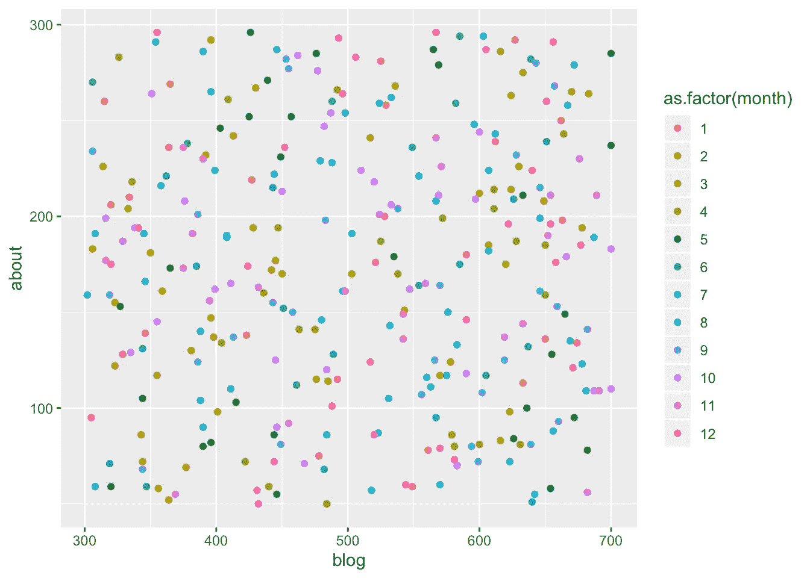

# 使用{fakir}创建虚假但有意义的数据

> 原文：<https://towardsdatascience.com/create-fake-but-meaningful-data-using-fakir-b193df1f4c94?source=collection_archive---------25----------------------->


数据科学或机器学习新手面临的一个问题是，为你想教/学/实验的一组正确的问题找到一组正确的数据集。假设您想要教授时间序列，在这种情况下，您的垃圾邮件/火腿分类数据集将没有任何用处。你必须求助于提供数据集的社区，比如著名的 UCI ML repo 或 Kaggle 数据集。如果您只想在您的环境中快速创建一个虚假但有意义的数据集，该怎么办？

# 解决办法

这就是`fakir`来帮助我们的地方。`fakir`是由 [**科林·费伊**](https://www.programmingwithr.com/how-to-generate-meaningful-fake-data-for-learning-experimentation-and-teaching/%60fakir%60)(Think-R 的)制作的 R-package，他对 [R 社区](https://www.programmingwithr.com/tags/r-bloggers/)的贡献一直很好。

# 关于 fakir

正如文档中所说，`fakir`的目标是提供可以用来教授 r 的假数据集

# 安装和装载

`fakir`可以从 Github 安装(`fakir`在 CRAN 上还不可用)

```
# install.packages("devtools")
devtools::install_github("ThinkR-open/fakir")library(fakir)
```

# 用例:点击流/ Web 数据

点击流/网络数据是目前许多组织在分析中使用的一种东西，但很难获得一些点击流数据，因为没有公司愿意分享他们的数据。Google Analytics 测试帐户上有一个样本数据，但这可能对你在 R 或 R 的生态系统中学习数据科学没有任何作用。

这是一个典型的`fakir`可以帮助你的案例

```
library(tidyverse)
fakir::fake_visits() %>% head()## # A tibble: 6 x 8
##   timestamp   year month   day  home about  blog contact
##   <date>     <dbl> <dbl> <int> <int> <int> <int>   <int>
## 1 2017-01-01  2017     1     1   352   176   521      NA
## 2 2017-01-02  2017     1     2   203   115   492      89
## 3 2017-01-03  2017     1     3   103    59   549      NA
## 4 2017-01-04  2017     1     4   484   113   633     331
## 5 2017-01-05  2017     1     5   438   138   423     227
## 6 2017-01-06  2017     1     6    NA    75   478     289
```

这就是用`fakir`获得点击流样本(整理)数据的简单方法。另一件值得一提的事情是，如果你看一下`fake_visits()`文档，你会发现有一个带`seed`值的参数，这意味着，你控制着数据的随机化和复制。

```
fake_visits(from = "2017-01-01", to = "2017-12-31", local = c("en_US", "fr_FR"), 
    seed = 2811) %>% head()## # A tibble: 6 x 8
##   timestamp   year month   day  home about  blog contact
##   <date>     <dbl> <dbl> <int> <int> <int> <int>   <int>
## 1 2017-01-01  2017     1     1   352   176   521      NA
## 2 2017-01-02  2017     1     2   203   115   492      89
## 3 2017-01-03  2017     1     3   103    59   549      NA
## 4 2017-01-04  2017     1     4   484   113   633     331
## 5 2017-01-05  2017     1     5   438   138   423     227
## 6 2017-01-06  2017     1     6    NA    75   478     289
```

# 用例:法国数据

此外，在上述`fake_visits()`函数的用法中，您可能已经注意到另一个属性`local`，它可以帮助您选择`French`数据而不是英语。在我个人看来，如果你的任务是提高数据素养或使数据科学民主化，这是至关重要的。

```
fake_ticket_client(vol = 10, local = "fr_FR") %>% head()## # A tibble: 6 x 25
##   ref   num_client prenom nom   job     age region id_dpt departement
##   <chr> <chr>      <chr>  <chr> <chr> <dbl> <chr>  <chr>  <chr>      
## 1 DOSS… 31         Const… Boul… <NA>     62 Lorra… 88     Vosges     
## 2 DOSS… 79         Martin Norm… Cons…    52 Midi-… 46     Lot        
## 3 DOSS… 65         Phili… Géra… <NA>     28 Prove… 84     Vaucluse   
## 4 DOSS… 77         Simon… Cour… Plom…    29 Prove… 83     Var        
## 5 DOSS… 59         Rémy   Dela… <NA>     18 Breta… 29     Finistère  
## 6 DOSS… 141        Astrid Dumo… Ingé…    35 Midi-… 46     Lot        
## # … with 16 more variables: gestionnaire_cb <chr>, nom_complet <chr>,
## #   entry_date <dttm>, points_fidelite <dbl>, priorite_encodee <dbl>,
## #   priorite <fct>, timestamp <date>, annee <dbl>, mois <dbl>, jour <int>,
## #   pris_en_charge <chr>, pris_en_charge_code <int>, type <chr>,
## #   type_encoded <int>, etat <fct>, source_appel <fct>
```

在上面的例子中，我们使用了 fakir 的另一个函数`fake_ticket_client()`，它帮助我们给出一个典型的票务数据集(就像你从 **ServiceNow** 或 **Zendesk** 得到的那个)

# 用例:散点图

如果你厌倦了只使用`iris`数据集来演示或教授散点图，而你需要至少两个连续变量，现在我们可以用`fakir`的数据集来克服它。

```
fake_visits() %>% 
  ggplot() + geom_point(aes(blog,about, color = as.factor(month)))## Warning: Removed 47 rows containing missing values (geom_point).
```



(也许，不是一个很好的散点图来显示相关性，但嘿，你可以教散点图没有绘制花瓣长度和萼片长度)

# 摘要

如果你从事教学工作或者喜欢实验，并且不想使用陈词滥调的数据集，那么`fakir`是一个非常好的软件包。正如`fakir`包的作者在描述中提到的，`[charlatan](https://github.com/ropensci/charlatan)`是另一个这样的 R 包，它帮助生成有意义的虚假数据。

# 参考

*   `[fakir](https://github.com/ThinkR-open/fakir)` [- Github](https://github.com/ThinkR-open/fakir)
*   `[fakir](https://thinkr-open.github.io/fakir/)` [-文档](https://thinkr-open.github.io/fakir/)

**如果你喜欢这个，请订阅我的** [***语言无关的数据科学时事通讯***](https://nulldata.substack.com/) **并与你的朋友分享！**

*最初发表于*[*programmingwithr.com，*](https://www.programmingwithr.com/how-to-generate-meaningful-fake-data-for-learning-experimentation-and-teaching/) *经许可转贴*