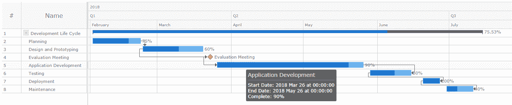
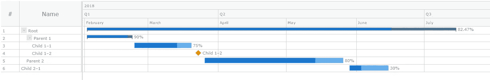

# 如何使用 JavaScript 创建简单的甘特图

> 原文：<https://towardsdatascience.com/create-javascript-gantt-chart-55ff8ec08886?source=collection_archive---------3----------------------->

> U 阿瑟 JavaScript 库创建甘特图，让您的项目管理更上一层楼


Source: [Pexels](https://www.pexels.com/photo/schedule-planning-startup-launching-7376/)

今年早些时候，我的团队正在寻找一个项目管理工具，它可以帮助我们根据一些特定的时间表绘制与我们的应用程序开发项目相关的各种任务。做了一些研究后，我们最终选定了甘特图。

然而，有些人认为 Gantts 很难制作。

不是真的！

感谢[众多的](https://en.wikipedia.org/wiki/Comparison_of_JavaScript_charting_libraries) JavaScript 图表库，数据可视化现在变得简单、灵活、可嵌入。

在我们的情况下，我们选择了 AnyChart 的 [JS Charts](https://www.anychart.com) 库，因为它易于使用，文档丰富，用于试验的灵活代码平台，以及其他强大的功能。

在本教程中，我将带您了解如何使用这个数据可视化库创建一个简单的交互式甘特图。

这是我们将要制作的东西，你可以在教程的最后获得创建这样一个甘特图的完整代码:



# 用 4 个步骤创建 JS 甘特图

让我们动手使用 JavaScript 库创建一个简单的甘特图来安排和监控项目活动。

在本 JS 图表教程中，我们将遵循以下四个步骤:

*   **第一步:**准备数据
*   **第二步:**获取依赖关系
*   **第三步:**声明图表容器
*   **第四步:**渲染甘特图

# 步骤 1:准备数据

使用 JavaScript 构建甘特图的第一步是准备将要显示的数据。AnyChart 库要求使用树数据模型来表示数据。

在这个模型中，数据被组织成一个分层的树状结构，其中父子关系用于连接各种数据项。

因此，父数据项将有一个**子**数据字段，其中子数据项被表示为一个数组。

让我给你看一个例子来说明我所说的:

```
var data = [{
	id: "1",
	name: "Development Life Cycle",
	actualStart: Date.UTC(2018, 01, 02),
	actualEnd: Date.UTC(2018, 06, 15),
	children: [{
			id: "1_1",
			name: "Planning",
			actualStart: Date.UTC(2018, 01, 02),
			actualEnd: Date.UTC(2018, 01, 22),
			connectTo: "1_2",
			connectorType: "finish-start",
			progressValue: "75%"
		},
		// more data goes here
	]
}];
```

# 步骤 2:获取依赖关系

AnyChart 利用了一种极简的、基于模块的方法，让您只获得那些对您的项目来说必不可少的依赖项，这极大地缩小了部署代码的大小，从而提高了性能。

为了创建甘特图，我们将在网页的 **<标题>** 部分添加以下核心和甘特图模块。

```
<head>
<script src="https://cdn.anychart.com/releases/8.6.0/js/anychart-core.min.js"> </script> 
<script src ="https://cdn.anychart.com/releases/8.6.0/js/anychart-gantt.min.js"></script>
</head>
```

# 步骤 3:声明图表容器

然后，让我们创建一个容器，甘特图将加载到其中。

```
<body><div id="container"></div><body>
```

注意，我已经给出了“容器”的 **< div >** 元素和 **id** 以供下一步引用。

# 步骤 4:呈现甘特图

最后，我们将按照以下步骤呈现甘特图:

*   通过将准备好的数据传递给 **anychart.data.tree()** 方法来创建数据树。对于第二个参数，我们将其指定为**“as-tree”**。

```
var treeData = anychart.data.tree(data, "as-tree");
```

*   通过调用 **anychart.ganttProject()** 图表构造函数创建项目甘特图:

```
var chart = anychart.ganttProject();
```

*   通过将创建的数据树传递给图表的 **data()** 方法来设置数据:

```
chart.data(treeData);
```

*   将时间线的刻度配置到项目结束的日期:

```
chart.getTimeline().scale().maximum(Date.UTC(2018, 06, 30));
```

*   引用我们之前设置的图表容器 **id** :

```
chart.container("container");
```

*   开始绘制图表:

```
chart.draw();
```

*   将指定的活动放在时间线的宽度内:

```
chart.fitAll();
```

下面是我用来创建上图中的甘特图的全部代码:

(也可以在 [this CodePen repository](https://codepen.io/jasoya/pen/ZEzKoEv) 上查看代码)。

```
<html>
<head>
<script src="https://cdn.anychart.com/releases/8.6.0/js/anychart-core.min.js"> </script> 
<script src ="https://cdn.anychart.com/releases/8.6.0/js/anychart-gantt.min.js"></script>
</head><body><div id = "container" > </div><script>anychart.onDocumentReady(function () {
	// create data
	var data = [{
		id: "1",
		name: "Development Life Cycle",
		actualStart: Date.UTC(2018, 01, 02),
		actualEnd: Date.UTC(2018, 06, 15),
		children: [{
				id: "1_1",
				name: "Planning",
				actualStart: Date.UTC(2018, 01, 02),
				actualEnd: Date.UTC(2018, 01, 22),
				connectTo: "1_2",
				connectorType: "finish-start",
				progressValue: "75%"
			},
			{
				id: "1_2",
				name: "Design and Prototyping",
				actualStart: Date.UTC(2018, 01, 23),
				actualEnd: Date.UTC(2018, 02, 20),
				connectTo: "1_3",
				connectorType: "start-start",
				progressValue: "60%"
			},
			{
				id: "1_3",
				name: "Evaluation Meeting",
				actualStart: Date.UTC(2018, 02, 23),
				actualEnd: Date.UTC(2018, 02, 23),
				connectTo: "1_4",
				connectorType: "start-start",
				progressValue: "80%"
			},
			{
				id: "1_4",
				name: "Application Development",
				actualStart: Date.UTC(2018, 02, 26),
				actualEnd: Date.UTC(2018, 04, 26),
				connectTo: "1_5",
				connectorType: "finish-finish",
				progressValue: "90%"
			},
			{
				id: "1_5",
				name: "Testing",
				actualStart: Date.UTC(2018, 04, 29),
				actualEnd: Date.UTC(2018, 05, 15),
				connectTo: "1_6",
				connectorType: "start-finish",
				progressValue: "60%"
			},
			{
				id: "1_6",
				name: "Deployment",
				actualStart: Date.UTC(2018, 05, 20),
				actualEnd: Date.UTC(2018, 05, 27),
				connectTo: "1_7",
				connectorType: "start-finish",
				progressValue: "100%"
			},
			{
				id: "1_7",
				name: "Maintenance",
				actualStart: Date.UTC(2018, 05, 30),
				actualEnd: Date.UTC(2018, 06, 11),
				progressValue: "40%"
			},

		]
	}];
	// create a data tree
	var treeData = anychart.data.tree(data, "as-tree");

	// create a chart
	var chart = anychart.ganttProject();

	// set the data
	chart.data(treeData); // configure the scale
	chart.getTimeline().scale().maximum(Date.UTC(2018, 06, 30)); // set the container id
	chart.container("container"); // initiate drawing the chart
	chart.draw(); // fit elements to the width of the timeline
	chart.fitAll();
});</script>
</body>
</html>
```

# 自定义甘特图设计

AnyChart 提供了广泛的选项来定制数据可视化的设计，以满足您的个人偏好和需求。在数据域中，可以设置各种属性来自定义甘特图的外观。

例如，以下是我在上述甘特图示例中指定的一些数据字段:

*   **id** —设置每个任务的唯一标识符；
*   **名称** —设置每个任务的名称；
*   **actualStart** —设置每项任务的开始日期；
*   **实际结束** —设置每个任务的结束日期；
*   **connectTo** —是一种设置目标任务的连接器；
*   **连接器类型** —设置连接器的类型，可以是“开始-开始”、“开始-结束”、“结束-开始”或“结束-结束”；
*   **进度值** —以百分比形式设置每个任务的进度值。

此外，AnyChart 允许以下类型的任务，这些任务可以用不同的方式可视化:

*   **常规任务** —与其他任务没有关系；
*   **父任务** —与其他任务有父子关系；
*   **里程碑** —可视化持续时间为零的事件。它们可以通过在**实际开始**和**实际结束**字段上设置相同的日期来指定。

# 将数据作为表加载

如果您想通过从关系数据库加载数据来创建图表，您可以将数据**组织为带有父/子链接的表格**。

在这种情况下，每个项目的**父**字段应该指定其父 **id** 值。此外，您应该将根项目的父项设置为 **null、**或者不指定它。

这就是我所说的:

(你也可以在 [this CodePen repository](https://codepen.io/jasoya/pen/RwbVyPw?editors=1010) 上查看代码)。

```
var data = [{
		id: 1,
		parent: null,
		name: "Root",
		actualStart: Date.UTC(2018, 01, 02),
		actualEnd: Date.UTC(2018, 06, 15),
	},
	{
		id: 2,
		parent: 1,
		name: "Parent 1",
		actualStart: Date.UTC(2018, 01, 02),
		actualEnd: Date.UTC(2018, 01, 22),
		progressValue: "90%"
	},
	{
		id: 3,
		parent: 2,
		name: "Child 1–1",
		actualStart: Date.UTC(2018, 01, 23),
		actualEnd: Date.UTC(2018, 02, 20),
		progressValue: "75%"
	},
	{
		id: 4,
		parent: 2,
		name: "Child 1–2",
		actualStart: Date.UTC(2018, 02, 23),
		actualEnd: Date.UTC(2018, 02, 23),
		progressValue: "60%"
	},
	{
		id: 5,
		parent: 1,
		name: "Parent 2",
		actualStart: Date.UTC(2018, 02, 26),
		actualEnd: Date.UTC(2018, 04, 26),
		progressValue: "80%"
	},
	{
		id: 7,
		parent: 6,
		name: "Child 2–1",
		actualStart: Date.UTC(2018, 04, 29),
		actualEnd: Date.UTC(2018, 05, 15),
		progressValue: "30%"
	},
];
```

另外，当您以表的形式加载数据时，不要忘记将 **anychart.data.tree()** 方法中的第二个参数从“as-tree”更改为“as-table”，因此整行如下所示:

```
var treeData = anychart.data.tree(data, "as-table");
```

以下是以表格形式加载数据时创建的甘特图的屏幕截图:



# 结论

就是这样！

如您所见，使用 AnyChart JavaScript 图表库创建甘特图简单而直接。

在本教程中，我只是简单介绍了甘特图的一些功能。我希望你已经了解了这种图表的惊人能力，以及它如何帮助你管理你的 web 开发任务。

当然，你可以看看易于遵循的 AnyChart 的[甘特图文档](https://docs.anychart.com/Gantt_Chart/Overview)，以了解更多调整甘特图以适应你的设计要求的方法，并帮助你跟踪你的项目管理活动。

万事如意。