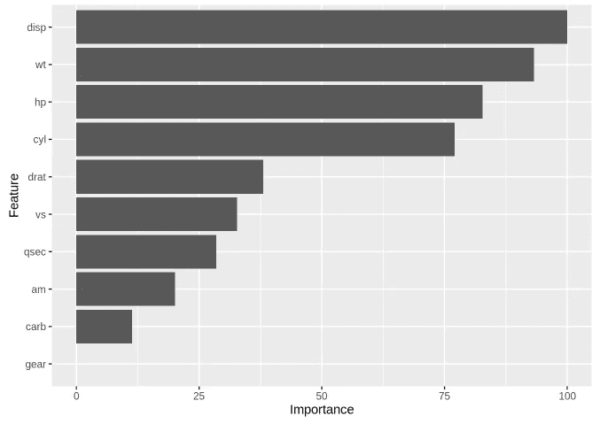

# 用插入符号在 R 中创建预测模型

> 原文：<https://towardsdatascience.com/create-predictive-models-in-r-with-caret-12baf9941236?source=collection_archive---------3----------------------->

Caret 是 ***C*** 分类***A***nd***RE***gression***T***raining。它是一个完整的包，涵盖了创建机器学习预测模型的所有阶段。在本教程中，我将解释以下主题:

1.  如何安装 caret
2.  如何创建简单的模型
3.  如何使用交叉验证来避免过度拟合
4.  如何向数据添加简单的预处理
5.  如何为您选择的模型找到最佳参数
6.  如何查看模型中最重要的特征/变量
7.  如何使用你的模型来预测

# 安装

安装 caret 就像在 r 中安装任何其他包一样简单。如果你使用的是 RStudio(推荐)，你也可以点击工具栏中的“工具”>“安装包…”来安装它。

```
install.packages("caret")
```

# 创建简单的模型

我们将通过使用 **train()** 函数来实现这一点。函数 **train()** 是 caret 的核心函数。顾名思义，它用于训练模型，即将算法应用于一组数据，并创建代表该数据集的模型。

train()函数有三个基本参数:

1.  公式
2.  资料组
3.  方法(或算法)

**公式**参数是你指定什么是因变量(你要预测的)和自变量(特性)的地方。下面我会详细解释如何写你的公式。

**数据集**参数是您的数据。

**方法**参数是指定使用哪个分类或回归模型的字符串。

在本教程中，我将使用 mtcars 数据集。它是内置的 R 数据集之一。下面是关于这个数据集的解释:

## 汽车趋势道路测试(mtcars)

## 描述

该数据摘自 1974 年的《美国汽车趋势》杂志，包括 32 款汽车(1973-74 款)的油耗以及汽车设计和性能的 10 个方面。

用 11 个变量的 32 个观察值格式化一个数据框。

1.  mpg:英里/(美国)加仑
2.  cyl:气缸数量
3.  disp:排量(立方英寸)
4.  马力:总马力
5.  drat:后桥传动比
6.  重量:重量(1000 磅)
7.  qsec: 1/4 英里时间
8.  vs: V/S
9.  am:变速器(0 =自动，1 =手动)
10.  档位:前进档的数量
11.  碳水化合物:化油器数量

让我们来看看数据框。

```
data(mtcars)    *# Load the dataset*
head(mtcars)
```


```
?mtcars         *# Get more information about this dataset*
```

现在，让我们创建回归模型，根据其他属性预测汽车模型可以行驶多少英里每加仑(mpg)。

**公式**可以写成“ **x ~ y，z，w”**其中 x 是因变量，我们这里是 mpg，y，z，w 是自变量。如果你想传递所有的属性，你可以把它写成“ **x ~。****。**

```
**library**(caret)*# Simple linear regression model (lm means linear model)*
model <- train(mpg ~ wt,
               data = mtcars,
               method = "lm")

*# Multiple linear regression model*
model <- train(mpg ~ .,
               data = mtcars,
               method = "lm")

*# Ridge regression model*
model <- train(mpg ~ .,
               data = mtcars,
               method = "ridge") *# Try using "lasso"*
```

这就是如何使用函数 **train()** 创建不同的基本模型。很简单，不是吗？

# k 倍交叉验证

函数 **train()** 有其他可选参数。让我们学习如何通过向我们的 **train()** 函数添加参数**tr control**(train control)来向我们的模型添加重采样。

重采样过程可以通过使用 K 重交叉验证、留一交叉验证或引导来完成。在这个例子中，我们将使用 10 重交叉验证。为此，我们需要使用另一个插入符号函数， **trainControl()** 。检查下面的代码。

```
*## 10-fold CV**# possible values: boot", "boot632", "cv", "repeatedcv", "LOOCV", "LGOCV"* fitControl <- trainControl(method = "repeatedcv",   
                           number = 10,     *# number of folds*
                           repeats = 10)    *# repeated ten times*

model.cv <- train(mpg ~ .,
               data = mtcars,
               method = "lasso",  *# now we're using the lasso method*
               trControl = fitControl)  

model.cv ## The lasso 
## 
## 32 samples
## 10 predictors
## 
## No pre-processing
## Resampling: Cross-Validated (10 fold, repeated 10 times) 
## Summary of sample sizes: 28, 30, 28, 28, 29, 29, ... 
## Resampling results across tuning parameters:
## 
##   fraction  RMSE      Rsquared   MAE     
##   0.1       4.660950  0.8873870  3.841383
##   0.5       2.824138  0.8735388  2.468004
##   0.9       3.243825  0.8400985  2.797594
## 
## RMSE was used to select the optimal model using the smallest value.
## The final value used for the model was fraction = 0.5.
```

# 添加预处理

**train()** 函数还有另一个可选参数叫做**预处理**。它用于为您的数据添加一些预处理。

在本例中，我们将使用以下预处理:

1.  中心数据(即计算每列的平均值，并从每个相应的值中减去它)；
2.  缩放数据(即将所有数据放在同一个刻度上，例如从 0 到 1 的刻度)

但是，还有更多的预处理可能性，如“BoxCox”、“YeoJohnson”、“expoTrans”、“range”、“knnImpute”、“bagImpute”、“medianImpute”、“pca”、“ica”和“spatialSign”。

```
model.cv <- train(mpg ~ .,
               data = mtcars,
               method = "lasso",
               trControl = fitControl,
               preProcess = c('scale', 'center')) *# default: no pre-processing*

?train    # if you need more information about the train function model.cv## The lasso 
## 
## 32 samples
## 10 predictors
## 
## Pre-processing: scaled (10), centered (10) 
## Resampling: Cross-Validated (10 fold, repeated 10 times) 
## Summary of sample sizes: 29, 30, 29, 28, 29, 29, ... 
## Resampling results across tuning parameters:
## 
##   fraction  RMSE      Rsquared   MAE     
##   0.1       4.597673  0.9072492  3.821535
##   0.5       2.755728  0.8968303  2.411330
##   0.9       3.183950  0.8820037  2.778551
## 
## RMSE was used to select the optimal model using the smallest value.
## The final value used for the model was fraction = 0.5.
```

# 寻找模型超参数

通过使用 **tuneGrid** 参数，我们可以找到模型的最佳超参数。该参数接收具有可能调谐值的数据帧。dataframe 列的名称与优化参数的名称相同。

为了生成可能的值，我将使用基本库中的 **expand.grid** 函数。为了解释 tuneGrid 的用法，我将使用岭回归法。

## 简短解释

随着λ的增长，岭方法将预测变量的系数向 0 收缩。收缩效应降低了模型的灵活性，也降低了其方差，但增加了偏差。岭回归的思想是找到λ的值，该值是偏差和方差之间令人满意的折衷。

使用下面的代码，我们可以找到 10^-2 到 10^10.之间岭回归的最佳 lambda 参数

```
*# Here I generate a dataframe with a column named lambda with 100 values that goes from 10^10 to 10^-2*
lambdaGrid <- expand.grid(lambda = 10^seq(10, -2, length=100))

model.cv <- train(mpg ~ .,
               data = mtcars,
               method = "ridge",
               trControl = fitControl,
               preProcess = c('scale', 'center'),
               tuneGrid = lambdaGrid,   *# Test all the lambda values in the lambdaGrid dataframe*
               na.action = na.omit)   *# Ignore NA values*

model.cv ## Ridge Regression 
## 
## 32 samples
## 10 predictors
## 
## Pre-processing: scaled (10), centered (10) 
## Resampling: Cross-Validated (10 fold, repeated 10 times) 
## Summary of sample sizes: 28, 29, 28, 29, 30, 28, ... 
## Resampling results across tuning parameters:
## 
##   lambda        RMSE       Rsquared   MAE      
##   1.000000e-02   3.133764  0.8542752   2.700711
##   1.321941e-02   3.097225  0.8559508   2.670390
##   1.747528e-02   3.057315  0.8583961   2.637061
##   2.310130e-02   3.015005  0.8621809   2.600386
##   3.053856e-02   2.971543  0.8672769   2.562851... # too much output so i cut it out##   1.000000e+10  25.370412  0.8901093  23.047829
## 
## RMSE was used to select the optimal model using the smallest value.
## The final value used for the model was lambda = 0.1629751.
```

当您调用 **model.cv** 时，您可以看到您测试的每个 lambda 值的度量 RMSE、Rsquared 和 MAE，并且模型还输出测试值中 lambda 的最佳选择。在这种情况下，λ= 0.1629751。

还有另一种搜索超参数的方法，不需要将值列表传递给 **train()** 函数。我们可以在 **trainControl()** 中使用 **search = "random"** ，该函数将自动测试一系列值。

```
fitControl <- trainControl(*## 10-fold CV*
                           method = "repeatedcv",
                           number = 10,
                           repeats = 10,
                           search = "random")  *# hyper-parameters random search* 

model.cv <- train(mpg ~ .,
               data = mtcars,
               method = "ridge",
               trControl = fitControl,
               preProcess = c('scale', 'center'),
               na.action = na.omit)

model.cv## Ridge Regression 
## 
## 32 samples
## 10 predictors
## 
## Pre-processing: scaled (10), centered (10) 
## Resampling: Cross-Validated (10 fold, repeated 10 times) 
## Summary of sample sizes: 28, 29, 29, 29, 28, 28, ... 
## Resampling results across tuning parameters:
## 
##   lambda        RMSE       Rsquared   MAE      
##   7.830203e-05   3.428075  0.8533706   2.950310
##   9.214823e-05   3.427668  0.8533953   2.949997
##   8.645309e+00  15.314730  0.9024834  13.994384
## 
## RMSE was used to select the optimal model using the smallest value.
## The final value used for the model was lambda = 9.214823e-05.
```

# 可变重要性

现在，让我们学习如何查看哪些是我们模型中最重要的变量。我们可以使用插入符号函数 **varImp** 。 **varImp** 的返回可以传递给函数 **ggplot** 以生成可视化。

```
ggplot(varImp(model.cv))
```



正如我们在图中看到的，位移变量对我们的预测模型最重要。

# 预言

最后，我们可以使用函数 **predict** 来预测汽车的性能，即每加仑汽油可以行驶多少英里。我将传递与生成模型相同的数据帧作为参数，只是为了展示函数是如何工作的。

在一个真实的项目中，你会使用一个更大的数据帧，并把它分成一个训练集和一个测试集，但这不是这里的目的。

```
predictions <- predict(model.cv, mtcars)

predictions##           Mazda RX4       Mazda RX4 Wag          Datsun 710 
##            22.59767            22.11103            26.25381 
##      Hornet 4 Drive   Hornet Sportabout             Valiant 
##            21.23520            17.69025            20.38318 
##          Duster 360           Merc 240D            Merc 230 
##            14.38382            22.49686            24.41665 
##            Merc 280           Merc 280C          Merc 450SE 
##            18.70104            19.19260            14.17669 
##          Merc 450SL         Merc 450SLC  Cadillac Fleetwood 
##            15.60112            15.74344            12.03039 
## Lincoln Continental   Chrysler Imperial            Fiat 128 
##            10.93585            10.49555            27.77480 
##         Honda Civic      Toyota Corolla       Toyota Corona 
##            29.89355            29.51135            23.64401 
##    Dodge Challenger         AMC Javelin          Camaro Z28 
##            16.94227            17.73144            13.30775 
##    Pontiac Firebird           Fiat X1-9       Porsche 914-2 
##            16.68855            28.29431            26.15559 
##        Lotus Europa      Ford Pantera L        Ferrari Dino 
##            27.63590            18.87023            19.69368 
##       Maserati Bora          Volvo 142E 
##            13.93917            24.37227
```

您可以将预测值与真实值进行比较。有一些指标可以用来判断你的模型是否是一个好的预测器，但是我们不打算在这里深入讨论。

感谢您的阅读。我希望这是一次有益而愉快的阅读。