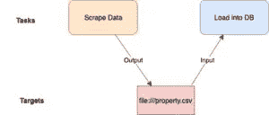
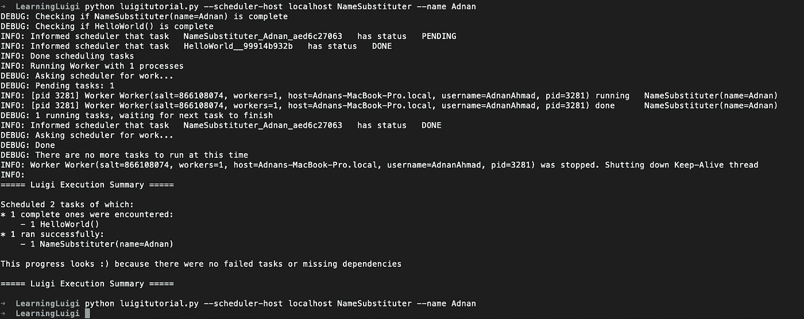
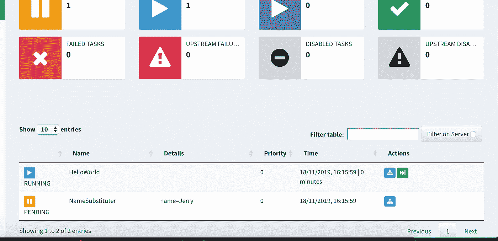
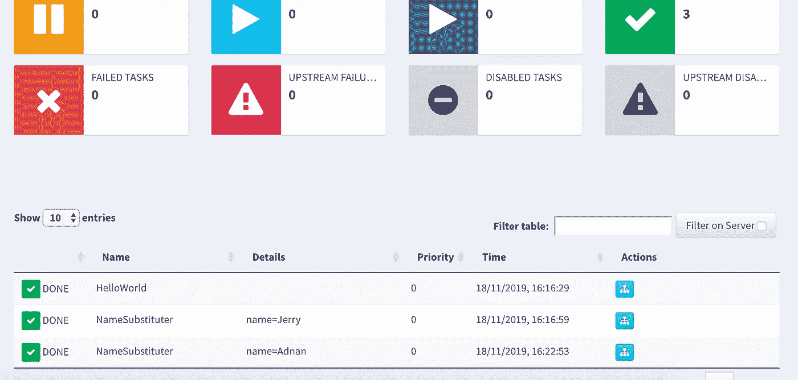
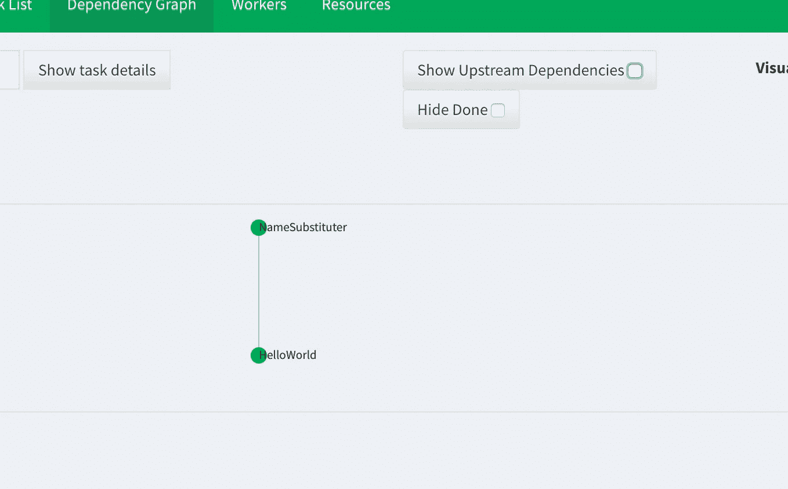

# 在 Luigi 中创建您的第一个 ETL

> 原文：<https://towardsdatascience.com/create-your-first-etl-in-luigi-23202d105174?source=collection_archive---------10----------------------->

*本帖是* [*数据工程系列*](http://blog.adnansiddiqi.me/tag/data-engineering/) *的一部分。*

在以前的帖子中，我讨论了用 Bonobo、Spark 和 Airflow 编写 ETL。在这篇文章中，我将介绍另一个由 *Spotify* 开发的 ETL 工具，名为 **Luigi** 。

之前我已经讨论过关于编写基本 ETL 管道的[这里](http://blog.adnansiddiqi.me/develop-your-first-etl-job-in-python-using-bonobo/)，这里[这里](http://blog.adnansiddiqi.me/getting-started-with-apache-airflow/)和[这里](http://blog.adnansiddiqi.me/create-your-first-etl-pipeline-in-spark-and-python/)。Bonobo 在编写 ETL 管道方面很酷，但是这个世界并不全是编写 ETL 管道来实现自动化。还有一些其他的用例，在这些用例中，您必须按照一定的顺序执行任务一次或者定期执行。例如:

*   监控 Cron 作业
*   将数据从一个地方传输到另一个地方。
*   自动化您的开发运维。
*   定期从网站上获取数据，并为你令人敬畏的价格比较系统更新数据库。
*   基于推荐系统的数据处理。
*   机器学习管道。

可能性是无限的。

在我们进一步在我们的系统中实现 *Luigi* 之前，让我们讨论一下什么是气流及其术语。

# 什么是路易吉？

来自 [Github 页面](https://github.com/spotify/luigi):

> Luigi 是一个 Python (2.7、3.6、3.7 测试版)包，可以帮助你构建复杂的批处理作业管道。它处理依赖关系解析、工作流管理、可视化、处理故障、命令行集成等等。

让我们学习和理解基本组件和术语。

*   **目标:-** 简单来说，一个目标持有一个任务的输出。目标可以是本地(例如:文件)、HDFS 或 RDBMS(MySQL 等)
*   任务是实际工作发生的地方。任务可以是独立的，也可以是从属的。相关任务的示例是将数据转储到文件或数据库中。在加载数据之前，数据必须以任何方式存在(抓取、API 等)。每个任务都表示为一个 Python 类，其中包含某些强制成员函数。任务函数包含以下方法:
*   **requires():-**task 类的这个成员函数包含了当前任务之前必须执行的所有任务实例。在我上面分享的例子中，一个名为 **ScrapeData** 的任务将包含在`requires()`方法中，因此使一个任务成为一个依赖任务。
*   **output():-** 这个方法包含了任务输出将被存储的目标。这可能包含一个或多个目标对象。
*   **run():-** 这个方法包含了运行任务的实际逻辑。

图示将如下所示:

我们先写一个玩具 ETL。它什么也不做，只是把 Hello World 放到一个文本文件中，然后用你输入的名字替换 World。

第一个类或任务`HelloWorld`是 ETL 的*提取*部分，假设文本为 Hello World！来自外部来源(API、DB 等)并存储在文件`helloworld.txt`中。`output()`方法设定目标。因为目标是文件名为`helloworld.txt`的本地文件`LocalTarget`。`run`方法负责所有的处理逻辑。因为这个任务不依赖于任何任务，所以`requires()`返回一个`None`。

第二个类`NameSubstituter`可以被认为是一个将原始文本转换成其他内容并保存到另一个文本文件中的类。因此，这个类(任务)负责 ETL 的 **T** 和 **L** 部分。

`name = luigi.Parameter()`是将 ETL 参数化，便于从外部数据源接受数据。`infile.read()`从传入文件中读取数据，在我们的例子中，它是`helloworld.txt`和内容 *Hello World！*被保存在一个`text`变量中。文本*世界*，然后被替换为输入名称。文件名也遵循在`output()`方法中设置的特定格式。

好了，代码准备好了。是时候运行它了。我转到命令行并运行以下命令:

`python luigitutorial.py --scheduler-host localhost NameSubstituter`

哎呀！它坠毁了！

如您所见，错误消息很清楚:*需要设置‘name’参数。*

我们必须传递 name 参数。为此，我们将采取以下措施:

`python luigitutorial.py --scheduler-host localhost NameSubstituter --name Adnan`

你能看到笑脸符号吗？一切顺利！

现在让我解释一下这个命令。Luigi 使用一种不同的调度程序来调度作业。出于开发目的，使用了`--local-schedular`,但是如果您希望可视化监控过程，那么您应该使用`--schedular-host`在基于 web 的界面上监控它。确保运行运行本地 web 服务器的`luigid`守护进程。如果你不设置`--schedular-host`，它仍然会运行，但是你不能监控正在运行的任务，所以一定要小心！如果所有的点都连接得很好，你可以通过访问`[http://localhost:8082/](http://localhost:8082/)`来了解事情的进展

在访问中，您可以看到如下屏幕:

任务正在运行，您可以看到状态。万一你想知道我为什么加了`sleep`，你现在就可以猜到了。如果不增加延迟，你就无法想象它，因为它会执行得非常快。此外，请注意在*细节*部分中带有参数的`NameSubstituter`类的多个条目。这是因为它们被认为是独特的工作，而 HelloWorld 却不是。

如果您单击单个任务，您可以看到任务的依赖关系图。类似于[气流](http://blog.adnansiddiqi.me/getting-started-with-apache-airflow/)。

您会看到文件名附加了输入名称。如果您还记得，我们已经这样设置了文件名。这是不必要的，你可以选择任何你想要的，因为我自己从一个例子。

哦，对了，任务运行一次。并不是每次运行都会生成文件。如果你想有一个新的开始，而不仅仅是删除所有的输入和输出文件。在这个例子中，例如，如果您想重新运行名为 Adnan 的 ETL，那么只需删除`helloworld.txt.name_Adnan`，而不是所有文件。如果您的输入文件内容被更改，那么也删除它。

# 结论

因此，您了解了 Luigi 如何使编写满足您需求的 ETL 变得更加容易。在下一部分中，我们将讨论一个真实世界的例子，就像我们对 Apache Airflow 所做的那样。像往常一样，代码可以在 [Github](https://github.com/kadnan/Luigi-Python-Tutorial) 获得。

*原载于 2019 年 11 月 18 日*[*http://blog . adnansiddiqi . me*](http://blog.adnansiddiqi.me/create-your-first-etl-in-luigi/)*。*