# 用 Apache Spark 和 Python 创建您的第一个 ETL 管道

> 原文：<https://towardsdatascience.com/create-your-first-etl-pipeline-in-apache-spark-and-python-ec3d12e2c169?source=collection_archive---------1----------------------->

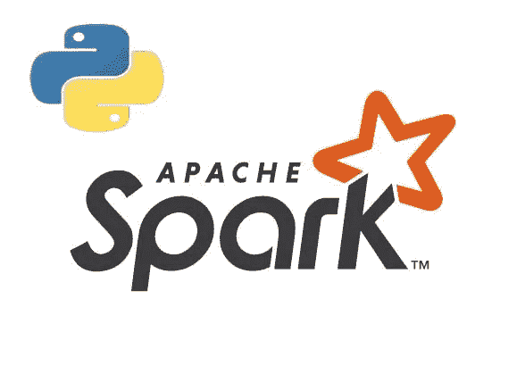

在这篇文章中，我将讨论 Apache Spark 以及如何在其中创建简单而健壮的 ETL 管道。您将了解 Spark 如何提供 API 来将不同的数据格式转换成数据框架和 SQL 以便进行分析，以及如何将一个数据源转换成另一个数据源。

# 什么是阿帕奇火花？

据[维基百科](https://en.wikipedia.org/wiki/Apache_Spark):

> Apache Spark 是一个开源的分布式通用集群计算框架。Spark 提供了一个接口，通过隐式数据并行和容错对整个集群进行编程。

来自[官网](https://spark.apache.org/):

> Apache Spark 是用于大规模数据处理的统一分析引擎。

简而言之，Apache Spark 是一个用于处理、查询和分析大数据的框架。由于计算是在内存中完成的，因此它比竞争对手如 MapReduce 等快几倍。每天产生万亿字节数据的速度，需要一种能够高速提供实时分析的解决方案。Spark 的一些功能包括:

*   比传统的大规模数据处理框架快 100 倍。
*   易于使用，因为您可以用 Python、R 和 Scala 编写 Spark 应用程序。
*   它为 SQL、流和图形计算提供了库。

# Apache Spark 组件

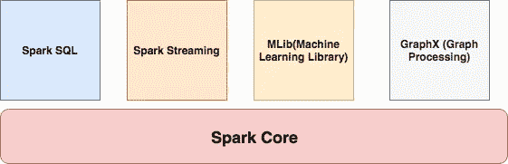

# 火花核心

它包含 Spark 的基本功能，如任务调度、内存管理、与存储的交互等。

# Spark SQL

它是一组用于与结构化数据交互的库。它使用类似 SQL 的接口与各种格式的数据进行交互，如 CSV、JSON、Parquet 等。

# 火花流

Spark 流是一个 Spark 组件，支持实时数据流的处理。实时流，如股票数据、天气数据、日志和各种其他内容。

# MLib

MLib 是 Spark 提供的一组机器学习算法，用于监督和非监督学习

# GraphX

它是 Apache Spark 用于图形和图形并行计算的 API。它扩展了 Spark RDD API，允许我们创建一个带有附加到每个顶点和边的任意属性的有向图。它为 ETL、探索性分析和迭代图计算提供了统一的工具。

# Spark 集群管理器

Spark 支持以下资源/集群管理器:

*   **Spark Standalone**—Spark 附带的一个简单的集群管理器
*   Apache Mesos —一个通用的集群管理器，也可以运行 Hadoop 应用。
*   **Apache Hadoop YARN**—Hadoop 2 中的资源管理器
*   Kubernetes —一个用于自动化部署、扩展和管理容器化应用程序的开源系统。

# 设置和安装

从[这里](https://spark.apache.org/downloads.html)下载 Apache Spark 的二进制文件。您必须在系统上安装 Scala，并且还应该设置它的路径。

对于本教程，我们使用的是 2019 年 5 月发布的 2.4.3 版本。移动`/usr/local`中的文件夹

`mv spark-2.4.3-bin-hadoop2.7 /usr/local/spark`

然后导出 Scala 和 Spark 的路径。

```
#Scala Path
export PATH="/usr/local/scala/bin:$PATH"#Apache Spark path
export PATH="/usr/local/spark/bin:$PATH"
```

通过在终端上运行`spark-shell`命令来调用 Spark Shell。如果一切顺利，您将看到如下内容:

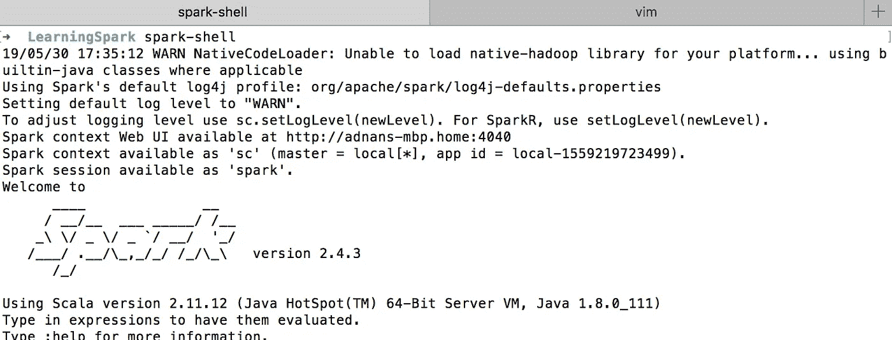

它加载基于 Scala 的 shell。既然我们要使用 Python 语言，那么我们必须安装 **PySpark** 。

`pip install pyspark`

一旦安装完成，你可以在你的终端上运行命令`pyspark`来调用它:

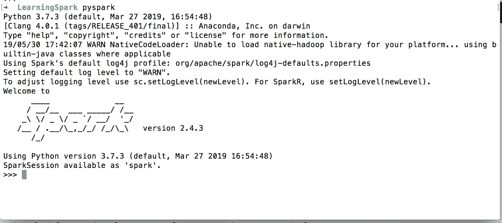

您会发现一个典型的 Python shell，但是它加载了 Spark 库。

# Python 开发

让我们开始写我们的第一个程序。

```
from pyspark.sql import SparkSession
from pyspark.sql import SQLContextif __name__ == '__main__':
    scSpark = SparkSession \
        .builder \
        .appName("reading csv") \
        .getOrCreate()
```

我们导入了两个库:`SparkSession`和`SQLContext`。

SparkSession 是编程 Spark 应用程序的入口点。它允许您与 Spark 提供的`DataSet`和`DataFrame`API 进行交互。我们通过调用`appName`来设置应用程序名称。`getOrCreate()`方法要么返回应用程序的新 SparkSession，要么返回现有的 spark session。

我们的下一个目标是读取 CSV 文件。我已经创建了一个示例 CSV 文件，名为`data.csv`，如下所示:

```
name,age,country
adnan,40,Pakistan
maaz,9,Pakistan
musab,4,Pakistan
ayesha,32,Pakistan
```

代码是:

```
if __name__ == '__main__':
    scSpark = SparkSession \
        .builder \
        .appName("reading csv") \
        .getOrCreate()data_file = '/Development/PetProjects/LearningSpark/data.csv'
    sdfData = scSpark.read.csv(data_file, header=True, sep=",").cache()
    print('Total Records = {}'.format(sdfData.count()))
    sdfData.show()
```

我设置了文件路径，然后调用`.read.csv`来读取 CSV 文件。参数是不言自明的。`.cache()`缓存返回的结果集，从而提高性能。当我运行该程序时，它会返回如下内容:

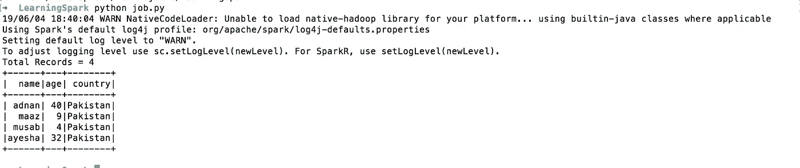

看起来很有趣，不是吗？现在，如果我想读取一个数据帧中的多个文件呢？让我们创建另一个文件，我将其命名为`data1.csv`，如下所示:

1

2

3

4

5

姓名，年龄，国家

诺琳，23 岁，英国

阿米尔，9 岁，巴基斯坦

诺曼，4 岁，巴基斯坦

拉希德，12 岁，巴基斯坦

我要做的就是:

`data_file = '/Development/PetProjects/LearningSpark/data*.csv'`它将读取所有以*数据*开始的 CSV 类型的文件。

它将读取所有匹配模式的 CSV 文件并转储结果:

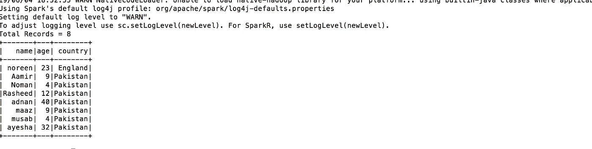

如您所见，它将 CSV 中的所有数据转储到一个数据帧中。很酷吧。

但是有一点，只有当所有的 CSV 都遵循特定的模式时，这种转储才会起作用。如果您有一个不同列名的 CSV，那么它将返回以下消息。

```
19/06/04 18:59:05 WARN CSVDataSource: Number of column in CSV header is not equal to number of fields in the schema:
 Header length: 3, schema size: 17
CSV file: file:///Development/PetProjects/LearningSpark/data.csv
```

如您所见，Spark 抱怨 CSV 文件不一致，无法处理。

您可以使用 DataFrame 执行许多操作，但是 Spark 为您提供了更简单、更熟悉的界面来使用`SQLContext`操作数据。它是 SparkSQL 的网关，允许您使用类似 SQL 的查询来获得想要的结果。

在我们进一步讨论之前，让我们先玩一些真实的数据。为此，我们使用我从 [Kaggle](https://www.kaggle.com/aungpyaeap/supermarket-sales) 获得的超市销售数据。在尝试 SQL 查询之前，让我们尝试按性别对记录进行分组。我们在这里处理 ETL 的**提取**部分。

```
data_file = '/Development/PetProjects/LearningSpark/supermarket_sales.csv'
sdfData = scSpark.read.csv(data_file, header=True, sep=",").cache()gender = sdfData.groupBy('Gender').count()
print(gender.show())
```

当您运行时，它会返回如下内容:

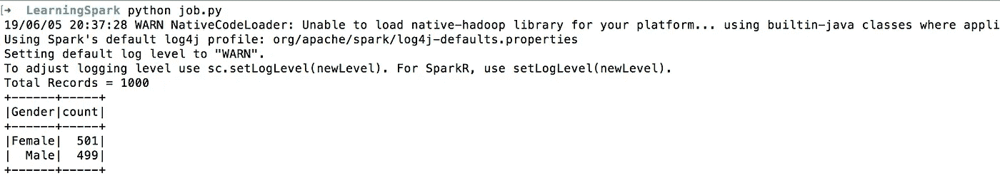

`groupBy()`按给定的列对数据进行分组。在我们的例子中，它是性别栏。

SparkSQL 允许您使用类似 SQL 的查询来访问数据。

```
sdfData.registerTempTable("sales")
output =  scSpark.sql('SELECT * from sales')
output.show()
```

首先，我们从数据帧中创建一个临时表。为此，使用了`registerTampTable`。在我们的例子中，表名是**销售**。一旦完成，你就可以对它使用典型的 SQL 查询。在我们的例子中，它是 **Select * from sales** 。

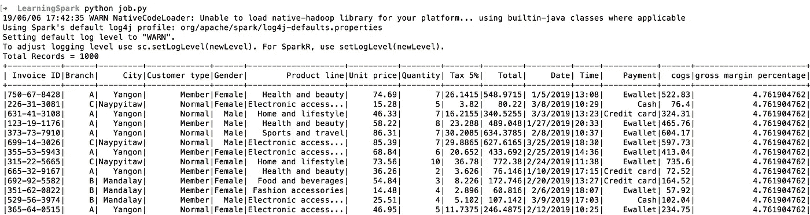

或者类似下面的内容:

```
output = scSpark.sql('SELECT * from sales WHERE `Unit Price` < 15 AND Quantity < 10')
output.show()
```

或者甚至是聚合值。

```
output = scSpark.sql('SELECT COUNT(*) as total, City from sales GROUP BY City')
output.show()
```

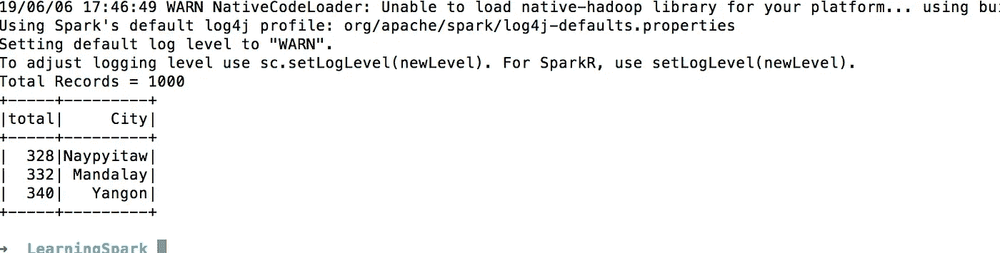

很灵活，对吧？

我们刚刚完成了 ETL 的**转换**部分。

最后**加载 ETL 的**部分。如果您想保存这些转换后的数据，该怎么办？你有很多选择，RDBMS，XML 或者 JSON。

`output.write.format('json').save('filtered.json')`

当您运行它时，Sparks 会创建以下文件夹/文件结构。

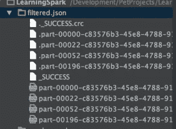

它用文件名创建了一个文件夹，在我们的例子中是 **filtered.json** 。然后，一个名为 **_SUCCESS** 的文件会告知操作是否成功。如果失败，将生成一个名为 **_FAILURE** 的文件。然后，您会在这里找到多个文件。之所以有多个文件，是因为每个工作都涉及到写入文件的操作。如果你想创建一个单独的文件(不推荐)，那么可以使用`coalesce`,从所有分区收集数据并减少到一个单独的数据帧中。

`output.coalesce(1).write.format('json').save('filtered.json')`

它将输出以下数据:

```
{"total":328,"City":"Naypyitaw"}
{"total":332,"City":"Mandalay"}
{"total":340,"City":"Yangon"}
```

# MySQL 和 Apache 火花集成

上面的数据帧包含转换后的数据。我们希望将这些数据加载到 MYSQL 中，以便进一步使用，如可视化或在应用程序上显示。

首先，我们需要 MySQL 连接器库来与 Spark 交互。我们将从 [MySQL 网站](https://cdn.mysql.com//Downloads/Connector-J/mysql-connector-java-8.0.16.tar.gz)下载连接器，并放在一个文件夹中。我们将修改`SparkSession`以包含 JAR 文件。

```
scSpark = SparkSession \
        .builder \
        .appName("reading csv") \
        .config("spark.driver.extraClassPath", "/usr/local/spark/jars/mysql-connector-java-8.0.16.jar") \
        .getOrCreate()
```

`output`现在看起来如下:

```
output = scSpark.sql('SELECT COUNT(*) as total, City from sales GROUP BY City')
    output.show()
    output.write.format('jdbc').options(
        url='jdbc:mysql://localhost/spark',
        driver='com.mysql.cj.jdbc.Driver',
        dbtable='city_info',
        user='root',
        password='root').mode('append').save()
```

在运行脚本之前，我在 DB 中创建了所需的 Db 和表。如果一切顺利，您应该会看到如下结果:

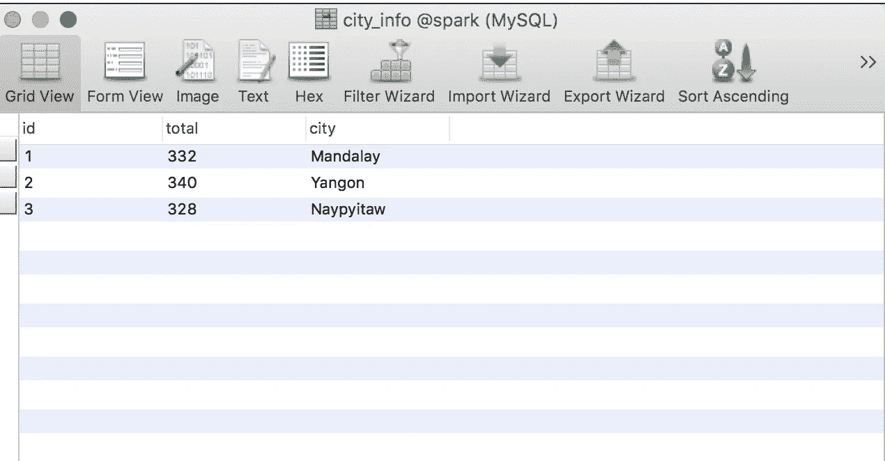

如您所见，Spark 使得从一个数据源向另一个数据源传输数据变得更加容易。

# 结论

Apache Spark 是一个非常苛刻和有用的大数据工具，它有助于非常容易地编写 ETL。您可以加载数 Pb 的数据，并通过建立一个包含多个节点的集群来轻松处理这些数据。本教程只是让您对 Apache Spark 编写 ETL 的方式有一个基本的了解。您应该查看文档和其他资源来深入了解。

*本帖原载* [*此处*](http://blog.adnansiddiqi.me/create-your-first-etl-pipeline-in-spark-and-python/) *。*