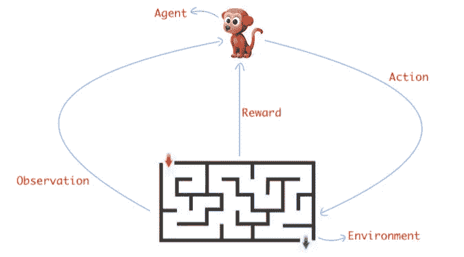

# 创造你自己的强化学习环境

> 原文：<https://towardsdatascience.com/create-your-own-reinforcement-learning-environment-beb12f4151ef?source=collection_archive---------5----------------------->

Image by [wallpaperplay](https://wallpaperplay.com/board/minecraft-background-wallpapers)

人们一直在使用**强化学习**来解决许多令人兴奋的任务。无论是简单的**雅达利**游戏，还是复杂的**围棋**和 **Dota** 游戏。强化学习不仅能够解决任务，而且实现了超人的表现。

> 在这篇博客中，我们不仅要解决另一个强化学习环境，还要从头开始创建一个。

对于那些不熟悉**强化学习**并想知道什么是**环境**的人，让我简单介绍一下。即使你是机器学习的新手，在这篇博客结束时，你也会学到很多东西。

# 强化学习|简介

强化学习是机器学习的一个分支，我们有一个**代理**和一个**环境**。环境只不过是一个任务或模拟，而代理是一个与环境交互并试图解决它的人工智能算法。

在下图中，环境就是****迷宫**。代理的目标是通过采取最佳行动来解决这个迷宫。**

****

**从图中可以清楚地看出代理和环境是如何相互作用的。代理向环境发送动作，环境在执行从代理接收的每个动作后向代理发送观察和奖励。观察不过是环境的内部状态。奖励意味着这个行为有多好。随着我们继续浏览博客，情况会变得更清楚。**

**因此，为了应用强化学习，我们需要两样东西。**

*   ****Agent** :一种 AI 算法。**
*   ****环境**:需要代理解决的任务/模拟。**

**环境通过发送它的状态和奖励与代理交互。因此，下面是创建环境的步骤。**

*   **创建一个模拟。**
*   **添加一个代表模拟内部状态的**状态向量**。**
*   **在模拟中添加一个**奖励系统**。**

**让我们现在开始构建环境。**

# **创造环境**

**我要用 python 制作一个非常简单的游戏。一旦我们完成游戏，我们可以在其中添加**状态**向量和**奖励**系统。就这样，我们有了第一个强化学习环境。**

**这场比赛将是一场简单的球拍和球的比赛。我们在地上放了一个桨，桨需要击打移动的球。如果球触地而不是触板，那就是失误。**

**我将使用 python 中内置的 **turtle** 模块。Turtle 提供了一个简单易用的界面来构建和移动不同的形状。大部分代码都是不言自明的，所以我将简单介绍一下这些代码。现在没有必要深入研究代码语法。**

**让我们为我们的游戏创建一个背景窗口。**

**Creating a background window**

**我们创建了一个大小为`(600, 600)`像素的空白窗口。窗口的中点坐标是`(0, 0)`。意味着我们可以上下左右移动 300 个像素。**

****

**Blank Screen**

**酷，10%环境完成。让我们在底部加一个桨，在中间加一个球。**

**Adding paddle and ball**

****

**Paddle and Ball**

**太好了，现在 20%的环境已经完成。让我们在按下左右键时添加左右移动。**

**Adding paddle movement**

**我们创建了两个函数来左右移动球拍。然后我们用左右键绑定这些函数。表示按下右箭头键，函数 *paddle_right* 被调用，paddle 向右移动 20 个像素。**

****

**Paddle Movement**

**太棒了，我们已经完成了 30%的环境。现在让我们添加球的运动。**

**Adding ball movement**

**对于球，我设置水平速度为 3，垂直速度为-3。意味着球在每一帧后水平移动 3 个像素，垂直移动-3 个像素。所以对于每一帧，我们必须使用球的速度来更新球在主循环中的位置。**

****

**Ball Movement**

**现在完成了 40 %。但是等等，球刚刚穿过屏幕。应该是撞上了侧墙。所以我们必须在代码中加入以下边界检查。**

*   **球应该与上面的球和侧面的球碰撞。**
*   **球应该和桨碰撞。**
*   **如果球碰到了地面，那么游戏应该从头开始。**

**Adding boundary checks**

****

**看起来不错。这个已经做了七成了。让我们在棺材上钉上最后一颗钉子，那就是记分卡。**

**Adding scorecard**

**我们维护两个变量，分别叫做`hit`和`miss`。如果球击中了球拍，我们增加`hit`，否则增加`miss`。然后我们可以创建一个记分卡，在屏幕的顶部中间打印分数。**

****

**Scorecard**

**现在，这看起来像一个适当的游戏。我们现在已经完成了 90%的环境。剩下的就是在这个模拟中添加一个**状态**向量和**奖励**系统。**

## **状态向量和奖励系统**

**我们将状态向量提供给我们的人工智能代理，代理基于该状态选择一个动作。状态向量应该包含有价值的信息。代理采取的行动的好坏取决于状态向量的信息量。**

**我创建了一个包含以下信息的状态向量。**

*   **桨叶棒在 x 轴上的位置**
*   **球在 x 和 y 轴上的位置**
*   **球在 x 轴和 y 轴的速度**

**以下是我实施的奖励制度。**

*   **如果球碰到了球拍，奖励`+3`**
*   **球没打中桨就给奖励`-3`。**
*   **每次划桨移动给予`-0.1`的奖励，这样划桨就不会不必要的移动。**

**我们还必须实现一个行动空间。代理将从动作空间中选择一个动作，并将其发送到环境中。以下是我实现的动作空间。**

*   **`0` -向左移动桨。**
*   **`1`——什么都不做。**
*   **`2` -向右移动拨片。**

**代理将把这些数字中的一个发送给环境，环境执行对应于该数字的动作。**

**Adding reward and state vector**

**所有这些都包含在这个小小的**步骤**函数中。这是代理与环境交互的功能。代理调用此函数，并在参数中提供操作值。并且这个函数将**状态**向量和**奖励**返回给代理。这个函数还返回一个变量，这个变量是**完成的**。这将告诉代理剧集是否终止。在我们的例子中，当球触地时一集结束，新的一集开始。当你把这些代码放在一起看的时候，它们会更有意义。**

**最后，它 100%完成了。看起来不错。现在就来解决吧。**

# **解决环境问题**

**这个博客的主要焦点是创造环境。因此，我将在这篇博客中简要介绍代理算法。**

**我已经实现了 **DQN** 算法来解决这个任务。我们在这个算法的核心使用了一个**神经网络**，它以状态作为输入，输出动作。DQN 还有更多，你可以在 DQN 的这篇令人敬畏的 [**论文**](https://www.cs.toronto.edu/~vmnih/docs/dqn.pdf) 中找到。**

**以下是代理人玩游戏的片段。球拍经常在 49 次失误后开始击球。**

****

**Agen playing the game**

**下面是一个奖励/情节。代理在 30 集后开始实现频繁的高回报。**

****

**暂时就这样了。我们从头开始创建了一个非常简单的环境，并使用 DQN 解决了这个问题。以下是包含完整代码的 GitHub 库。我会继续贴出更多很酷的项目，在那之前请保持关注。**

** [## shivaverma/轨道

### 强化学习环境的开源集合。

github.com](https://github.com/shivaverma/Orbit)** 

## **注意**

> **我正在开发一个名为 [**Orbit**](https://github.com/shivaverma/Orbit) 的开源项目，这将是一个强化学习环境的集合。如果你有任何令人兴奋的想法，并通过创建自己的环境为这个包做出贡献，请在**shivajbd@gmail.com**上 ping 我。如果需要的话，我很乐意为你提供个人指导。**