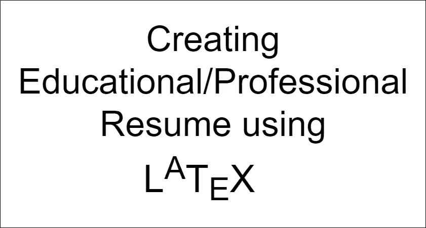
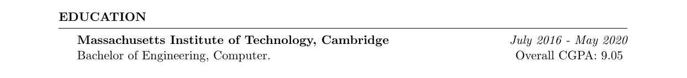
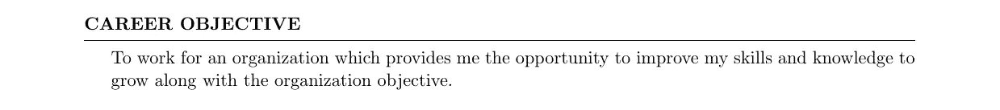
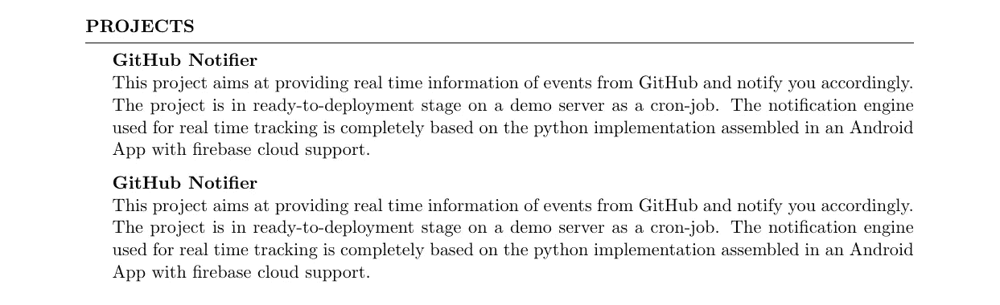
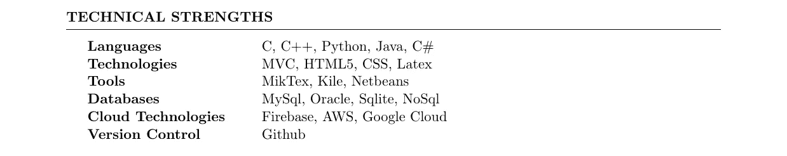
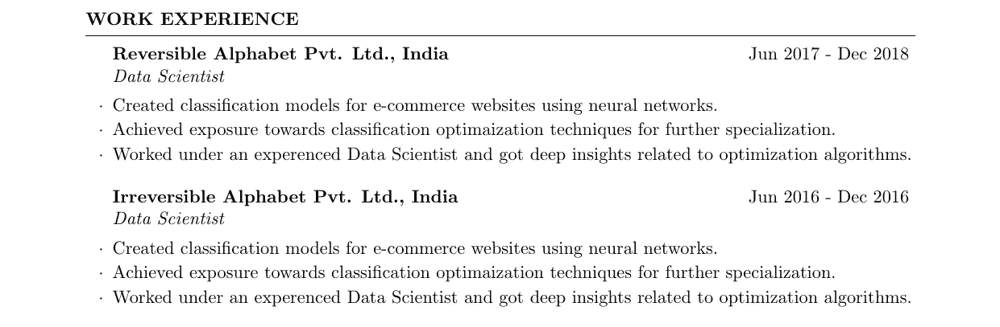
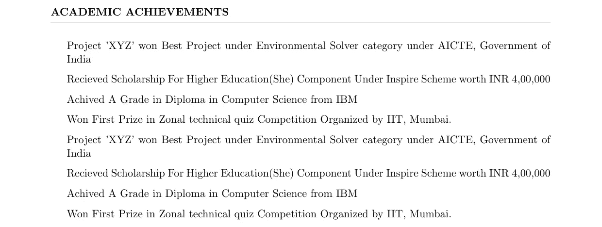
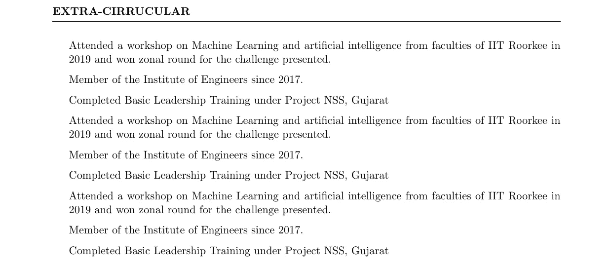
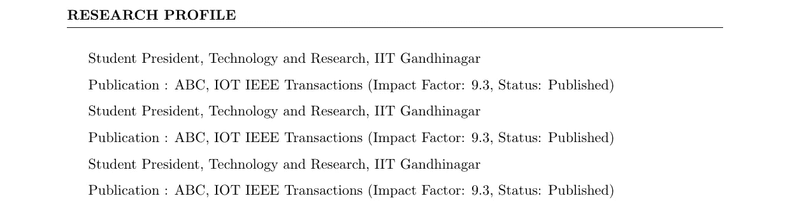
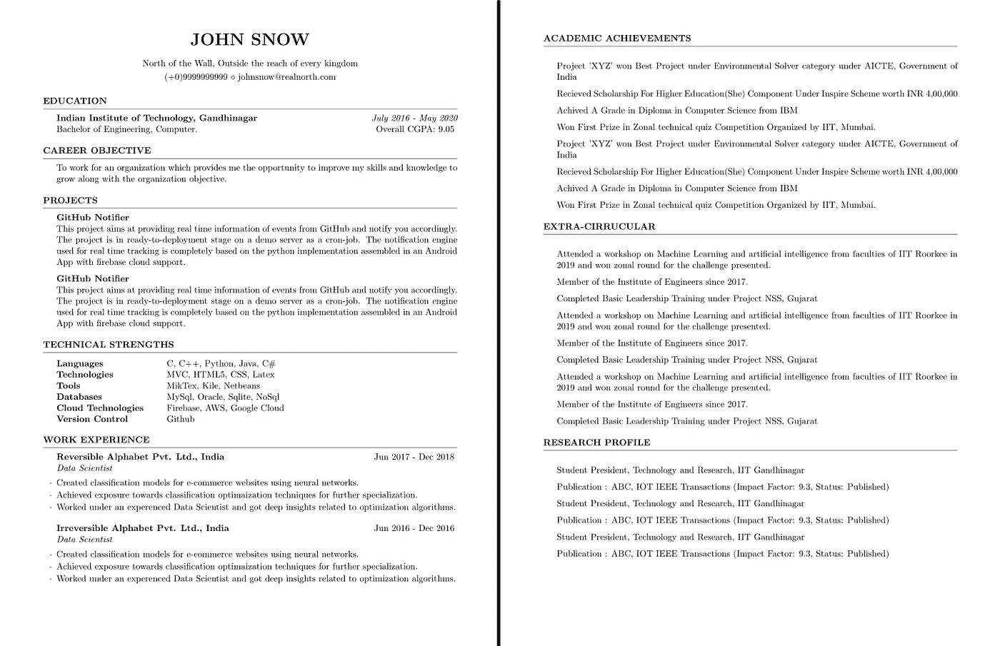

# 使用 LaTeX 创建您的专业/教育简历

> 原文：<https://towardsdatascience.com/create-your-professional-educational-resume-using-latex-7bc371f201e3?source=collection_archive---------6----------------------->

一份简历可以被认为是你在雇主面前的第一印象。简历是向你未来的雇主宣布你是这个职位的最佳人选的最合适的方式。在本教程中，我将演示如何使用 LaTeX 环境为您未来的工作创建一份组织良好的专业简历。



引人注目的简历背后的主要动机是展示你的基本资产，如你的资历、经验、成就、能力和品质。根据招聘经理(雇主)的典型心态，据观察，雇主只需几秒钟就能决定是否给这个人打电话面试。正如在企业界普遍经历的那样，拥有必要技能和适当经验的人得不到面试电话的情况经常发生。这是因为申请这份工作的人没有在简历中清楚地宣传自己。

因此，要准备一份令人信服的简历，在职业生态系统中应该遵循一定的标准。遵循预先定义的规则并不意味着每份申请/简历都要遵循特定的格式。每份简历都可以根据申请人向雇主展示自己的方式而有所不同。简历是一种有效描述专业/教育背景的方式，可以吸引监考员。

使用通用文本编辑器，如微软 Word 或谷歌文档，可以达到保存简历草稿的初步目的。这些编辑坚持“所见即所得”的方式来编排作品。然而，使用这样的编辑器在整个简历中遵循特定的格式/编辑标准会花费很多不必要的努力。由于这些问题，促使我向读者介绍 [LaTeX 环境](https://www.latex-project.org/)。LaTeX 是学术和研究团体用于出版其作品的文档准备系统。具体来说，作者使用标记惯例来格式化整个文档中的文本，添加引用和交叉引用，以及定义文档的结构。LaTeX 使用 TeX 发行版，如 [TeX Live](https://www.tug.org/texlive/) 或 [MikTeX](https://miktex.org/) 来生成适合打印或数字发行的输出文件(PDF)。

在 LaTeX 中准备简历可以降低格式化文档所需的整体复杂性；因此，对于每一个专业人士来说，了解基本的 LaTeX 语法来构建简历是非常必要的。在本教程中，我将从几个方面讲述如何创建一份强大而有效的简历，这份简历将涵盖申请的每一个要素。

首先，每个 LaTeX 文件可以包含一个特定的样式类文件，通常称为 ***。cls*T3，它定义了文档的所有样式规则。这个类文件的功能类似于网页设计中的 CSS 文件。网上有多种类型的文件可以用来制作简历，其中我更喜欢由 [Trey Hunner](https://github.com/treyhunner/resume/blob/master/resume.cls) 提供的文件。这个文件是一个简单而有效的方式来展示你自己。从下面提供的链接下载类文件:**

> [ridhamdave/resume-latex/blob/master/resume . cls](https://github.com/ridhamdave/resume-latex/blob/master/resume.cls)

每个 LaTeX 文件都以“文档”对象开始和结束。为了演示:

```
\documentclass{resume} % The style class
\begin{document}
.
.
.
\end{document}
```

让我们开始创建简历，第一项任务是在页面顶部提供个人详细信息，这也称为地址部分。这一部分将出现在包含有关您的姓名、地址、电话号码和电子邮件地址的详细信息的文档的顶部。这里提供的类文件为标题和其他联系信息定义了某些标签(标记)。在文档开始之前添加这一行，以反映引言部分。

```
\name{John Snow} % Your name
\address{North of the Wall, Outside the reach of every kingdom} 
\address{(+0)9999999999 \\ [johnsnow@realnorth.com](mailto:johnsnow@realnorth.com)}
```


Introduction Section above the first page

下一部分对每一个大学毕业生来说都是最重要的，也就是教育背景。这一部分必须包括所读的学位、教育机构、其附属大学以及总的 CGPA/分数。这个类文件提供了一个预定义的“rSection”标签，用于区分简历的各个部分。该部分的花括号包含该部分的名称，在\begin 和\end 之间的条目代表实际需要的内容。

这里，\bf 代表**粗体**，而\em 代表*斜体*，\hfill 命令用于在页面的右侧和侧面之间提供适当的格式空间。教育部分如下所示，输入到实际文档中:

```
\begin{rSection}{Education}{\bf Massachusetts Institute of Technology, Cambridge} \hfill {\em July 2016 - May 2020} 
\\ Bachelor of Engineering, Computer.\hfill { Overall CGPA: 9.05 }\end{rSection}
```



Education section

下一部分可以被认为是职业和个人的主要职业目标。这一部分可以定义为“职业目标”，如下所示:

```
\begin{rSection}{Career Objective}
 To work for an organization which provides me the opportunity to improve my skills and knowledge to grow along with the organization objective.
\end{rSection}
```



Career’s long-term goal

从学术角度来看，项目在学习实践技能方面起着至关重要的作用。因此，我考虑将“项目”部分放在文档的这个位置。这是一个可以根据个人喜好修改的方面。对于这一部分，一般惯例是项目的名称以粗体显示，而摘要则从下一行开始以普通文本显示，如下所述。这里双斜杠(\\)表示新行。我将同一个项目重复了两次，以演示项目之间的确切间距。

```
\begin{rSection}{Projects}{\bf GitHub Notifier}
\\This project aims at providing real time information of events from GitHub and notify you accordingly. The project is in ready-to-deployment stage on a demo server as a cron-job. The notification engine  used for real time tracking is completely based on the python implementation assembled in an Android App with firebase cloud support.{\bf GitHub Notifier}
\\This project aims at providing real time information of events from GitHub and notify you accordingly. The project is in ready-to-deployment stage on a demo server as a cron-job. The notification engine  used for real time tracking is completely based on the python implementation assembled in an Android App with firebase cloud support.\end{rSection}
```



Project section. Note the spacing between each project

简历的下一步是简单明了地展示你拥有的技能和技术优势。因此，无边框的桌子最适合这种视觉美感。表格部分用于创建表格，如下所示。“&”运算符用于各列的多样化，而“\”运算符用于新的行连接。

```
\begin{rSection}{Technical Strengths}\begin{tabular}{ @{} >{\bfseries}l @{\hspace{6ex}} l }
Languages \ & C, C++, Python, Java, C\#  \\
Technologies & MVC, HTML5, CSS, Latex\\
Tools & MikTex, Kile, Netbeans \\
Databases & MySql, Oracle, Sqlite, NoSql\\
Cloud Technologies & Firebase, AWS, Google Cloud\\
Version Control & Github
\end{tabular}\end{rSection}
```



Tabular Demonstration of Technical Strengths

下一部分被认为是你简历中最重要的部分之一，即“工作经历”部分。这一部分需要简要描述你对之前工作过的公司的贡献。在实习的情况下，这个人应该提到这一点，并相应地总结在公司中的角色。类文件为此类条目提供了一个“rSubsection”模板，它可能需要多个标记来表示雇员名称、公司名称、工作持续时间等..一个区段将包含一个子区段，用于工作概况的每个条目，如下所示。在这里，每个汇总点都用一个\item 标签声明，以实现相等的间距和设计。

```
\begin{rSection}{Work Experience}
\begin{rSubsection}{Reversible Alphabet Pvt. Ltd., India}{Jun 2017 - Dec 2018}{Data Scientist}{}
 \item Created classification models for e-commerce websites using neural networks.
 \item Achieved exposure towards classification optimaization techniques for further specialization.
 \item Worked under an experenced Data Scientist and got deep insights related to optimization algorithms.
\end{rSubsection}
\begin{rSubsection}{Irreversible Alphabet Pvt. Ltd., India}{Jun 2016 - Dec 2016}{Data Scientist}{}
 \item Created classification models for e-commerce websites using neural networks.
 \item Achieved exposure towards classification optimaization techniques for further specialization.
 \item Worked under an experenced Data Scientist and got deep insights related to optimization algorithms.
\end{rSubsection}\end{rSection}
```



Note individual entry for each Job

类似地，学术成就、课外活动和研究概况等部分可以通过以下方式添加。每个部分都可以添加，如下例所示:

```
\begin{rSection}{Academic Achievements} 
\item Project 'XYZ' won Best Project under Environmental Solver category under AICTE, Government of India
\item Recieved Scholarship For Higher Education(She) Component Under Inspire Scheme worth INR 4,00,000
\item Achived A Grade in Diploma in Computer Science from IBM
\item Won First Prize in Zonal technical quiz Competition Organized by IIT, Mumbai.
\item Project 'XYZ' won Best Project under Environmental Solver category under AICTE, Government of India
\item Recieved Scholarship For Higher Education(She) Component Under Inspire Scheme worth INR 4,00,000
\item Achived A Grade in Diploma in Computer Science from IBM
\item Won First Prize in Zonal technical quiz Competition Organized by IIT, Mumbai.
\end{rSection} 
```



Point-vise academic achievements

```
\begin{rSection}{Extra-Cirrucular} 
\item Attended a workshop on Machine Learning and artificial intelligence from faculties of IIT Roorkee in 2019 and won zonal round for the challenge presented.
\item Member of the  Institute of Engineers since 2017.
\item Completed Basic Leadership Training under Project NSS, Gujarat
\item Attended a workshop on Machine Learning and artificial intelligence from faculties of IIT Roorkee in 2019 and won zonal round for the challenge presented.
\item Member of the  Institute of Engineers since 2017.
\item Completed Basic Leadership Training under Project NSS, Gujarat
\item Attended a workshop on Machine Learning and artificial intelligence from faculties of IIT Roorkee in 2019 and won zonal round for the challenge presented.
\item Member of the  Institute of Engineers since 2017.
\item Completed Basic Leadership Training under Project NSS, Gujarat\end{rSection}
```



Extra Curricular Activities need to be emphasized

同样，研究部分需要与充分记录和引用的论文一起提交，例如(带有期刊/会议名称):

```
\begin{rSection}{Research Profile}
 \item Student President, Technology and Research, IIT Gandhinagar
 \item Publication : ABC, IOT IEEE Transactions (Impact Factor: 9.3, Status: Published)
 \item Student President, Technology and Research, IIT Gandhinagar
 \item Publication : ABC, IOT IEEE Transactions (Impact Factor: 9.3, Status: Published)
 \item Student President, Technology and Research, IIT Gandhinagar
 \item Publication : ABC, IOT IEEE Transactions (Impact Factor: 9.3, Status: Published)
\end{rSection}
```



Research Work

最后，在添加了简介的所有方面之后，需要对文档进行最终校对，并需要准备最终草稿。如果有错误或含糊不清的地方，让同事来纠正应该是一种惯例。简历构建是一项反复的任务，需要不断的调整和完善，只有付出足够的努力才能实现。下面的 GitHub 链接提供了简历的所有 LaTeX 代码。

> https://github . com/ridhamdave/resume-latex/blob/master/resume . tex

最终的 PDF 如下所示:



Final Resume

总结一下，你现在手里有一份很棒的简历，为了让它更好，需要定期更新。在简历制作过程中，有两个词应该牢记在心，那就是:

> **精确的**和**简洁的**

希望你学到了有效构建简历的新技术，并且更熟悉这种专业任务的 LaTeX 环境。

感谢您的关注。

也可以在 LinkedIn 上关注我。