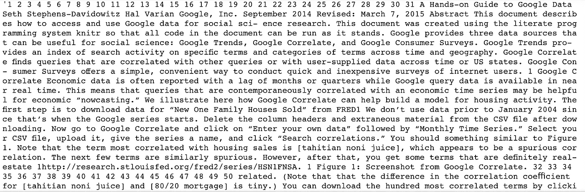
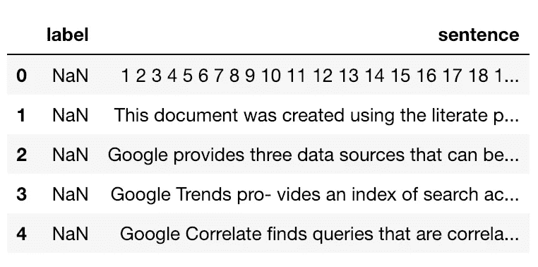
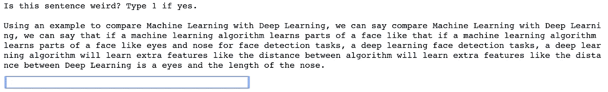
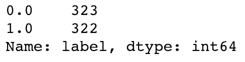
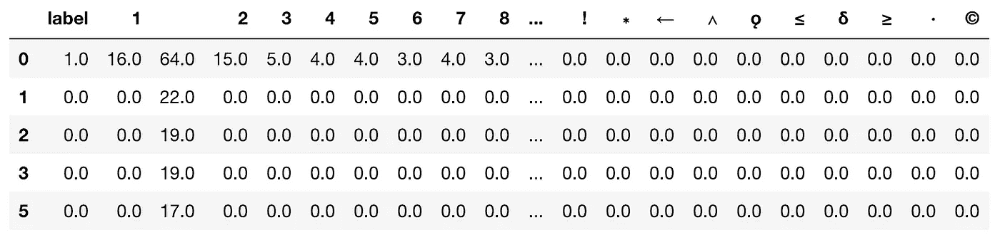
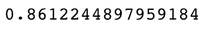
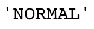
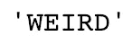

# 为文本清理创建自定义分类器

> 原文：<https://towardsdatascience.com/creating-a-custom-classifier-for-text-cleaning-a2a1fc818935?source=collection_archive---------15----------------------->

## 句子分类的机器学习


最近，我对 NLP 的研究超过了其他数据科学领域，我经常面临的一个挑战是该过程的清理部分。构建 NLP 模型需要许多预处理步骤，如果数据处理不当，可能会导致模型质量差，而这正是我们想要避免的。

在本文中，我们将重点关注 PDF 文档。这里的目标是打开一个 PDF 文件，将其转换为纯文本，了解数据清理的需要，并为此建立一个机器学习模型。

在本帖中，我们将:

*   打开 PDF 文件并将其转换为文本字符串
*   将文本分割成句子并建立数据集
*   通过用户交互手动标记数据
*   制作一个分类器来删除不需要的句子

我们将要使用的一些库:

*   *pdfminer* →阅读 PDF 文件
*   *文本斑点* →文本处理
*   *熊猫* →数据分析

# PDF 阅读器

和往常一样，我会试着解释文本中使用的代码，所以如果你愿意，可以跳过这些代码片段。让我们从导入一些模块开始:

```
from collections import Counter
from IPython.display import clear_output
from pdfminer.converter import TextConverter
from pdfminer.layout import LAParams
from pdfminer.pdfinterp import PDFResourceManager
from pdfminer.pdfinterp import PDFPageInterpreter
from pdfminer.pdfpage import PDFPage
from textblob import TextBlob
import io
import math
import numpy as np
import pandas as pd
import string
```

我们将使用 *pdfminer* 来构建我们的 PDF 阅读器:

```
def read_pdf(path):
    rsrcmgr = PDFResourceManager()
    retstr = io.StringIO()
    codec = 'utf-8'
    laparams = LAParams()
    device = TextConverter(rsrcmgr, retstr, codec=codec, laparams=laparams)
    fp = open(path, 'rb')
    interpreter = PDFPageInterpreter(rsrcmgr, device)
    password = ""
    maxpages = 0
    caching = True
    pagenos=set()
    for page in PDFPage.get_pages(fp, pagenos, maxpages=maxpages, password=password, caching=caching, check_extractable=True): 
        interpreter.process_page(page)
    text = retstr.getvalue()
    text = " ".join(text.replace(u"\xa0", " ").strip().split())  
    fp.close()
    device.close()
    retstr.close()
    return text
```

虽然这个函数看起来很长，但它只是读取一个 PDF 文件并以字符串形式返回它的文本。我们将把它应用到一篇名为“谷歌数据实用指南”的论文中:

只要看第一页，我们很快就会发现，一篇文章包含的不仅仅是简单的句子，还包括像**日期**、**行数**、**页码**、**数字**、**标题和副标题**、**节分隔符**、**等式、**等等。让我们来看看当论文被转换成纯文本时，这些属性将如何显示(*primer.pdf*是文件的名称，存储在我的本地计算机中):

```
read_pdf('primer.pdf')
```



很明显，我们丢失了所有的文本结构。行数和页码分散开来，因为它们是句子的一部分，而标题和参考文献无法与正文明确区分。可能有很多方法可以让你在阅读 PDF 时保留文本结构，但是为了便于解释，让我们保持混乱状态(因为这通常就是原始文本数据的样子)。

# 文本清理

一个完整的清洗管道有许多步骤，为了熟悉它们，我建议遵循一些教程([这个](https://machinelearningmastery.com/clean-text-machine-learning-python/)和[这个](https://www.analyticsvidhya.com/blog/2018/02/the-different-methods-deal-text-data-predictive-python/)是很好的起点)。一般来说，清洗流程链包括:

*   标记化
*   正常化
*   实体提取
*   拼写和语法纠正
*   删除标点符号
*   删除特殊字符
*   词干

我们在这里的目标不是取代任何一个阶段，而是建立一个更通用的工具来删除我们不需要的东西。把它作为辅助步骤，在中间帮忙。

假设我们想要删除任何看起来不像人类写的句子。这个想法是将那些句子归类为“不想要的”或“怪异的”，而将其余的句子视为“正常的”。例如:

> 32 33 34 35 36 37 38 39 40 41 42 43 44 45 46 47 48 49 50 相关。

或者

> 51 52 53 54 55 #从关联中读取数据，并使其成为动物园时间序列 dat

Those sentences are clearly messed up because of the text transformation and in case we're making, let's say, a PDF summarizer, they shouldn't be included.

To remove them, we could manually analyze the text, figure out some patterns and apply [正则表达式](https://docs.python.org/2/library/re.html)。但是，在某些情况下，为我们建立一个发现这些模式的模型可能会更好。这就是我们在这里做的。我们将创建一个分类器来识别奇怪的句子，这样我们就可以轻松地将它们从正文中删除。

# 构建数据集

让我们构建一个函数来打开 PDF 文件，将文本拆分成句子并保存到一个数据框中，该数据框包含列*标签*和*句子*:

```
def pdf_to_df(path):
    content = read_pdf(path)
    blob = TextBlob(content)
    sentences = blob.sentences
    df = pd.DataFrame({'sentence': sentences, 'label': np.nan})
    df['sentence'] = df.sentence.apply(''.join)
    return dfdf = pdf_to_df('primer.pdf')
df.head()
```



由于我们没有标记数据(在“怪异”或“正常”中)，我们将手动填充我们的*标签*列。这个数据集将是可更新的，以便我们可以附加新的文件，并标记他们的句子。

让我们首先将未标记的数据集保存到一个*中。泡菜*文件:

```
df.to_pickle('weird_sentences.pickle')
```

现在，我们将创建一个用户交互功能来手动分类数据点。对于数据集中的每个句子，我们将显示一个文本框，供用户键入“1”或不键入任何内容。如果用户键入‘1’，该句子将被分类为‘怪异’。

我使用的是 Jupyter 笔记本，所以我从 IPython.display 调用了 clear_output()函数来改善交互。

```
def manually_label(pickle_file):
    print('Is this sentence weird? Type 1 if yes. \n')
    df = pd.read_pickle(pickle_file)
    for index, row in df.iterrows():
        if pd.isnull(row.label):
            print(row.sentence)
            label = input()
            if label == '1':
                df.loc[index, 'label'] = 1
            if label == '':
                df.loc[index, 'label'] = 0
            clear_output()
            df.to_pickle('weird_sentences.pickle')

    print('No more labels to classify!')manually_label('weird_sentences.pickle')
```

每个句子的输出如下所示:



由于这句话看起来挺正常的，我就不打' 1 '了，直接按*回车*进入下一句。这个过程将一直重复，直到数据集被完全标记或者当您中断时。每一个用户输入都被保存到 *pickle* 文件中，因此数据集在每一个句子中都被更新。这种简单的交互使得标记数据变得相对较快。我花了 20 分钟标记了大约 500 个数据点。

为了简单起见，还编写了另外两个函数。一个用于将另一个 PDF 文件附加到我们的数据集，另一个用于重置所有标签(将*标签*列值设置为 *np.nan* )。

```
def append_pdf(pdf_path, df_pickle):
    new_data = pdf_to_df(pdf_path)
    df = pd.read_pickle(df_pickle)
    df = df.append(new_data)
    df = df.reset_index(drop=True)
    df.to_pickle(df_pickle)def reset_labels(df_pickle):
    df = pd.read_pickle(df_pickle)
    df['label'] = np.nan
    df.to_pickle(df_pickle)
```

由于我们最终得到了更多“正常”而非“怪异”的句子，我构建了一个函数来对数据集进行欠采样，否则，一些机器学习算法将无法很好地执行:

```
def undersample(df, target_col, r=1):
    falses = df[target_col].value_counts()[0]
    trues = df[target_col].value_counts()[1]
    relation = float(trues)/float(falses) if trues >= r*falses:
        df_drop = df[df[target_col] == True]
        drop_size = int(math.fabs(int((relation - r) * (falses))))
    else: 
        df_drop = df[df[target_col] == False]
        drop_size = int(math.fabs(int((r-relation) * (falses)))) df_drop = df_drop.sample(drop_size)
    df = df.drop(labels=df_drop.index, axis=0)
    return dfdf = pd.read_pickle('weird_sentences.pickle').dropna()
df = undersample(df, 'label')
df.label.value_counts()
```



645 个标记的数据点。不足以制作一个像样的模型，但我们会用它作为一个操场的例子。

# 文本转换

现在，我们需要以算法可以理解的方式转换句子。一种方法是计算每个字符在句子中的出现次数。这有点像是一种文字袋技术，但是是在角色层面上。

```
def bag_of_chars(df, text_col):
    chars = []
    df['char_list'] = df[text_col].apply(list)
    df['char_counts'] = df.char_list.apply(Counter)
    for index, row in df.iterrows():
        for c in row.char_counts:
            df.loc[index, c] = row.char_counts[c]
    chars = list(set(chars))
    df = df.fillna(0).drop(['sentence', 'char_list', 'char_counts'], 1)
    return dfdata = bag_of_chars(df, 'sentence')
data.head()
```



# **机器学习模型**

完美！现在我们只剩下一个常见的机器学习挑战。一个分类问题中的多个特征和一个目标。让我们将数据分成训练集和测试集:

```
data = data.sample(len(data)).reset_index(drop=True)
train_data = data.iloc[:400]
test_data = data.iloc[400:]x_train = train_data.drop('label', 1)
y_train = train_data['label']
x_test = test_data.drop('label', 1)
y_test = test_data['label']
```

我们准备选择一个算法并检查它的性能。在这里，我使用逻辑回归来看看我们能实现什么:

```
from sklearn.linear_model import LogisticRegression
from sklearn.metrics import accuracy_scorelr = LogisticRegression()
lr.fit(x_train, y_train)accuracy_score(y_test, lr.predict(x_test))
```



86 %的准确率。对于小型数据集、浅层模型和字符包方法来说，这已经很不错了。唯一的问题是，尽管我们分成了训练和测试，但是我们是用我们训练的同一个文档来评估模型的。更合适的方法是使用新文档作为测试集。

让我们创建一个函数，使我们能够预测任何自定义句子:

```
def predict_sentence(sentence):
    sample_test = pd.DataFrame({'label': np.nan, 'sentence': sentence}, [0])
    for col in x_train.columns:
        sample_test[str(col)] = 0
    sample_test = bag_of_chars(sample_test, 'sentence')
    sample_test = sample_test.drop('label', 1)
    pred = lr.predict(sample_test)[0]
    if pred == 1:
        return 'WEIRD'
    else:
        return 'NORMAL'weird_sentence = 'jdaij oadao //// fiajoaa32 32 5555' 
```

正常句子:

> 我们刚刚建立了一个很酷的机器学习模型

```
normal_sentence = 'We just built a cool machine learning model'
predict_sentence(normal_sentence)
```



怪句:

> jdaij oadao //// fiajoaa32 32 5555

```
weird_sentence = 'jdaij oadao //// fiajoaa32 32 5555'
predict_sentence(weird_sentence)
```



我们的模特得分了！不幸的是，当我尝试更多的句子时，它显示出对其中一些句子进行分类的糟糕表现。单词袋(在这种情况下是字符)方法可能不是最好的选择，算法本身可以大大改进，我们应该标记更多的数据点，使模型变得可靠。这里的要点是，您可以使用相同的方法来执行许多不同的任务，例如识别特定的元素(例如链接、日期、名称、主题、标题、等式、引用等等)。使用正确的方式，文本分类可以是一个强大的工具，以帮助在清理过程中，不应该被视为理所当然。好清洁！

谢谢你一直读到最后。这是一篇关注文本分类以解决清理问题的文章。请关注我的个人资料，了解更多关于数据科学的信息，并随时向我提出任何意见或问题。下一篇帖子再见！