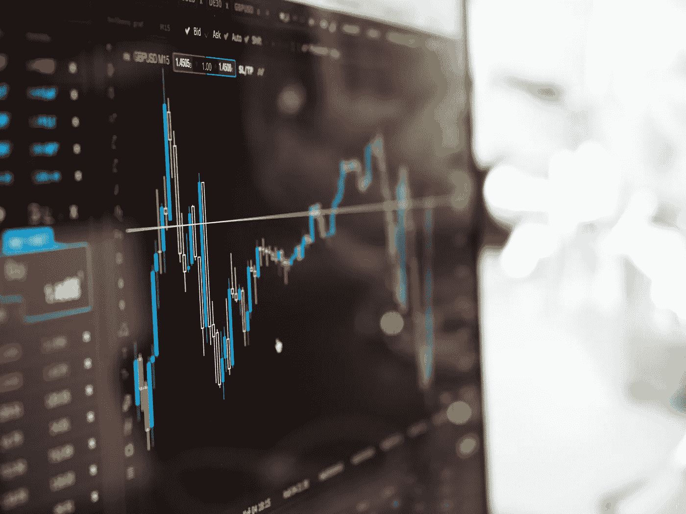

# 从头开始创建定制的健身房环境—股票市场示例

> 原文：<https://towardsdatascience.com/creating-a-custom-openai-gym-environment-for-stock-trading-be532be3910e?source=collection_archive---------1----------------------->

OpenAI 的`gym`是一个很棒的包，允许你创建定制的强化学习代理。它配备了相当多的预建环境，如[car pole](https://gym.openai.com/envs/#classic_control)、 [MountainCar](https://gym.openai.com/envs/#classic_control) 和[大量免费的 Atari 游戏](https://gym.openai.com/envs/#atari)以供试验。

这些环境非常适合学习，但最终您会希望设置一个代理来解决自定义问题。为此，您需要创建一个定制的环境，特定于您的问题域。稍后，我们将创建一个自定义的股票市场环境来模拟股票交易。本文的所有代码都可以在我的 [**GitHub**](https://github.com/notadamking/Stock-Trading-Environment) 上获得。

首先，让我们了解一下到底什么是环境。环境包含运行代理并允许其学习的所有必要功能。每个环境必须实现以下 *gym* 接口:

```
**import** gym
**from** gym **import** spaces

**class** **CustomEnv**(gym.Env):
  *"""Custom Environment that follows gym interface"""*
  metadata = {'render.modes': ['human']}

  **def** __init__(self, arg1, arg2, ...):
    super(CustomEnv, self).__init__() *# Define action and observation space*
    *# They must be gym.spaces objects* *# Example when using discrete actions:*
    self.action_space = spaces.Discrete(N_DISCRETE_ACTIONS) *# Example for using image as input:*
    self.observation_space = spaces.Box(low=0, high=255, shape=
                    (HEIGHT, WIDTH, N_CHANNELS), dtype=np.uint8)

  **def** step(self, action):
    # Execute one time step within the environment
    ... **def** reset(self):
    # Reset the state of the environment to an initial state
    ... **def** render(self, mode='human', close=False):
    # Render the environment to the screen
    ...
```

在构造函数中，我们首先定义我们的`action_space`的类型和形状，它将包含代理在环境中可能采取的所有动作。类似地，我们将定义`observation_space`，它包含代理要观察的所有环境数据。

我们的`reset`方法将被调用来周期性地将环境重置为初始状态。接下来是通过环境的许多`step`，其中一个动作将由模型提供，并且必须被执行，下一个观察结果被返回。这也是计算奖励的地方，稍后会详细介绍。

最后，可以定期调用`render`方法来打印环境的再现。这可能像打印语句一样简单，也可能像使用 openGL 渲染 3D 环境一样复杂。对于这个例子，我们将坚持使用打印语句。

# **股票交易环境**

为了演示这一切是如何工作的，我们将创建一个股票交易环境。然后，我们将培训我们的代理，使其成为该环境中的盈利交易者。我们开始吧！



我们需要考虑的第一件事是人类交易者会如何看待他们的环境。在决定进行交易之前，他们会做哪些观察？

交易者很可能会看一些股票价格走势图，上面可能会覆盖一些技术指标。从那时起，他们将把这些视觉信息与他们对类似价格行为的先验知识结合起来，对股票可能的走势做出明智的决定。

因此，让我们将此转化为我们的代理应该如何感知其环境。

我们的`observation_space`包含了我们希望经纪人在交易*或不交易*之前考虑的所有输入变量。在本例中，我们希望代理“看到”过去五天的股票数据点(开盘价、最高价、最低价、收盘价和日交易量)，以及其他一些数据点，如帐户余额、当前股票头寸和当前利润。

这里的直觉是，对于每个时间步，我们希望我们的代理考虑导致当前价格的价格行为，以及他们自己的投资组合的状态，以便为下一个行为做出明智的决定。

一旦交易者意识到他们的环境，他们需要采取行动。在我们代理的例子中，它的`action_space`将由三种可能性组成:买入一只股票，卖出一只股票，或者什么都不做。

但是这还不够。我们需要知道每次买入或卖出的股票数量。使用 gym 的`Box`空间，我们可以创建一个动作空间，该空间具有离散数量的动作类型(买入、卖出和持有)，以及连续的买入/卖出金额范围(分别为账户余额/头寸大小的 0-100%)。

您会注意到，金额对于保留操作不是必需的，但无论如何都会提供。我们的代理最初并不知道这一点，但随着时间的推移，应该会知道该金额与此行为无关。

在实施我们的环境之前，最后要考虑的是回报。我们希望激励长期持续的利润。在每一步，我们将把奖励设置为账户余额乘以到目前为止的时间步数的某个分数。

这样做的目的是在早期阶段延迟对代理人的过快奖励，并允许它在过于深入地优化单个策略之前进行充分的探索。它还将奖励那些在更长时间内保持较高余额的代理商，而不是那些使用不可持续的策略迅速赚钱的代理商。

## 履行

现在我们已经定义了我们的观察空间、行动空间和奖励，是时候实现我们的环境了。首先，我们需要在环境的构造函数中定义`action_space`和`observation_space`。环境期望传入一个包含要学习的股票数据的`pandas`数据帧。 [**Github repo**](https://github.com/adamjking3/Stock-Trading-Environment) 中提供了一个例子。

```
***class*** **StockTradingEnvironment**(*gym*.*Env*):
  """A stock trading environment for OpenAI gym"""
  metadata = {'render.modes': ['human']} **def** __init__(*self, df*):
    *super*(StockTradingEnv, self).__init__()
    self.df = df
    self.reward_range = (0, MAX_ACCOUNT_BALANCE)    # Actions of the format Buy x%, Sell x%, Hold, etc.
    self.action_space = spaces.Box(
      *low*=np.array([0, 0]), *high*=np.array([3, 1]), *dtype*=np.float16) # Prices contains the OHCL values for the last five prices
    self.observation_space = spaces.Box(
      *low*=0, *high*=1, *shape*=(6, 6), *dtype*=np.float16)
```

接下来，我们将编写`reset`方法，每当创建新环境或重置现有环境的状态时都会调用该方法。在这里，我们将设置每个代理的初始余额，并将其未平仓头寸初始化为一个空列表。

```
**def** reset(*self*):
  # Reset the state of the environment to an initial state
  self.balance = INITIAL_ACCOUNT_BALANCE
  self.net_worth = INITIAL_ACCOUNT_BALANCE
  self.max_net_worth = INITIAL_ACCOUNT_BALANCE
  self.shares_held = 0
  self.cost_basis = 0
  self.total_shares_sold = 0
  self.total_sales_value = 0

  # Set the current step to a random point within the data frame
  self.current_step = random.randint(0, len(self.df.loc[:, 'Open'].values) - 6) **return** self._next_observation()
```

我们将当前步骤设置为数据帧中的随机点，因为它本质上为我们的代理提供了来自同一数据集的更独特的体验。`_next_observation`方法编译最近五个时间步长的股票数据，附加代理的帐户信息，并将所有值调整到 0 到 1 之间。

```
***def*** _next_observation(*self*):
  # Get the data points for the last 5 days and scale to between 0-1
  frame = np.array([
    self.df.loc[self.current_step: self.current_step +
                5, 'Open'].values / MAX_SHARE_PRICE,
    self.df.loc[self.current_step: self.current_step +
                5, 'High'].values / MAX_SHARE_PRICE,
    self.df.loc[self.current_step: self.current_step +
                5, 'Low'].values / MAX_SHARE_PRICE,
    self.df.loc[self.current_step: self.current_step +
                5, 'Close'].values / MAX_SHARE_PRICE,
    self.df.loc[self.current_step: self.current_step +
                5, 'Volume'].values / MAX_NUM_SHARES,
   ]) # Append additional data and scale each value to between 0-1
  obs = np.append(frame, [[
    self.balance / MAX_ACCOUNT_BALANCE,
    self.max_net_worth / MAX_ACCOUNT_BALANCE,
    self.shares_held / MAX_NUM_SHARES,
    self.cost_basis / MAX_SHARE_PRICE,
    self.total_shares_sold / MAX_NUM_SHARES,
    self.total_sales_value / (MAX_NUM_SHARES * MAX_SHARE_PRICE),
  ]], *axis*=0) **return** obs
```

接下来，我们的环境需要能够采取`step`。在每一步，我们将采取指定的行动(由我们的模型选择)，计算奖励，并返回下一个观察结果。

```
***def*** step(*self*, *action*):
  # Execute one time step within the environment
  self._take_action(action) self.current_step += 1 **if** self.current_step > len(self.df.loc[:, 'Open'].values) - 6:
    self.current_step = 0 delay_modifier = (self.current_step / MAX_STEPS)

  reward = self.balance * delay_modifier
  done = self.net_worth <= 0 obs = self._next_observation() **return** obs, reward, done, {}
```

现在，我们的`_take_action`方法需要采取模型提供的动作，或者买入、卖出或者持有股票。

```
***def*** _take_action(*self*, *action*):
  # Set the current price to a random price within the time step
  current_price = random.uniform(
    self.df.loc[self.current_step, "Open"],
    self.df.loc[self.current_step, "Close"]) action_type = action[0]
  amount = action[1] **if** action_type < 1:
    # Buy amount % of balance in shares
    total_possible = self.balance / current_price
    shares_bought = total_possible * amount
    prev_cost = self.cost_basis * self.shares_held
    additional_cost = shares_bought * current_price self.balance -= additional_cost
    self.cost_basis = (prev_cost + additional_cost) / 
                            (self.shares_held + shares_bought)
    self.shares_held += shares_bought **elif** actionType < 2:
    # Sell amount % of shares held
    shares_sold = self.shares_held * amount . 
    self.balance += shares_sold * current_price
    self.shares_held -= shares_sold
    self.total_shares_sold += shares_sold
    self.total_sales_value += shares_sold * current_price self.netWorth = self.balance + self.shares_held * current_price **if** self.net_worth > self.max_net_worth:
    self.max_net_worth = net_worth **if** self.shares_held == 0:
    self.cost_basis = 0
```

现在唯一剩下要做的就是`render`将环境调整到屏幕上。为了简单起见，我们将只呈现到目前为止的利润和一些其他有趣的指标。

```
***def*** render(*self*, *mode*='human', *close*=False):
  # Render the environment to the screen
  profit = self.net_worth - INITIAL_ACCOUNT_BALANCE print(*f*'Step: {self.current_step}')
  print(*f*'Balance: {self.balance}')
  print(*f*'Shares held: {self.shares_held}
          (Total sold: {self.total_shares_sold})')
  print(*f*'Avg cost for held shares: {self.cost_basis}
          (Total sales value: {self.total_sales_value})')
  print(*f*'Net worth: {self.net_worth}
          (Max net worth: {self.max_net_worth})')
  print(*f*'Profit: {profit}')
```

我们的环境是完整的。我们现在可以用数据框实例化一个`StockTradingEnv`环境，并用来自[稳定基线](https://github.com/hill-a/stable-baselines)的模型测试它。

```
**import** gym
**import** json
**import** datetime **as** dt**from** stable_baselines.common.policies **import** MlpPolicy
**from** stable_baselines.common.vec_env **import** DummyVecEnv
**from** stable_baselines **import** PPO2**from** env.StockTradingEnv **import** StockTradingEnv**import** pandas **as** pddf = pd.read_csv('./data/AAPL.csv')
df = df.sort_values('Date')# The algorithms require a vectorized environment to run
env = DummyVecEnv([*lambda*: StockTradingEnv(df)])model = PPO2(MlpPolicy, env, *verbose*=1)
model.learn(*total_timesteps*=20000)obs = env.reset()
**for** i **in** range(2000):
  action, _states = model.predict(obs)
  obs, rewards, done, info = env.step(action)
  env.render()
```

当然，这只是为了好玩，来测试创建一个有趣的、定制的健身房环境，包括一些半复杂的动作、观察和奖励空间。如果我们真的想在股票市场上通过深度学习致富，这将需要更多的时间和努力…

请继续关注下周的文章，在那里我们将学习[为我们的环境创建简单而优雅的可视化效果](/visualizing-stock-trading-agents-using-matplotlib-and-gym-584c992bc6d4)！

[](/creating-bitcoin-trading-bots-that-dont-lose-money-2e7165fb0b29) [## 创造不赔钱的比特币交易机器人

### 让我们使用深度强化学习来制造有利可图的加密货币交易代理

towardsdatascience.com](/creating-bitcoin-trading-bots-that-dont-lose-money-2e7165fb0b29) 

*感谢阅读！一如既往，本教程的所有代码都可以在我的* [*GitHub*](https://github.com/notadamking/Stock-Trading-Environment) *上找到。如果您有任何问题或反馈，请在下面留下评论，我很乐意收到您的来信！我也可以通过@notadamking 上的*[*Twitter*](https://twitter.com/notadamking)*联系到。*

*你也可以通过下面的链接在* [*Github 赞助商*](https://github.com/users/notadamking/sponsorship) *或者*[*Patreon*](https://www.patreon.com/join/notadamking)*上赞助我。*

[](https://github.com/users/notadamking/sponsorship) [## GitHub 赞助商

### 嗨，我是亚当。我是一名开发人员、作家和企业家，尤其对深度…

github.com](https://github.com/users/notadamking/sponsorship) 

> Github 赞助商目前正在 1:1 匹配所有捐款，最高可达 5000 美元！

[](https://patreon.com/notadamking) [## 亚当·金正在创造改变世界的内容

### 嗨，我是亚当。我是一名开发人员、作家和企业家，尤其对深度…

patreon.com](https://patreon.com/notadamking)