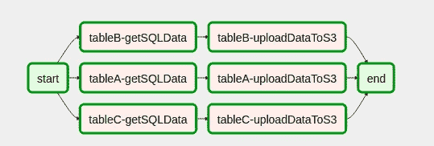

# 使用 Apache 气流创建动态 DAG

> 原文：<https://towardsdatascience.com/creating-a-dynamic-dag-using-apache-airflow-a7a6f3c434f3?source=collection_archive---------3----------------------->

今天我们想和你分享一个我们用 Apache 气流解决的问题。我们有一个包含 40 多个应用程序的项目。每天，我们都必须将数据从内部数据库加载到云中，特别是 AWS S3 公司。该过程批量执行，每天执行。由于特殊原因，数据必须在没有任何进一步预处理的情况下加载到 S3。要加载到 AWS S3 的表可能会定期变化，因此添加这样的表作为输入源应该更容易——因为我们不想为数据库中的每个表创建 DAG。

我们决定通过自动生成气流 DAG 来解决上述问题。特别是，我们设计的解决方案使 DAG 工作流可以从一个简单的 YAML 生成，*即*，给定一个包含要加载到 AWS S3 的表名的 YAML 文件，Airflow 应该自动生成 DAG 任务来加载这些数据。因此，在本帖中，我们想带您了解我们的解决方案。我们希望你会发现它有用！

# YAML 文件

要加载到 S3 的表应该在 YAML 文件中指定。此外，由于这是一个批处理过程，我们需要包含一个日期类型字段，用于根据执行日期过滤这样的表。因此，我们执行增量加载，*，即*，仅将前一天的数据加载到 S3。

# 动态任务生成

一旦定义了 YAML 文件结构，我们就可以为我们的动态 DAG 构建逻辑了！因此，首先要做的是使用[虚拟操作符](https://airflow.apache.org/_api/airflow/operators/dummy_operator/index.html)、*定义两个任务，即*开始和结束任务。在这些任务中，我们将通过在它们之间动态创建任务来构建我们的 DAG，此时这可能有点混乱，但一旦您看到图表，一切都将变得清晰。

然后，下一步是定义允许创建 DAG 任务的 Python 函数。特别是，我们通过使用 PythonOperators 来创建这样的任务。该函数应接收任务 id 作为参数；要执行的 python 函数，*即*，python 运算符的*Python _ callable*；以及在执行过程中使用的一组参数。

> 我们将任务 id 作为一个参数。因此，我们可以通过 [XCOM](https://airflow.apache.org/concepts.html?highlight=xcom#xcoms) *在动态生成的任务之间交换数据，例如*。**

# 设置 DAG 工作流程

最后一步是将 DAG 的工作流放在一起，如果您已经做到这一点，这将非常容易。

这是我们的 DAG 在将代码放在一起后的样子

DAG automatically generated by using a YAML file

# 结论

在这篇文章中，我们介绍了一种在气流 DAG 中创建动态任务的方法。我们在本文中给出了函数 *getSQLData* 和 *upload_to_s3_task，*的定义，因为我们认为它们超出了本文的范围。

您可以在下一个代码片段中找到最终的代码

希望你觉得有用。

感谢阅读到最后！:)