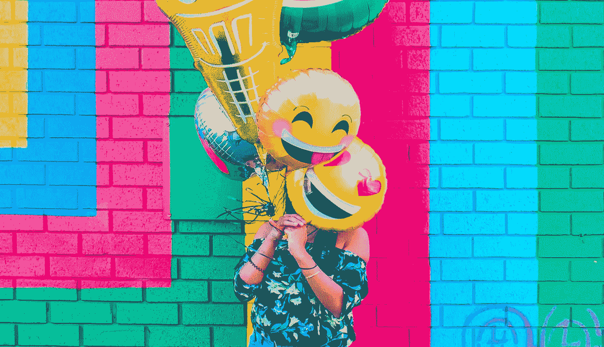
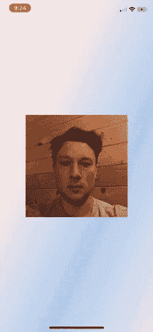
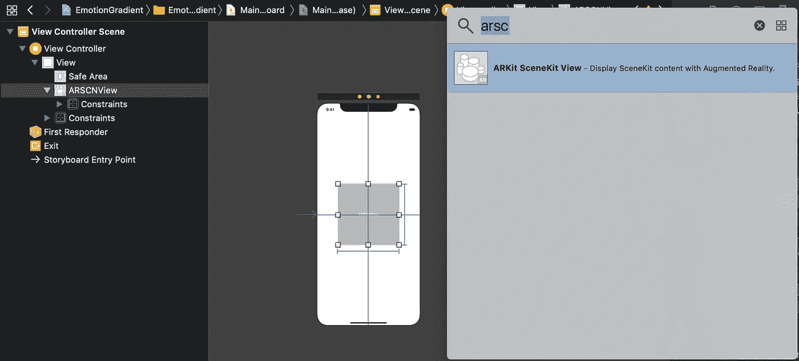
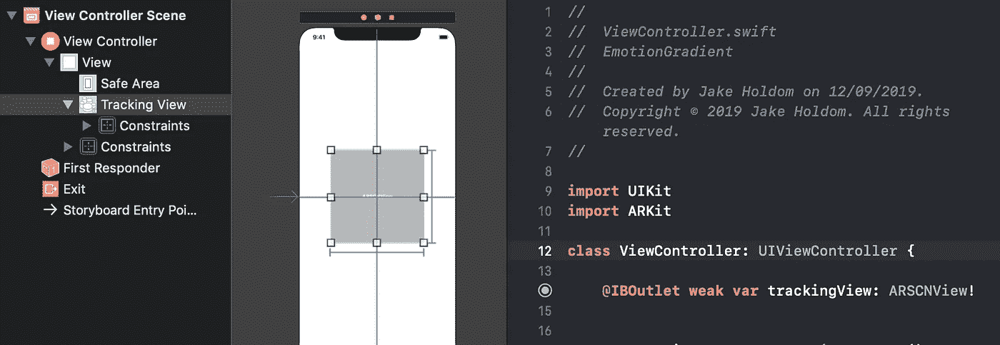

# 通过 ARKit 使用面部情绪创建动态用户界面

> 原文：<https://towardsdatascience.com/creating-a-dynamic-ui-using-facial-emotions-with-arkit-d2f836010db7?source=collection_archive---------13----------------------->



Photo from [Unsplash](https://unsplash.com/photos/tXz6g8JYYoI)

## 如何创建一个美丽的，动画渐变视图，反应面部情绪

ARKit 和原深感摄像头为开发人员实现基于用户面部表情的直观和动态组件开辟了许多新的可能性。本教程的目标是创建一个动画渐变视图，其颜色对应于相关的情绪。



Emotion gradient

## 设置一个项目来检测面部运动

在 Xcode 中创建一个新项目作为单视图应用程序，然后转到`main.storyboard`。将 ARKit SceneKit 视图拖放到您的`ViewController`中，并为视图设置任何约束。该视图将显示前摄像机视图。如果愿意，您可以将其设置为隐藏。



ARKit SceneKit View

`Import ARKit`，然后将`ARSCNView`添加到`ViewController`中。



ARSCNView tracking view

现在添加面部跟踪功能

```
**override** **func** viewDidLoad() { 
    **super**.viewDidLoad()
    **guard** ARFaceTrackingConfiguration.isSupported **else** {
        fatalError("Face tracking not available on this on this device model!")
    } **let** configuration = ARFaceTrackingConfiguration()
    **self**.trackingView.session.run(configuration)
    **self**.trackingView.delegate = **self** }
```

## 情感跟踪

创建一个名为`Emotion`和`import ARKit`的新文件。然后添加以下协议，带有后续扩展名。

```
**import** UIKit
**import** ARKit**protocol** Emotion { *// The range between 0-1 where the emotion is considered active or not* **var** threshold: Double { **get** } *// List of colors associated with the emotion* **var** colors: [UIColor] { **get** } *// Calculated from the the blendshapes to see if that face has the given emotion (for example smile is calculated from '.mouthSmileLeft' or '.mouthSmileRight' being over the threshold amount)* **func** isActive(for face: ARFaceAnchor) -> Bool}**extension** Emotion {
    *// Set default threshold to 0.3, can be overriden by class to change value.* **var** threshold: Double {
        **return** 0.3
    }
}
```

接下来，我们将创建想要跟踪的情感对象。对于这个教程，我只打算把中性，快乐，悲伤和愤怒。为了确定人脸的情绪，我们将分析人脸对象的混合形状。您可以在此查看所有[可用的混合形状。](https://developer.apple.com/documentation/arkit/arfaceanchor/blendshapelocation)

```
**struct** NeutralEmotion: Emotion { **var** colors: [UIColor] = [UIColor(hexString: "#9CC0E7"), UIColor(hexString: "#EEEEEE"), UIColor(hexString: "#FCFCFC"), UIColor(hexString: "#F7DBD7")] **func** isActive(for face: ARFaceAnchor) -> Bool {

        **for** blendshape **in** face.blendShapes {
            **if** blendshape.value.doubleValue > **self**.threshold {
                **return** **false** }
        }
        **return** **true** }
}**struct** HappyEmotion: Emotion {
    **var** colors: [UIColor] = [UIColor(hexString: "#01BEFE"), UIColor(hexString: "#FFDD00"), UIColor(hexString: "#ADFF02"), UIColor(hexString: "#E7B2FF")] **func** isActive(for face: ARFaceAnchor) -> Bool {
        **return** face.blendShapes[.mouthSmileLeft]?.doubleValue ?? 0 > **self**.threshold || face.blendShapes[.mouthSmileRight]?.doubleValue ?? 0 > **self**.threshold
    }
}**struct** SadEmotion: Emotion {
    **var** colors: [UIColor] = [UIColor(hexString: "#345467"), UIColor(hexString: "#101442"), UIColor(hexString: "#1F6B65"), UIColor(hexString: "#1D4E7A")] **func** isActive(for face: ARFaceAnchor) -> Bool {
        **return** face.blendShapes[.mouthFrownLeft]?.doubleValue ?? 0 > **self**.threshold || face.blendShapes[.mouthFrownRight]?.doubleValue ?? 0 > **self**.threshold
    }
}**struct** AngryEmotion: Emotion {
    **var** colors: [UIColor] = [UIColor(hexString: "#E72222"), UIColor(hexString: "#C92929"), UIColor(hexString: "#AB3232"), UIColor(hexString: "#963232")] **func** isActive(for face: ARFaceAnchor) -> Bool {
        **return** face.blendShapes[.browDownRight]?.doubleValue ?? 0 > **self**.threshold || face.blendShapes[.browDownLeft]?.doubleValue ?? 0 > **self**.threshold
    }
}
```

请记住，我还添加了一个 UIColor 扩展，它使用十六进制字符串代替 RGB 值。要将它添加到您的项目中，创建一个名为`ColorExtensions`的文件，并添加以下代码。

```
**import** UIKit**extension** UIColor {
    **convenience** **init**(hexString: String) {
        **let** hex = hexString.trimmingCharacters(in: CharacterSet.alphanumerics.inverted)
        **var** int = UInt32()
        Scanner(string: hex).scanHexInt32(&int)
        **let** a, r, g, b: UInt32

        **switch** hex.count {
            **case** 3: *// RGB (12-bit)* (a, r, g, b) = (255, (int >> 8) * 17, (int >> 4 & 0xF) * 17, (int & 0xF) * 17)
            **case** 6: *// RGB (24-bit)* (a, r, g, b) = (255, int >> 16, int >> 8 & 0xFF, int & 0xFF)
            **case** 8: *// ARGB (32-bit)* (a, r, g, b) = (int >> 24, int >> 16 & 0xFF, int >> 8 & 0xFF, int & 0xFF)
            **default**:
                (a, r, g, b) = (255, 0, 0, 0)
        }
        **self**.init(red: CGFloat(r) / 255, green: CGFloat(g) / 255, blue: CGFloat(b) / 255, alpha: CGFloat(a) / 255)
    }
}
```

我们现在想要创建一个名为`EmotionManager`的新文件。这个类将分析一个 [ARFaceAnchor](https://developer.apple.com/documentation/arkit/arfaceanchor) 对象，看看它是否匹配我们的任何情感对象规范，并将它们保存在一个列表中。

```
**import** UIKit
**import** ARKit**class** EmotionManager { *// List of all of the emotions we want to track* **private** **var** emotions: [Emotion] = [NeutralEmotion(), HappyEmotion(), SadEmotion(), AngryEmotion()] *// Current active emotions. Defaults to neutral.* **var** activeEmotions: [Emotion] = [NeutralEmotion()] *// Gets the current emotions found in the given ARFaceAnchor object. If none are found then return neutral as default.* **func** refreshActiveEmotions(for face: ARFaceAnchor) {
        **var** activeEmotions = [Emotion]() **for** emotion **in** **self**.emotions {
            **if** emotion.isActive(for: face) {
                activeEmotions.append(emotion)
            }
        } *// If no active emotions are found then default to neutral* **self**.activeEmotions = activeEmotions.isEmpty ? [NeutralEmotion()] : activeEmotions
    } *// Return emotion colors from currently active face emotions. Shuffle the order so the gradient constantly changes.* **func** getEmotionColors() -> [CGColor] {
        **return** activeEmotions.flatMap { $0.colors.compactMap { $0.cgColor } }.shuffled()
    }
}
```

## 动画渐变视图

回到你的`ViewController`，为我们刚刚创建的`EmotionManager`添加一个实例变量和一个 [CAGradientLayer](https://developer.apple.com/documentation/quartzcore/cagradientlayer) (这将是我们的渐变)。

```
**var** emotionManager = EmotionManager()
**var** gradientView : CAGradientLayer?
```

现在我们需要两个函数，`initialiseGradient()`和`animateGradient()`，它们都将在`viewDidLoad()`方法的末尾被调用。

```
**override** **func** viewDidLoad() {
    **super**.viewDidLoad() **guard** ARFaceTrackingConfiguration.isSupported **else** {
    fatalError("Face tracking not available on this on this device model!")
    } **let** configuration = ARFaceTrackingConfiguration()
    **self**.trackingView.session.run(configuration)
    **self**.trackingView.delegate = **self** **self**.initialiseGradient()
    **self**.animateGradient()
}**func** initialiseGradient() {
    *// Create gradient view to take up whole of the background view* **self**.gradientView = CAGradientLayer() **self**.gradientView?.startPoint = CGPoint(x: 0, y: 0) *// Starts in top left corner* **self**.gradientView?.endPoint = CGPoint(x: 1, y: 1) *// Ends in bottom right corner* **self**.gradientView?.frame = **self**.view.frame
    **self**.gradientView?.colors = emotionManager.getEmotionColors()
    view.layer.insertSublayer(**self**.gradientView!, at: 0)
}**func** animateGradient() {
    *// Animates gradient from current gradient colors to current emotion colors* **let** colorArray = **self**.emotionManager.getEmotionColors()
    **let** animation = CABasicAnimation(keyPath: "colors")
    animation.duration = 1
    animation.fromValue = **self**.gradientView!.colors
    animation.toValue = colorArray
    animation.delegate = **self
    self**.gradientView?.add(animation, forKey: **nil**)
    DispatchQueue.main.async {
        CATransaction.setDisableActions(**true**)
        **self**.gradientView?.colors = colorArray
    }
}
```

现在，为了在当前动画完成后开始新的渐变动画，创建无休止的渐变运动效果，我们需要扩展 [CAAnimationDelegate](https://developer.apple.com/documentation/quartzcore/caanimationdelegate) 并从`animationDidStop`方法中调用`animateGradient()`。

```
**extension** ViewController: CAAnimationDelegate { **func** animationDidStop(**_** anim: CAAnimation, finished flag: Bool) {
        DispatchQueue.main.async {
            *// Run new gradient animation once the previous has finished to create the endless gradient movement effect* **self**.animateGradient()
        }
    }
}
```

最后，我们想要扩展 ARSCNViewDelegate 并在 renderer 方法内部检查一个包含面部表情数据的 ARFaceAnchor 。如果我们找到一个面部锚，我们可以将它传递给我们的`emotionManager`来检查任何活跃的情绪，这将相应地改变颜色。

```
**extension** ViewController: ARSCNViewDelegate { **func** renderer(**_** renderer: SCNSceneRenderer, didUpdate node: SCNNode, for anchor: ARAnchor) {
        **guard** **let** faceAnchor = anchor **as**? ARFaceAnchor **else** { **return** }
        DispatchQueue.main.async {
            **self**.emotionManager.refreshActiveEmotions(for: faceAnchor)
        }
    }
}
```

就是这样！

我希望你喜欢这个教程，如果你把它应用到你自己的任何项目中，或者它启发你创造类似的东西，那么请联系我，因为我很想看看你做了什么。

[点击此处查看完整源代码。](https://github.com/JakeHoldom/EmotionTrackingGradient)