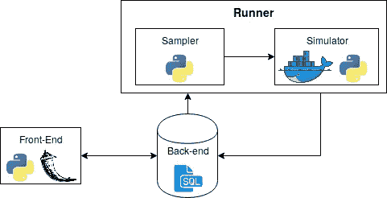
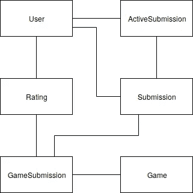
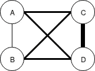
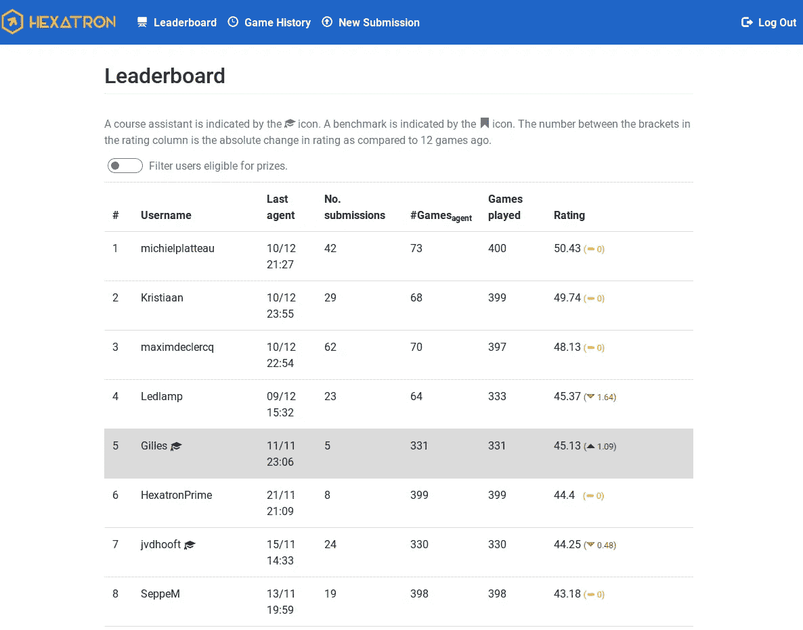

# 用 Python 为人工智能竞赛创建一个平台

> 原文：<https://towardsdatascience.com/creating-a-platform-for-ai-competitions-1184666f32e4?source=collection_archive---------25----------------------->

## 详细说明在开发 AI 竞赛平台过程中遇到的最重要方面。

[去年](https://medium.com/@gillesvandewiele/creating-the-perfect-connect-four-ai-bot-c165115557b0)和[今年](https://medium.com/p/2d7662ffcbf6)我写了一篇博客，介绍我和我的同事 [Elias](https://telefoonboek.ugent.be/nl/people/802001314384) 、 [Pieter](https://telefoonboek.ugent.be/nl/people/802002430187) 、奥赞和 [Cedric](https://biblio.ugent.be/person/802001856372) 专门为一年级的工科学生设计的人工智能竞赛解决方案。在这个竞争中，玩家可以编写他们自己的代理，该代理为他们与其他玩家的代理玩游戏。为了促进这一竞争，创建了一个平台，允许学生注册自己，上传他们的代码，并检查他们的代理在排行榜上的排名。排行榜根据定期模拟的游戏结果不断更新。这篇博客文章将详细讨论这个名为 Hexatron 的平台在今年的创建过程，内容安排如下:

1.  [高层综述及采用的技术](https://medium.com/p/1184666f32e4#c1c2)
2.  [我们模拟器的详细讨论](https://medium.com/p/1184666f32e4#5084)
3.  [讨论我们的数据库技术和数据方案](https://medium.com/p/1184666f32e4#6dcf)
4.  [撮合及评级代理人技能](https://medium.com/p/1184666f32e4#0d83)
5.  [我们的前端概述](https://medium.com/p/1184666f32e4#5722)

**请注意，这只是我们平台的第二个版本。绝对有改进的空间！因此，任何形式的反馈都是非常受欢迎和非常赞赏的。**

This year we even designed our own logo!

# 高层架构和使用的技术

以下是我们系统中不同组件及其交互方式的高级概述:

A (very) high-level overview of the architecture, consisting of three main modules: (i) a front-end for user registration, agent submission and display of our data, (ii) a SQL database with our data, and (iii) a runner that periodically samples two players from the database and simulates a game between them. Arrows depict the flow of data.

**我们可以区分 4 个大组件。核心组件是我们的*后端:*一个基于 SQL 的数据存储。关于用户和提交的代理的数据通过*前端*收集并存储在*后端*中。而且所有的数据都是通过*前端*应用显示的。*采样器*组件定期从数据库中提取一对用户，以便使用*模拟器*组件在 docker 容器中模拟他们之间的游戏。配对是为了尝试和确保竞争激烈、激动人心的比赛。**

# 代理合规性和基于 docker 的模拟

由于游戏是在服务器端模拟的，而且由于 python 脚本可能会对您的主机造成损害(想象一下`shutil.rmtree('/')`或`exec('sudo smth')`)，所以我们采取了一些措施，以确保不可能(或至少很难)向我们的系统提交代理并有效地对我们的服务器造成损害。这是通过向我们的平台提交代码时的一些**初始检查，以及尝试**在“沙盒”环境中模拟游戏**实现的。**

每个参与者需要实现一个函数，该函数接受某个游戏状态作为输入，并输出代理想要进行的移动。每次他或她向我们的平台提交新编写的代码，我们都会进行一些检查。首先，我们检查上传文件的大小是否没有超过一兆字节。这是为了避免用户提交会在我们的硬盘上分配太多空间的解决方案，并避免为每个可能的游戏状态硬编码最佳移动。其次，我们只允许使用 NumPy 和标准库中的某些包。第三，也是最后一点，不允许顶级执行代码(所有代码都必须包装在函数中)，并且禁止一些构造，包括`eval`、`exec`、`open`、`file`、`subprocess`、`dircache`等等。如果所有这些检查都成功，则相应用户的最新提交将被更新为新代码，这将在下一次模拟中使用。

模拟是使用 Docker 容器执行的。每当一个新的代理被提交到我们的平台时，就会为该代理创建一个 docker 容器，其中运行着一个 flask 服务器。这个 flask 服务器有一个 post route，它接受一个游戏状态并把它的移动返回给代理。虽然 Docker 容器不太适合作为沙盒环境，但它确实使得通过提交的代码破坏系统变得更加困难。

# 后端技术和数据方案

作为后端技术，我们使用了 SQL。例如，虽然它比简单的 MongoDB 需要更多的开发工作，但它通常更高效。我们的数据方案(可能太复杂了)描述如下:

The data scheme used in our SQL store.

我们后端的中心对象是*用户*、*提交*和*游戏*。对于用户提交到我们平台的每个代理*，一个*提交*对象被创建并添加到 DB 中。此外，这个新添加的*提交*用于“覆盖”用户的*活动提交*。我们的运行器定期对成对的*用户*对象进行采样，并在它们之间运行模拟。该模拟的结果存储在新添加的*游戏*对象中，从而创建了新的*等级*对象，该对象代表用户的更新等级。而*主动提交*和*提交*对象之间并没有真正的区别。我们确实做了区分，这样我们就可以允许在提交的代理之间切换功能。*

# 配对和技能评级

比赛的两个重要方面是如何尽可能准确地确定代理商的排名以及如何尽可能确保竞争性比赛。同样，现有的算法和技术被用来解决这些问题。

为了对代理进行排名，我们首先应用了微软开发的[true skill](https://en.wikipedia.org/wiki/TrueSkill)系统。TrueSkill 类似于著名的 [ELO](https://en.wikipedia.org/wiki/Elo_rating_system) 系统(起源于国际象棋)，但有一些额外的优势，例如适用于 1 对 1 以外的游戏，并自然地处理玩家的不活跃状态(而在 ELO 系统中，这些玩家只会保持相同的等级)。虽然提到的优势在我们的场景中并不真正相关(在我们的场景中，游戏是 1 对 1 的，并且由于定期采样，不活动的情况不会发生)，但 TrueSkill 系统是最近才出现的，因此值得一试。不幸的是，我们注意到真实技能等级变化太慢，使得比其他人晚加入比赛的人很难获得更高的等级。因此，我们在比赛中途重构回 ELO 系统。

为了确保有竞争力的匹配，我们使用了一个已经存在的算法，称为****，**，它在一个图中找到最大匹配。更正式地说:给定一个图 G = (V，E)，该算法找到一个匹配的 *M* (它是边的集合)，使得 *V* 中的每个顶点至多与 *M* 中的一条边关联，并且| *M* |(或者在我们的情况下是权重的总和)被最大化。这个问题本身非常类似于**二分图匹配**问题，可以通过应用 [**匈牙利算法**](https://en.wikipedia.org/wiki/Hungarian_algorithm) 来解决(这是我们首先要研究的)，但是后者在两组(不同的)顶点(通常代表人和工作)之间创建了一个匹配。举个例子，假设我们的系统中有四个玩家。一个玩家 ***(A)*** 拥有非常强的代理，一个玩家***【B】***拥有非常弱的代理，另外两个玩家***【C，D】***拥有一般的代理。然后我们可以用加权图来表示我们的排行榜。这个图是全连通的，每个顶点对应一个玩家。来自顶点的每个输出边上的权重对应于这两个玩家之间的比赛质量(玩家之间的竞争越激烈，质量越高):**

****

**Representing our leaderboard of four players in a graph. The width of the edges depicts the match quality.**

**在这种情况下，Blossom 算法将返回 2 条边，使得它们的权重之和最大化，并且使得我们的图中的每个顶点恰好与这些边中的一条边相关联。这正是我们想要的:每个玩家与另一个玩家比赛，比赛质量的总和最大化。当然，这只有在顶点数为偶数时才有可能。在奇数个玩家的情况下，从所有玩家中均匀地抽取 1 个随机玩家，并从图形中移除。**

# **在前端显示所有内容**

**前端主要使用 Flask 创建。我们平台上的每个可能页面都对应一条路线。当用户浏览这条路线时，从后端检索相关对象并提供给 JINJA 模板，然后呈现该模板。对于我们应用程序的交互部分(比如在特定日期范围内过滤游戏的滑块和不同的可视化)，我们使用了 JavaScript 和 D3。下面是该应用程序的一些截图:**

****

**Screenshot of the leaderboard page**

****

**Screenshot of the game history page**

****

**Creating a new account**

# **总结词**

**这就是了。现在，我已经简要介绍了在平台开发过程中需要大量时间的方面和组件。我希望这能对那些正在尝试创造类似东西的人有所帮助。一如既往:如果有任何不清楚的地方，如果有你想要我进一步阐述的事情，或者如果你有建议或反馈，请不要犹豫与我联系！你可以通过评论这篇文章或者给我发邮件来做到这一点。**

**也许明年，我可以再发一篇关于我们在年度人工智能竞赛的第三个版本中所做的改变的文章。到时候见，**

**吉勒斯、[伊利亚](https://telefoonboek.ugent.be/nl/people/802001314384)、[皮特](https://telefoonboek.ugent.be/nl/people/802002430187)、奥赞[塞德里克](https://biblio.ugent.be/person/802001856372)**