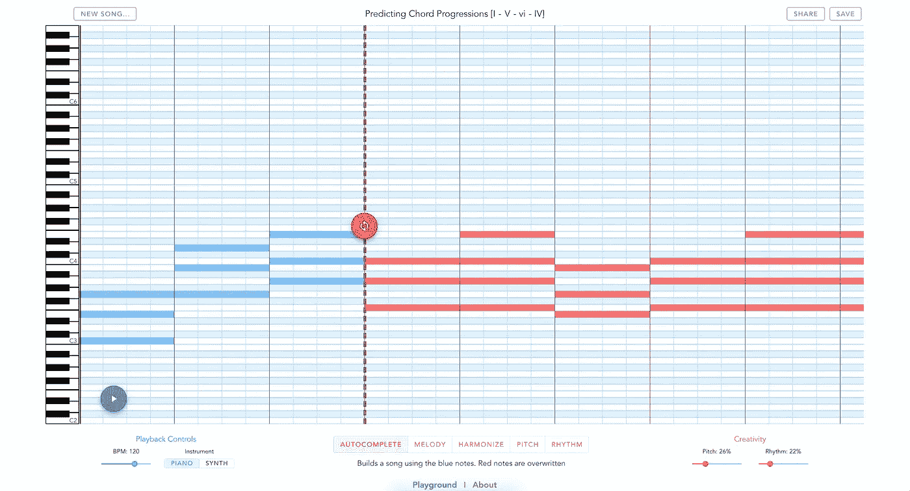

# 使用变压器创建流行音乐发生器

> 原文：<https://towardsdatascience.com/creating-a-pop-music-generator-with-the-transformer-5867511b382a?source=collection_archive---------4----------------------->

*TLDR；训练一个深度学习模型生成流行音乐。你可以在这里用我们预先训练好的模型—*[*【http://musicautobot.com】*](http://musicautobot.com)*作曲。源代码在这里可以找到—*[*https://github.com/bearpelican/musicautobot*](https://github.com/bearpelican/musicautobot)*。*

在这篇文章中，我将解释如何训练一个深度学习模型来生成流行音乐。这是“构建人工智能音乐生成器”系列的第一部分。

> *快速提示:有几种方法可以生成音乐。非平凡的方式是生成实际的声波(*[*wave net*](https://deepmind.com/blog/wavenet-generative-model-raw-audio/)*，*[*MelNet*](https://arxiv.org/abs/1906.01083)*)。另一种是为乐器演奏生成乐谱(类似于乐谱)。我将解释如何做到后者。*

# 我来这里只是为了目的地…

好吧！这里有一些很酷的音乐生成的例子给你。

我建了一个网站:MusicAutobot。它由我们将在本文中构建的音乐模型驱动。

[歌曲#1(灵感来自里奇·汪妮——拉·邦巴)](https://musicautobot.com/#/predict/f00bd0f1289b5f5afd74229569fa74ef)


Red Notes are generated by the model. Green/White notes are the original

[歌曲#2(灵感来自帕切尔贝尔——D 中的佳能)](https://musicautobot.com/#/predict/e06828d196b2d5182cd459c273d609ac)

[](https://musicautobot.com/#/predict/e06828d196b2d5182cd459c273d609ac)

Feel free to press the red button and generate your own music!

*注:MusicAutobot 最好在桌面上观看。对于那些手机用户，你只需要听下面的。*

Generated Part starts at 0:03

Generated Part starts at 0:06

# 背景

[Transformer](http://jalammar.github.io/illustrated-transformer/) 架构是 NLP 的最新进展，它在生成文本方面产生了惊人的[结果](https://transformer.huggingface.co/)。与以前的语言模型相比，变形金刚训练速度更快，长期记忆能力更强。给它几个词，它就能继续生成比这更有意义的整段文字。

自然地，这看起来非常适合创作音乐。为什么不给它一些音符，让它产生一段旋律呢？

这正是我们将要做的。我们将使用一个变压器来预测音符！

这是我们正在尝试做的事情的高层次图表:


# 用…音乐数据训练变压器

我们正在做的，是为音乐建立一个序列模型。取一个输入序列并预测一个目标序列。无论是时间序列预测、音乐还是文本生成，构建这些模型都可以归结为两个步骤:

***第一步。*** 将数据转换成一系列令牌

**第二步*。*** 建立并训练模型以预测下一个令牌

在两个 python 库 [music21](https://web.mit.edu/music21/) 和 [fastai](https://docs.fast.ai/) 的帮助下，我们构建了一个简单的库 [musicautobot](https://github.com/bearpelican/musicautobot/tree/master/musicautobot) ，使得这两个步骤变得相对容易。

## **第一步。**

> *将数据(音乐文件)转换成符号序列(音符)*

拿一张*钢琴单*看起来像这样:


Piano Score

然后把符号化成这样:

```
xxbos xxpad n72 d2 n52 d16 n48 d16 n45 d16 xxsep d2 n71 d2 xxsep d2 n71 d2 xxsep d2 n69 d2 xxsep d2 n69 d2 xxsep d2 n67 d4 xxsep d4 n64 d1 xxsep d1 n62 d1
```

使用 musicautobot，您可以这样做:

More examples in this [Notebook](https://github.com/bearpelican/musicautobot/blob/master/notebooks/data_encoding/MusicItem-Transforms.ipynb)

*注:musicautobot 在后台使用 music21 来加载音乐文件和令牌化。这种转换的细节将在下一篇文章中介绍。*

## **第二步。**

> 构建并训练模型以预测下一个令牌。

fastai 有一些惊人简单的[训练代码](https://github.com/fastai/fastai/blob/master/examples/train_wt103.py#L59)用于训练语言模型。

如果我们修改数据加载来处理音乐文件而不是文本，我们可以重用大部分相同的代码。

训练我们的音乐模型现在就像这样简单:

*去试试这个* [*笔记本*](https://github.com/bearpelican/musicautobot/blob/master/notebooks/music_transformer/Train.ipynb) *来训练自己吧！*

# 是的，就是这样。

现在让我们看看它是否真的有效。

在下一部分，我将使用我在一个大型 MIDI 数据库上预先训练了几天的模型。你可以在这里直接玩预先训练好的模型[。](https://github.com/bearpelican/musicautobot/blob/master/notebooks/music_transformer/Generate.ipynb)

## 预测流行音乐

第一步:创建一小段笔记:

Snippet from [here](https://github.com/bearpelican/musicautobot/blob/master/notebooks/music_transformer/Generate.ipynb)

*看起来是这样的:*


First few notes of La Bamba — sounds like [this](https://soundcloud.com/andrew-shaw-27/la-bamba-snippet)

**第二步:**把它喂给我们的模特:

```
Hyperparameters:[Temperature](https://cs.stackexchange.com/questions/79241/what-is-temperature-in-lstm-and-neural-networks-generally) adjusts how "creative" the predictions will be. You can control the amount of variation in the pitch and/or rhythm.[TopK/TopP](https://twitter.com/Thom_Wolf/status/1124263860104507393) - filters out the lowest probability tokens. It makes sure outliers never get chosen, even if they have the tiniest bit of probability
```

## 瞧啊。


*听起来是这样的:*

这其实是我得到的第一个结果，但副作用可能会有所不同。你可以在这里创造你自己的变化[。](https://musicautobot.com/#/song/aeee134e4034e5f98bb630c56d2f7f8c)

# 真正的考验:流行音乐理论

据 HookTheory 的牛逼人士称，现代音乐中最流行的和弦进行是 I-V-VI-IV 和弦。

你可能以前听过。很多流行歌曲中都有。

*喜欢每一个。单身。同ＰＯＰＵＬＡＴIＯＮ宋。*

All these songs use the I-V-vi-IV chord progression

## 构建和弦

让我们测试我们的模型，看看它是否能识别这个和弦进行。我们将输入前三个和弦“I — V — vi”，看看它是否能预测“IV”和弦。

以下是你如何用音乐创作前三个和弦 21:

看起来是这样的:[C-E-G]——[G-B-D]——[A-C-E]


Model Input: First 3 chords (I-V-vi)

# 预测“IV”和弦

现在，我们把这些和弦输入我们的模型来预测下一个:

以下是我们得到的结果(包括 3 个输入和弦):


Model predicted the final chord — IV

万岁。该模型预测了音符[F-A-C]——也就是“IV”和弦。

这正是我们希望它预测的。看起来我们的音乐模型能够遵循基本的音乐理论，制作每一首流行歌曲！至少是和弦。

## 自己测试一下

不要只相信我的话。在[音乐机器人](https://musicautobot.com/#/predict/afbaeb409dcdd02beed4465e9b708ddc)上试试吧:

[](https://musicautobot.com/#/predict/afbaeb409dcdd02beed4465e9b708ddc)

你所要做的就是按红色按钮。

*注:10 次中有 8 次，你会得到一个“IV”和弦或者它的一个* [*转位*](https://musicautobot.com/#/predict/4f77b4b9bf6323ebf3c4d83c2fdc94a3) *。我不能保证确定的结果。只有概率。*

## 这就是全部了！

现在你知道了训练一个音乐模型的基本步骤。

这篇文章中的所有代码都可以在这里找到:[https://github.com/bearpelican/musicautobot](https://github.com/bearpelican/musicautobot)

使用我们刚刚建立的模型播放和生成歌曲:
[http://musicautobot.com](http://musicautobot.com)
*^这些是实时预测，请耐心等待！*

# 接下来:更深的潜水和更深的模型

我可能忽略了一些细节。还有呢！

[**第二部分。训练音乐模型的实用技巧**](https://medium.com/@andrew.t.shaw/practical-tips-for-training-a-music-model-755c62560ec2)——深入研究音乐编码和训练——它将涵盖我刚刚忽略的所有细节。

[**第三部分。建立一个多任务音乐模型**](https://medium.com/@andrew.t.shaw/a-multitask-music-model-with-bert-transformer-xl-and-seq2seq-3d80bd2ea08e)*——*训练一个超级酷的音乐模型，它可以协调，生成旋律，以及混音歌曲。下一个令牌预测是如此…基本。

[**第四部分。使用一个音乐机器人来重新混合链烟**](https://medium.com/@andrew.t.shaw/how-to-remix-the-chainsmokers-with-a-music-bot-6b920359248c)——我们将使用 musicautobot 在 Ableton 重新混合一个 EDM drop。仅用于纯粹的娱乐目的。

> 特别感谢[耶鲁安·克斯滕](https://www.thehim.com/)和[杰瑞米·霍华德](https://www.fast.ai/)的指导，[南方公园公地](https://medium.com/@southparkcommons)和[帕拉帕维克](https://www.palapavc.com/)的支持。