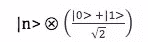
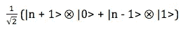

# 用扔量子硬币来分析量子行走

> 原文：<https://towardsdatascience.com/creating-a-quantum-walk-with-a-quantum-coin-692dcfa30d90?source=collection_archive---------18----------------------->

So how does a quantum particle walk?

## 那么什么是“散步”呢？

一次*散步*正是我们在公园或其他地方进行*漫无目的的*漫步时所做的事情。我们站在某个地方(可以认为是公园里有一些坐标的位置)，迈一步，最后到了另一个地方(是公园里的某个其他位置)。

*漫步，*或者更准确地说，关于本文的内容，*随机漫步*是系统从一个状态到另一个状态的转换序列。需要注意的一个重要事实是，这种转移是随机的，或者形式上有一个概率分布。

## 它们到底为什么重要？

量子行走在一些量子算法的开发中非常有用。比如复杂性分离和通用计算模型。最后都是值得研究他们的。

# 伯努利随机漫步

在深入研究量子行走之前，研究一个简单的一般随机行走是有用的。考虑以下场景:

*你站在一个名为原点的点上，用整数 0 表示。你可以向右或向左移动，通过掷硬币来决定(* ***你走路的随机性的原因)。你如何分析这种行走，比如说硬币翻转 100 次？***

简单来说，你有 50 %的机会向左或向右移动，相当于硬币有 50 %的机会是正面或反面。所以如果你把到达某个地方的概率列表，你会得到这样的结果:

放弃在时间 *t* 到达位置 *n* 的概率

或者前一状态即在时间(t-1)的概率的平均值。这导致了对离散马尔可夫链的整个讨论，马尔可夫链是强大的模型，并且已经被广泛地翻译到量子世界。简而言之，*马尔可夫链*是这样的:在给定**历史**的所有信息的情况下，在当前状态下着陆的概率是 ***与给定*** 之前的状态下，在当前状态下着陆的概率是 ***。***

其中 n(a)代表系统在时间 t 的状态。

一般来说，这是一个由下式给出的*二项式分布*:

Generic probability of landing at state n at time t

随着我们增加 *n，*二项式分布可以更好地近似为以下形式的正态分布:

The Gaussian or the normal distribution

# 量子行走是怎样的？

现在让我们把上面的行走转换成量子行走。如果你知道量子力学的基本原理，那会很有帮助。但就算你不说，我也会一路解释。在分析行走之前，我们需要创建一个 ***孤立的量子系统*** ，行走将在那里发生。

量子世界最基本的属性是**叠加，**或者一个系统同时存在于几个状态的能力。形式上，我们定义了一个无限维希尔伯特空间 ，它将表示我们的行走器的**位置(与上面讨论的伯努利行走示例中的线上的点相对比)。我们称这个希尔伯特空间为 a。**

我们已经把沃克转移到量子世界了。现在我们需要翻译硬币。离散硬币有两种不同的状态可供选择(正面或反面)。类似地，我们定义另一个希尔伯特空间 B，它是二维的，计算基|0 >和|1 >。通过**计算基础，**我简单的意思是，通过下面的线性组合方程，可以在这个希尔伯特空间中获得任何叠加形式:

for given values of scalars a and b

## 如何刻画这样的量子币？

如果我们能找到一个符合我们对 B 的定义的量子系统，我们就可以走了。而且谢天谢地，这样的量子系统是存在的:*电子。*

考虑一个**孤立**电子。它可以以它的*、*自旋的任何叠加形式存在，但是正好有*两个*方向可以通过上述线性组合方程组合起来产生任何可能的自旋。

Consider the left one as |1> and the right one as |0> and we have our computational basis realised in physical terms

原来量子力学中的 ***测量破坏了系统的叠加态。*** 这仅仅意味着当你测量处于叠加态的电子时，它的状态会坍缩，变成|1 >或|0 >。

这难道不是非常接近于掷硬币吗？！？！

事实证明，在我们前进之前，我们需要一种机制来将我们的 walker 系统(希尔伯特空间 A)和 coin 系统(希尔伯特空间 B)结合成一个单一的系统。这是通过以下张量运算完成的:

Tensor equation for C

如果你不完全理解张量运算，就简单地把它想象成量子力学中的一种方式，把硬币给行走者，这样他们就可以一起行走。从数学上来说，我们发现了一种方法，可以同时在一个无限维的希尔伯特空间(A)和另一个二维的希尔伯特空间上操作，就好像它们是 c 描述的另一个更大的量子系统的子部分一样。

C 中的任何状态都可以用上面给出的张量方程来描述，例如|n>|0 >，其中|0 >属于 B，表示电子的负半自旋，而|n >属于 a。

一个人可以用几个*硬币*；我们将使用最著名的一种——**哈达玛硬币。**

哈达玛是由下式给出的矩阵:

Hadamard matrix

有趣的是，它在 B (the |0 >和 the |1 >)的计算基础上有以下行为:

很容易观察到哈达玛是如何将一个*纯*态转换成叠加态的。

除了硬币操作符，让我们定义另一个操作符，类似于**移位操作符**，它根据量子硬币投掷的结果走一步。

Looks exactly like the decision of the classical coin toss.

现在要靠我们自己走完全程了。假设我们系统的原始状态是|n> |0 >。为了将其提升到叠加状态(**，这将为其提供一些随机性**，应用以下张量(在 C 中):

其中 I 是属于希尔伯特空间 A 的单位矩阵，H 是属于希尔伯特空间 B 的**阿达玛币**；两者在希尔伯特空间 c 中形成一个张量，直观上可以认为 I 作用于|n >而 H 作用于|0 >(或者简单地说他们作用于和他们一样属于希尔伯特空间的向量)。

作用于|n >的同一性就这样保持着。相反，哈达玛 T12 将| 0>提升到叠加状态，在希尔伯特空间 C 中产生以下内容:

分布张量，可以得到如下结果:

将**移位操作符**应用于上述操作会产生以下结果:

这里，我们看到了在应用**投掷硬币之后，由移位操作符执行的行走器位置的最终叠加状态。**

这是我们的量子步行者的概率分布。总之，如果我们知道助行器的初始状态，那么在任何给定时间的状态都可以定义如下:

## 结论

在这里，我们已经完成了对量子行走器的定义，并得出了一个方程，它告诉我们，在任何给定的时间内，我们的量子系统的演化。

理解最基本的量子行走，因为这使任何人都能够将其扩展到离散马尔可夫链的实现到其量子等价物。这些想法也适用于连续的量子行走，这是我们不久将探讨的。敬请关注！