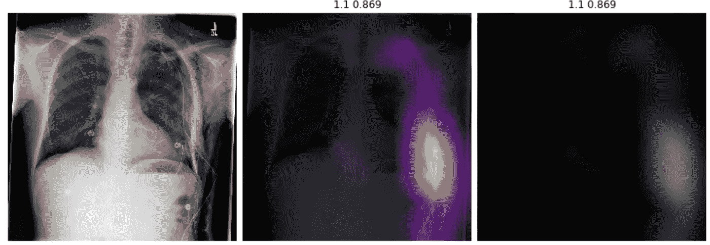
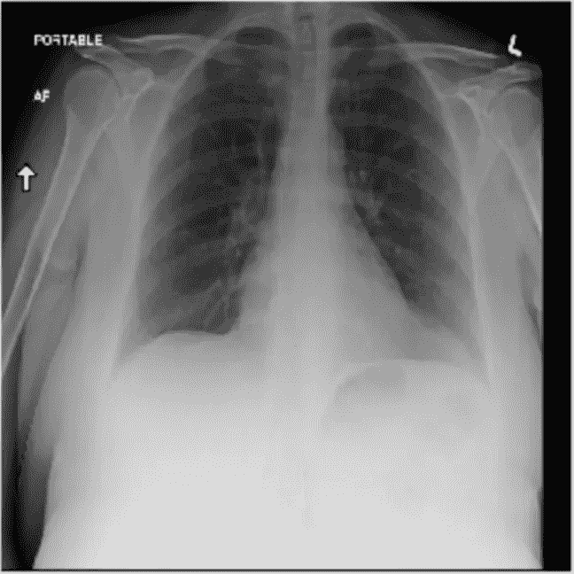
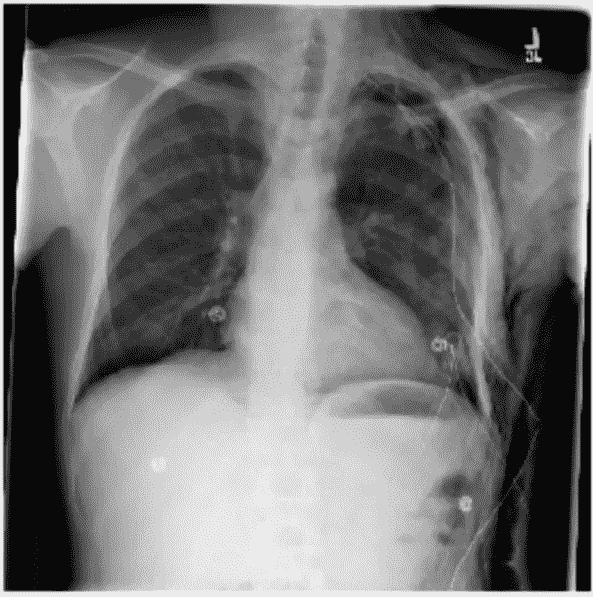
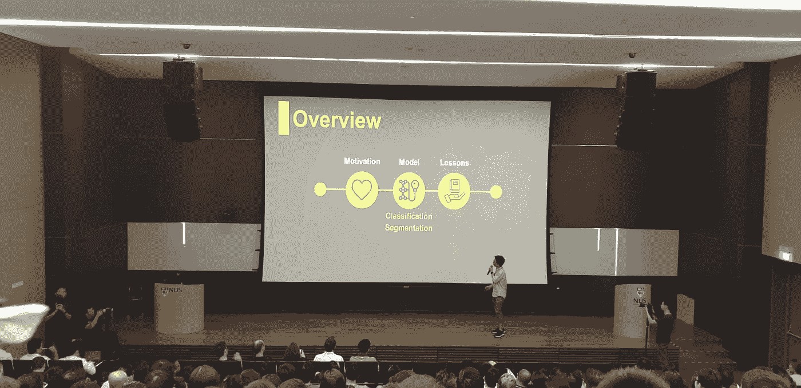
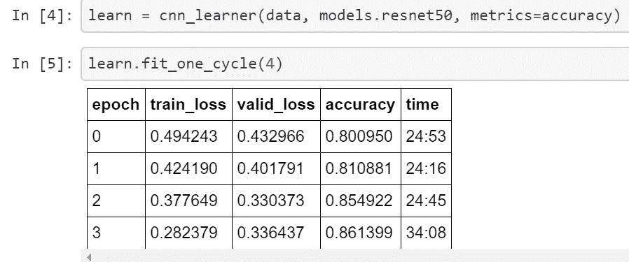
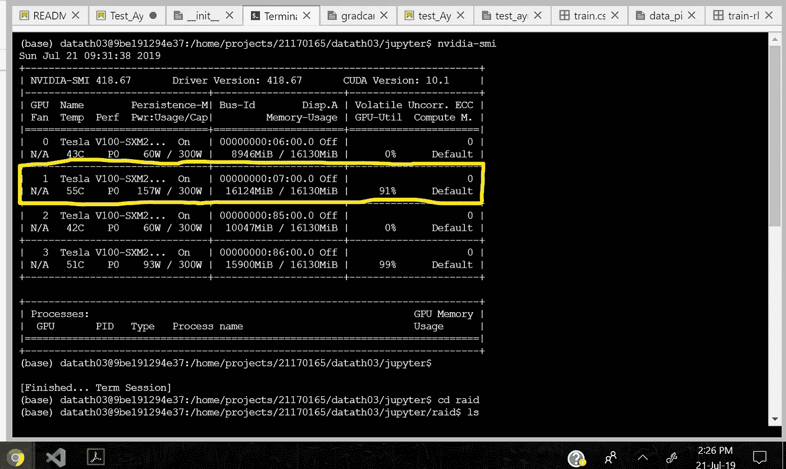
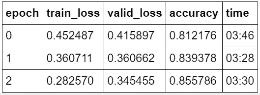
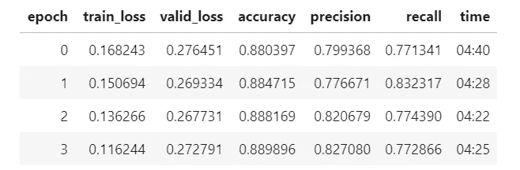
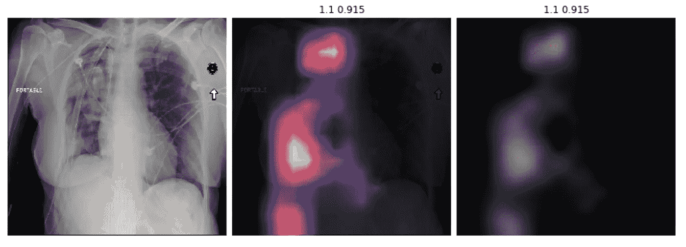
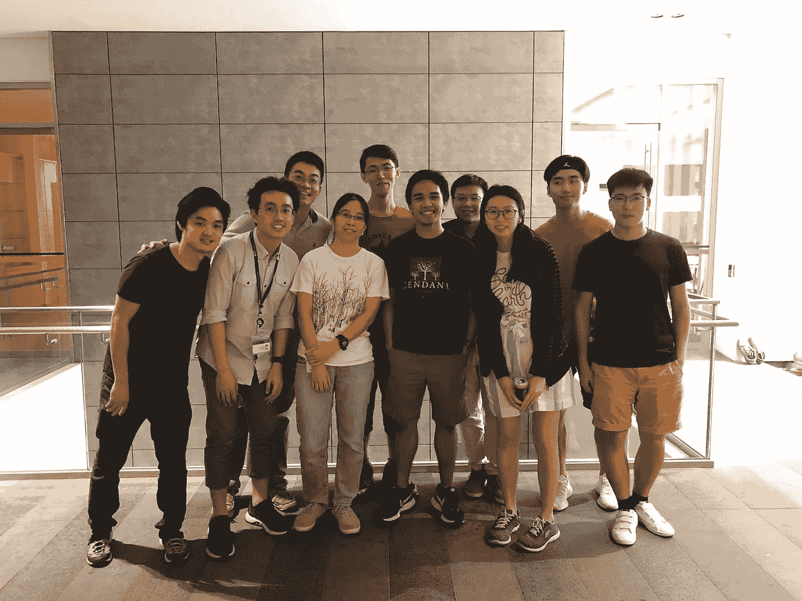

# 从头开始创建放射科医生

> 原文：<https://towardsdatascience.com/creating-a-radiologist-from-scratch-d776eb944399?source=collection_archive---------19----------------------->

## 在我的第一次数据科学竞赛中，我是如何制作 x 射线阅读器来检测肺部缺陷的

A Computer learns to see (albeit at the wrong place)

我不知道该怎么做。

除了我自己的 x 光片，我从来没有看过其他的 x 光片，更不用说那些显示出身体缺陷的 x 光片了。我不知道该看什么来确定缺陷。一个对放射学毫无经验的人怎么能告诉一台机器如何看 x 光图像呢？

六个小时后，我仍然不知道如何确定是否有缺陷。但不知何故，我能够创造出一台在检测缺陷方面几乎和放射科医生一样好的机器。

Which x-ray shows a disorder?

我浏览着我的笔记本电脑屏幕，试图了解我面前的网页。有两个文件夹:都包含 x 光图像。一些图像被标记为阳性，一些图像被标记为阴性。我从两个标签上各拿了一个，老实说我看不出有什么不同。在我旁边的是我的九个队友，其中两个正在解决同一个问题。作为唯一一名本科生(也是唯一一名除了微积分课程之外没有接受过任何大学数学正规教育的学生)，我周围要么是研究生，要么是从事数据科学家、数据工程师和公共卫生研究的专业人士。

我们正在开发一种机器，可以对 x 射线扫描是否包含气胸(基本上是肺萎陷)进行分类，然后识别图像中的萎陷区域。除了不能区分，我们必须找到一种方法来显示图像中的哪个区域有差异。虽然图像可能有标签，但它没有标记气胸出现的区域。虽然我们的团队中有两个具有放射学经验的人，但我们肯定不能依靠他们在 3000 多张气胸阳性图像中告诉我们受影响区域的确切位置。作为我第一次 datathon 的最后一个个人障碍，当我使用 Pytorch 时，每个人都在使用 Keras，这两个框架都是深度学习的框架。在很大程度上，我们无法相互理解。

再说一次，除了不能区分，我们必须找到一种方法来显示图像中的哪个区域有差异。你在让一个盲人教一台机器如何“看”和看图像来确定它是否是气胸阳性。最重要的是，你能得到的最接近的帮助是在两个不同的编码框架中工作，这让我们感觉像是在用两种不同的方言交谈。然后，我们不得不奇迹般地克服这种情况，将我们建立的任何东西与一个可能用于拯救人类生命的系统结合起来。这太疯狂了。

> 你在让一个盲人教一台机器如何“看”和看图像来确定它是否是气胸阳性。

# 火的洗礼

Our group’s presentation at the National University of Singapore (NUS)-Massachusetts Institute of Technology (MIT) Datathon

该问题分为两部分，分类和分段。分类器任务是根据图像的标签对图像进行分类(例如，x 射线图像是否显示气胸(阳性)或不显示气胸(阴性))，而分割任务是通过将图像分割成“部分”来识别图像的哪一部分具有所讨论的对象(例如，如果是阳性的，则阳性区域将被给予一个边界，该边界将其与图像内的其他对象分开)。我自愿参加分类，因为它似乎更容易。

由于我们在不同的框架中编码，我不得不制作自己的分类器。在我们的三人小组中，我们要比较我们的分类器，并选择一个最准确的。我的一个队友把预处理 x 光图像作为一项工作。作为最后的警告，我两周前才开始学习深度学习，我也从未仅仅使用 Pytorch 制作过真正的模型。在我写这篇文章的时候，我还没有独家使用 Pytorch(但是我快到了！).

相反，我只用过基于 Pytorch 的 fastai。这是一个初学者友好的库，它简化了加载图像数据集，在深度学习模型上训练它，然后用它来预测新图像的标签的整个过程。他们在网上也有完整的课程，我用第一课作为指导，制作了我的第一个[图像分类器](https://github.com/ajsanjoaquin/funstuff/blob/master/Jesus_classifier.ipynb)。但这是我在加入这个数据马拉松之前制作的第一个也是唯一一个分类器。

所以没有人问我如何在 Pytorch，**中实现它，我简单地复制了我的第一个项目**的步骤。我从医学成像信息学协会(SIIM)获取了提供的图像数据集，并将其远程连接到 NSCC 国家超级计算中心的 GPU。我用 Python 处理 Excel 的知识清理了 labels 文件(仍然花了我两个多小时才找到一个简单的公式，将一列中所有非零值都改为 1)。

我使用这个数据集在 Resnet-50 上训练模型。Resnet-50 是一个模型/神经网络，之前显示了数百万张图像，以产生一系列“权重”。您可以将权重视为代表模型中神经元之间强度的一组数字，这些数字有助于模型“观察”图像。直觉是，使用 Resnet-50 的权重比使用随机选取的权重更好，因为该模型已经更善于“观察”图像。这个过程叫做迁移学习。再打个比方，就像老师(预训练的模型)把知识传授给学生(针对具体问题的新模型)。

同一个图像有 4 种不同的尺寸。我从 1024 x 1024 像素的最高分辨率开始，因为更高质量的图像可以帮助计算机“看”它，因为它更清晰，对吗？这个过程用了一个半小时，几乎把给我的 GPU 都烧光了。

[Fit one cycle policy](https://arxiv.org/abs/1803.09820) is a learning acceleration technique, but running on 1024 x 1024 still took almost 2 hours :(

我给电脑输入了总共大约 44，000 张高清图像。但令人惊讶的是，默认设置的准确率为 86%。最后，我不得不放弃这种方法，因为我的 GPU 经常内存不足。

I was 6MB away from remotely crashing a foreign government’s hardware

# 自学

一开始就达到了 86%的准确率，太神奇了。这比猜测要好，也可能比我看 x 光的能力要好。但是它是怎么到那里的呢？我没有给出任何关于如何查看图像的说明或提示，只是说哪个图像对于训练测试来说是正面的或者不是正面的，但是它能够在没有标签的验证集上进行预测。机器是怎么学会*怎么学会*的？

> 从经验和观察中抽象出想法是学习的基本特征，机器在这方面做得越来越好。

看看这个模型是怎么来的。机器“学习”的来源是给它提供例子。从例子中，就像人类回忆经历一样，它能够找到*模式。*这不是死记硬背，因为它能够归纳并应用于*新的*和*未知的*数据。我没有写任何明确告诉它*如何*的代码。它自己发展了一套规则。从经验和观察中抽象出想法是学习的基本特征，机器在这方面做得越来越好。所以，我对放射学毫无经验，怎么能告诉一台机器如何观察它呢？**我没有，这也正是它学习**的原因。

回到过去，我被迫使用较小的图像，所以我选择了 512 X 512 的图像尺寸。与之前的运行相比，我很惊讶它的速度有多快:

我的模型达到了几乎相同的精度，但速度却快了十倍。哇哦。

我错了。与以前的版本相比，它可以在相同的时期更好地对**进行分类，并且分辨率几乎是以前的一半。我的直觉被打破了。也许模型不需要考虑不必要的细节，这些细节使得更高的分辨率得以呈现。如果我再做一次，我会得到更高的初始精度。我花了最后几个小时调整模型来改进它。**

The final version of the model. I actually got 89% accuracy but I wasn’t able to save the version.

最终我的分类器表现最好(下一个有~71%的准确率)，它和分割模型结合完成了气胸检测器。我已经设法利用我在深度学习方面的稀缺知识制作了一个模型，这个模型的表现*优于*专业人士制作的其他模型*。这个模型既不是建立在复杂的预处理技术上，也不是建立在优雅的算法上。仅仅遵循一些简单的技术就让我惊讶地发现，我能够构建一个具有竞争力且精确的模型。*

# 还是一个 Noob

但一路走来，我欠队友的支持。我曾请 CS 博士生帮助我处理 Python 回调，并试图覆盖 fastai 库中的一些预建函数。我从医学影像分析师那里获得了如何预处理图像的技巧(不幸的是，我无法实现，因为我不知道如何对它们进行编码)。我得到了放射科医生的帮助，他告诉我如何手动确定气胸的位置。我还从一位数据工程师那里得到了关于[如何通过热图](https://arxiv.org/abs/1610.02391)看到模型“看到”的帮助。这个模型还有很多我可以改进的地方，但是如果没有这些地方，我一开始就不可能造出一个来。

Grad-CAM: Where the model “looks”. (Middle) The hotter the area is, the higher focus of the model on that area. Notice how it ignores the labels and arrows on the side. Our radiologist confirmed that the Pneumothorax was within the hot area. (Right) The image in grayscale.

最重要的是，他们分享了他们如何进入机器学习的故事。虽然大多数人有适当的分析背景，如生物医学工程、计算机科学和纯数学学位，但没有人在课堂上学到这些。无论是自动化他们的任务还是增强他们的研究洞察力，他们都能够通过参加在线课程、获得在线证书和参加 Kaggle 竞赛来自学。

> 我们正处于这样一个时期，那里有许多有待开发的人工智能系统的未开发领域，我们正处于实现提高我们生活质量的潜力的过程中。

缺乏正规培训和气胸问题的存在反映了人工智能应用的整体状况，因为它目前正在改变我们的工作方式。我们正处于这样一个时期，那里有许多有待开发的人工智能系统的未开发领域，我们正处于实现提高我们生活质量的潜力的过程中。单看气胸问题，有人**将**开发一种解决方案，在这个过程中不需要放射科医生，就像自动驾驶汽车不需要司机一样。同样，这在缺乏放射科医生的地方有巨大的应用。将此扩展到人力稀缺的专业工作。

然而，这再次延伸到危害，如劳动力减少和缺乏对失业工人的再培训，使用人工智能做出不道德的判断，以及使用人工智能系统来针对使社会和资本不平等永久化的被剥夺权利的群体。这些最终将成为普通人必须解决的主要问题的一部分，就像贫困和政治一样，因为这只是一个时间问题，这种系统将主宰我们的生活，就像互联网塑造大多数人与现实的互动一样。

这种情况告诉我的最后一件事是，教室不足以让我了解这个世界。仅有理论是远远不够的，只要存在独特和未知问题的现实世界的变化快于课堂教学的变化，课堂课程就无法跟上。

你可以和我团队中的许多人一样有背景，但这只能让你在某些领域拥有优势。从收集信息，到训练模型，再到可视化，这些都需要专业化，而这通常不是一个人就能完成的。你需要某个领域的专业知识，以及合作和理解其他学科的灵活性。这些人花时间学习机器学习，因为他们意识到这是一种可以帮助他们的工具。

像他们一样，我会继续学习，继续练习。希望这不是我唯一从头开始训练的东西。

*我用的代码在我的* [*资源库*](https://github.com/ajsanjoaquin/Pneumothorax/blob/master/Test_Ayrton.ipynb) *上可以作为 jupyter 笔记本使用。看看吧！*